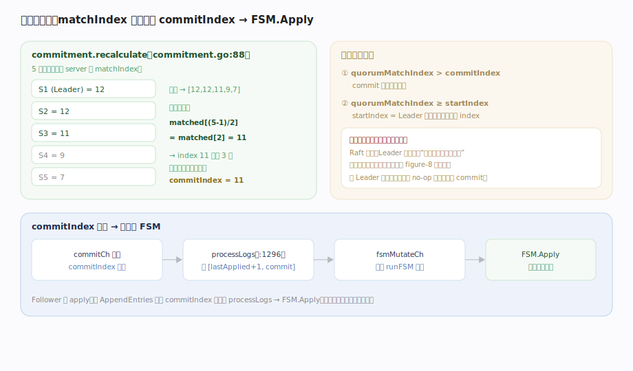
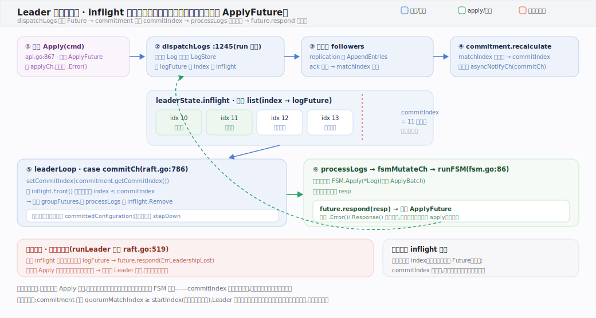

# HashiCorp raft 核心原理 · 支撑能力域 · 提交与应用

> **定位**：把“已复制到多数派”翻译成“已提交”，再喂给状态机——线性一致的落点。`commitment` 用各 server 的 `matchIndex` 中位数算出 `commitIndex`，`processLogs` 把 `(lastApplied, commit]` 区间的日志经 `fsmMutateCh` 交 `runFSM` 调 `FSM.Apply`。核实基准：`commitment.go`、`raft.go`（processLogs:1296、configurationChangeChIfStable:654）、`fsm.go`（runFSM:86）。

## 一、matchIndex 中位数定 commitIndex，再应用到 FSM

**多数派提交的核心算法**（`commitment.recalculate`, `commitment.go:88`）：把所有 server 的 `matchIndex` 排序，取 `matched[(len-1)/2]`——即“被多数派复制到的最大 index”。例：5 节点 matchIndex `[12,12,11,9,7]` 排序后 `matched[2]=11`，说明 index 11 已被 3 个（多数派）节点持有 → `commitIndex=11`。

**两条提交约束**：① `quorumMatchIndex > commitIndex`（commit 只前进不后退）；② `quorumMatchIndex >= startIndex`（`commitment.go:96-99`），`startIndex` 是 Leader 本任期首条日志的 index——**Raft 只允许 Leader 通过提交本任期的新日志来间接提交旧任期日志**（防 figure-8 问题）。因此新 Leader 上任会先追加一条 no-op 日志推进本任期 commit，之后才处理成员变更等（见 `configurationChangeChIfStable`, `raft.go:654` 的第二个条件）。

**应用流水线**：`commitIndex` 增加 → `commitCh` 通知 → `processLogs`（`raft.go:1296`）取 `(lastApplied, commitIndex]` 的日志 → 送 `fsmMutateCh` → `runFSM`（`fsm.go:86`）串行调 `FSM.Apply`（`LogCommand`）或 `StoreConfiguration`（`LogConfiguration`），`LogBarrier` 不下发 FSM。Follower 收 AppendEntries 更新 commitIndex 后走同样的 processLogs → FSM.Apply——**各节点确定性地应用同一序列，状态机一致**。

---

## 二、Leader 提交流水线：inflight 队列与 Future 唤醒

这张图接续上节的中位数算法，讲"提交"如何唤醒宿主阻塞的 `ApplyFuture`。`dispatchLogs`（`raft.go:1245`）写本地日志的同时把 `logFuture` 按 index 挂进 `leaderState.inflight`（有序 list）；复制回来推进 `matchIndex`，`commitment` 算出新 `commitIndex` 并 `asyncNotifyCh(commitCh)`；`leaderLoop` 的 `commitCh` 分支（`raft.go:786`）从 `inflight.Front()` 起取出所有 `index ≤ commitIndex` 收进 `groupFutures`，交 `processLogs` 送 `fsmMutateCh` → `runFSM` 调 `FSM.Apply` → `future.respond(resp)` 唤醒宿主。失去领导权时（`:519`）inflight 里未提交的 Future 全部 `respond(ErrLeadershipLost)`，绝不静默丢写。

---

## 拓展 · 提交与应用要点

| 项 | 机制 | 源码 |
|---|---|---|
| 多数派 index | 排序 matchIndex 取中位数 | `commitment.go:96` |
| commit 单调 | quorumMatchIndex > commitIndex 才更新 | `commitment.go:100` |
| 本任期约束 | quorumMatchIndex ≥ startIndex | `commitment.go:100` |
| 应用区间 | (lastApplied, commitIndex] | `raft.go:1296` |
| 批量应用 | BatchingFSM.ApplyBatch 一次一批 | `fsm.go:54` |
| 日志类型 | LogCommand→Apply, LogConfiguration→StoreConfiguration | `fsm.go:runFSM` |

---

## 调优要点

- **CommitTimeout**（默认 50ms）：无新 Apply 时 Leader 主动发心跳传播 commit，别设太大以免 commit 滞后。
- **BatchingFSM**：高写入用 `ApplyBatch` 一次拿一批已提交日志，降低 apply 次数。
- **FSM.Apply 要快且确定性**：它在 runFSM 单线程串行执行，慢 apply 直接拖累状态机推进。
- **lastApplied 与 commitIndex 分离**：应用是异步的，宕机重启后从快照 + 日志重放恢复 lastApplied。

---

## 常见误区与工程要点

- **“复制到多数派 = 立即提交”**：还要满足本任期约束——旧任期日志不能靠计数直接提交，须由本任期日志带出。
- **以为 commitIndex 会回退**：只前进，`recalculate` 有 `> commitIndex` 守卫。
- **把 FSM.Apply 当同步返回给客户端**：Apply 返回 Future，宿主等 `Response` 才拿到结果。
- **Barrier 会被 FSM 处理**：`LogBarrier` 不下发 FSM，仅用于“等此前写全部 apply”的栅栏。
- **no-op 是多余的**：恰恰相反——新 Leader 的 no-op 是安全提交旧日志的前提。

---

## 一句话总纲

**提交与应用把“多数派已复制”变成“已提交并生效”：commitment 对所有 server 的 matchIndex 排序取中位数得出被多数派持有的最大 index 作 commitIndex（只前进、且必须 ≥ Leader 本任期首条日志的 startIndex 以安全带出旧任期日志），commitIndex 一涨就经 commitCh 通知 processLogs 取 (lastApplied, commit] 区间日志、送 fsmMutateCh 由 runFSM 单线程确定性地调 FSM.Apply——Follower 同样按 LeaderCommit 应用，各节点状态机严格一致，这是线性一致的落点。**
