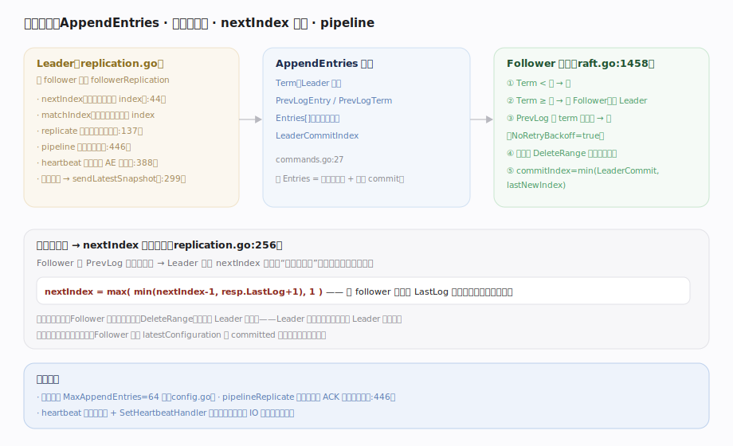
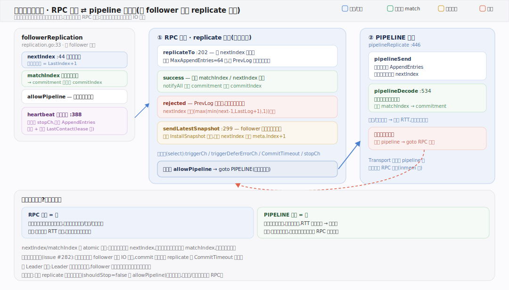

# HashiCorp raft 核心原理 · 支撑能力域 · 日志复制

> **定位**：把 Leader 的日志一字不差地复制到 Follower——共识的数据面。Leader 为每个 follower 维护 `nextIndex`/`matchIndex`，用 `AppendEntries` 携带 `PrevLog` 做一致性检查，不匹配就回退 nextIndex 重试；强 Leader 模型下 Leader 日志是唯一真相。核实基准：`replication.go`、`raft.go`（appendEntries:1458、dispatchLogs:1245）、`commands.go`。

## 一、AppendEntries、一致性检查与 nextIndex 回退

**Leader 侧**（`replication.go`）：每个 follower 一个 `followerReplication`（`:33`），核心是 `nextIndex`（`:44`，下一条要发的 index）与 `matchIndex`（已确认复制到的 index）。`replicate`（`:137`）协程持续推日志，`replicateTo`（`:202`）组一批（最多 `MaxAppendEntries=64`）发出；`heartbeat`（`:388`）走独立通道发空 AppendEntries 保活；follower 落后到快照之前时 `sendLatestSnapshot`（`:299`）改发 InstallSnapshot。

**AppendEntries 报文**（`commands.go:27`）带 `Term / PrevLogEntry / PrevLogTerm / Entries[] / LeaderCommitIndex`。空 `Entries` 即心跳，兼做 commit 传播。

**Follower 校验**（`appendEntries`, `raft.go:1458`）：① `Term < currentTerm` 拒；② `Term ≥ currentTerm` 转 Follower、记录 Leader；③ **一致性检查**——`PrevLogEntry` 处本地 term 与 `PrevLogTerm` 不匹配则拒并置 `NoRetryBackoff`（`raft.go` ~1493）；④ 通过后删冲突后缀（`DeleteRange`）、追加新条目；⑤ `commitIndex = min(LeaderCommitIndex, lastNewIndex)`。

**不一致就回退**（`replication.go:256`）：Follower 拒绝后，Leader 执行 `nextIndex = max(min(nextIndex-1, resp.LastLog+1), 1)`——借 follower 回传的 `LastLog` 一步跳到位，避免逐条递减，往回找“最后一致点”后从那里覆盖同步。若冲突点落在配置项之前，Follower 把 `latestConfiguration` 回退到 `committed` 版本保持一致。

---

## 二、replicate 两态机：RPC 追赶 ⇄ pipeline 流水线

每个 follower 一个 `replicate` 协程（`replication.go:137`），在两种模式间切换：**RPC 模式**一发一收、看响应决定进退，能优雅处理拒绝回退与 `sendLatestSnapshot`（`:299`）快照兜底，代价是每批一个 RTT；链路健康（`allowPipeline`）时 `goto PIPELINE` 升级为**流水线模式**（`pipelineReplicate:446`）——`pipelineSend` 连发不等响应、`pipelineDecode`（`:534`）独立协程异步收响应更新 `matchIndex`，RTT 被重叠掉换取高吞吐；一旦出错回落 RPC 重新对齐。心跳走独立协程（`heartbeat:388`），不被 follower 磁盘 IO 阻塞。

---

## 拓展 · 复制状态与参数

| 项 | 含义 | 源码 |
|---|---|---|
| nextIndex | 下一条要发给该 follower 的 index | `replication.go:44` |
| matchIndex | 已确认复制到该 follower 的 index | `commitment.go` match |
| PrevLogEntry/Term | 一致性检查锚点 | `commands.go:27` |
| MaxAppendEntries | 单批最多条数（默认 64） | `config.go` |
| pipelineReplicate | 不等 ACK 连发多批 | `replication.go:446` |
| NoRetryBackoff | 日志不匹配时置位，触发快速回退 | `raft.go:1458` |

---

## 调优要点

- **MaxAppendEntries**：调大提高批量吞吐，但单批过大增加尾延迟与内存；默认 64 适合多数场景。
- **pipeline** 显著提升高延迟链路吞吐；心跳走 `SetHeartbeatHandler` 快路径避免被磁盘 IO 阻塞。
- **大 value 谨慎**：单条日志过大撑大 AppendEntries 报文与磁盘写；配合 `SnapshotThreshold` 控制日志规模。
- **落后 follower**：nextIndex 退到快照之前会触发 InstallSnapshot，网络开销大——避免 follower 长时间离线。

---

## 常见误区与工程要点

- **以为 Follower 能改自己日志**：强 Leader 模型——Follower 只能删冲突后缀并接受 Leader 的条目，不自主追加。
- **把复制当异步主从**：AppendEntries 是同步复制，Leader 要等多数派确认才提交（见提交与应用）。
- **一致性检查只看 index**：还要看 `PrevLogTerm`——同 index 不同 term 即冲突，必须覆盖。
- **nextIndex 逐条退很慢**：本库用 `resp.LastLog` 加速回退，不是每次只减 1。
- **心跳携带数据**：心跳是空 Entries 的 AppendEntries，只保活与传 commit，不带日志。

---

## 一句话总纲

**日志复制是共识数据面：Leader 为每个 follower 维护 nextIndex/matchIndex，用带 PrevLogEntry/PrevLogTerm 的 AppendEntries 复制日志——Follower 先校验 term、再做一致性检查（PrevLog 处 term 不匹配即拒），通过后删冲突后缀并追加；不匹配时 Leader 借 follower 回传的 LastLog 快速回退 nextIndex 找到最后一致点再覆盖同步；pipeline 连发多批、心跳走快路径提升吞吐，落后过多的 follower 改用 InstallSnapshot 追平——强 Leader 模型下 Leader 日志是唯一真相。**
