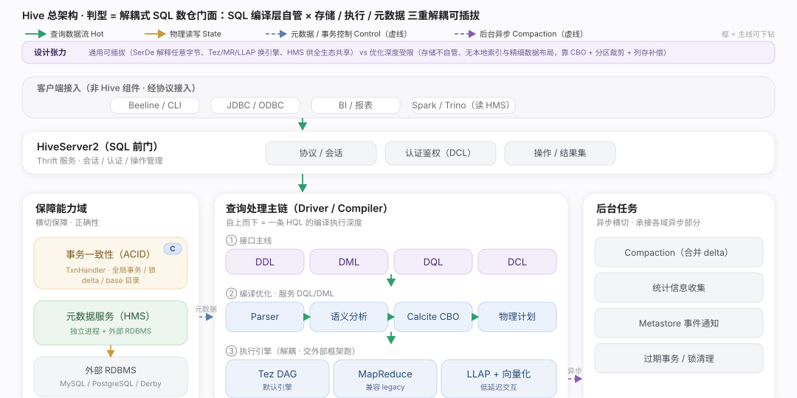
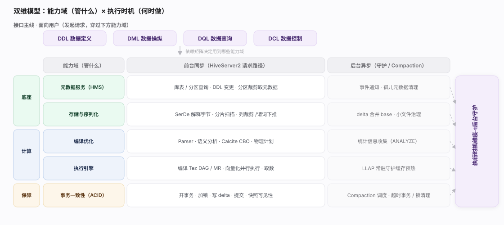
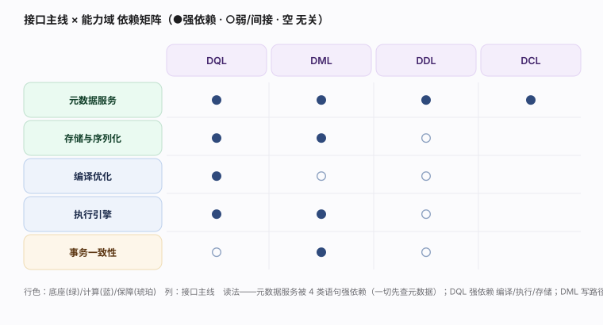

# Hive 核心原理 · 全景主线框架

> 统领全部原理文档：Hive 是 **SQL-on-Hadoop 数据仓库**——一个「SQL 门面 + 解耦的存储/执行/元数据」的引擎。它的主线是 **4 条接口主线（DDL/DML/DQL/DCL）+ 5 条支撑主线**，既无遗漏也无越界。

## 一、原型判定：解耦式 SQL 数仓门面

Hive **不是**自管存储的一体化 MPP 数据库（如 Doris），也**不是**纯联邦查询引擎（如 Trino）。它是三重解耦的 SQL 门面：

- **有完整 SQL 接口与自己的编译优化器**：HiveQL 语法（`parser`）+ 语义分析（`SemanticAnalyzer`）+ Calcite CBO（`CalcitePlanner`）——像一体化数仓的前端。
- **存储解耦**：数据放在 HDFS / 对象存储 / HBase，由 **SerDe + InputFormat/OutputFormat + StorageHandler** 三件套解释，Hive **不组织底层字节**——存储可插拔。
- **执行解耦**：物理算子树交给 **Tez / MapReduce / LLAP** 执行框架跑，Hive **不自管计算资源调度**（由 YARN/LLAP 管）。
- **元数据独立成服务**：**Hive Metastore（HMS）** 是独立进程，元数据持久化在外部 RDBMS（MySQL/PostgreSQL/Derby），供 Hive 及整个 Hadoop 生态（Spark/Trino/Impala）共享。

> 一句话原型：**Hive = SQL 编译优化层（自管）× 存储/执行/元数据（解耦可插拔）**。这是「存算分离数仓」的鼻祖形态。

---

## 二、总架构图

---

## 三、双维模型：能力域 × 执行时机

- **能力域（管什么）**：接口主线（DDL/DML/DQL/DCL）面向用户；支撑侧 5 条能力域面向引擎内部——元数据服务、编译优化、执行引擎、事务一致性（ACID）、存储与序列化。
- **执行时机（何时做）**：前台同步（HiveServer2 请求路径：编译→加锁→执行→取数）与后台异步（Compaction 合并 delta、Metastore 事件清理、统计信息收集）。

---

## 四、5 条支撑主线的分层归位

| 层 | 支撑主线 | 一句话职责 |
|---|---|---|
| 底座 | **元数据服务（HMS）** | 库表/分区/列/统计的持久化与全生态共享（独立进程 + 外部 RDBMS） |
| 底座 | **存储与序列化** | 用 SerDe + InputFormat + StorageHandler 解释外部字节，存储可插拔 |
| 计算 | **编译优化** | HiveQL → AST → 逻辑计划 → Calcite CBO → 物理算子树（RBO/CBO/CTE） |
| 计算 | **执行引擎** | 把算子树编译成 Tez DAG / MR Job / LLAP，向量化并行执行 |
| 保障 | **事务一致性（ACID）** | 基于 delta/base 目录 + TxnHandler 全局事务/锁，保证行级 ACID |

---

## 五、一条 HQL 的主干路径（源码核实）

> 从 SQL 前门到执行的骨架调用链，全部 file:line 回源核实。源码前缀：`ql/src/java/org/apache/hadoop/hive/ql/`、`service/src/java/org/apache/hive/service/`、`standalone-metastore/metastore-server/src/main/java/org/apache/hadoop/hive/metastore/`。

| 阶段 | 源码入口 |
|---|---|
| SQL 前门 | HiveServer2 `service/server/HiveServer2.java` → 会话 SQL 操作 |
| 驱动 | `Driver.java:129` `run()` → `:152` `runInternal()` → `:428` `compileInternal()` |
| 编译 | `Compiler.java:98` `compile()`：`parse():169` → `analyze():185` → `createPlan():358` → `openTransaction():281` |
| 语义分析 | `parse/SemanticAnalyzer.java`（AST→算子树）；CBO `parse/CalcitePlanner.java`（Calcite 优化） |
| 加锁与快照 | `Driver.java:327` `lockAndRespond()` → `:228` `validateCurrentSnapshot()` |
| 执行 | `Driver.java:342` `execute()` → Tez 任务 `exec/tez/TezTask.java` |
| 取数 | `Driver.java:193` `FetchTask` |
| 元数据服务 | `metastore/HiveMetaStore.java`（Thrift Server）→ `metastore/ObjectStore.java`（JDO/RDBMS 持久化） |
| 事务 ACID | `metastore/txn/TxnHandler.java`（全局事务/锁/Compaction 队列） |

---

## 六、接口主线 × 能力域 依赖矩阵

---

## 七、三条贯穿声明（不单列主线，但覆盖全局）

- **解耦与可插拔（本质）**：存储（SerDe/StorageHandler）、执行（Tez/MR/LLAP）、元数据（外部 RDBMS）三处都可替换，主线清单不变、实现变。
- **共享元数据（生态位）**：HMS 不只服务 Hive——Spark、Trino、Impala、Iceberg 都读同一个 Metastore，Hive 的元数据模型是 Hadoop 数仓的事实标准。
- **面向大数据 ETL（定位）**：Hive 为高吞吐批处理/数仓 ETL 而生，不面向 OLTP 高并发点查（README 明确）；LLAP 才补上低延迟交互查询。

---

## 常见误区与工程要点

- **Hive 不"存"数据**：表只是"HDFS 目录 + SerDe 解释规则 + HMS 元数据"三者的绑定，删表默认删目录（managed）或只删元数据（external）。
- **Metastore 是独立服务不是库**：它是有 Thrift 接口的进程，背后才是 RDBMS；直接改 RDBMS 会绕过缓存与事件通知。
- **ACID 不等于 OLTP**：Hive ACID 靠 delta/base 目录 + Compaction 实现，为批量写与合并优化，不适合高频小事务。

---

## 一句话总纲

**Hive 的主线是"能力域 × 执行时机"双维网：纵向 4 条接口主线（DDL/DML/DQL/DCL）面向用户，横切 5 条支撑主线——底座（元数据服务、存储与序列化）、计算（编译优化、执行引擎）、保障（ACID 事务）；其灵魂是「SQL 编译层自管、存储/执行/元数据全解耦」的鼻祖式存算分离数仓。**