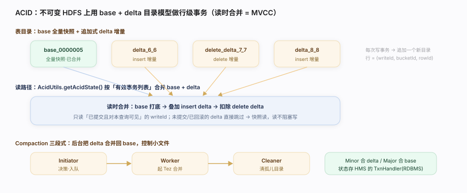

# Hive 核心原理 · 支撑主线 · 事务一致性（ACID）

> **定位**：事务一致性是 Hive 的**保障能力域**——它是 Hive 从「只写不改的批量 ETL 仓」进化到「支持 INSERT/UPDATE/DELETE/MERGE 的事务表」的关键。核心难题：HDFS 只能追加、不能原地改，怎么在不可变文件上做行级更新？Hive 的答案是 **delta/base 目录模型 + 全局事务与锁管理器（HMS 里的 TxnHandler）+ 后台 Compaction 合并**。它横跨前台（写事务、加锁）与后台（合并守护）两种时机。

## 一、原型：不可变文件上的 ACID

HDFS 文件写完不可改，Hive 用「**追加 delta + 后台合并**」绕开：

- **base 目录**：某个时间点的全量快照（`base_N/`）。
- **delta 目录**：一次事务产生的增量（`delta_min_max/`，插入/更新/删除都记成带 rowid 的行）。
- **读时合并**：查询按有效事务列表把 base + 多个 delta 叠加成「当前视图」——这就是 Hive 的 MVCC 快照读。
- **写全局串号**：每个事务拿全局递增的 txnId + writeId，delta 目录名带上它，读时据此判定可见性。

> 一句话：**ACID = 事务领 txnId/writeId → 写成独立 delta 目录 → 读时按有效事务列表合并 base+delta → 后台 Compaction 把碎 delta 合成 base。**

---

## 二、事务与锁管理（TxnHandler，源码核实）

事务状态不在计算侧,而是**集中存在 HMS 的 RDBMS 里**,由 `TxnHandler` 统一裁决:

| 能力 | 做什么 | 源码入口 |
|---|---|---|
| 开事务 | 分配 txnId，写入 TXNS 表 | `TxnHandler.openTxns():407` |
| 提交 | 标记事务已提交，delta 转为可见 | `TxnHandler.commitTxn():640` |
| 中止 | 回滚，delta 标记为作废 | `TxnHandler.abortTxn():520` / `abortTxns():557` |
| 加锁 | 申请表/分区级读写锁 | `TxnHandler.lock():831` |
| 查锁 | 轮询锁是否获批（等待队列） | `TxnHandler.checkLock():859` |

`TxnHandler` 定义见 `standalone-metastore/.../metastore/txn/TxnHandler.java:197（abstract class implements TxnStore）`——**全局事务/锁状态是 HMS 的一部分**，这也是 HMS 成为强一致底座的原因。

---

## 三、读路径：有效事务列表 + 目录合并

查询开始时拿到一份「**有效事务列表**」（哪些 txn 已提交、哪些在跑/已中止），据此决定读哪些 delta：

- `AcidUtils.getAcidState()`（`ql/.../io/AcidUtils.java:1343`，返回 `AcidDirectory`）扫描表目录，挑出**可见的 base + delta**，过滤掉未提交/已中止的 delta。
- 每行带 `(writeId, bucketId, rowId)` 三元组标识，更新/删除通过 delete_delta 记「哪一行作废」。
- 读时把 base + insert delta + delete delta 归并，得到该快照下的正确行——**读不加写锁，写不阻塞读**（MVCC）。

---

## 四、后台·Compaction 合并

delta 越攒越多会拖慢读,后台守护定期合并:

- **Minor Compaction**：多个 delta 合成一个大 delta（不动 base），减少文件数。
- **Major Compaction**：base + 所有 delta 合成新 base，彻底清掉历史 delta 与删除标记。
- **Initiator**（`ql/.../txn/compactor/Initiator.java:60 run`）：后台线程，扫描各表判断是否需要合并、生成 compaction 请求入队。
- **Worker**（`ql/.../txn/compactor/Worker.java:78 run` / `findNextCompactionAndExecute:173`）：从队列取请求，起一个 MR/Tez 作业真正做合并。
- **Cleaner**：合并完成后删除不再被任何事务引用的旧文件。

> Initiator 决策、Worker 执行、Cleaner 清理——三段式后台流水，全靠 HMS 里的 Compaction 队列表串起来。

---

## 五、调优要点

- **建事务表要显式声明**：`TBLPROPERTIES('transactional'='true')` + 存储格式 ORC，非事务表无 delta 机制。
- **别攒太多 delta**：频繁小批量写会催生海量 delta，务必让 Compaction 及时跟上（调 `hive.compactor.*` 阈值）。
- **Major 合并挑低峰**：Major Compaction 重写全量、吃资源，安排在业务低谷。
- **锁粒度**：批量更新尽量按分区操作，避免全表长事务持锁阻塞。
- **清理孤儿**：确认 Cleaner 正常，否则作废 delta 堆积浪费空间。

---

## 六、常见误区

- **「Hive 表都支持 UPDATE」**：错。只有 `transactional=true` 的 ORC 事务表支持行级增删改。
- **「事务状态存在计算节点」**：错。txnId/锁/Compaction 队列全在 HMS 的 RDBMS 里集中管理。
- **「UPDATE 是原地改文件」**：错。是写 delete_delta + insert delta，HDFS 文件从不原地改。
- **「Compaction 可有可无」**：错。不合并 delta，读性能会随写入持续劣化。
- **「Hive ACID = OLTP 级事务」**：不准。它面向数仓批量/近实时更新，不是高并发短事务的 OLTP。

---

## 源码锚点（file:line 全核实，工作区外 `/Users/zhangdongdong92/workdir/hive/`）

| 主题 | 文件:行 | 说明 |
|---|---|---|
| 事务管理器 | `standalone-metastore/.../txn/TxnHandler.java:197` | 全局事务/锁,存 HMS RDBMS |
| 开事务 | `TxnHandler.java:407` | `openTxns` 分配 txnId |
| 提交 | `TxnHandler.java:640` | `commitTxn` |
| 中止 | `TxnHandler.java:520` / `:557` | `abortTxn` / `abortTxns` |
| 加锁 | `TxnHandler.java:831` | `lock` |
| 查锁 | `TxnHandler.java:859` | `checkLock` 等待队列 |
| 读快照 | `ql/.../io/AcidUtils.java:1343` | `getAcidState` 合并 base+delta |
| Compaction 决策 | `ql/.../txn/compactor/Initiator.java:60` | `run` 扫描入队 |
| Compaction 执行 | `ql/.../txn/compactor/Worker.java:78` / `:173` | `run` / `findNextCompactionAndExecute` |

---

> **一句话总纲**：事务一致性让 Hive 在不可变的 HDFS 上做出了行级 ACID——写事务领 txnId 写成独立 delta 目录、读时按有效事务列表把 base+delta 合并成 MVCC 快照、后台 Compaction 三段式（Initiator 决策/Worker 合并/Cleaner 清理）把碎 delta 收敛回 base，而全局事务与锁状态统一托管在 HMS 的 RDBMS 里。