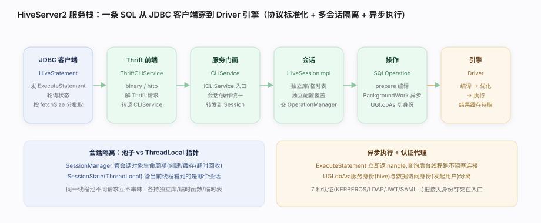

# Hive 核心原理 · 支撑主线 · HiveServer2 与会话服务

> **定位**：HiveServer2（HS2）是 Hive 的**接入门面**——它把「引擎能力」包装成一个标准的、可并发、可认证的**网络服务**：对外用 Thrift 暴露 JDBC/ODBC 协议，对内管会话生命周期、把每条 SQL 交给编译执行栈异步跑，再把结果分批取回客户端。没有 HS2，Hive 只是一个本地 CLI；有了 HS2，它才成为 BI 工具、报表平台、应用程序能直连的数仓服务。

## 一、原型：为什么接入层要独立成多会话 Thrift 服务

早期 HiveServer1 单会话、无并发、无认证，无法当生产服务。HS2 的原型是一个**多会话、可认证、协议标准化的 SQL 服务前端**：

- **协议标准化**：用 Thrift 定义 `TCLIService`，天然生成 JDBC/ODBC 可对接的 RPC——BI 工具无需懂 Hive 内部，只当它是个 JDBC 数据源。
- **多会话并发**：每个客户端连接 = 一个 `Session`，各自持有独立的配置、临时函数、当前库、临时表，互不干扰。
- **异步执行**：SQL 提交后立即返回 `OperationHandle`，查询在后台线程跑，客户端轮询状态 + 分批取结果——长查询不阻塞连接。
- **可认证可代理**：内建 7 种认证 + 用户模拟（doAs），把「谁在查、以谁的身份读 HDFS」纳入统一入口。

> 一句话：**HS2 = 把 Hive 引擎包装成「Thrift 协议 + 多会话隔离 + 异步执行 + 认证代理」的标准 SQL 网络服务。**

---

## 二、服务栈分层：从 Thrift 到 Driver



一条 SQL 从客户端到引擎，穿过这条链路（每层职责单一、可替换）：

| 层 | 载体 | 职责 |
|---|---|---|
| 客户端 | `HiveStatement`（JDBC 驱动侧） | 发 `ExecuteStatement` RPC，轮询状态，分批 fetch |
| Thrift 前端 | `ThriftCLIService`（binary/http 两实现） | 解 Thrift 请求，转调 CLIService |
| 服务门面 | `CLIService`（实现 `ICLIService`） | 会话/操作的统一入口，转发到具体 Session |
| 会话 | `HiveSessionImpl` | 持有会话状态，把语句交给 OperationManager |
| 操作 | `SQLOperation` | 一条 SQL 的生命周期，异步跑 `Driver`，缓存结果 |
| 引擎 | `Driver` | 编译 → 优化 → 执行（见编译优化/执行引擎篇） |

`HiveServer2` 本身是个 `CompositeService`——`init` 时组装 CLIService + ThriftCLIService，`start` 时一并拉起。

---

## 三、会话管理：SessionManager 与线程本地 SessionState

**SessionManager** 管会话的创建、缓存、超时回收、并发上限：

- `openSession` → `createSession` 造出 `HiveSessionImpl`，登记进 handle→session 表，配空闲超时线程回收。
- 每个会话持有独立的 `HiveConf` 覆盖、当前数据库、临时函数/表——这是「多用户互不干扰」的落点。

**SessionState** 是**线程本地（ThreadLocal）** 的会话上下文：

- 编译/执行的每一步都从 `SessionState.get()` 拿当前会话的配置与资源。
- 进入一个会话的工作线程时 `SessionState.start()` 设置它，离开时清理——保证同一线程池里不同请求不串味。

> 关键：SessionManager 管「会话对象的生命周期」，SessionState 管「当前线程看到的是哪个会话」——一个是池子，一个是 ThreadLocal 指针。

---

## 四、异步执行：SQLOperation 的后台线程模型

`SQLOperation` 是一条 SQL 的执行单元。它的核心是**异步 + 用户模拟**：

| 阶段 | 做什么 |
|---|---|
| `prepare` | 编译 SQL（调 Driver.compile），拿到 plan 与结果 schema |
| `runInternal` | 若异步，提交 `BackgroundWork` 到线程池；否则同步跑 |
| `BackgroundWork.run` | 用 `UGI.doAs`（以发起用户身份）跑 `Driver` 的执行阶段 |
| `getNextRowSet` | 客户端 fetch 时，从 Driver 结果里分批取 `RowSet` 回传 |

**为什么要 doAs**：HS2 进程通常以 hive 用户启动，但读 HDFS 要以**发起查询的真实用户**做权限校验——`BackgroundWork` 用 `UGI.doAs` 切身份，把「服务身份」与「数据访问身份」分开。

**结果分批**：查询结果不一次性返回，客户端按 `fetchSize` 反复调 `FetchResults`，服务端 `getNextRowSet` 从 Driver 取下一批——大结果集不撑爆内存。

---

## 五、JDBC 接入：URL、连接与传输模式

**JDBC URL 格式**：

```
jdbc:hive2://host:port/db;sessionVars?hiveConfs#hiveVars
```

- 默认端口 `10000`（binary）；`db` 是初始数据库；`;` 后是会话变量（如认证）、`?` 后是 Hive 配置、`#` 后是 Hive 变量。

**连接建立**（`HiveConnection`）：`openTransport` 按传输模式建通道 → OpenSession 拿会话句柄 → 之后 `createStatement` 造 `HiveStatement` 发 SQL。

**两种传输模式**：

| 模式 | 通道 | 场景 |
|---|---|---|
| `binary`（默认） | 直接 TCP + Thrift binary | 内网直连，性能最优 |
| `http` | Thrift over HTTP(S)（走 servlet 路径 `cliservice`） | 过防火墙/负载均衡/网关，端口 10001 |

`createBinaryTransport` 负责 binary 模式下按认证类型（SASL/Kerberos/plain）包裹底层 socket。

---

## 六、认证与安全（7 种机制）

HS2 在连接建立时按配置选一种认证，把「你是谁」钉死在会话入口：

| 机制 | 说明 |
|---|---|
| `NONE` | 无认证（仅测试/内网） |
| `KERBEROS` | 企业标准，SASL/GSSAPI，配委托令牌 |
| `LDAP` | 用户名密码校验到 LDAP/AD |
| `CUSTOM` | 自定义 `PasswdAuthenticationProvider` |
| `JWT` | 令牌式，适合网关前置鉴权 |
| `SAML`（Browser） | 浏览器 SSO 流程 |
| `DelegationToken` | 已认证客户端派生的委托令牌，供后台任务无密访问 |

配 `KERBEROS` 时通常同时开 `doAs`（用户模拟）+ SSL（`http`/`binary` 均可加 TLS）。

---

## 七、调优要点（关键开关）

- **并发上限**：`hive.server2.thrift.max.worker.threads` 决定 HS2 能同时服务多少连接；打满即拒连，需配合前置连接池。
- **异步线程池**：`hive.server2.async.exec.threads` 是后台执行 `BackgroundWork` 的池大小——长查询多时要调大，否则查询排队在提交阶段。
- **fetch 批大小**：客户端 `fetchSize` 太小则 RPC 往返多、太大则内存压力大；BI 大结果集适当调大。
- **传输选 http 过网关**：跨机房/走负载均衡时用 `http` 模式（端口 10001），内网直连留 `binary`。
- **HS2 是有状态前端**：会话内临时表/函数绑在会话上，客户端重连即丢；别把状态寄托在长连接以外。

---

## 八、常见误区与工程要点

- **HS2 ≠ Metastore**：HS2 是 SQL 接入服务（端口 10000），HMS 是元数据服务（端口 9083）；编译期 HS2 反过来调 HMS 查表。
- **execute 立即返回不等于跑完**：异步模式下 `ExecuteStatement` 只返回 handle，得轮询 `GetOperationStatus` 到 FINISHED 再 fetch。
- **doAs 影响权限**：开了用户模拟，读 HDFS 用发起用户身份；没开则用 hive 服务身份——权限报错常源于此。
- **binary 与 http 不能混连**：URL 传输模式必须与服务端配置一致，否则握手失败。

---

## 源码锚点（用户分支核实）

> 均已在用户工作区 `/Users/zhangdongdong92/workdir/hive` grep 核实。

- **服务主体**：`service/src/java/org/apache/hive/service/server/HiveServer2.java:161`（`class HiveServer2 extends CompositeService`）；`init` @ `:264`、`start` @ `:782`。
- **服务门面**：`service/src/java/org/apache/hive/service/cli/CLIService.java:58`（`class CLIService extends CompositeService implements ICLIService`）；`openSession` @ `:164`。
- **Thrift 前端**：`service/src/java/org/apache/hive/service/cli/thrift/ThriftCLIService.java:131`（`abstract class ThriftCLIService implements TCLIService.Iface, Runnable`）；`OpenSession` @ `:399`、`ExecuteStatement` @ `:641`。
- **会话管理**：`service/src/java/org/apache/hive/service/cli/session/SessionManager.java:73`（`class SessionManager extends CompositeService`）；`openSession` @ `:448`、`createSession` @ `:477`。
- **会话实现**：`service/src/java/org/apache/hive/service/cli/session/HiveSessionImpl.java:94`（`class HiveSessionImpl implements HiveSession`）；`executeStatement` @ `:525`、`executeStatementAsync` @ `:536`。
- **SQL 操作与后台执行**：`service/src/java/org/apache/hive/service/cli/operation/SQLOperation.java:88`（`class SQLOperation extends ExecuteStatementOperation`）；`prepare` @ `:169`、`runInternal` @ `:271`、`class BackgroundWork` @ `:305`、`getNextRowSet` @ `:477`。
- **线程本地会话上下文**：`ql/src/java/org/apache/hadoop/hive/ql/session/SessionState.java:135`（`class SessionState implements ISessionAuthState`）；`start` @ `:663`、`get` @ `:1122`。
- **JDBC 连接**：`jdbc/src/java/org/apache/hive/jdbc/HiveConnection.java:164`（`class HiveConnection implements java.sql.Connection`）；`openTransport` @ `:552`、`createBinaryTransport` @ `:998`、`createStatement` @ `:1635`。

---

## 一句话总纲

**HiveServer2 把 Hive 引擎包成标准 SQL 网络服务：Thrift 前端（binary/http）解协议、CLIService 做门面、SessionManager 管会话生命周期而 SessionState 用 ThreadLocal 隔离当前会话、SQLOperation 把每条 SQL 异步交给 Driver 并以 UGI.doAs 切换用户身份、结果按 fetchSize 分批取回；7 种认证钉死接入身份——这套「协议标准化 + 多会话隔离 + 异步执行 + 认证代理」正是 Hive 成为可被 BI/应用直连的数仓门面的接入底座。**