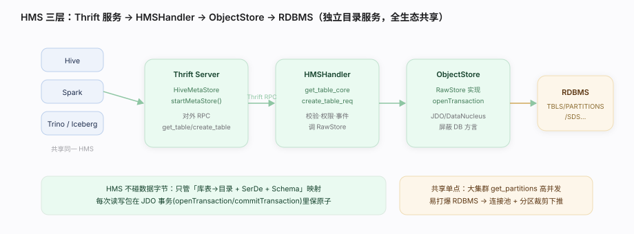

# Hive 核心原理 · 支撑主线 · 元数据服务（HMS）

> **定位**：元数据服务是 Hive 的**底座能力域之首**——它把「表 = HDFS 目录 + SerDe 规则 + Schema」这层绑定从引擎里剥离成一个**独立进程（Hive Metastore, HMS）**，元数据落在外部 RDBMS（MySQL/PostgreSQL/Derby）。它不仅服务 Hive，还是 Spark / Trino / Impala / Iceberg 共享的**事实标准目录**。前台同步（编译期查库表/分区）走它，后台异步（事件通知/孤儿清理）也走它。

## 一、原型：为什么元数据要独立成服务

一体化数据库（如 PostgreSQL）把元数据（系统表）和数据放在同一进程里；Hive 反其道而行——**把元数据抽成一个有 Thrift 接口的独立服务**：

- **共享**：一份元数据，整个 Hadoop 生态（Spark/Trino/Impala）都能读。这是 Hive 成为「数仓门面」的生态位根基。
- **解耦**：HMS 只管「有哪些库表、每张表的目录在哪、用什么 SerDe 解释」，**不碰数据字节**；数据在 HDFS/对象存储里，由执行引擎按元数据规则去读。
- **可插拔存储**：元数据自身持久化在外部 RDBMS，通过 **DataNucleus（JDO）** ORM 层屏蔽具体数据库方言。

> 一句话：**HMS = 一个「库表→目录+SerDe+Schema」映射的独立目录服务，Thrift 对外、RDBMS 落地、全生态共享。**

---

## 二、三层结构：Thrift 服务 → HMSHandler → ObjectStore → RDBMS

| 层 | 载体 | 职责 |
|---|---|---|
| Thrift Server | `HiveMetaStore` 启动的 TServer | 对外暴露 `get_table` / `create_table` / `get_partitions` 等 RPC |
| 业务处理 | `HMSHandler`（实现 Thrift `IFace`） | 参数校验、权限、事件通知、调 RawStore |
| 持久化 | `ObjectStore`（实现 `RawStore`） | 用 JDO/DataNucleus 把对象读写进 RDBMS |
| 存储 | 外部 RDBMS | 真正落地元数据表（TBLS/PARTITIONS/SDS…） |

调用方向：客户端 → Thrift → `HMSHandler.get_table_core` → `ObjectStore` → JDO → RDBMS。

---

## 三、一次「查表元数据」的路径（源码核实）

从 HiveServer2 编译期需要表 Schema 说起：

| 阶段 | 源码入口 |
|---|---|
| 服务启动 | `HiveMetaStore.startMetaStore()`（启动 Thrift TServer，监听端口） |
| 收到 get_table RPC | `HMSHandler.get_table_core()`（校验 + 调 RawStore） |
| 持久化读 | `ObjectStore.openTransaction()` → JDO 查询 → `commitTransaction()` |
| 建表 | `HMSHandler.create_table_req()`（校验 + 落库 + 触发事件） |

> **要点**：每次元数据读写在 ObjectStore 里都包在 `openTransaction()`/`commitTransaction()` 事务里（JDO 事务，不是 Hive ACID），保证元数据操作的原子性。

---

## 四、元数据对象模型（Catalog → DB → Table → Partition → SD）

| 对象 | 记录内容 |
|---|---|
| Catalog | 命名空间根（多租户/联邦隔离） |
| Database | 库，含 location（HDFS 目录） |
| Table | 表：类型（managed/external）、列 Schema、SerDe、InputFormat/OutputFormat、表参数 |
| Partition | 分区：分区值 → 子目录 + 各自的 SD（可覆盖表级格式） |
| StorageDescriptor(SD) | location + SerDe 类 + Input/OutputFormat + 分桶/排序信息 |

**managed vs external**：managed 表删表连数据目录一起删；external 表删表只删元数据、保留目录——这个区别就存在 Table 的类型字段里。

---

## 五、事件通知与后台清理（异步侧）

- **事件通知（Notification Log）**：每次 DDL/DML 元数据变更写一条 event 到 RDBMS 的通知表，供下游（Iceberg/复制工具/缓存）增量消费——这是「共享目录」能被生态实时感知的机制。
- **孤儿元数据清理**：后台线程周期清理无主的统计、过期事件等。
- 二者都由 HMS 启动时拉起的后台线程承接（见 `startMetaStore` 内的线程初始化）。

---

## 六、调优要点（关键开关）

- **HMS 是共享单点**：大集群下 get_partitions 高并发会打爆 RDBMS，务必给 HMS 配连接池 + RDBMS 读写分离；分区数爆炸（百万级）是头号杀手。
- **分区裁剪下推到 HMS**：编译期用 `get_partitions_by_filter` 让 RDBMS 侧过滤，避免拉全量分区回引擎再筛。
- **别直接改 RDBMS**：绕过 HMS 直接写元数据表会跳过缓存与事件通知，导致下游看不到变更。
- **元数据缓存**：HMS 侧可开缓存（CachedStore）降 RDBMS 压力，但要权衡一致性延迟。

---

## 七、常见误区与工程要点

- **HMS 不是数据库，是服务**：它是有 Thrift 接口的进程，背后才是 RDBMS；「连 Metastore」指连它的 Thrift 端口，不是连 RDBMS。
- **Hive 不「存」数据**：表只是「目录 + SerDe + Schema」三者的元数据绑定，删 managed 表才删目录。
- **元数据是全生态共享资产**：改表结构会影响所有读同一 HMS 的引擎（Spark/Trino），不是只影响 Hive。

---

## 源码锚点（用户分支核实）

> 源码前缀 `standalone-metastore/metastore-server/src/main/java/org/apache/hadoop/hive/metastore/`；均已在用户工作区分支 grep 核实。

- **HMS 主入口**：`HiveMetaStore.java:228`（`main`）。
- **Thrift 服务启动**：`HiveMetaStore.java:335`（`startMetaStore`）。
- **后台线程拉起**：`HiveMetaStore.java:824`（`startMetaStoreThreads`）。
- **业务处理·查表**：`HMSHandler.java:1282`（`get_table_core`）。
- **业务处理·建表**：`HMSHandler.java:878`（`create_table_req`）。
- **持久化·类定义**：`ObjectStore.java:170`（`class ObjectStore implements RawStore`）。
- **持久化·初始化**：`ObjectStore.java:254`（`initialize`）。
- **持久化·开事务**：`ObjectStore.java:392`（`openTransaction`）。
- **持久化·提交事务**：`ObjectStore.java:492`（`commitTransaction`）。

---

## 一句话总纲

**Hive Metastore 是把「库表→目录 + SerDe + Schema」映射抽出来的独立目录服务：Thrift 对外（HMSHandler）、JDO 落 RDBMS（ObjectStore）、每次读写包在 JDO 事务里；它不碰数据字节，却是整个 Hadoop 生态共享的事实标准元数据——这正是 Hive 存算分离数仓门面的底座。**