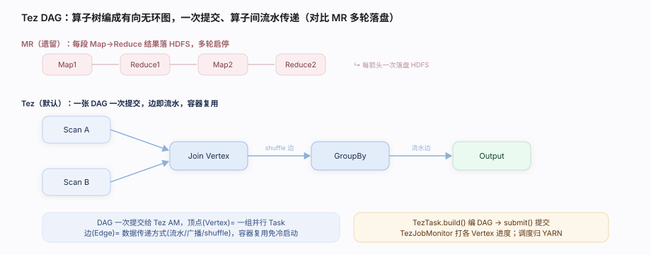

# Hive 核心原理 · 支撑主线 · 执行引擎

> **定位**：执行引擎是 Hive 的**计算能力域**——负责把编译层产出的「引擎无关算子树 / Task DAG」真正跑起来，读 HDFS 数据、算出结果、回吐给客户端。它是 Hive「存算解耦」里**执行侧解耦**的一半：Hive 自己不实现分布式调度，而是把 Task 翻译成 **Tez DAG / MR Job / LLAP 常驻查询**，交给可插拔的执行框架去跑。它横跨**前台同步**（Driver 提交并等结果）与**后台常驻**（LLAP 守护进程）两种时机。

## 一、原型：可插拔的执行框架

Hive 把「怎么跑」彻底外包，`hive.execution.engine` 一个开关就能换引擎：

- **Tez（默认）**：把算子树编成一张 **DAG**（有向无环图），一次提交、算子间流水传递、容器复用，避免 MR 的多轮落盘。
- **MR（遗留）**：编成一串 MapReduce Job，每段中间结果落 HDFS，慢但最稳。
- **LLAP（Live Long And Process）**：一组**常驻守护进程**，预热 JVM + 缓存列存数据（ORC），专治交互式低延迟点查。

> 一句话：**执行引擎 = 算子树/Task DAG →（Driver 提交）→ Tez/MR/LLAP 分布式跑 → FetchTask 取结果回吐。**

---

## 二、三引擎对比

| 引擎 | 形态 | 中间结果 | 延迟 | 适用 |
|---|---|---|---|---|
| Tez | DAG，容器复用 | 内存/流水传递 | 中 | 默认，批 + 交互 |
| MR | 多轮 Job | 每轮落 HDFS | 高 | 遗留兼容、超大稳态 |
| LLAP | 常驻守护 + 缓存 | 内存缓存 | 低 | 交互式 BI/点查 |

三者共享同一套编译产物——切引擎不改 SQL，这正是「执行解耦」的价值。

---

## 三、一次执行路径（源码核实）

Driver 是前台执行的总指挥，`runInternal` 串起「加锁 → 执行 → 取数」：

| 步 | 做什么 | 源码入口 |
|---|---|---|
| ① 驱动串联 | 编译后进入执行阶段 | `Driver.runInternal():152` |
| ② 加锁 | 申请事务/表锁，保障并发正确 | `Driver.lockAndRespond():327` |
| ③ 执行 | 触发 Task 执行 | `Driver.execute():342`（私有实现） |
| ④ 提交 DAG | Tez Task 构建并提交 DAG | `TezTask.execute():156` |
| ⑤ 建图 | 算子树 → Tez DAG | `TezTask.build():495`（内部 `createDagName():506`） |
| ⑥ 提交并监控 | 提交 DAG、拿 DAGClient、TezJobMonitor 打进度 | `TezTask.submit(dag):653` + `TezJobMonitor`（`:280` 构造） |
| ⑦ 取结果 | 前台从结果目录拉数回客户端 | `FetchTask`（Driver `:193` 装配） |

`TezTask` 定义见 `ql/src/java/org/apache/hadoop/hive/ql/exec/tez/TezTask.java:106（class TezTask extends Task<TezWork>）`。

---

## 四、向量化执行

Hive 的算子默认一行一行处理（火山模型），开销大。**向量化**把「一行」换成「一批（默认 1024 行）」：

- 核心载体 `VectorizedRowBatch`——列式内存批，一列一个数组，CPU 缓存友好、可 SIMD。
- 向量化算子（如 `VectorGroupByOperator`）对整批做聚合/过滤，函数调用次数骤降。
- 只对 ORC/Parquet 列存 + 支持的类型生效，`hive.vectorized.execution.enabled` 开关控制。

源码：`storage-api/src/java/org/apache/hadoop/hive/ql/exec/vector/VectorizedRowBatch.java:39`；向量算子 `ql/src/java/org/apache/hadoop/hive/ql/exec/vector/VectorGroupByOperator.java`。

---

## 五、深化·LLAP 守护与缓存

LLAP 不是新引擎，而是 **Tez 之上的加速层**：

- 一组常驻 `LlapDaemon`（`llap-server/src/java/org/apache/hadoop/hive/llap/daemon/impl/LlapDaemon.java:103`）预先拉起，省去每查询冷启动。
- 内建**列存缓存**（ORC 解码后缓存在堆外），热数据反复查不再读 HDFS。
- 一部分算子（尤其扫描/过滤）下沉到守护进程执行，Tez 只做协调——交互式查询延迟从秒级降到亚秒。

---

## 六、调优要点

- **默认用 Tez**，别用 MR：`set hive.execution.engine=tez;`。MR 仅为极端兼容保留。
- **开向量化**：`set hive.vectorized.execution.enabled=true;`——配合 ORC 列存收益最大。
- **交互式上 LLAP**：BI/自助查询场景部署 LLAP 守护 + 缓存，秒级变亚秒。
- **容器复用/预热**：Tez 容器复用（`tez.am.container.reuse.enabled`）省启动开销。
- **看 DAG 进度**：TezJobMonitor 打印各 Vertex 进度，卡在哪个算子一目了然。

---

## 七、常见误区

- **「Hive 自己实现了分布式调度」**：错。Hive 只编 Task，跑靠 Tez/MR/LLAP，调度归 YARN。
- **「换引擎要改 SQL」**：错。编译产物引擎无关，切 `execution.engine` 即可。
- **「LLAP 是独立引擎」**：不准。LLAP 是 Tez 上的常驻缓存加速层，仍走 Tez 协调。
- **「向量化对所有查询都提速」**：错。仅列存 + 支持类型生效，行存/复杂 UDF 可能回退逐行。
- **「Tez 全程不落盘」**：不严谨。数据量超内存时 shuffle 仍会溢写磁盘，只是比 MR 少。

---

## 源码锚点（file:line 全核实，工作区外 `/Users/zhangdongdong92/workdir/hive/`）

| 主题 | 文件:行 | 说明 |
|---|---|---|
| 执行驱动 | `ql/.../ql/Driver.java:152` | `runInternal` 串加锁→执行→取数 |
| 加锁 | `ql/.../ql/Driver.java:327` | `lockAndRespond` |
| 执行 | `ql/.../ql/Driver.java:342` | `execute`（私有） |
| Tez Task | `ql/.../ql/exec/tez/TezTask.java:106` / `execute:156` | 提交 DAG 的 Task |
| 建 DAG | `TezTask.java:495`（build）/ `:506`（createDagName） | 算子树→Tez DAG |
| 提交监控 | `TezTask.java:653`（submit）/ `:280`（TezJobMonitor 构造） | 提交 + 进度 |
| 向量化批 | `storage-api/.../vector/VectorizedRowBatch.java:39` | 列式内存批 1024 行 |
| 向量算子 | `ql/.../exec/vector/VectorGroupByOperator.java` | 整批聚合 |
| LLAP 守护 | `llap-server/.../daemon/impl/LlapDaemon.java:103` | 常驻缓存加速 |

---

> **一句话总纲**：执行引擎是 Hive 把编译产物「跑起来」的执行侧解耦层——Driver 前台加锁提交、Tez 把算子树编成 DAG 分布式流水执行、向量化按批压榨 CPU、LLAP 常驻缓存冲低延迟，而分布式调度本身外包给 YARN，Hive 只负责翻译与协调。