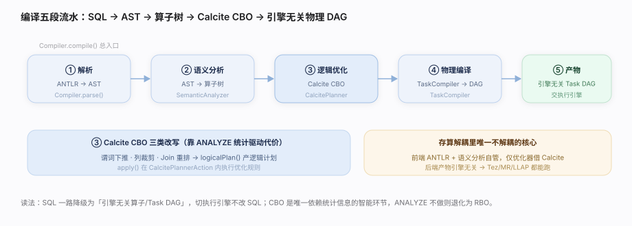

# Hive 核心原理 · 支撑主线 · 编译优化

> **定位**：编译优化是 Hive 的**计算能力域**——它是「SQL 门面」里 Hive **自己完全掌控**的那一半（存储/执行都解耦出去了，唯独编译器是 Hive 的核心资产）。职责：把一句 HiveQL 文本，经 **词法/语法解析 → 语义分析 → Calcite CBO 逻辑优化 → 物理算子树 → 执行计划（Tez DAG/MR Job）** 五段流水，翻译成可交给执行引擎跑的 Task 树。它全程发生在**前台同步**编译期。

## 一、原型：Hive 编译器 = 前端自管 + 后端解耦

Hive 是「解耦式 SQL 数仓门面」，但编译优化层是它**不解耦**的核心：

- **前端全自管**：HiveQL 方言的 Parser（ANTLR 文法）、语义分析、类型系统都是 Hive 自己的。
- **优化器借力 Calcite**：逻辑优化（RBO 规则 + CBO 代价）委托给 Apache Calcite——业界通用优化器框架，Hive 把自己的 Operator 树桥接成 Calcite 的 RelNode 做优化，再翻译回来。
- **后端产物解耦**：最终产物是「引擎无关的算子树」，再由 TaskCompiler 按目标引擎（Tez/MR）编译成对应的 Task DAG——所以同一条 SQL 可跑在不同引擎上。

> 一句话：**编译优化 = HiveQL → AST →（Hive 语义分析）→ Calcite CBO 优化 → Hive 物理算子树 →（TaskCompiler）→ Tez DAG / MR Job。**

---

## 二、五段编译流水（源码核实）

| 段 | 做什么 | 源码入口 |
|---|---|---|
| ① 驱动编译 | 编译总入口，串起 parse→analyze→plan | `Compiler.compile():98` |
| ② 语法解析 | HiveQL 文本 → AST（ANTLR 文法） | `Compiler.parse():169` |
| ③ 语义分析 | AST → 算子树 + 元数据绑定 | `Compiler.analyze():185` → `BaseSemanticAnalyzer.analyze():356` → `SemanticAnalyzer.analyzeInternal():12749` |
| ④ CBO 优化 | 算子树桥接 Calcite → 代价优化 → 回译 | `CalcitePlanner.logicalPlan():1261` → `CalcitePlannerAction.apply():1531` |
| ⑤ 物理编译 | 算子树 → 引擎 Task DAG | `TaskCompiler.compile():128` |

其中 `CalcitePlanner` 继承自 `SemanticAnalyzer`（`CalcitePlanner.java:362`）——开启 CBO 时用 Calcite 路径，否则回退纯 RBO 的 `SemanticAnalyzer.genPlan()`（`:12351`）。

---

## 三、语义分析：AST → 算子树（Operator Tree）

语义分析把 AST 变成 **QB（Query Block）** 结构，再逐块 `genPlan` 生成 **Operator 树**（TableScan → Filter → Select → Join → GroupBy → ReduceSink → FileSink）：

- **元数据绑定**：解析 `FROM` 表名时调 HMS 拿 Schema/SerDe/分区，做列解析与类型检查。
- **分区裁剪**：把 `WHERE` 里的分区谓词下推到 HMS，编译期就只取相关分区元数据。
- **算子树**：Hive 内部的执行抽象，节点是 `Operator`，边是数据流——这是后续物理编译的输入。

---

## 四、Calcite CBO：基于代价的优化

开启 CBO 后，Hive 把 Operator 树桥接成 Calcite 的 **RelNode**，交给 Calcite 的 Volcano/规则优化器：

| 优化类别 | 典型规则 |
|---|---|
| 谓词下推 | Filter 尽量贴近 TableScan，减少扫描行 |
| 列裁剪 | 只读查询用到的列（配合列存事半功倍） |
| Join 重排序 | 按统计信息（行数/NDV）选最优 Join 顺序与算法 |
| 分区裁剪 | 结合分区谓词消除无关分区 |
| 常量折叠/子查询展开 | 表达式化简、相关子查询转 Join |

**代价来自统计信息**：表/列的行数、NDV（不同值数）、数据大小由后台 `ANALYZE TABLE` 收集，存 HMS。统计缺失时 CBO 退化为拍脑袋估计，Join 顺序可能很差——所以「先跑 ANALYZE」是 Hive 调优第一课。

---

## 五、物理编译：算子树 → 引擎 Task DAG

`TaskCompiler` 是抽象类，按目标引擎有不同实现（`TezCompiler` / `MapReduceCompiler`）：

- 把逻辑算子树切成 **Task**（一个 Task ≈ 一个 Tez Vertex 或一个 MR Job）。
- 决定 shuffle 边界（ReduceSink 处）、Join 物理算法（MapJoin/CommonJoin）、并行度。
- 产出 `QueryPlan`（Task 树），交回 `Driver.execute()` 提交执行引擎。

---

## 六、调优要点（关键开关）

- **先 ANALYZE 再查**：`ANALYZE TABLE ... COMPUTE STATISTICS` 让 CBO 有代价依据，Join 顺序天差地别。
- **CBO 默认开**：`hive.cbo.enable=true`；关掉会退回纯规则优化，复杂多表 Join 明显变慢。
- **MapJoin 阈值**：小表能进内存就走 MapJoin（无 shuffle），`hive.auto.convert.join.noconditionaltask.size` 控阈值。
- **矢量化 + 分区裁剪**：配合列存格式（ORC/Parquet）与分区设计，让优化器能裁掉大量数据。
- **EXPLAIN 看计划**：`EXPLAIN` / `EXPLAIN CBO` 确认谓词是否下推、Join 顺序是否合理。

---

## 七、常见误区与工程要点

- **CBO ≠ 万能**：没有统计信息时 CBO 反而可能选错，务必先 ANALYZE。
- **算子树是引擎无关的**：同一条 SQL 编译出的逻辑算子树可跑 Tez 或 MR，差异在物理编译段。
- **编译在前台同步**：编译期要访问 HMS 取元数据，HMS 慢会直接拖慢查询响应（不是执行慢）。
- **子查询/相关子查询代价高**：优化器会尽量转成 Join，但复杂嵌套仍可能爆计划，写 SQL 时注意。

---

## 源码锚点（用户分支核实）

> 源码前缀 `ql/src/java/org/apache/hadoop/hive/ql/`；均已在用户工作区分支 grep 核实。

- **编译总入口**：`Compiler.java:98`（`compile`）。
- **语法解析**：`Compiler.java:169`（`parse`）。
- **语义分析调度**：`Compiler.java:185`（`analyze`）。
- **语义分析基类入口**：`parse/BaseSemanticAnalyzer.java:356`（`analyze`）。
- **语义分析主体**：`parse/SemanticAnalyzer.java:334`（`class SemanticAnalyzer`）、`:12749`（`analyzeInternal`）、`:12351`（`genPlan`，RBO 路径）。
- **CBO 规划器**：`parse/CalcitePlanner.java:362`（`class CalcitePlanner extends SemanticAnalyzer`）、`:1261`（`logicalPlan`）、`:1531`（`CalcitePlannerAction.apply`）。
- **物理编译**：`parse/TaskCompiler.java:110`（`class TaskCompiler`）、`:128`（`compile`）。

---

## 一句话总纲

**Hive 编译优化是它在「存算解耦」里唯一不解耦的核心：HiveQL 经 Parser→语义分析（绑 HMS 元数据、生成 Operator 树）→ Calcite CBO（靠 ANALYZE 收集的统计做代价优化、谓词下推、Join 重排）→ TaskCompiler 编成引擎无关到引擎相关的 Task DAG——前台同步完成，产出交执行引擎跑。**