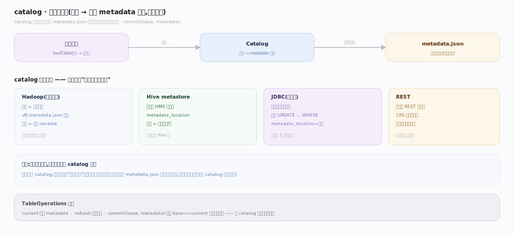
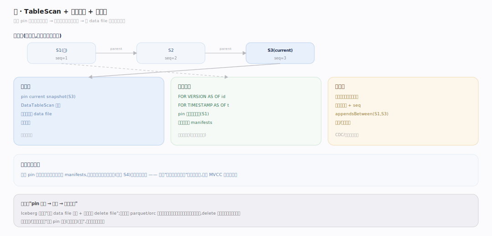
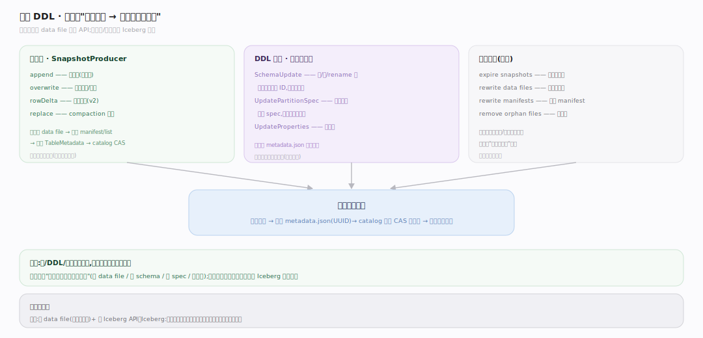
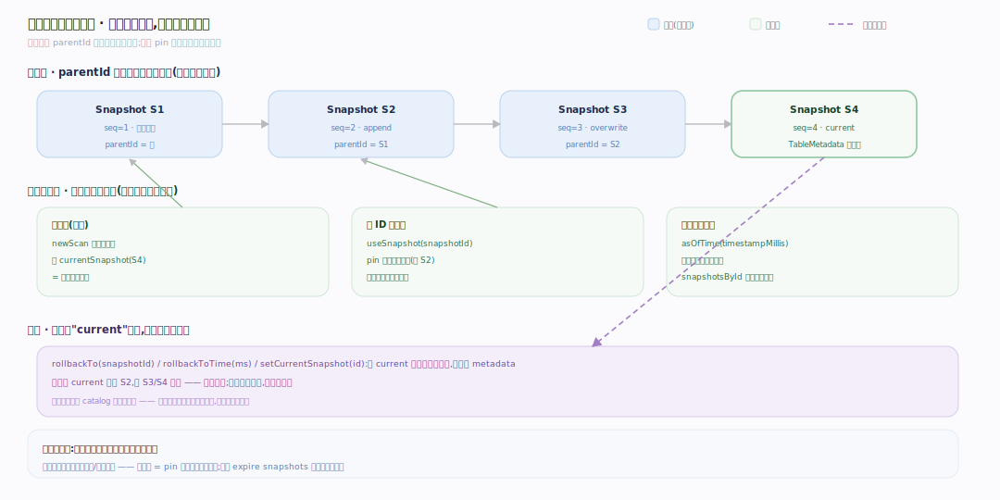

# Iceberg 原理 · 接触面主线 · 表 API 与快照读

> **定位**：属"接触面主线"(计算引擎可见)。Iceberg 的接触面是**表操作 API**:通过计算引擎(Spark/Trino/Flink)读写表、时间旅行读历史快照、DDL 演进。它不是给终端用户的 SQL,而是给引擎集成的库 API + catalog。调用【元数据树】遍历、【快照与提交】写、【扫描规划】读。源码基准 **Iceberg(apache/iceberg main · commit 6ec1a01)**(`api/`、`core/`)。

Iceberg 怎么被用?**不直接面向终端用户**——它是链接进 Spark/Trino/Flink 的库,引擎通过 Iceberg 的表 API + catalog 读写表。用户写的 SQL 在引擎里执行,引擎调 Iceberg 做元数据操作(找文件、提交快照)。所以 Iceberg 的"接触面"是引擎集成层:catalog(找表)、TableScan(读)、SnapshotProducer(写)、时间旅行(读历史)。

---

## 一、catalog:表的入口

图注:catalog 是找表入口,存"表名 → 当前 metadata 位置"这一个指针。类型多样:Hadoop(文件系统,目录约定 + rename 提交)、Hive/JDBC(元存储,条件 UPDATE 提交)、REST(服务端 CAS)。拿到 metadata 就能顺元数据树读整张表;引擎经 catalog 找到表,再走 TableScan/提交。

---

## 二、读:TableScan + 时间旅行

图注:读经 TableScan 规划(DataTableScan)——读 current snapshot 元数据树、两级剪枝出 data file 列表交引擎扫;因快照不可变、旧快照保留,可按 id/时间读任意历史或读两快照增量。快照隔离免费:读者 pin 一个快照读它不可变的 manifests,读期间别人提交不影响——不可变元数据树的天然红利。

---

## 三、写与 DDL:SnapshotProducer + 演进 API

图注:写数据经 SnapshotProducer(append/overwrite/rowDelta)提交——写新 manifest/manifest list、构建新 TableMetadata、catalog 原子 CAS。DDL 演进(SchemaUpdate 加删改列、UpdatePartitionSpec、UpdateProperties)只改元数据、不重写数据;维护操作(expire/rewrite)由存储过程触发。全部走"改元数据 → 原子提交新快照"的统一模式:引擎只管产 data file 和调 API,原子性/一致性由 Iceberg 保证。

---

## 四、时间旅行与快照回溯

图注:快照靠 parentId 串成不可变版本链,旧快照默认永久保留(直到显式 expire)。读历史三入口:默认 currentSnapshot、useSnapshot(id) 按 id pin、asOfTime(ms) 按时间选。回溯用 rollbackTo/rollbackToTime/setCurrentSnapshot,只移动 current 指针、不删任何快照,和一次普通写一样走 catalog 原子换指针。所以时间旅行不需额外备份或日志重放——读历史 = pin 一个还在的旧快照。

---

## 拓展 · 表 API 关键结构一览

| 结构 | 定义 | 职责 |
|---|---|---|
| Catalog | `api/.../catalog/` | 表名→metadata 位置(Hadoop/Hive/JDBC/REST) |
| TableScan / DataTableScan | `core/.../DataTableScan.java:64` | 读规划(含时间旅行 pin 快照) |
| SnapshotProducer | `core/.../SnapshotProducer.java` | 写提交(append/overwrite/rowDelta) |
| SchemaUpdate | `core/.../SchemaUpdate.java` | schema 演进 DDL |
| Snapshot(时间旅行) | `api/.../Snapshot.java:42` | 按 id/时间读历史 |
| ManageSnapshots | `api/.../ManageSnapshots.java:72`/`:62`/`:53` | 回溯:rollbackTo/rollbackToTime/setCurrentSnapshot |

## 调优要点（关键开关）

- **catalog 选型**:生产用 REST/Hive/JDBC(集中管理);测试可用 Hadoop(文件系统)。
- **时间旅行 + 快照过期**:保留策略平衡"能回溯多久"与"元数据/数据膨胀";定期 expire。
- **写模式**:append(纯追加,无冲突)、overwrite(覆盖分区)、rowDelta(行级删除,v2)——按语义选。
- **维护任务**:定期 rewrite data files/manifests + expire snapshots,防小文件/快照膨胀。

## 常见误区与工程要点

- **误区:Iceberg 是查询引擎/有自己的 SQL 执行。** 不。它是库/规范,链接进 Spark/Trino/Flink;SQL 在引擎里执行,引擎调 Iceberg 做元数据操作。
- **误区:时间旅行要额外存储。** 旧快照本就保留(不可变),时间旅行是读历史快照,零额外成本(直到 expire)。
- **误区:catalog 存表数据。** catalog 只存"表名→当前 metadata 位置"一个指针;数据和元数据树都在对象存储。
- **误区:DDL 要停写/重写。** schema/分区演进只改元数据(按字段 ID/spec id),不重写数据、不停写。
- **归属提醒**:读规划在【扫描规划】;写提交/CAS 在【快照与提交】;演进逻辑在【schema 与分区演进】;元数据树结构在【元数据树】;实际数据读写由计算引擎。

## 深化 · 源码锚点（apache/iceberg · commit 6ec1a01）

| 论断 | 锚点 |
|---|---|
| BaseTable：引擎拿到的表句柄，newScan/currentSnapshot/updateSchema 等 | `core/src/main/java/org/apache/iceberg/BaseTable.java:42` |
| newScan 造 TableScan（读入口） | `core/src/main/java/org/apache/iceberg/BaseTable.java:83` |
| currentSnapshot 拿当前快照 | `core/src/main/java/org/apache/iceberg/BaseTable.java:145` |
| TableScan 契约（planFiles/时间旅行） | `api/src/main/java/org/apache/iceberg/TableScan.java:22` |
| 时间旅行读：useSnapshot(id) pin 历史快照 | `api/src/main/java/org/apache/iceberg/TableScan.java:38` |
| 时间旅行读：asOfTime(ms) 按时间选快照 | `api/src/main/java/org/apache/iceberg/TableScan.java:62` |
| 读的 planFiles 落到 DataTableScan.doPlanFiles | `core/src/main/java/org/apache/iceberg/DataTableScan.java:64` |
| Snapshot 不可变，读者 pin 后免锁隔离 | `core/src/main/java/org/apache/iceberg/BaseSnapshot.java:36` |
| 写经 SnapshotProducer.commit（append/overwrite/rowDelta 统一路径） | `core/src/main/java/org/apache/iceberg/SnapshotProducer.java:480` |
| DDL 演进经 UpdateSchema（不重写数据） | `core/src/main/java/org/apache/iceberg/BaseTable.java:165` |
| catalog 找表：TableMetadata 是引擎可见的表状态 | `core/src/main/java/org/apache/iceberg/TableMetadata.java:54` |

## 一句话总纲

**Iceberg 的接触面是给计算引擎集成的表 API + catalog(不面向终端用户 SQL):catalog(Hadoop/Hive/JDBC/REST)存"表名→当前 metadata 位置"指针作入口;读经 TableScan 规划当前快照(时间旅行 pin 历史快照读任意版本、增量读快照间差异,快照隔离免费);写经 SnapshotProducer(append/overwrite/rowDelta)+ DDL(SchemaUpdate/UpdatePartitionSpec 按字段 ID/spec id 演进不重写数据)统一走"改元数据→原子提交新快照";Spark/Trino/Flink 产 data file 调 API,原子性一致性由 Iceberg 保证。**
