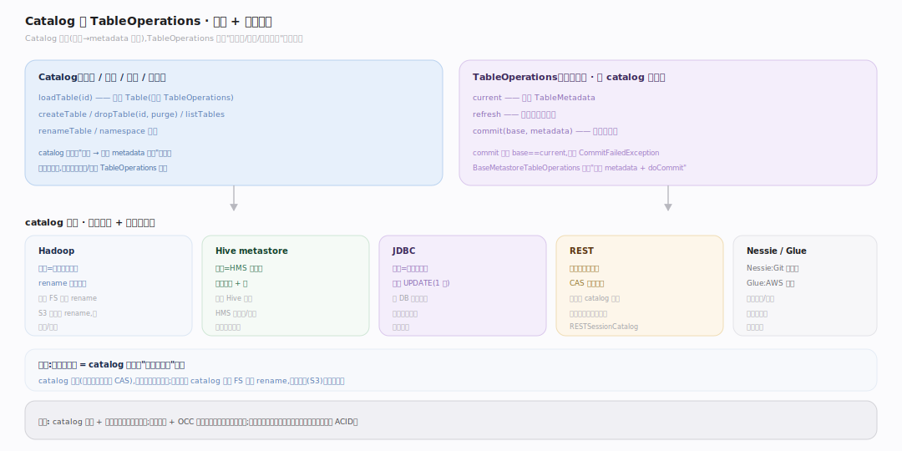
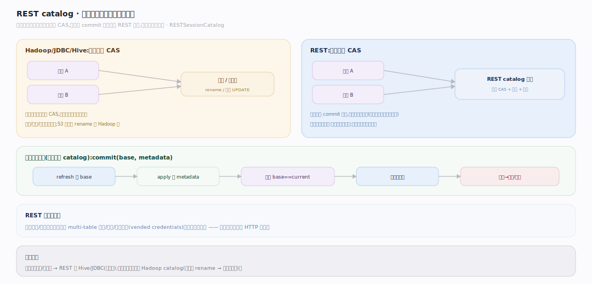
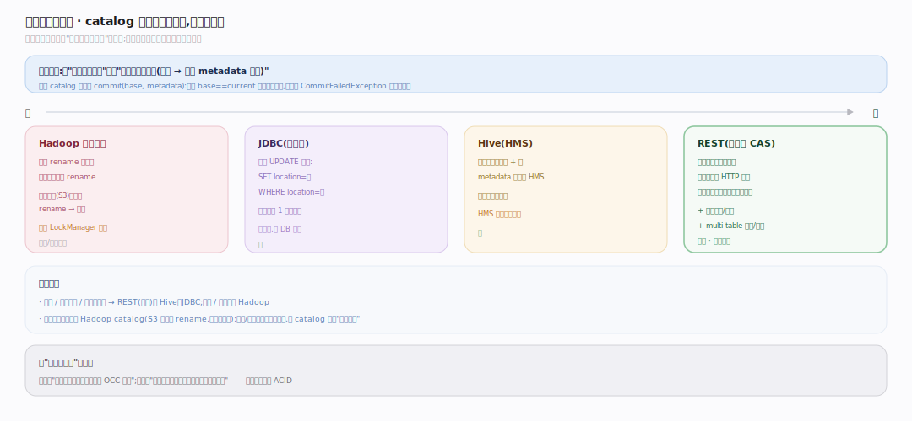

# Iceberg 原理 · 支撑主线 · catalog 与并发

> **定位**：属"事务能力域"的入口侧。管两件事:catalog(表名 → 当前 metadata 位置的映射、建/删/列表)与 TableOperations 提交契约(current/refresh/commit),以及不同 catalog 实现如何提供"原子换指针"这一并发正确性基石。姊妹主线【快照与提交】管快照产出 + OCC 重试逻辑;本主线管 catalog 抽象/类型/提交原语。依赖【元数据树】(指针指向 metadata.json)。源码基准 **Iceberg(apache/iceberg main · commit 6ec1a01)**(`api/catalog/`、`core/`)。

Iceberg 在无事务、无锁的对象存储上做 ACID,靠的是把"原子性"归约到"原子换一个指针"。**catalog** 就是持有这个指针("表名 → 当前 metadata 位置")并提供原子交换能力的组件;**TableOperations** 是所有 catalog 都要实现的统一提交契约。catalog 的强弱(文件系统 rename、元存储条件更新、还是服务端 CAS)直接决定多写者并发的可靠性——这是本主线与【快照与提交】互补的一面:那边管"怎么产快照、冲突了怎么重试",这边管"指针存哪、怎么原子换、并发有多可靠"。

---

## 一、Catalog 与 TableOperations:找表 + 提交契约

图注:Catalog 解决"表名 → 表"映射与生命周期(loadTable/createTable/dropTable/listTables/renameTable),只存一个指针、不存数据。TableOperations 是所有 catalog 都实现的提交契约:current(当前 TableMetadata)、refresh(重读)、commit(base, metadata)(校验 base==current 后原子换指针);BaseMetastoreTableOperations 用 writeNewMetadata 收敛公共流程。四类 catalog 差异只在"如何原子换指针":Hadoop rename、Hive HMS 条件更新+锁、JDBC 条件 UPDATE 一行、REST 服务端 CAS。

---

## 二、REST catalog:把提交与并发收敛到服务端

图注:REST catalog(RESTSessionCatalog)是并发正确性最强的形态——客户端不直接碰存储做 CAS,而把 commit 发给服务端统一裁决冲突(冲突返回 CommitFailedException、客户端重试)。引擎与后端解耦:换后端不动引擎,可托管、多引擎共享同一 catalog;还集中鉴权/审计、服务端 multi-table 事务/视图、凭据下发。并发可靠性:集中式(REST / Hive / JDBC)强,文件系统 Hadoop 在对象存储上最弱——这正是"catalog 强弱决定并发可靠性"。

---

## 三、并发可靠性阶梯:四类 catalog 从弱到强

图注:四类实现差异只在"如何原子换指针",强弱直接排出并发可靠性——Hadoop 靠原子 rename,对象存储无原子 rename 时最弱(可选 LockManager 兜底);JDBC 条件 UPDATE 一行、Hive HMS 条件更新+锁,集中式较强(HMS 单点易瓶颈);REST 服务端 CAS 最强。生产/多写/多引擎共享选 REST 或 Hive、JDBC,对象存储上避免纯 Hadoop。与【快照与提交】互补:那边管"怎么产快照、OCC 重试",这边管"指针存哪、怎么原子换"。Nessie(Git 式分支)、Glue(AWS 托管)是平台特化变体。

---

## 拓展 · catalog 与并发关键结构一览

| 结构 | 定义 | 职责 |
|---|---|---|
| Catalog | `api/.../catalog/Catalog.java:33` | 表名→表映射、建/删/列表/改名 |
| TableOperations | `core/.../TableOperations.java:28` | current/refresh/commit(base,metadata) 契约 |
| BaseMetastoreTableOperations | `core/.../BaseMetastoreTableOperations.java:155` | writeNewMetadata + doCommit 公共流程 |
| HadoopTableOperations | `core/.../hadoop/HadoopTableOperations.java:132` | rename 原子提交(文件系统) |
| JdbcTableOperations | `core/.../jdbc/JdbcTableOperations.java:103` | 条件 UPDATE 一行提交(关系库) |
| RESTSessionCatalog | `core/.../rest/RESTSessionCatalog.java` | 服务端 CAS + 鉴权 + 视图 |

## 调优要点（关键开关）

- **生产选集中式 catalog**:多写并发/多引擎共享用 REST 或 Hive/JDBC;测试/单机才用 Hadoop。
- **对象存储避免纯 Hadoop catalog**:S3 无原子 rename → 提交不可靠;用 REST/Glue/JDBC 或带 LockManager 的方案。
- **catalog 是并发瓶颈也是保障**:HMS 单点易成瓶颈;REST 可水平扩展且能力最全。
- **凭据与鉴权**:REST 的 vended credentials 让引擎无需持久密钥,按表下发临时凭据,更安全。

## 常见误区与工程要点

- **误区:catalog 存表数据。** catalog 只存"表名 → 当前 metadata 位置"一个指针;数据和元数据树都在对象存储。
- **误区:所有 catalog 并发一样可靠。** 取决于"原子换指针"能力:服务端 CAS/条件更新强,文件系统 rename 在对象存储上弱。
- **误区:REST catalog 只是个代理。** 它把 CAS、鉴权、multi-table 事务、凭据下发收敛到服务端,是能力最全的形态,不只是转发。
- **误区:换 catalog 要迁移数据。** 数据/元数据树都在存储不动;换 catalog 只是换"谁持有并原子交换指针"。
- **归属提醒**:快照产出与 OCC 重试逻辑在【快照与提交】;元数据树结构在【元数据树】;本主线管 catalog 抽象/类型/提交原语与并发可靠性。三者共同实现 ACID。

## 深化 · 源码锚点（apache/iceberg · commit 6ec1a01）

| 论断 | 锚点 |
|---|---|
| TableOperations 提交契约接口 | `core/src/main/java/org/apache/iceberg/TableOperations.java:28` |
| current()：当前 TableMetadata | `core/src/main/java/org/apache/iceberg/TableOperations.java:35` |
| refresh()：重读最新元数据 | `core/src/main/java/org/apache/iceberg/TableOperations.java:42` |
| commit(base, metadata)：校验 base==current 后原子换指针 | `core/src/main/java/org/apache/iceberg/TableOperations.java:64` |
| BaseMetastoreTableOperations 收敛公共流程 | `core/src/main/java/org/apache/iceberg/BaseMetastoreTableOperations.java:42` |
| writeNewMetadata：写全新 metadata.json（版本号+1） | `core/src/main/java/org/apache/iceberg/BaseMetastoreTableOperations.java:155` |
| writeNewMetadataIfRequired：按需写新元数据 | `core/src/main/java/org/apache/iceberg/BaseMetastoreTableOperations.java:149` |
| TableMetadata 是被 CAS 交换的不可变状态 | `core/src/main/java/org/apache/iceberg/TableMetadata.java:54` |
| 引擎侧经 BaseTable 拿到含 TableOperations 的句柄 | `core/src/main/java/org/apache/iceberg/BaseTable.java:42` |
| OCC 冲突转 CommitFailedException 后由 SnapshotProducer 重试 | `core/src/main/java/org/apache/iceberg/SnapshotProducer.java:485` |

## 一句话总纲

**catalog 与并发是 Iceberg ACID 的入口侧:Catalog 持有"表名 → 当前 metadata 位置"这一个指针并管表生命周期,TableOperations 定义所有 catalog 都实现的 current/refresh/commit(base,metadata) 契约——commit 校验 base==current 后【原子换指针】;四类实现(Hadoop rename / Hive 条件更新+锁 / JDBC 条件 UPDATE 一行 / REST 服务端 CAS)差异只在"如何原子换指针",而这个原语的强弱直接决定多写者并发的可靠性(REST/集中式最强、对象存储上纯 Hadoop 最弱);REST catalog 进一步把 CAS、鉴权、multi-table 事务、凭据下发收敛到服务端,是生产多引擎共享的推荐形态。**
