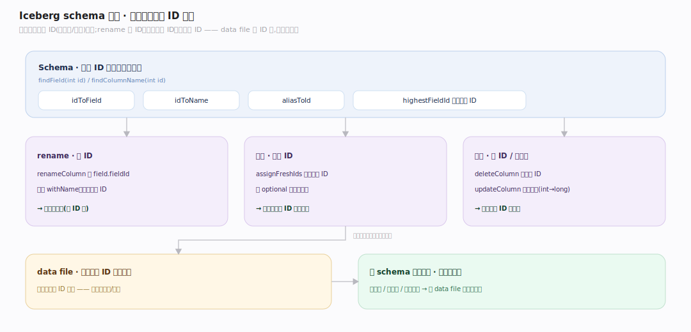
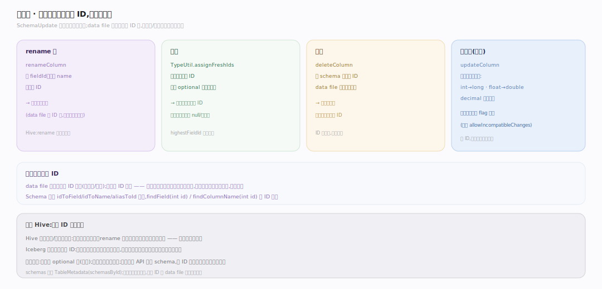

# Iceberg 原理 · 支撑主线 · schema 演进

> **定位**：属"演进能力域"——Iceberg 相对 Hive 的杀手锏之一。管安全的表结构演进:列靠不可变**字段 ID**追踪,rename/加列/删列/类型提升全部只改元数据、**不重写数据**。依赖【元数据树】存 schemas(schemasById)、被【扫描规划】按 schema 投影读。姊妹主线【分区演进与隐藏分区】管分区规则演进。源码基准 **Iceberg(apache/iceberg main · commit 6ec1a01)**(`api/`、`core/`)。

Hive 表改 schema 是噩梦:加列要小心位置、rename 可能读错列、改类型可能读乱数据。Iceberg 用**不可变字段 ID**根治:每列有个整数 ID,schema 里靠 ID 追踪而非名字/位置——data file 里的列也按 ID 存。于是 rename 只改名字、加列给新 ID、删列去掉 ID、改类型做安全提升,**统统不碰数据文件**。理解"列 = 字段 ID"这一点,就懂了 Iceberg 为什么能无痛演进 schema。

---

## 一、schema 演进:按字段 ID 追踪

**列靠不可变字段 ID 追踪**(非名字/位置):`Schema` 维护 `idToField`/`idToName`/`aliasToId` 映射(`api/.../Schema.java:78`),`findField(int id)`/`findField(String name)`/`findColumnName(int id)` 都以 ID 为主键。

- data file 里每列用**字段 ID**标识(写入时记 ID);读时按查询需要的字段 ID 投影。
- 名字变了、位置挪了、加删了列,老 data file 照样能按 ID 正确读——这是"零重写演进"的物理基础。
- `highestFieldId` 单调发新 ID(`api/.../Schema.java`),ID 一旦分配不复用,避免语义歧义。

**为什么按 ID 而非名字**:Hive/传统表按名字或位置解析列,一旦结构变动就可能张冠李戴;Iceberg 把"列的身份"钉在不可变 ID 上,结构怎么演进,历史数据的解读都不会错位。

---

## 二、四类列操作:全部只改元数据

`SchemaUpdate`(`core/.../SchemaUpdate.java`)提供的列操作,底层都是纯元数据变更、提交新快照即生效:

- **rename 列**:`renameColumn` 读 `int fieldId = field.fieldId`、只改名字(`.withName(newName)`)、保持同 ID(`SchemaUpdate.java:205`)——**rename 从不重写数据**。
- **加列**:`TypeUtil.assignFreshIds(...)` 分配全新字段 ID;加列须 optional 或有默认值(除非 `allowIncompatibleChanges`)。老 data file 无此 ID,读时该列投影为 null/默认值。
- **删列**:`deleteColumn` 从 schema 去掉该 ID;data file 里该列被忽略、不重写。ID 不复用。
- **改类型**:`updateColumn` 只允许**安全提升**(int→long、float→double、decimal 精度增大等);不兼容改动被 flag 挡住。保 ID,读老数据自动按新类型提升。

**关键**:四类操作没有一个需要重写 data file,也不需要停写;提交一个新 metadata.json 就完成演进,对读者是原子可见的。

---

## 拓展 · schema 演进关键结构一览

| 结构 | 定义 | 职责 |
|---|---|---|
| Schema | `api/.../Schema.java:78` | idToField/idToName/aliasToId 字段 ID 映射 |
| SchemaUpdate.renameColumn | `core/.../SchemaUpdate.java:205` | 保 ID 只改名,不重写数据 |
| SchemaUpdate(加/删/改) | `core/.../SchemaUpdate.java` | assignFreshIds 加列 / deleteColumn / updateColumn 类型提升 |
| schemasById | `core/.../TableMetadata.java` | 保留所有历史 schema,current-schema-id 指当前 |

## 调优要点（关键开关）

- **优先加 optional 列**:required 列加入需默认值或走 `allowIncompatibleChanges`,兼容性差;optional 列加入零风险。
- **类型只做安全提升**:int→long、float→double、decimal 扩精度;缩窄/改语义类型不被允许(会破坏老数据解读)。
- **不要绕过 API 手改 schema/字段 ID**:保 ID 稳定是安全演进的前提;手动改 ID 会让历史 data file 错位。
- **列改名无成本**:大胆 rename,只改元数据;不必担心重写或读错。

## 常见误区与工程要点

- **误区:rename 列要重写数据。** 不。data file 按字段 ID 存,rename 只改元数据名字、保 ID,零重写。
- **误区:加列会影响老数据。** 老 data file 无该 ID,读时投影为 null/默认值;不重写、不停写。
- **误区:字段 ID 是名字的别名。** ID 才是列的真正身份;名字只是 idToName 里的一个可变映射。
- **误区:改类型随意。** 只允许安全提升;不兼容改动被挡,否则老数据无法正确解读。
- **归属提醒**:schemas 存在【元数据树】的 TableMetadata(schemasById);按 schema 投影读在【扫描规划】/计算引擎;分区规则演进在【分区演进与隐藏分区】;字段 ID 让 data file 跨演进可读是本主线的根。

## 深化 · 源码锚点（apache/iceberg · commit 6ec1a01）

| 论断 | 锚点 |
|---|---|
| Schema 主体：靠不可变字段 ID 追踪列 | `api/src/main/java/org/apache/iceberg/Schema.java:56` |
| idToField：ID→字段映射（读投影按 ID 而非名字/位置） | `api/src/main/java/org/apache/iceberg/Schema.java:78` |
| findField(int id)：按 ID 定位（数据文件也按 ID 存列） | `api/src/main/java/org/apache/iceberg/Schema.java:376` |
| SchemaUpdate 实现 UpdateSchema，收集演进操作 | `core/src/main/java/org/apache/iceberg/SchemaUpdate.java:51` |
| addColumn：分配全新 ID，须 optional/有默认，不重写数据 | `core/src/main/java/org/apache/iceberg/SchemaUpdate.java:100` |
| deleteColumn：去掉 ID（ID 不复用） | `core/src/main/java/org/apache/iceberg/SchemaUpdate.java:190` |
| renameColumn：保 ID 只改名 | `core/src/main/java/org/apache/iceberg/SchemaUpdate.java:205` |
| updateColumn：仅安全类型提升（int→long 等） | `core/src/main/java/org/apache/iceberg/SchemaUpdate.java:273` |
| apply：产出新 Schema，提交新快照原子生效 | `core/src/main/java/org/apache/iceberg/SchemaUpdate.java:467` |
| schemasById 存历史 schema（老快照按当时 schema 读） | `core/src/main/java/org/apache/iceberg/TableMetadata.java:452` |
| 演进只改元数据，经 catalog 原子换指针提交 | `core/src/main/java/org/apache/iceberg/TableMetadata.java:444` |

## 一句话总纲

**Iceberg 用不可变字段 ID 根治 Hive 的 schema 演进痛点:每列有个整数 ID,schema 靠 ID(idToField/idToName)而非名字/位置追踪,data file 里列也按 ID 存;于是 SchemaUpdate 的四类操作——rename(保 ID 改名)、加列(assignFreshIds 给新 ID,须 optional/有默认)、删列(去 ID,ID 不复用)、改类型(只安全提升 int→long 等)——全部只改元数据、提交新快照即原子生效,不重写任何数据文件、不停写;这让"表结构随业务演进"从 Hive 的高危操作变成日常安全操作。**
