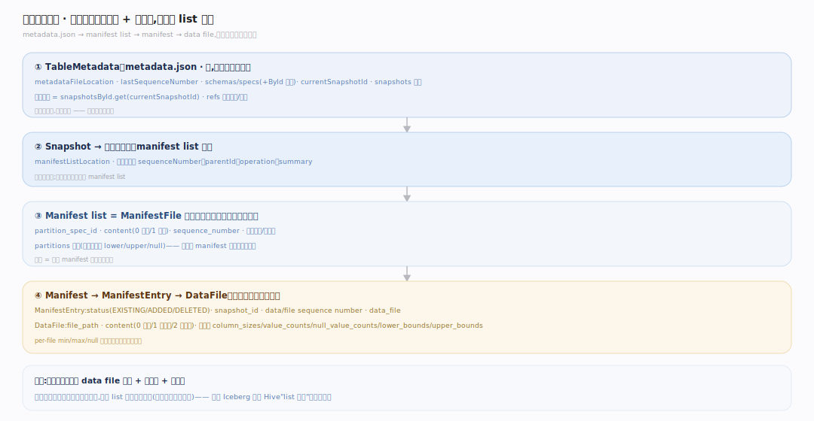
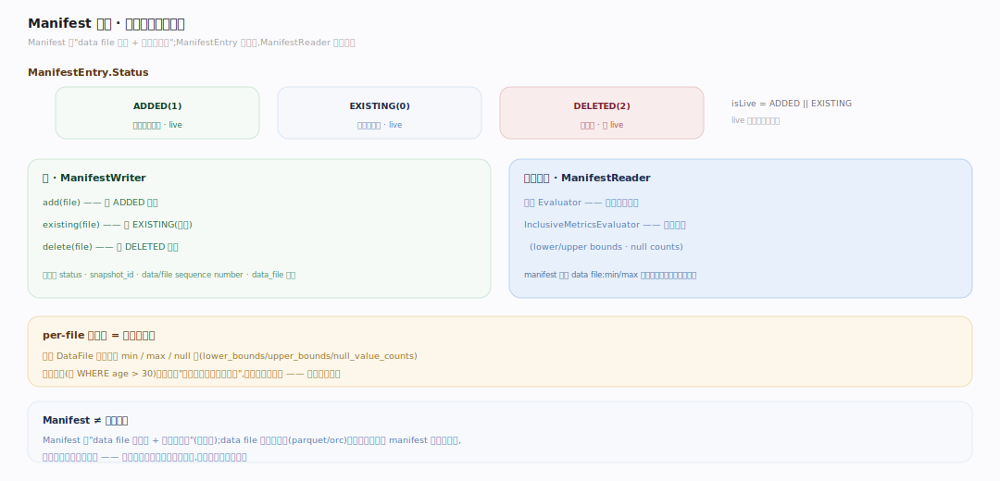
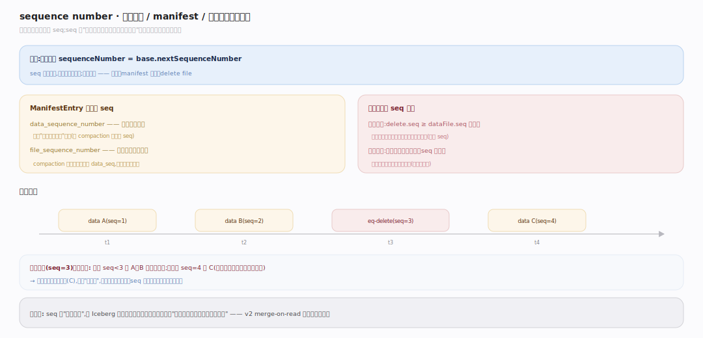

# Iceberg 原理 · 支撑主线 · 元数据树

> **定位**：属"元数据能力域"——Iceberg 的核心。管表的分层元数据:metadata.json → manifest list → manifest files → data files。这棵树自带全部文件清单 + 列统计,让读取"不 list 目录"。被【扫描规划】遍历、【快照与提交】写入。源码基准 **Iceberg(apache/iceberg main · commit 6ec1a01)**(`core/`、`api/`)。

Iceberg 的立身之本:**表是一棵不可变的分层元数据树**。Hive 靠"list 目录拿文件"(慢、无事务);Iceberg 把全部文件明确记进元数据——顺树而下、按列统计剪枝,**从不 list 目录**。下面三张图分别拆开四层树、manifest 条目与列统计、贯穿三处的序列号。

---

## 一、四层元数据树

图注:metadata.json(根,持 schemas/specs/snapshots/currentSnapshotId)→ Snapshot(指向一个 manifest list)→ ManifestFile(列 data file 清单 + 分区摘要)→ ManifestEntry→DataFile(路径 + content 类型 + 列统计)。元数据自带全部文件路径 + 分区值 + 列统计,读取直接顺树剪枝、无需 list 对象存储目录。

---

## 二、Manifest 文件:条目状态与统计

图注:Manifest 是"data file 清单 + 每文件列统计"。ManifestEntry 记 status(ADDED/EXISTING 为 live,DELETED 非 live);写路径经 ManifestWriter 的 add/existing/delete,读路径 ManifestReader 用分区 Evaluator + 列统计 InclusiveMetricsEvaluator 逐文件按 min/max/null 剪枝。per-file 统计是剪枝的燃料。

---

## 三、序列号:贯穿快照/manifest/删除

图注:sequence number 是元数据树的时序线,每次提交递增。ManifestEntry 带 data_sequence_number(可比添加它的快照更老,如 compaction 保留原 seq)+ file_sequence_number;行级删除靠 seq 比较定作用范围——位置删除作用于 seq 更新/相等的文件,等值删除只作用严格更老 seq。这是 v2 merge-on-read 不重写数据仍正确的基础。

---

## 深化 · 读写路径与序列号锚点

| 机制 | 锚点 |
|---|---|
| 当前快照 = snapshotsById.get(currentSnapshotId) | `core/.../TableMetadata.java:536` |
| Snapshot.manifestListLocation:快照指向一个 manifest list | `api/.../Snapshot.java:171` |
| isLive = ADDED‖EXISTING | `core/.../ManifestEntry.java:77` |
| 写:ManifestWriter add/existing/delete | `core/.../ManifestWriter.java:147` |
| 每次提交 seq = base.nextSequenceNumber | `core/.../SnapshotProducer.java:297` |
| ManifestEntry 带 data/file sequence number | `core/.../ManifestEntry.java:104` |

## 拓展 · 元数据树关键结构一览

| 结构 | 定义 | 职责 |
|---|---|---|
| TableMetadata | `core/.../TableMetadata.java:245` | 根:schemas/specs/snapshots/current |
| Snapshot | `api/.../Snapshot.java:42` | 指向一个 manifest list |
| ManifestFile | `api/.../ManifestFile.java:30` | manifest 元(路径/spec/分区摘要/计数) |
| ManifestEntry | `core/.../ManifestEntry.java:28` | data file 条目(status/seq/DataFile) |
| DataFile | `api/.../DataFile.java:35` | 数据文件(路径/content/列统计) |
| ManifestReader | `core/.../ManifestReader.java:269` | 读+分区/统计剪枝 |

## 调优要点（关键开关）

- **manifest 合并**:大量小 manifest 拖慢规划;定期 rewrite manifests 合并。
- **列统计**:`write.metadata.metrics.*` 控制哪些列记 min/max(全记占空间、少记剪枝弱);对过滤列开、对大文本列关。
- **分区摘要**:manifest list 的 partitions 摘要让分区剪枝在 manifest 级就生效;分区字段设计影响剪枝效果。
- **文件大小**:小文件多则 manifest 条目多、规划慢;compaction 合并小文件。

## 常见误区与工程要点

- **误区:Iceberg 读要 list 目录。** 不。元数据树自带全部 data file 清单 + 统计,顺树剪枝,从不 list 对象存储目录。
- **误区:manifest 就是数据文件。** manifest 是"data file 的清单 + 每文件统计";data file 才是真数据(parquet/orc)。
- **误区:序列号只是版本号。** 它决定行级删除作用于哪些数据文件(seq 比较),是 MoR 正确性的基础。
- **误区:改元数据要重写数据。** 元数据树引用 data file,加删快照/manifest 只写新元数据,data file 不动。
- **归属提醒**:遍历树剪枝在【扫描规划】;写新树在【快照与提交】;schema/spec 存 TableMetadata 但演进逻辑在【schema 与分区演进】;删除文件的应用在【行级删除】。

## 一句话总纲

**Iceberg 表是一棵不可变四层元数据树:metadata.json(根,持 schemas/specs/snapshots/currentSnapshotId)→ Snapshot(指向一个 manifest list)→ ManifestFile(列 data file 清单,带分区摘要用于剪枝)→ ManifestEntry→DataFile(路径 + content 类型 + 列统计 min/max/null);元数据自带全部文件清单+统计,读取顺树而下按统计两级剪枝、从不 list 目录;贯穿的 sequence number(每提交递增)让行级删除靠 seq 比较正确作用于数据文件——这是"一堆文件表现得像事务表"的根基。**
