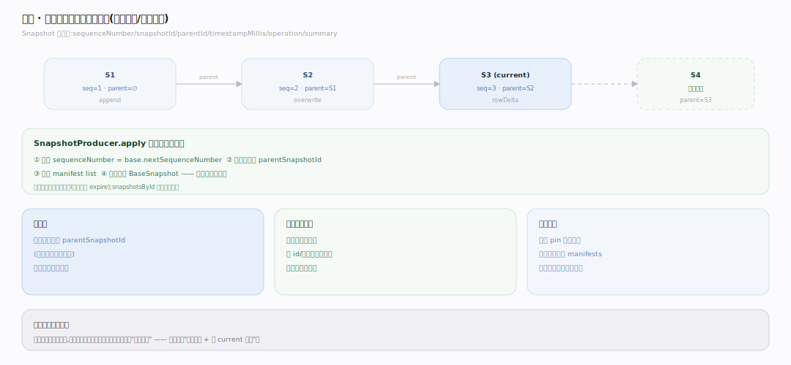
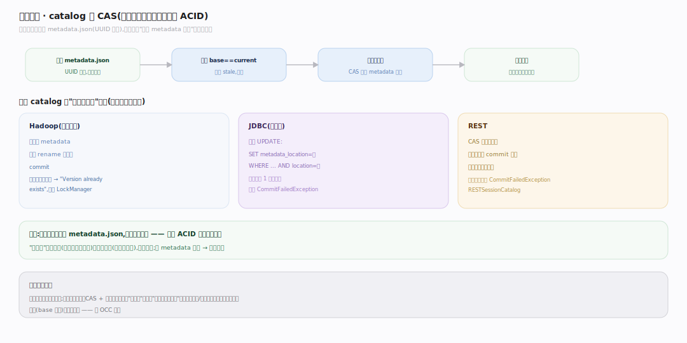
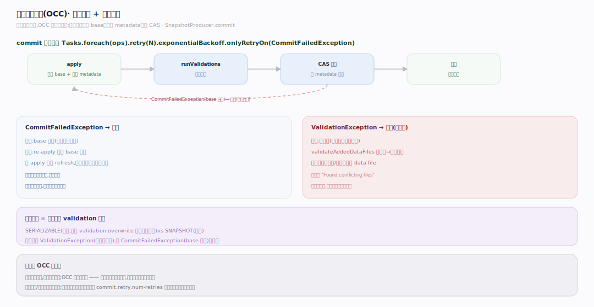

# Iceberg 原理 · 支撑主线 · 快照与提交

> **定位**：属"事务能力域"。管 ACID 提交与快照隔离:每次提交产生新不可变快照、catalog 原子 CAS 换 metadata 指针、乐观并发控制(OCC)+ 冲突检测。依赖【元数据树】写新 manifest、被【扫描规划】读快照。源码基准 **Iceberg(apache/iceberg main · commit 6ec1a01)**(`core/`)。

Iceberg 怎么在对象存储(无事务、无锁)上做到 ACID?靠**不可变快照 + catalog 的原子 CAS**:每次提交写全新的 metadata.json(UUID 路径),然后 catalog 原子地比较并交换"当前 metadata 位置"这一个指针——成功即提交,冲突则乐观重试。快照永远不可变,读者看到的是一致的历史快照(快照隔离、时间旅行免费)。理解"CAS 指针 + OCC 重试 + 不可变快照"就懂了 Iceberg 的事务。

---

## 一、快照:每提交一个不可变版本

**Snapshot**(`api/.../Snapshot.java:42`)是不可变的:`sequenceNumber`/`snapshotId`/`parentId`(父快照,可空)/`timestampMillis`/`operation`/`summary`。每次提交在 `SnapshotProducer.apply` 里:分配 `sequenceNumber = base.nextSequenceNumber`(`:297`)、记录父快照(`:295`)、写新 manifest list、返回全新 `BaseSnapshot`(`:357`)。

- **快照链**:每个新快照记 `parentSnapshotId`(目标分支最新快照)——形成不可变的版本链。
- **时间旅行免费**:旧快照永不改、永不删(除非显式过期),`snapshotsById` 索引所有快照——按 id/时间读任意历史版本。
- **快照隔离**:读者 pin 一个 snapshot,读它不可变的 manifests——读期间别人提交新快照不影响它。

---

## 二、原子提交:catalog 的 CAS

提交的原子性靠 **catalog 原子交换 metadata 指针**,不同 catalog 实现不同:

- **HadoopTableOperations**(文件系统):校验 `base == current`(否则 `CommitFailedException("stale")`),写临时 metadata,**原子 rename 即提交**(`core/.../hadoop/HadoopTableOperations.java:132`);目标版本文件已存在则 `"Version already exists"`(`:370`),可选 LockManager。
- **JdbcTableOperations**(元存储):条件 UPDATE `SET metadata_location=? WHERE ... AND metadata_location=?(旧位置)`(`core/.../jdbc/JdbcUtil.java:66`)——恰好更新 1 行才成功,否则 `CommitFailedException`(`core/.../jdbc/JdbcTableOperations.java:103`)。
- **REST catalog**:CAS 在服务端做,客户端只处理 `CommitFailedException`。

共性:每次提交写**全新 metadata.json(UUID 路径)**(`BaseMetastoreTableOperations.java:155`),再原子换"当前 metadata 位置"指针——这是 ACID 的原子性来源。

---

## 三、乐观并发控制(OCC)与冲突检测

并发提交靠**乐观重试 + 冲突检测**:

- **重试循环**:`SnapshotProducer.commit` 用 `Tasks.foreach(ops).retry(N).exponentialBackoff(...).onlyRetryOn(CommitFailedException.class)`(`SnapshotProducer.java:485`)——每次尝试 `apply` 重新读 base、重建 metadata、再 CAS 提交。
- **冲突检测**:每次尝试内跑 `runValidations(parentSnapshot)`(`:300`)——因 apply 重新 refresh,能看到并发已提交的快照。`validateAddedDataFiles` 扫起始快照到当前之间新增的、匹配分区/冲突过滤的 data file,有则抛 `ValidationException("Found conflicting files")`(`MergingSnapshotProducer.java:363`)。
- **隔离级别**:SERIALIZABLE vs SNAPSHOT 由操作注册哪些 validation 决定(如 overwrite 加过滤器);真冲突抛 ValidationException(失败不重试),仅 CommitFailedException(base 过时)才重试。

**为什么 OCC 而非锁**:对象存储无锁,悲观锁不可行;OCC 假设冲突少,冲突时重试——大多数提交无冲突一次成功,并发写不同分区互不干扰。

---

## 拓展 · 快照与提交关键结构一览

| 结构 | 定义 | 职责 |
|---|---|---|
| Snapshot / BaseSnapshot | `api/.../Snapshot.java:42` | 不可变快照(seq/parent/manifests) |
| SnapshotProducer | `core/.../SnapshotProducer.java:485` | 提交流程 + 乐观重试 |
| HadoopTableOperations | `hadoop/HadoopTableOperations.java:132` | rename 原子提交(文件系统) |
| JdbcTableOperations | `jdbc/JdbcTableOperations.java:103` | 条件 UPDATE 提交(元存储) |
| MergingSnapshotProducer | `core/.../MergingSnapshotProducer.java:363` | 冲突检测 validation |

## 调优要点（关键开关）

- **commit.retry.num-retries**:提交重试次数;高并发写场景调大。
- **commit.retry.*-ms**:指数退避参数;减少重试风暴。
- **隔离级别**:按需选 SERIALIZABLE(严格,更多 validation)vs SNAPSHOT(宽松)。
- **分区隔离**:并发写不同分区几乎不冲突;写同分区易冲突需重试——建模时按写入模式分区。
- **快照过期**:定期 expire snapshots 回收旧元数据/数据,否则无限增长。

## 常见误区与工程要点

- **误区:Iceberg 提交要锁表。** 靠 catalog 原子 CAS(rename/条件 UPDATE/服务端)换 metadata 指针 + OCC 重试,不锁表。
- **误区:快照可变/会被覆盖。** 快照不可变、旧快照保留(时间旅行);提交只加新快照、换指针。
- **误区:并发写一定冲突。** 写不同分区几乎不冲突(OCC 通过);写同分区/同文件才冲突重试。
- **误区:CommitFailedException = 数据错。** 它是"base 过时"信号,重试即可;真冲突是 ValidationException(失败)。
- **归属提醒**:新快照引用的 manifest 在【元数据树】;冲突检测读并发快照的 data file(【元数据树】);隔离级别的 validation 逻辑是本主线;快照被【扫描规划】读。

## 深化 · 源码锚点（apache/iceberg · commit 6ec1a01）

| 论断 | 锚点 |
|---|---|
| SnapshotProducer 是所有写操作基类 | `core/src/main/java/org/apache/iceberg/SnapshotProducer.java:87` |
| apply：重读 base、分配序列号、写新 manifest list、产 BaseSnapshot | `core/src/main/java/org/apache/iceberg/SnapshotProducer.java:293` |
| sequenceNumber = base.nextSequenceNumber() | `core/src/main/java/org/apache/iceberg/SnapshotProducer.java:297` |
| commit 主体：Tasks.foreach(ops).retry(...).onlyRetryOn(CommitFailedException) | `core/src/main/java/org/apache/iceberg/SnapshotProducer.java:485` |
| runValidations：每次尝试内重跑冲突检测 | `core/src/main/java/org/apache/iceberg/SnapshotProducer.java:300`、`:371` |
| 冲突检测 validateAddedDataFiles → "Found conflicting files" | `core/src/main/java/org/apache/iceberg/MergingSnapshotProducer.java:363` |
| 全新 metadata.json（UUID 路径）由 writeNewMetadata 写 | `core/src/main/java/org/apache/iceberg/BaseMetastoreTableOperations.java:155` |
| commit 校验 base==current 后原子换指针 | `core/src/main/java/org/apache/iceberg/TableOperations.java:28` |
| JDBC 条件 UPDATE 恰好更 1 行才成功 | `core/src/main/java/org/apache/iceberg/jdbc/JdbcUtil.java:66` |

## 一句话总纲

**Iceberg 在无事务的对象存储上做 ACID:每次提交产生不可变 Snapshot(记父快照+序列号,旧快照永久保留=时间旅行/快照隔离免费),原子性靠 catalog 的 CAS 换"当前 metadata 位置"指针(HadoopTableOps 用 rename、JDBC 用条件 UPDATE、REST 服务端);并发靠 OCC——commit 乐观重试(每次 re-apply 重读 base + runValidations 检测冲突,真冲突抛 ValidationException、base 过时才重试),写不同分区几乎不冲突,这是它在对象存储上实现事务表的根基。**
