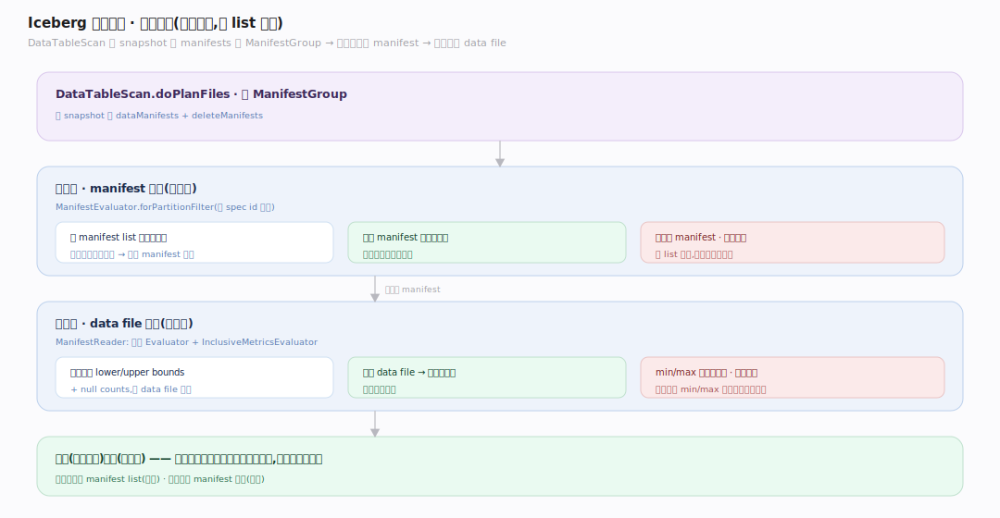
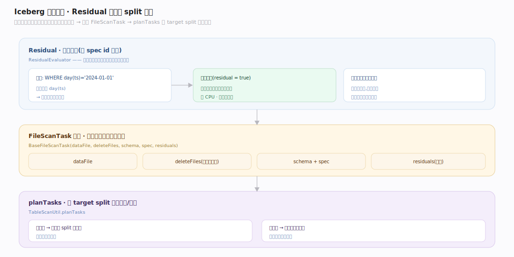

# Iceberg 原理 · 支撑主线 · 扫描规划

> **定位**：属"规划能力域"。管查询如何从元数据树规划出要读的 data file:两级剪枝(manifest 分区剪 + data file 列统计剪)、residual 残差、split 切分。被【接触面】的 scan 调用、消费【元数据树】、叠加【行级删除】。源码基准 **Iceberg(apache/iceberg main · commit 6ec1a01)**(`core/`)。

Iceberg 的查询规划**不 list 目录**,而是顺元数据树剪枝:读快照的 manifest list → 按分区摘要剪掉整个 manifest → 读存活 manifest、按 data file 列统计剪掉整个文件 → 剩下的 data file 组成扫描任务交计算引擎。两级剪枝 + 列统计让规划只碰真正相关的文件,是 Iceberg 查询快的关键。

---

## 一、两级剪枝:manifest 剪 + 文件剪

`DataTableScan.doPlanFiles`(`core/.../DataTableScan.java:64`)拿 snapshot 的 `dataManifests` + `deleteManifests`,建 `ManifestGroup` 剪枝:

- **第一级 · manifest 剪枝**:`ManifestEvaluator.forPartitionFilter(...)`(按 spec id 缓存)用 manifest list 里的**分区摘要**,剪掉分区值不可能匹配的整个 manifest(`ManifestGroup.java:279`)——一次跳过一整批文件。
- **第二级 · data file 剪枝**:存活 manifest 内,`ManifestReader` 用分区 `Evaluator` + `InclusiveMetricsEvaluator`(列统计 lower/upper bounds、null counts)逐 data file 过滤(`ManifestReader.java:269`)——跳过 min/max 不匹配谓词的文件。

**为什么两级**:分区摘要在 manifest list(粗粒度、先剪),列统计在 manifest 条目(细粒度、后剪);先粗后细,规划只读极少量元数据就定位到相关文件。

---

## 二、Residual 残差与 split 切分

- **Residual(残差谓词)**:`ResidualEvaluator`(按 spec id 缓存,`ManifestGroup.java:182`)——已被分区满足的谓词从行过滤里**去掉**。例如 `WHERE day(ts)='2024-01-01'` 若分区就是 `day(ts)`,该谓词由分区剪枝保证,残差为空,引擎读文件时无需再过滤——省 CPU。
- **FileScanTask 组装**:每个存活条目 → `BaseFileScanTask(dataFile, deleteFiles, schema, spec, residuals)`(`ManifestGroup.java:402`),附上匹配的 delete files。
- **split 切分**:`planTasks` 按目标 split 大小切分/合并文件任务(`BaseTableScan.java:43`,`TableScanUtil.planTasks`)——大文件切成多 split 并行读、小文件合并减少任务数。

---

## 拓展 · 扫描规划关键结构一览

| 结构 | 定义 | 职责 |
|---|---|---|
| DataTableScan | `core/.../DataTableScan.java:64` | 规划入口(读快照 manifests) |
| ManifestGroup | `core/.../ManifestGroup.java:279` | 两级剪枝 + 任务组装 |
| ManifestEvaluator | `core/.../ManifestGroup.java:279` | 第一级 manifest 分区剪 |
| InclusiveMetricsEvaluator | `core/.../ManifestReader.java:269` | 第二级文件列统计剪 |
| ResidualEvaluator | `core/.../ManifestGroup.java:182` | 残差(去掉分区已满足的谓词) |
| BaseFileScanTask | `core/.../ManifestGroup.java:402` | 扫描任务(data file+deletes+residual) |
| planTasks split 切分 | `core/.../BaseTableScan.java:43` | 按 target size 切/合并文件任务 |

## 调优要点（关键开关）

- **分区设计**:让常用过滤列成为分区(隐藏分区),第一级 manifest 剪枝才有效。
- **列统计**:对过滤列记 min/max(第二级剪枝);排序写入(sort/z-order)让 min/max 紧凑、剪枝更强。
- **文件大小**:target split size 匹配引擎并行度;小文件多则任务碎、大文件剪枝粗。
- **manifest 数**:manifest 多则第一级剪枝遍历慢;rewrite manifests 合并。

## 常见误区与工程要点

- **误区:Iceberg 规划要 list 目录扫全表。** 不。顺元数据树两级剪枝(manifest 分区剪 + 文件列统计剪),只碰相关文件的元数据。
- **误区:列统计对任意查询都有效。** 只对被记 min/max 的列 + 数据物理有序时剪枝强;乱序数据 min/max 覆盖全域,剪不掉。
- **误区:分区谓词要引擎再过滤。** residual 把分区已满足的谓词去掉,引擎读文件时不重复过滤。
- **误区:一个 data file 一个 split。** planTasks 按 target size 切分大文件/合并小文件,不是一文件一任务。
- **归属提醒**:被剪枝的元数据在【元数据树】;分区剪枝用的 spec 在【schema 与分区演进】;delete files 的应用在【行级删除】;实际读数据由计算引擎(非 Iceberg)。

## 一句话总纲

**Iceberg 扫描规划不 list 目录、顺元数据树两级剪枝:读快照的 manifest list→第一级用分区摘要(ManifestEvaluator)剪掉整个不匹配的 manifest→读存活 manifest 内 data file、第二级用列统计(InclusiveMetricsEvaluator 的 lower/upper bounds、null counts)剪掉不匹配的文件→组装 FileScanTask(附 delete files + residual 残差,去掉分区已满足的谓词避免引擎重复过滤)→planTasks 按 target split 切分合并;先粗(分区)后细(列统计),只碰相关文件元数据,是查询快的关键。**
