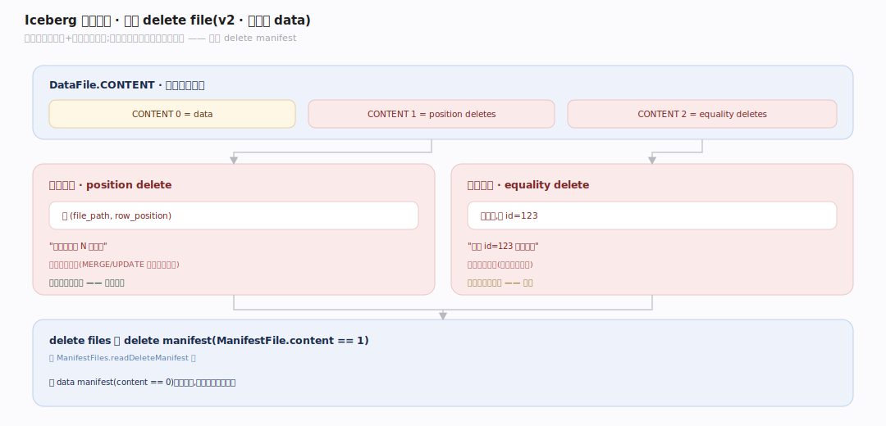
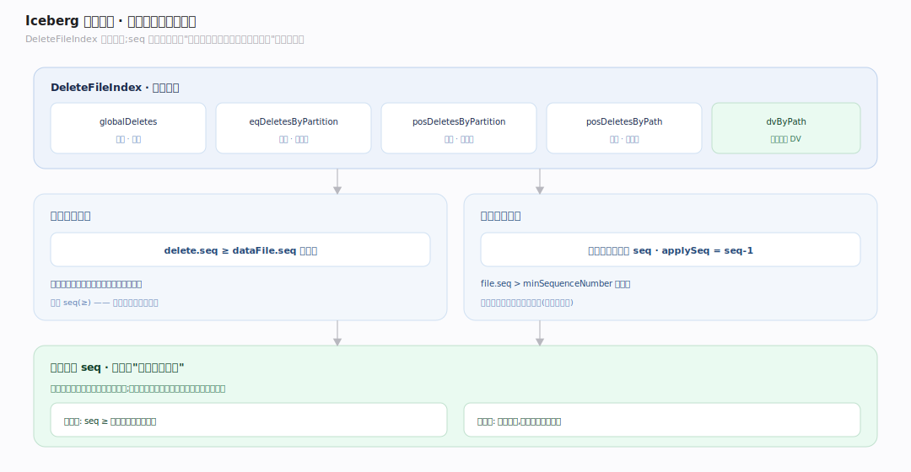
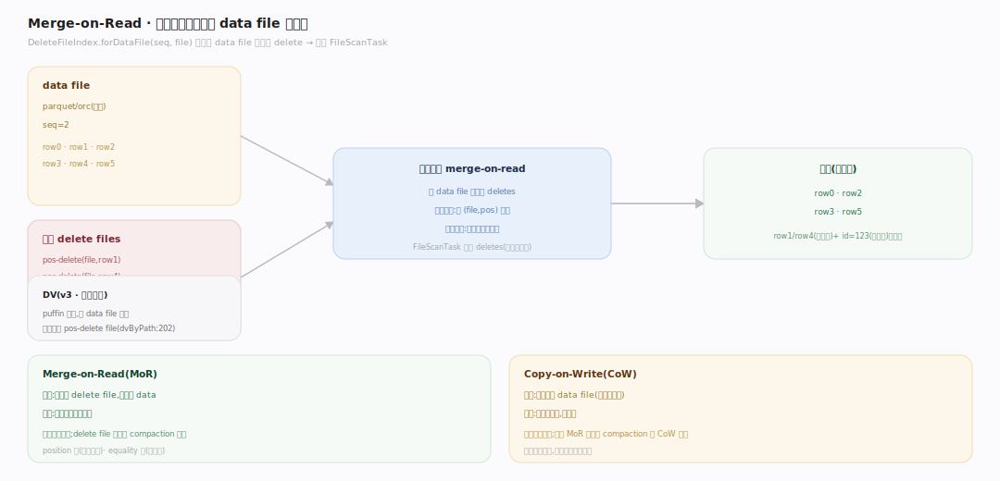
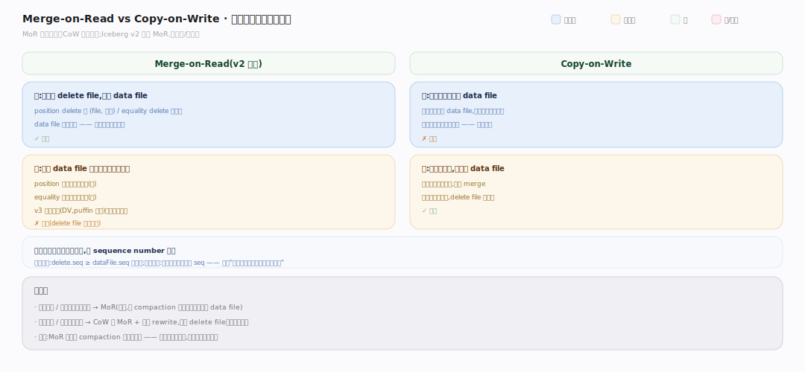

# Iceberg 原理 · 支撑主线 · 行级删除（v2 · Merge-on-Read）

> **定位**：属"删除能力域"。管 v2 表的行级删除:位置删除(position delete)vs 等值删除(equality delete)delete files、读时 merge-on-read 叠加、按序列号决定作用范围。依赖【元数据树】的 delete manifest、被【扫描规划】附到 FileScanTask。源码基准 **Iceberg(apache/iceberg main · commit 6ec1a01)**(`api/`、`core/`)。

Iceberg v2 支持行级删除,但不重写 data file(那太贵)——而是写独立的 **delete file** 记"哪些行被删了",读时**merge-on-read** 把删除叠加到 data file 上过滤掉。两种删除:**位置删除**(按文件+行号)和**等值删除**(按列值)。哪个 delete 作用于哪个 data file,靠序列号(sequence number)比较决定。

---

## 一、两种删除:position vs equality

`DataFile.CONTENT` 区分 `0=data / 1=position deletes / 2=equality deletes`(`api/.../DataFile.java:37`):

- **位置删除(position delete)**:记 `(file_path, row_position)`——"某文件的第 N 行被删"。适合已知位置的删除(如 MERGE/UPDATE 定位到具体行)。精确、读时按位置跳过。
- **等值删除(equality delete)**:记列值——"所有 id=123 的行被删"。适合按条件删(不用先查位置),但读时要按列值比对。

delete files 存在 **delete manifest**(`ManifestFile.content == 1`),经 `ManifestFiles.readDeleteManifest` 读(`BaseSnapshot.java:276`)。

---

## 二、序列号决定作用范围

`DeleteFileIndex`(`core/.../DeleteFileIndex.java:73`)四路索引 delete:`globalDeletes`(等值)/`eqDeletesByPartition`/`posDeletesByPartition`/`posDeletesByPath`(+ `dvByPath` 删除向量)。哪些 delete 作用于某 data file 靠 **sequence number 比较**:

- **位置删除规则**:`delete.dataSequenceNumber >= dataFile.dataSequenceNumber` 才生效(`:657`)——删除只作用于它写入时刻**已存在**的数据文件(含同 seq)。
- **等值删除规则**:作用于**严格更老** seq 的文件(`applySequenceNumber = wrapped.dataSequenceNumber - 1`,`:841`;`file.dataSequenceNumber > minSequenceNumber`,`:450`)——等值删除不能删它之后写入的同值行(那是新数据)。

**为什么按 seq**:删除是"某时刻的操作",只应作用于该时刻已有的数据;之后写入的数据是新的、不该被旧删除影响。seq 比较精确表达了这个时序语义。

---

## 三、Merge-on-Read:读时叠加删除

扫描时,`DeleteFileIndex.forDataFile(seq, file)`(`:151`)为每个 data file 找出适用的 delete files(global + eq-partition + pos-partition + pos-path,或单个删除向量 DV),附到 `FileScanTask`(见扫描规划篇)。计算引擎读 data file 时:

- **位置删除**:按 (file, position) 跳过被删行——精确、快。
- **等值删除**:按列值比对过滤——需扫描比对,较慢。
- **删除向量(DV,v3)**:puffin 格式,每 data file 一个 DV 文件存位置删除位图,比多个 position delete file 更高效(`dvByPath`,`:202`)。

**merge-on-read vs copy-on-write**:见下节对比图。

---

## 四、MoR vs CoW:删除代价挪到写还是读

同一件事——"删掉一些行"——两种策略把代价放在不同环节:**MoR**(v2 默认)只写小 delete file、data file 不动(写快),读时按 sequence number 叠加适用删除后过滤(读慢);**CoW** 直接重写受影响的整个 data file、把删除物化进去(写慢),读时无删除叠加(读快)。写多读少/频繁小批更新选 MoR(靠 compaction 定期物化删除),读多写少/追求最快查询选 CoW 或 MoR + 定期 rewrite。关键:删除代价从不消失,MoR 只是把它从写挪到读——不做 compaction 会越读越慢。

---

## 拓展 · 行级删除关键结构一览

| 结构 | 定义 | 职责 |
|---|---|---|
| DataFile.CONTENT | `api/.../DataFile.java:37` | 0 数据/1 位置删/2 等值删 |
| DeleteFileIndex | `core/.../DeleteFileIndex.java:73` | 四路索引 delete files |
| forDataFile | `core/.../DeleteFileIndex.java:151` | 为 data file 找适用删除 |
| dvByPath (DV) | `core/.../DeleteFileIndex.java:202` | 删除向量(v3,puffin 位图) |

## 调优要点（关键开关）

- **删除方式选择**:定位删/更新用 position delete(精确快);按条件批删用 equality delete(免查位置)。
- **MoR vs CoW**:写多读少用 MoR(写快);读多写少用 CoW 或定期 compaction 把删除物化进 data file。
- **删除文件合并**:大量小 delete file 拖慢读;定期 rewrite 把删除应用到 data file、清理 delete file。
- **DV(v3)**:新表用删除向量替代多个 position delete file,读更高效。

## 常见误区与工程要点

- **误区:删除会立即重写 data file。** v2 MoR 只写小 delete file,读时叠加过滤;data file 不动(除非 compaction)。
- **误区:等值删除能删之后写的同值行。** 不。等值删除只作用于严格更老 seq 的文件;之后写的同值行是新数据,不被旧删除影响。
- **误区:position 和 equality delete 一样快。** position 按位置跳过(快);equality 按列值比对(慢),能不用尽量用 position。
- **误区:delete file 越多越好(反正不重写)。** delete file 堆积拖慢读(每次都要叠加);需定期 compaction 物化。
- **归属提醒**:delete file 存【元数据树】的 delete manifest;seq 比较用【元数据树】的 sequence number;delete 附到 FileScanTask 在【扫描规划】;实际叠加过滤由计算引擎执行。

## 深化 · 源码锚点（apache/iceberg · commit 6ec1a01）

| 论断 | 锚点 |
|---|---|
| DeleteFileIndex 主体：为 data file 查适用删除 | `core/src/main/java/org/apache/iceberg/DeleteFileIndex.java:70` |
| globalDeletes（等值）四路索引之一 | `core/src/main/java/org/apache/iceberg/DeleteFileIndex.java:73` |
| posDeletesByPath（位置删除按文件路径索引） | `core/src/main/java/org/apache/iceberg/DeleteFileIndex.java:76` |
| forEntry / forDataFile：按 manifest entry / 文件查删除 | `core/src/main/java/org/apache/iceberg/DeleteFileIndex.java:143`、`:147` |
| forDataFile(seq, file)：按序列号过滤适用删除 | `core/src/main/java/org/apache/iceberg/DeleteFileIndex.java:151` |
| filter(seq)：位置删除按 delete.seq≥data.seq 生效 | `core/src/main/java/org/apache/iceberg/DeleteFileIndex.java:686` |
| filter(seq, dataFile)：等值删除只作用严格更老 seq | `core/src/main/java/org/apache/iceberg/DeleteFileIndex.java:768` |
| DataFile.CONTENT 区分 0=data/1=posDelete/2=eqDelete | `api/src/main/java/org/apache/iceberg/DataFile.java:37` |
| delete file 写在 content=1 的 delete manifest，经 readDeleteManifest 读 | `core/src/main/java/org/apache/iceberg/BaseSnapshot.java:276` |
| delete file 的 data_sequence_number 由 ManifestWriter 记 | `core/src/main/java/org/apache/iceberg/ManifestWriter.java:161` |
| rowDelta 写删除仍走 SnapshotProducer 提交 + OCC | `core/src/main/java/org/apache/iceberg/SnapshotProducer.java:480` |
| 扫描规划把适用删除附到 FileScanTask | `core/src/main/java/org/apache/iceberg/ManifestGroup.java:177` |

## 一句话总纲

**Iceberg v2 行级删除用 merge-on-read 不重写数据:写独立 delete file(位置删除记 file+行号、等值删除记列值,存 delete manifest content=1),读时 DeleteFileIndex.forDataFile 为每个 data file 找适用删除、附到 FileScanTask、计算引擎叠加过滤;哪个删除作用于哪个文件靠 sequence number(位置删除 delete.seq≥dataFile.seq、等值删除作用于严格更老 seq)——精确表达"删除只作用于其时刻已有数据"的时序;MoR 写快读慢(vs CoW),v3 用删除向量 DV(puffin 位图)提升位置删除效率。**
