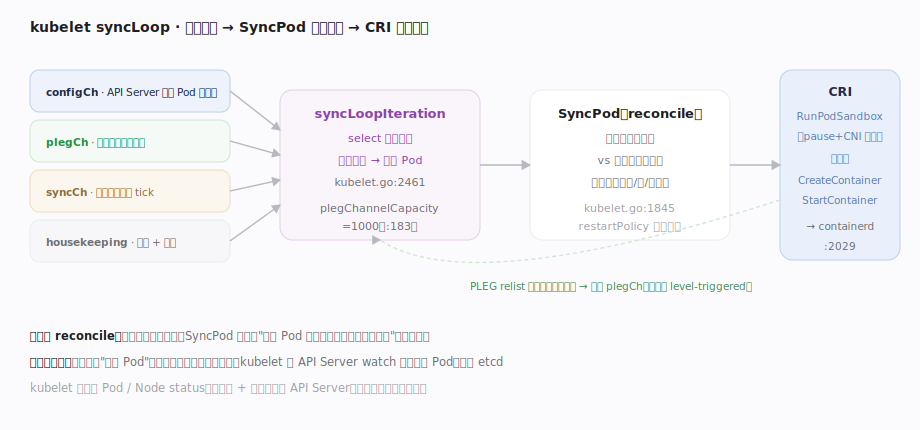
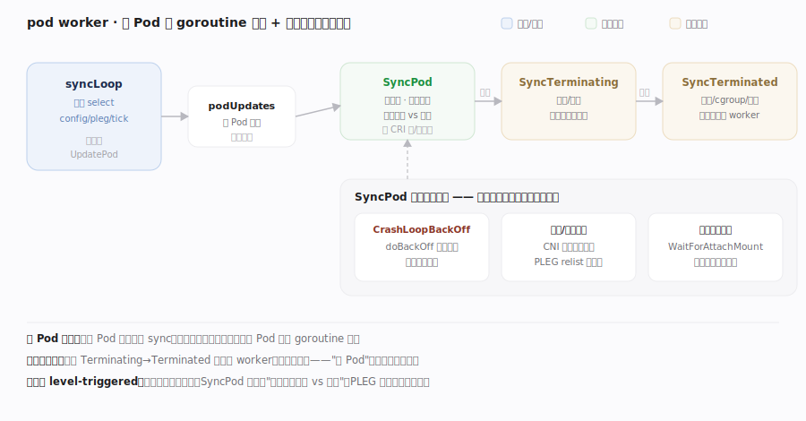

# Kubernetes 核心原理 · 支撑能力域 · kubelet 与 CRI

> **定位**：节点侧的执行代理，也是一个 reconcile 循环。kubelet 在每台机器上把"绑定到本节点的 Pod（spec）"变成真实运行的容器（实际态），经 CRI 调容器运行时（containerd/CRI-O）。它是 K8s "期望态"落到"真实进程"的最后一公里。核实基准：`pkg/kubelet/kubelet.go`。

## 一、syncLoop：多源事件驱动的节点级 reconcile

**图示**：kubelet 的核心是 `syncLoop`——一个永续循环，`syncLoopIteration` 用 select 同时监听多源：`configCh`（API Server 来的 Pod 增删改）、`plegCh`（PLEG，容器实际状态变化）、`syncCh`（周期全量 tick）、`housekeepingCh`（清理孤儿）、探针结果。**任一源触发都归结为对某 Pod 调 `SyncPod`**：算期望容器集与实际容器集的差异 → 建沙箱（pause + CNI 配网）→ 拉镜像 → 起/杀容器，全走 **CRI** gRPC 到 containerd；运行时侧 `computePodActions` 比对后按固定六步执行。**关键不变量——节点级 level-triggered reconcile**：不管收到什么事件，`SyncPod` 都重算"这个 Pod 现在该有哪些容器、实际有哪些"补齐差异；容器崩了 PLEG 报事件、重算就按 restartPolicy 重启。kubelet 还周期把节点/Pod status 写回 API Server（心跳 + 实际态上报）。

| 落点 | 符号 | 位置 |
|---|---|---|
| 主循环 | `syncLoop` / `syncLoopIteration` | kubelet.go:2387 / 2461 |
| 事件源 | `configCh` / `plegCh`（cap 1000） | kubelet.go:2464 / 2396（:183） |
| 同步单 Pod | `SyncPod` → `containerRuntime.SyncPod` | kubelet.go:1845 / 2029 |
| 准入纳管 | `HandlePodAdditions` | kubelet.go:2601 |
| 运行时六步 | `SyncPod` → `computePodActions` | kuberuntime_manager.go:1119 / 894 |
| CRI 接口 | `RunPodSandbox` / `CreateContainer` / `StartContainer` / `PullImage` | cri-api/pkg/apis/services.go:72 / 36 / 38 / 131 |

## 深化 · pod worker 的三段生命周期与失败路径

syncLoop 只"分发"，串行执行在**每 Pod 一个 goroutine** 的 pod worker 里：`podWorkers.UpdatePod`（`pkg/kubelet/pod_workers.go:735`）把更新投给该 Pod 专属 `podUpdates` channel（:924-928），`podWorkerLoop`（:1214）串行消费——**同一 Pod 绝不并发 sync**，不同 Pod 并行。worker 按图示三段状态机迁移：运行中 `SyncPod`（kubelet.go:1845）→ 被删/驱逐 `SyncTerminatingPod`（pod_workers.go:261，杀容器直到全停）→ 全停后 `SyncTerminatedPod`（:269，清卷/cgroup/资源），走完 terminated 才由 `SyncKnownPods`（:160）移除该 worker——**"删 Pod"也是收敛而非一刀切**。图中三条失败路径的源码锚点：CrashLoopBackOff 由 `doBackOff`（kuberuntime_manager.go:1490）判退避窗、命中回 `ErrCrashLoopBackOff`（:1515）；沙箱/网络失败靠 PLEG 下轮 `GenericPLEG.Relist`（`pkg/kubelet/pleg/generic.go:236`，`wait.Until` 周期驱动于 :163）重触发重试；卷未就绪阻塞在 `volumeManager.WaitForAttachAndMount`（`pkg/kubelet/volumemanager/volume_manager.go:393`）——**失败都不是终态，下轮重算重试**。

**PLEG 健康兜底**（图外补充）：若 relist 距上次超过 `RelistThreshold`（generic.go:190），PLEG 上报不健康，kubelet 的 healthz 会失败进而可能被重启——这是"节点级心跳"的自我保护。

## 深化 · CRI 与相邻接口

| 接口 | 缩写 | 谁实现 | 干什么 |
|---|---|---|---|
| Container Runtime Interface | CRI | containerd / CRI-O | 沙箱/容器/镜像 gRPC |
| Container Network Interface | CNI | Calico / Cilium… | 给 Pod 沙箱配网络 |
| Container Storage Interface | CSI | 各存储驱动 | 挂载卷（见存储篇） |
| PodLifecycleEventGenerator | PLEG | kubelet 内部 | relist 容器状态生成事件 |

## 拓展 · 一个 Pod 从绑定到运行

| 步骤 | 组件 | 动作 |
|---|---|---|
| 1 | 调度器 | 写 pod.spec.nodeName |
| 2 | kubelet syncLoop | configCh 收到本节点新 Pod |
| 3 | SyncPod | RunPodSandbox（pause + CNI 配网） |
| 4 | SyncPod | 拉镜像 + CreateContainer/StartContainer（CRI） |
| 5 | PLEG | relist 发现容器 Running，回灌事件 |
| 6 | kubelet | 探针检测 + 写 Pod status 回 API Server |

## 调优要点

- PLEG relist 周期与 `plegChannelCapacity`（1000）影响状态感知延迟；节点容器过多会拖慢 relist。
- 镜像拉取是常见瓶颈：预热镜像、用 `imagePullPolicy: IfNotPresent`、镜像本地缓存。
- 节点资源预留（`--kube-reserved`/`--system-reserved`）避免 kubelet/系统被业务挤爆。
- liveness/readiness 探针配置不当会误杀或误摘容器，谨慎设初始延迟与阈值。

## 常见误区

- **kubelet 从 etcd 读 Pod**：kubelet 经 API Server（watch）拿分配到本节点的 Pod，不碰 etcd。
- **kubelet 直接运行容器**：它经 CRI 调外部运行时（containerd），自身不含容器引擎。
- **一次事件对应一次固定动作**：SyncPod 是重算差异的 reconcile，事件只是触发。
- **Pod 网络由 kubelet 自己配**：网络由 CNI 插件在建沙箱时配置。

## 一句话总纲

**kubelet 是节点侧的 reconcile 循环：syncLoop 用 select 汇聚 API Server 变更、PLEG 容器事件、周期 tick 等多源信号，任一触发都对相关 Pod 调 SyncPod 重算"期望容器集 vs 实际容器集"的差异、经 CRI 调 containerd 建沙箱（CNI 配网）/拉镜像/起杀容器，并把实际态写回 API Server——它把集群的"期望 Pod"落成机器上真实运行的进程，是声明式期望态的最后一公里。**
