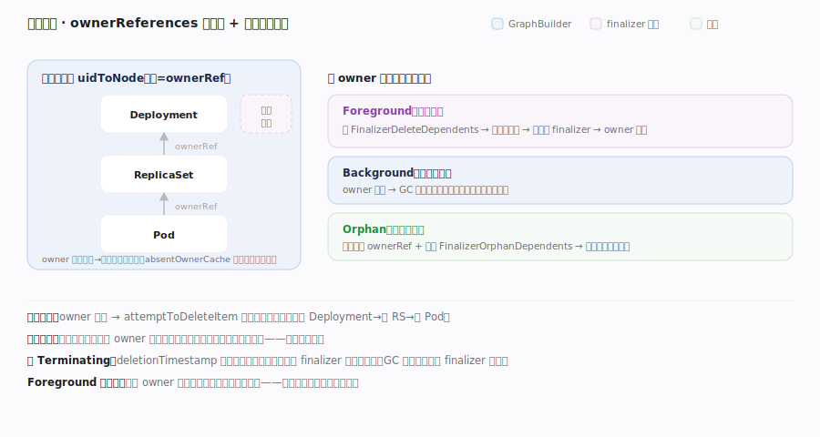

# Kubernetes 核心原理 · 支撑能力域 · 控制器管理器与垃圾回收

> **定位**：几十个控制器的"运行时底座"与集群级清理器。`kube-controller-manager` 把众多控制器编排进一个进程（共享 Informer、leader 选举保只有一个实例在跑），而**垃圾回收（GC）**控制器沿 `ownerReferences` 构成的对象图做级联删除、`finalizers` 提供删除前钩子——它们是让"控制器群"稳定运行、让"删除"正确收敛的公共机制。核实基准：`cmd/kube-controller-manager/app/controllermanager.go`、`pkg/controller/garbagecollector/garbagecollector.go`。

## 一、多控制器编排 + ownerReferences 级联 GC

**图示**：controller-manager 启动时注册全部控制器（Deployment/ReplicaSet/Node/Job/PV/GC…）并逐个拉起，**共用一个 SharedInformerFactory**（同一资源只 List+Watch 一次）；多副本靠 **leader 选举**竞争一个 Lease，只有 leader 才真正跑控制器，避免多实例 reconcile 同一对象打架。**GC 的机制内核**：删除不是逐个手删下游——GC 的 `GraphBuilder` 消费所有资源 informer 事件，在内存里维护一张 `ownerReferences` 依赖图；owner 被删时沿图**级联删除**孤儿子对象（删 Deployment→ReplicaSet→Pod）。**关键不变量**：删除是声明式的——API Server 收到删除只打 `deletionTimestamp`，对象要等所有 **finalizer** 被处理移除才真正消失；传播策略 Foreground/Background/Orphan 决定 owner 与下游谁先消失。

| 落点 | 符号 | 位置 |
|---|---|---|
| 注册控制器 | `NewControllerDescriptors` | controllermanager.go:495 |
| 拉起 | `StartControllers` | controllermanager.go:662 |
| 选主 | `Run` + `leaderelection` | controllermanager.go:180 / 51 |
| 依赖图 | `GraphBuilder` / `uidToNode` / `processGraphChanges` | graph_builder.go:78 / 109 / 678 |
| 级联删 | `attemptToDeleteWorker` → `attemptToDeleteItem` | garbagecollector.go:317 → 498 |
| 传播策略 | Foreground / Background / Orphan | garbagecollector.go:622 |

## 深化 · 级联删除的图算法与失败路径

图示依赖图机制与三种传播策略的源码锚点：**虚拟节点**——引用了尚未入图的 owner 时 `GraphBuilder` 先建占位节点（graph_builder.go:410 附近注释），待真身出现或确认不存在再修正，避免误判孤儿；**absentOwnerCache 防抖**——确认 owner 不存在后写入缓存（graph_builder.go:115，容量 500 见 :160），后续同引用直接判孤儿、不再打 API Server；**Foreground 两段式**——先给 owner 打 `FinalizerDeleteDependents`（garbagecollector.go:653）进入 `deletingDependents`，把每个下游加入删除队列（:657 注释），**下游全删净才移除 owner 的 finalizer**，故"看到 owner 还在即代表下游没删完"；**Orphan 解绑**——`runAttemptToOrphanWorker`（garbagecollector.go:706）摘除下游 ownerRef、移除 `FinalizerOrphanDependents`（:754）。**典型故障·卡 Terminating**：对象 `deletionTimestamp` 已置却不消失，几乎总是某 finalizer 对应控制器没跑/没摘除；GC 本身不删有未完成 finalizer 的对象，强删（`--force --grace-period=0`）绕过 finalizer 可能遗留外部资源泄漏，应先排查控制器健康。

**discovery 抖动**（图外补充）：GC 靠 `Sync`（garbagecollector.go:175）周期性发现集群所有资源类型（含 CRD）重建 monitors；API 资源列表拉取失败会让新类型对象暂时不被 GC 覆盖，需关注 controller-manager 的 discovery 错误日志。

## 深化 · 删除传播策略

| 策略 | 行为 | 用途 |
|---|---|---|
| Foreground | 先删所有下游，owner 最后删 | 需保证下游先清理 |
| Background（默认多数） | owner 先删，GC 后台清下游 | 快速返回 |
| Orphan | 只删 owner，保留下游 | 保留子对象（解绑管理） |

## 拓展 · 对象图与清理机制

| 机制 | 数据 | 作用 |
|---|---|---|
| ownerReferences | 子对象 → owner 的边 | GC 级联删除的图 |
| GC 控制器 | 内存依赖图 + attemptToDelete | 删 owner 连带删孤儿 |
| finalizers | metadata 字符串列表 | 删除前置钩子（阻塞至清理完） |
| deletionTimestamp | 删除标记 | "正在删除"而非立即消失 |
| leader 选举 | Lease 锁 | 保证控制器单实例运行 |

## 调优要点

- controller-manager 多副本 + leader 选举做 HA：`--leader-elect` 默认开，调 lease 时长权衡切换速度与抖动。
- `--concurrent-*-syncs` 调各控制器 worker 数，权衡收敛速度与 API Server 压力。
- 卡在 Terminating 的对象几乎总是 finalizer 未被移除：排查对应控制器是否健康，勿盲目强删。
- 大规模集群 GC 依赖图内存与 discovery 开销大：关注 GC 控制器的同步（Sync:175）健康。

## 常见误区

- **每个控制器一个进程**：几十个控制器共处 kube-controller-manager 一个进程、共享 Informer。
- **多副本控制器同时工作**：leader 选举保证只有一个实例跑循环。
- **删 Deployment 要手动删 Pod**：GC 沿 ownerReferences 级联删除下游。
- **删除即刻生效**：有 finalizer 时先打 deletionTimestamp，待 finalizer 清完才真正删除。

## 一句话总纲

**控制器管理器是控制器群的运行时底座：把几十个控制器编排进一个进程、共享 Informer、用 leader 选举保单实例运行；而垃圾回收沿 ownerReferences 对象图做级联删除、finalizers 提供可阻塞的删除前钩子、deletionTimestamp 标记"正在删除"——让"删除"也纳入声明式 + reconcile 的正确收敛，是支撑整个控制平面稳定运转的公共机制。**
