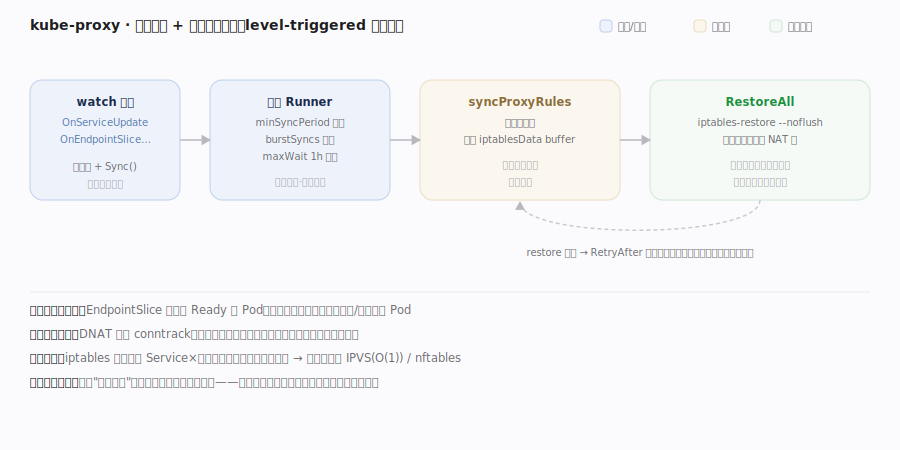

# Kubernetes 核心原理 · 支撑能力域 · 网络（Service / kube-proxy / CNI）

> **定位**：把"一组会漂移的 Pod"抽象成稳定的访问入口。Pod IP 随生灭而变，**Service** 提供固定的虚拟 IP（ClusterIP）+ 负载均衡；**EndpointSlice** 记录 Service 当前后端 Pod IP；**kube-proxy** 在每个节点把这套抽象落成本机转发规则；**CNI** 负责给 Pod 分配可路由的 IP。核实基准：`pkg/proxy/iptables/proxier.go`。

## 一、Service 数据面：ClusterIP → EndpointSlice → kube-proxy

**图示**：**控制面**——用户建 Service（selector 选 Pod），EndpointSlice 控制器持续 reconcile，把匹配且**就绪**的 Pod IP:port 写进 EndpointSlice（后端漂移，这里始终反映当前就绪后端）。**数据面**——每节点一个 kube-proxy watch Service+EndpointSlice，经一个"节流的 reconcile"把全量规则刷进内核：事件只标脏 + `Sync()`，后台限频 runner 调 `syncProxyRules`**重算整张表**写 buffer，再 `RestoreAll` 一次性原子替换 NAT/filter 表。**关键不变量——level-triggered 整表重刷**：kube-proxy 不追"哪条 endpoint 变了"，而是周期重算整表，天然幂等。访问 ClusterIP:port 的包被 iptables DNAT 到某后端 Pod IP（多后端概率分摊）；Pod IP 由 CNI 分配并保证"所有 Pod 无 NAT 互通"；对外经 NodePort / LoadBalancer / Ingress(L7) 暴露。

| 落点 | 符号 | 位置 |
|---|---|---|
| 控制面 reconcile | `syncService` → `reconciler.Reconcile`（只收录 Ready） | endpointslice_controller.go:354 → 429 |
| 节流 runner | `syncRunner`=`BoundedFrequencyRunner`（注册） | proxier.go:164（328） |
| 事件标脏 | `OnServiceUpdate` → `Sync()` → `syncRunner.Loop` | proxier.go:566 / 526 / 543 |
| 重算整表 | `syncProxyRules` → `iptables.RestoreAll`（原子替换） | proxier.go:799 → 1558 |
| 失败重试 | `syncRunner.RetryAfter`（整表重算故幂等） | proxier.go:834 |

## 深化 · 节流重刷的失败路径与整表原子性

**图示**"限频重算 + 整表原子替换"的容错内核：`minSyncPeriod`+`burstSyncs` 让刷表**限频防抖**（不因每个 endpoint 变更就刷表爆 CPU，也不让紧急变更久等）；`--noflush` 整表一次性载入**原子替换**，任意时刻内核都是一份自洽规则集、无"删旧到加新"的流量黑洞；因是整表重算故**天然幂等**，`iptables-restore` 失败只需 `RetryAfter` 重刷，无需知道"上次改到哪"——这是增量改规则做不到的容错。**两个边界**：① iptables 规则数随 Service×后端线性增长、刷表变慢，超大集群应切 IPVS（内核哈希表 O(1)）或 nftables；② DNAT 依赖 conntrack，规则重刷只影响**新连接**选路、已建长连接仍走旧后端，被删后端的 conntrack 表项需清理否则新连接可能误导到已消失的后端。

## 深化 · 网络对象与职责

| 对象/组件 | 职责 | 类比 |
|---|---|---|
| Service (ClusterIP) | 稳定虚 IP + 负载均衡入口 | 内部 VIP |
| EndpointSlice | 当前就绪后端 Pod IP 列表 | 后端池（会变） |
| kube-proxy | 把 Service→后端 落成本机转发规则 | 分布式 LB 数据面 |
| CNI 插件 | 给 Pod 分配可路由 IP + 接入网络 | 网卡 + 路由 |
| Ingress | L7（host/path）路由到 Service | 反向代理 |

## 拓展 · kube-proxy 后端模式

| 模式 | 机制 | 特点 |
|---|---|---|
| iptables | DNAT 规则链，概率分摊 | 默认、成熟；规则数随 Service 线性增长 |
| IPVS | 内核 LVS 哈希表 | 大规模下查找 O(1)、更快 |
| nftables | 新一代内核过滤框架 | 替代 iptables 的演进方向 |

## 调优要点

- 大规模 Service/Endpoint 下 iptables 规则膨胀 → 改用 IPVS/nftables 模式降低同步与查找开销。
- `minSyncPeriod` 控制 kube-proxy 重刷频率：太小 CPU 高、太大收敛慢。
- EndpointSlice（替代旧 Endpoints）分片降低大 Service 的 watch/更新压力。
- Service 拓扑感知路由（内部流量策略）可让流量优先本地节点后端，降跨区延迟。

## 常见误区

- **Service 有自己的进程在转发**：ClusterIP 是虚 IP，转发靠各节点内核规则（kube-proxy 只写规则不代理流量，iptables 模式下）。
- **kube-proxy 增量改规则**：iptables 模式是周期重算整表原子替换（level-triggered）。
- **Pod 通信要经过 Service**：Pod 间可直接用 Pod IP 互通；Service 只是给"一组会变的 Pod"一个稳定入口。
- **Ingress 和 Service 同层**：Ingress 是 L7，通常路由到 Service（L4）再到 Pod。

## 一句话总纲

**K8s 网络把"会漂移的一组 Pod"抽象成稳定入口：Service 给固定 ClusterIP + 负载均衡、EndpointSlice 记录当前就绪后端、kube-proxy 在每个节点把这套抽象周期重算成内核转发规则（iptables/IPVS，DNAT 到后端），而 CNI 保证所有 Pod 无 NAT 可路由互通——同样是 level-triggered 的整表重刷，让数据面持续贴合期望。**
