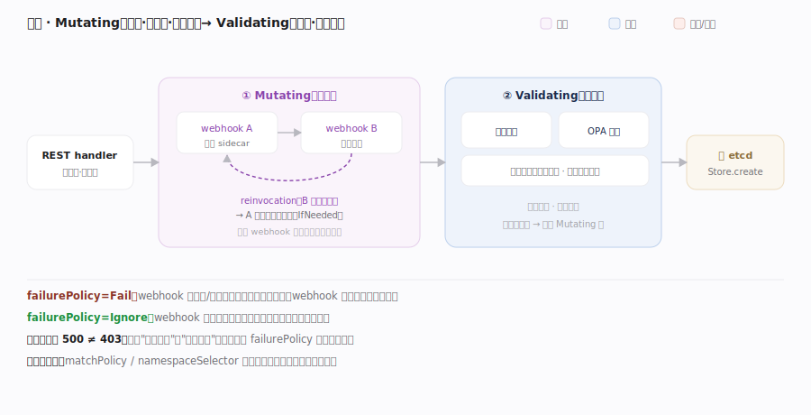

# Kubernetes 核心原理 · 支撑能力域 · 认证授权与准入

> **定位**：写请求进入 API Server 后的三道关卡——**认证（你是谁）→ 授权（你能不能）→ 准入（内容合规吗，可改可拒）**。前两道是 HTTP 过滤器链的一环，第三道在 REST 层落库前触发。这是集群的安全边界与策略注入点。核实基准：`staging/src/k8s.io/apiserver/pkg/endpoints/filters/authentication.go`、`plugin/pkg/auth/authorizer/rbac/rbac.go`、`admission/plugin/webhook/mutating/dispatcher.go`、`server/config.go`。

## 一、三道关卡：authn → authz → admission

**图示**：每个请求在 API Server 的 handler chain 上依次过三关——**① 认证**（你是谁）在 filter 里 union 组合器联合尝试证书/Token/SA JWT/OIDC，任一成功得出 user+groups，全失败 401；**② 授权**（你能不能）主力 RBAC，遍历该主体绑定的 Role/ClusterRole 规则逐条比对 (apiGroup,resource,verb,name)，**默认拒绝**、命中才放行，否则 403；**③ 准入**（内容合规吗）在对象解码后、落库前先跑 Mutating（可改写，如注入 sidecar）再跑 Validating（只校验、可拒）。**顺序铁律**：authn→authz→admission，且 Mutating 必在 Validating 前（否则改完不复检）。K8s 不存用户表——普通用户靠外部身份，ServiceAccount 才是集群内建身份。

| 关 | 符号 | 位置 |
|---|---|---|
| 认证 filter | `withAuthentication` → `AuthenticateRequest` | endpoints/filters/authentication.go:46/67；失败 :127 |
| 认证联合 | union `New(...)` | authentication/request/union/union.go:36 |
| 授权 filter | `WithAuthorization` → `Authorize` | endpoints/filters/authorization.go:53/71；放行 :79 / 拒 :92 |
| RBAC | `RBACAuthorizer.Authorize` → `VisitRulesFor` → `RuleAllows` | rbac/rbac.go:75/78/178；判定 :79 / :80 |
| 准入 | Mutating `Dispatch` → Validating `Dispatch` | mutating :105（reinvoke :150）/ validating :88 |

## 深化 · 三关对比

| 关卡 | 问题 | 主力机制 | 失败 | 位置 |
|---|---|---|---|---|
| 认证 authn | 你是谁 | 证书 / Token / SA JWT / OIDC | 401 | handler chain filter |
| 授权 authz | 你能不能 | RBAC（默认拒绝） | 403 | handler chain filter |
| 准入 admission | 内容合规吗 | Mutating + Validating webhook | 拒绝/改写 | REST 落库前 |

## 拓展 · RBAC 四对象

| 对象 | 作用域 | 含义 |
|---|---|---|
| Role | namespace | 一组权限规则（资源×动作） |
| ClusterRole | 集群 | 跨 namespace / 集群级资源的规则 |
| RoleBinding | namespace | 把 (Cluster)Role 授予主体 |
| ClusterRoleBinding | 集群 | 集群范围授予主体 |

## 深化 · webhook 准入的失败路径与重调用

准入 webhook 在**写请求关键路径**上，失败处理是稳定性敏感点，图中各机制的源码锚点：**failurePolicy=Fail/Ignore** 由 dispatcher 在 `callHook`（validating/dispatcher.go:248）/`callAttrMutatingHook`（mutating/dispatcher.go:244）里把网络错误转成拒绝或忽略；**Mutating 重调用（reinvocation）**——`mutatingDispatcher.Dispatch` 用 `reinvokeCtx`（mutating/dispatcher.go:106），检测 `IsOutputChangedSinceLastWebhookInvocation`（:115）后 `SetShouldReinvoke`（:195），对 `reinvocationPolicy=IfNeeded` 的 webhook 二次调用，**要求 webhook 幂等，否则产生累积改写**；**Validating 并发**——`Dispatch`（validating/dispatcher.go:88）并发调所有 hook、任一拒即整体拒，延迟取决于最慢者；**authz 内部错误**走 `InternalError`（authorization.go:88）返回 500 而非 403，以区分"明确拒绝"与"暂时故障"。

**最常见运维事故**（图外补充）：`matchPolicy` / `namespaceSelector` 漏配会让本该拦截的对象**静默漏过**——这是策略失效最隐蔽的根因。

## 调优要点

- 遵循最小权限：优先 namespace 级 Role/RoleBinding，慎用 ClusterRoleBinding 与通配 `*`。
- ServiceAccount 是 Pod 的身份：给工作负载专用 SA + 精确 RBAC，别用 default SA 附高权限。
- Validating/Mutating webhook 在写路径关键路径上：webhook 慢或挂会拖垮/阻断写请求，设 `failurePolicy` 与超时要谨慎。
- 用 `kubectl auth can-i` 验证有效权限；审计日志（Audit）回溯"谁在何时做了什么"。

## 常见误区

- **K8s 有内建用户数据库**：普通用户来自外部（证书/OIDC），集群只内建 ServiceAccount。
- **RBAC 默认放行**：默认拒绝，必须显式规则允许。
- **准入是 HTTP 过滤器**：认证鉴权是 filter，准入在 REST 层落库前（Mutating 先于 Validating）。
- **认证通过就能操作**：认证只确认身份，还要过授权与准入。

## 一句话总纲

**每个写请求进 API Server 都要过三道关：认证（联合认证器确认 user/groups，失败 401）→ 授权（RBAC 默认拒绝、命中允许规则才放行，失败 403）→ 准入（落库前 Mutating 改写 + Validating 校验，注入配额/安全/策略）；三者顺序固定、职责正交，构成 K8s 的安全边界与策略切面，且准入是把组织策略织进声明式流程的核心扩展点。**
