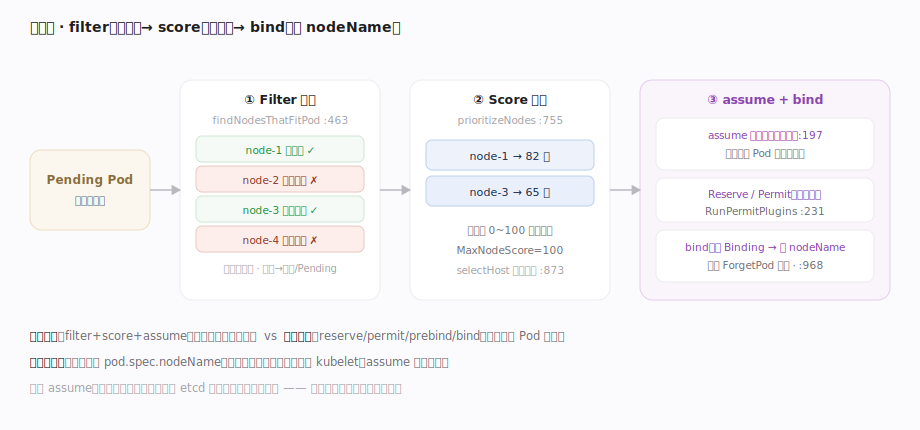
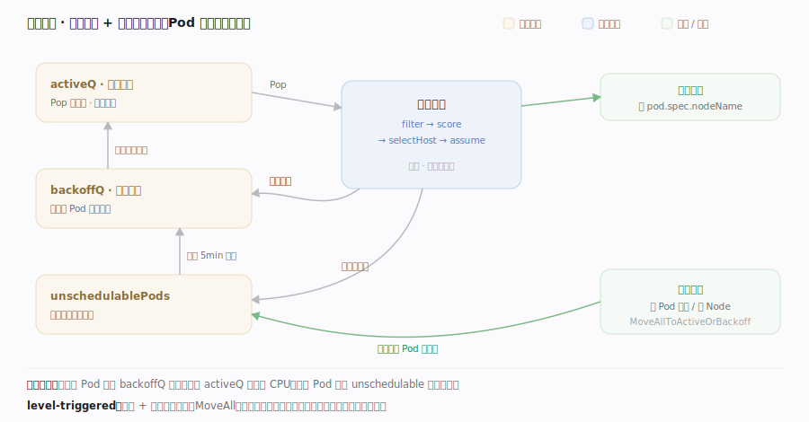

# Kubernetes 核心原理 · 支撑能力域 · 调度器

> **定位**：一个专职控制器——为处于 Pending、未绑定节点的 Pod 挑一个最合适的节点，写回 `pod.spec.nodeName`（绑定）。它本身不启动容器，只做"选址"。调度分两段：**调度周期**（filter→score→选点，串行、需全局视图）与**绑定周期**（reserve/permit/prebind/bind，可异步）。核实基准：`pkg/scheduler/schedule_one.go`、`pkg/scheduler/framework/interface.go`。

## 一、调度框架：filter → score → bind

**图示**：调度器从优先级队列取一个 Pod 进入 `schedulePod`，两阶段定节点——**① Filter（预选）**逐节点跑所有 FilterPlugin，剔除放不下的（资源/端口/亲和/污点/PVC…），得"可行节点集"，空集则触发抢占 PostFilter；大集群靠 `percentageOfNodesToScore` 剪枝，找够就停。**② Score（优选）**对可行节点跑 ScorePlugin 打分（0–100 加权求和），`selectHost` 选最高分（同分随机避热点）。**关键不变量——乐观 assume**：选定后先把 `NodeName` 写进调度器**内存缓存**（不等 API Server 确认），好让下一个 Pod 立即把它算作已占用；随后 Reserve→Permit→（绑定周期可并行）向 API Server 建 Binding 落 `pod.spec.nodeName`。失败则 `ForgetPod` 回滚缓存 + Unreserve。串行全局决策若每步等 etcd 会极慢，乐观假设换吞吐、失败再回滚。

| 阶段 | 符号 | 位置 |
|---|---|---|
| 入口 | `schedulePod` | schedule_one.go:411 |
| 预选 | `findNodesThatFitPod` → `findNodesThatPassFilters` | schedule_one.go:463 → 591 |
| 跑 Filter | `RunFilterPluginsWithNominatedPods`（`FilterPlugin` interface.go:540） | schedule_one.go:629 |
| 剪枝 / 抢占 | `numFeasibleNodesToFind` / `RunPostFilterPlugins` | schedule_one.go:676 / 175 |
| 优选 | `prioritizeNodes`（Score 0–100，interface.go:258/607） | schedule_one.go:755 |
| 选点 | `selectHost` | schedule_one.go:873 |
| 假设周期 | `schedulingCycle` → `assume` | schedule_one.go:138 → 946 |
| 绑定周期 | `bindingCycle` → `bind`（建 Binding 对象） | schedule_one.go:266 → 968 |

## 深化 · 调度队列的三段结构与失败重试

图示三段队列源于 `PriorityQueue`（`pkg/scheduler/backend/queue/scheduling_queue.go:20-24` 注释）：**activeQ**（:66，优先级堆，`Pop`:857 取队头）、**backoffQ**（:67，失败 Pod 指数退避冷却，`flushBackoffQCompleted`:804 到点搬回 activeQ，避免热失败 Pod 空转占满调度器）、**unschedulablePods**（:68，`flushUnschedulablePodsLeftover`:834 默认 5min 兜底搬回）。事件驱动重试由 `MoveAllToActiveOrBackoffQueue`（:1056）实现——集群一发生"可能让某 Pod 变可调度"的变化（删 Pod 释放资源、新增 Node）就唤醒相关 Pod，**这就是 level-triggered 在调度器里的体现，Pod 不会一次失败就永久卡死**。

**失败与抢占路径**（图外补充）：
- 调度周期出错走 `handleSchedulingFailure`（schedule_one.go:1023）——把 Pod 送回 unschedulable/backoff，并按 `nominatingInfo` 记录抢占提名节点（`AddNominatedPod`，schedule_one.go:1090 → `nominator.go:67`）。
- 可行集为空且注册了 PostFilter 时，默认抢占插件 `SelectVictimsOnNode`（`pkg/scheduler/framework/preemption/preemption.go:705`）在候选节点上算出**最小驱逐集**（尊重 PDB），驱逐低优 Pod 给高优 Pod 腾位；被提名节点记在 Pod 的 `status.nominatedNodeName`，下一轮优先尝试。
- assume 后绑定失败（如节点已不满足、API 写冲突）→ `ForgetPod`（schedule_one.go:211）撤销内存占位，Pod 重新入队——**内存缓存与 etcd 的最终一致由这条回滚路径兜底**。

## 深化 · 调度扩展点（framework）

| 扩展点 | 作用 | 空集/拒绝后果 |
|---|---|---|
| PreFilter / Filter | 预处理 + 剔除放不下的节点 | 可行集空 → 抢占或 Pending |
| PostFilter | 无可行节点时触发（抢占） | 驱逐低优 Pod 腾位 |
| PreScore / Score | 对可行节点打分（0~100） | 决定优选排序 |
| Reserve / Permit | 预留资源 / 准入（可等齐） | Unreserve 回滚 |
| PreBind / Bind / PostBind | 绑定前后钩子 + 写 nodeName | 失败 ForgetPod 回滚 |

## 拓展 · 调度器不是什么

| 误解 | 实情 |
|---|---|
| 启动容器 | 只写 nodeName，容器由目标节点 kubelet 拉起 |
| 全局最优解 | 逐 Pod 贪心 + 打分，非全局最优 |
| 同步落库再调下一个 | assume 乐观占位，绑定异步，失败回滚 |
| 只看资源 | 亲和/反亲和、污点容忍、拓扑分布、PVC 拓扑都参与 filter/score |

## 调优要点

- 大集群开 `percentageOfNodesToScore`：只对部分节点打分，牺牲少量最优换调度吞吐。
- 用 PodTopologySpread / 亲和性控制分布，但插件越多单次调度越慢。
- 抢占（PriorityClass）保障高优 Pod 抢占低优；谨慎设置避免抖动。
- 绑定周期与调度周期解耦，volume 绑定等慢操作放绑定周期不阻塞调度队列。

## 常见误区

- **调度器启动 Pod**：它只做绑定（写 nodeName），执行是 kubelet。
- **Filter 给节点打分**：Filter 只做布尔可行性剔除，打分是 Score 阶段。
- **assume 后就一定绑定成功**：assume 是内存乐观占位，绑定失败会 ForgetPod 回滚。
- **调度一次考虑所有 Pod 全局最优**：逐 Pod 处理，是贪心而非全局优化。

## 一句话总纲

**调度器是"选址"专职控制器：对每个待调度 Pod 先 Filter 剔除放不下的节点、再 Score 给可行节点打分（0~100）选最高分，然后乐观 assume 占位以维持串行调度的高吞吐，最后在可异步的绑定周期把 pod.spec.nodeName 写回 API Server——它只决定"去哪台"，真正拉起容器的是目标节点的 kubelet。**
