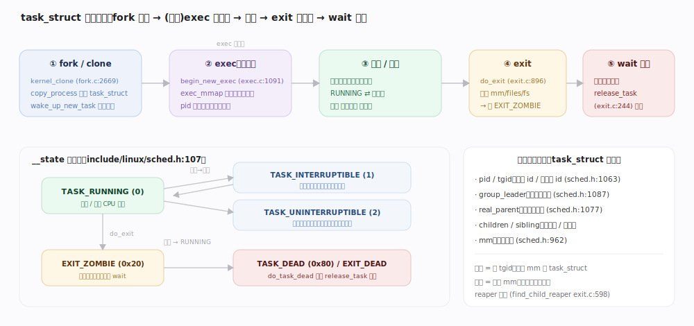
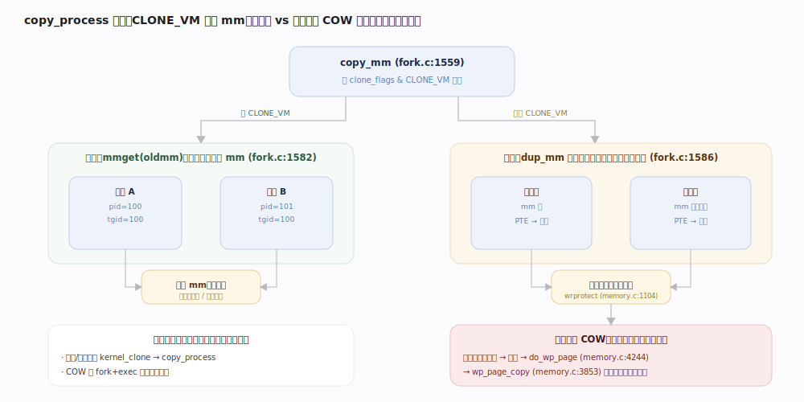
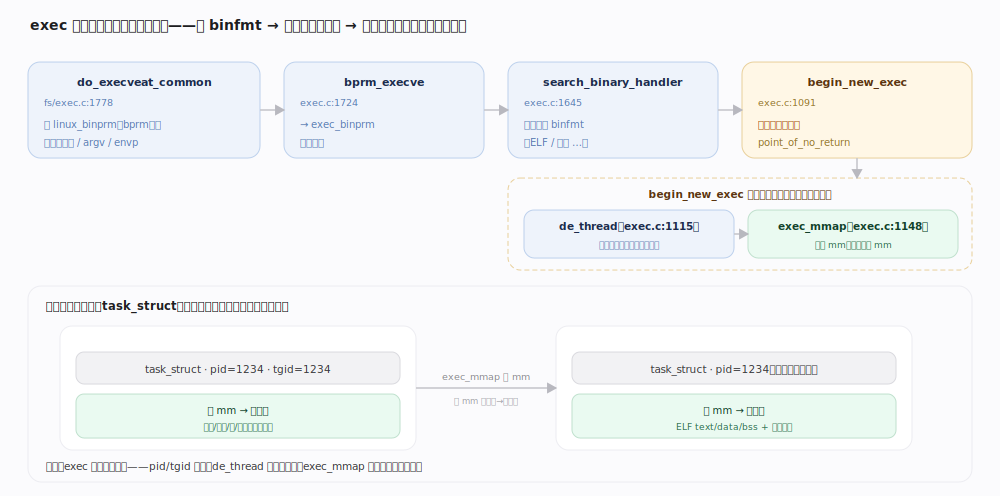
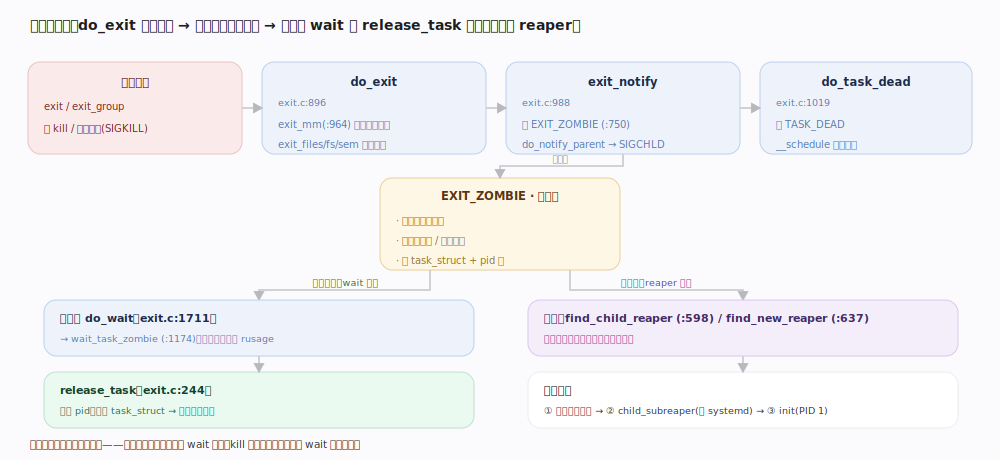
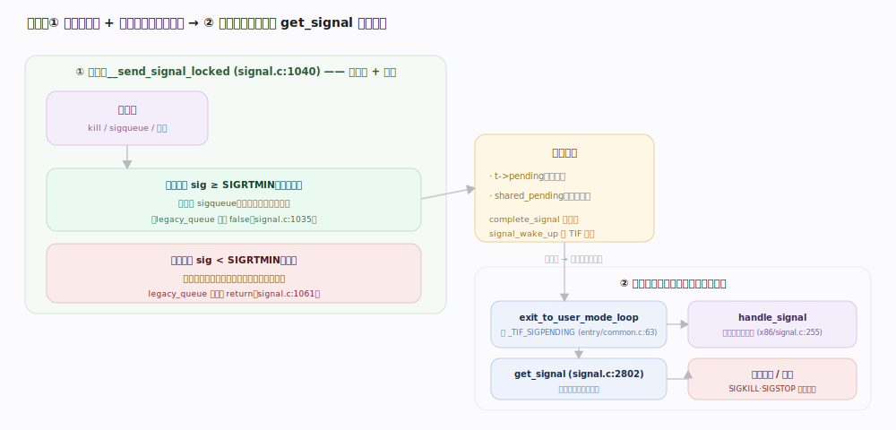

# Linux 内核原理 · 进程与任务管理

> **定位**：**计算能力域**（与进程调度同层，但管的是"进程怎么生灭"而非"选谁跑"）。职责：任务的创建/替换/销毁与身份、进程树、信号投递。前台 = `fork`/`exec`/`exit`、信号发送与处理；后台 = 僵尸回收、延迟释放。依赖**进程调度**（新任务入队 `wake_up_new_task`）、**虚拟内存**（地址空间/COW）、**cgroup 与 namespace**（新进程归属与视图）；被**接触面**（进程类系统调用）依赖。7.1.3 里线程与进程共用同一个 `task_struct`，差别只在 `clone` 时**共享哪些资源**。

## 一、task_struct 与进程生命周期

内核里**一个可调度实体 = 一个 `task_struct`**（`include/linux/sched.h:820`）——无论用户叫它"进程"还是"线程"。核心字段：调度状态 `__state`（`sched.h:828`）、身份 `pid`/`tgid`（`sched.h:1063`）、进程树指针 `real_parent`/`children`/`sibling`/`group_leader`（`sched.h:1077`）、地址空间 `mm`（`sched.h:962`）。一个任务的一生走**四段**：`fork` 复制出来 → （可选）`exec` 换掉执行映像 → 被调度器反复选中运行 → `exit` 变僵尸、由父进程 `wait` 回收。

| 状态（`sched.h:107`） | 值 | 含义 |
|---|---|---|
| `TASK_RUNNING` | 0 | 就绪或正在 CPU 上跑 |
| `TASK_INTERRUPTIBLE` | 1 | 可中断睡眠（可被信号唤醒） |
| `TASK_UNINTERRUPTIBLE` | 2 | 不可中断睡眠（等硬件，信号打不断） |
| `__TASK_STOPPED` | 4 | 被 SIGSTOP 等停住 |
| `TASK_DEAD` | 0x80 | `do_exit` 末尾的最终态 |
| `EXIT_ZOMBIE` / `EXIT_DEAD` | 0x20 / 0x10 | 退出后放在 `exit_state`，等/已被回收 |

## 二、创建：fork / clone

Linux **不区分"创建进程"和"创建线程"的系统调用**——`fork`/`vfork`/`clone`/`clone3` 最终都汇入 `kernel_clone`（`kernel/fork.c:2669`）→ `copy_process`（`fork.c:1969`）复制一份 `task_struct`，再 `wake_up_new_task`（`fork.c:2754`）交给调度器。**线程 vs 进程的唯一区别是 `clone_flags` 决定共享哪些资源**：置 `CLONE_VM` 就共享地址空间（成为同进程的线程），不置就 COW 复制（成为独立进程）。

---

## 深化 · copy_process 与写时复制（COW）

地址空间的复制由 `copy_mm`（`fork.c:1559`）按 `CLONE_VM` 分岔：**共享**时 `mmget(oldmm)` 让新任务 `mm` 直接指向父的 `mm`（`fork.c:1582`，这就是线程）；**不共享**时 `dup_mm`（`fork.c:1586`）复制页表结构，但**不复制物理页**——`__copy_present_ptes`（`mm/memory.c:1104`）把父子双方的可写 PTE 都改成**只读**（`wrprotect_ptes` + `pte_wrprotect`）。此后任一方写入触发缺页，`do_wp_page`（`memory.c:4244`）→ `wp_page_copy`（`memory.c:3853`）才真正**复制那一页**并恢复可写。COW 让 `fork` 近乎零拷贝，也解释了为何 `fork` 后紧跟 `exec` 的经典模式几乎不产生页复制开销。

## 深化 · exec 替换执行映像

`exec` **不创建新任务**，而是把当前 `task_struct` 的执行映像整体换掉：入口 `do_execveat_common` 建 `linux_binprm`（承载新程序文件、参数、环境）→ `search_binary_handler` 按 ELF 等格式选 binfmt 处理器。**`begin_new_exec` 是不可回头点**——先 `de_thread` 收掉线程组里其它线程，再 `exec_mmap` 卸下旧 `mm`、挂上全新地址空间；此后旧代码/数据/堆栈全部消失，新程序从入口开始跑。**`pid` 不变，但"里面的人"换了**。各阶段函数与行号见图内标注。

## 深化 · exit / wait 与僵尸回收

任务退出走 `do_exit`（`kernel/exit.c:896`）：依次 `exit_mm`（`exit.c:964`，归还地址空间）、`exit_files`/`exit_fs`/`exit_sem` 等释放资源，最后 `exit_notify`（`exit.c:988`）把 `exit_state` 置 **`EXIT_ZOMBIE`**（`exit.c:750`）并通知父进程（`do_notify_parent` 发 `SIGCHLD`）。**僵尸不是 bug 而是设计**：进程退出后必须保留退出码与统计信息，直到父进程 `wait`（`do_wait`）取走才 `release_task`（`exit.c:244`）彻底销毁。收尾 `do_task_dead`（`exit.c:1019`）把状态置 `TASK_DEAD` 并调 `__schedule` 永不返回。若父进程先死，孤儿由 `find_child_reaper`（`exit.c:598`）**重新认领**（通常挂到 init 或最近的 subreaper），避免僵尸永久滞留。

## 深化 · 信号：投递与处理

信号是**异步事件的排队 + 延迟处理**机制，分**发送**与**处理**两段（发送方与被通知方常不在同一时刻）：

- **发送**（`__send_signal_locked`，`signal.c:1040`）：把信号挂进目标的挂起队列（私有 `t->pending` 或线程组 `shared_pending`），再 `complete_signal`（`signal.c:963`）挑一个线程 `signal_wake_up`。这里有**可靠 vs 不可靠**之分：`legacy_queue`（`signal.c:1035`）判 `sig < SIGRTMIN` 的**传统信号**——同种信号只保留一个、重复发送被合并丢弃；`>= SIGRTMIN` 的**实时信号**则真正排队、按序投递且可带数据。
- **处理**：发送只置"挂起+唤醒"标志，**不当场执行处理函数**。真正处理推迟到**目标任务返回用户态那一刻**——`__exit_to_user_mode_loop`（`kernel/entry/common.c:63`）见 `_TIF_SIGPENDING` 就调 `arch_do_signal_or_restart`（`arch/x86/kernel/signal.c:333`）→ `get_signal`（`signal.c:2802`）取出信号 → `handle_signal`（`x86/kernel/signal.c:255`）在**用户栈**上搭一个信号帧、把返回地址指向 handler。`SIGKILL`/`SIGSTOP` 例外：无法被捕获或忽略。

---

## 拓展 · 线程组、pid namespace、futex

| 概念 | 机制 | 源码 |
|---|---|---|
| 线程组 | 同进程的线程共享 `tgid`（= 组长 `pid`），`group_leader` 指向组长 | `sched.h:1064` `1087` |
| 进程树 | `real_parent`/`children`/`sibling` 组成父子兄弟链 | `sched.h:1077` |
| pid namespace | 一个任务在不同层级 ns 里有不同 pid（容器隔离基础），`pid_max` 已下放为**每 ns** sysctl | `kernel/pid.c:792` |
| 孤儿认领 | 父先死时 reaper（init/subreaper）接管子进程 | `exit.c:598` |
| futex | 用户态锁快路径在用户空间自旋，仅争用时才陷入内核排队/唤醒 | → 详见 同步原语 主线 |

---

## 调优要点（关键开关，均据 7.1.3 源码）

- `/proc/sys/kernel/pid_max`（`kernel/pid.c:792`）：pid 上限；7.1.3 已改为**每个 pid namespace 独立**的 sysctl，不再是全局单值。
- `vfork` vs `fork`：`vfork`（`CLONE_VFORK|CLONE_VM`）不复制地址空间且父进程阻塞等子进程 `exec`/`exit`（`fork.c:2741`），用于"复制即换映像"场景省去 COW 开销。
- `clone3` 的 `CLONE_*` 标志：精细控制共享 VM/FS/FILES/SIGHAND/信号，是线程库与容器 runtime 的基石。
- rlimit `RLIMIT_NPROC`：单用户进程数上限，防 fork 炸弹（配额语义，非本文件核心路径）。

---

## 常见误区与工程要点

- **"进程和线程是两种内核对象"**：错。两者都是 `task_struct`，差别只在 `clone` 时 `CLONE_VM` 等标志决定共享哪些资源。
- **"`fork` 会立刻复制整个地址空间"**：错。`dup_mm` 只复制页表并把页设只读，物理页在**首次写入触发 COW**（`do_wp_page`）时才真正复制。
- **"僵尸进程是资源泄漏/需要 kill"**：僵尸已释放绝大部分资源，只留退出信息等父进程 `wait`；`kill` 僵尸无效，要处理的是**不 wait 的父进程**。
- **"信号发出去就立即执行处理函数"**：错。发送只入队+唤醒，处理推迟到目标任务**返回用户态**时由 `get_signal` 取出；且传统信号会被合并，实时信号才逐个排队。

---

## 一句话总纲

**Linux 用同一种 `task_struct` 表达进程与线程，靠 `clone` 标志决定共享什么：`fork`/`clone` 经 `copy_process` 复制任务、地址空间走 COW（写时才真复制），`exec` 经 `begin_new_exec`/`exec_mmap` 就地换掉执行映像，`exit` 先变僵尸留退出信息、由父进程 `wait` 回收；信号则是"发送时入队+唤醒、返回用户态时才由 `get_signal` 处理"的异步机制，传统信号合并、实时信号排队。**
