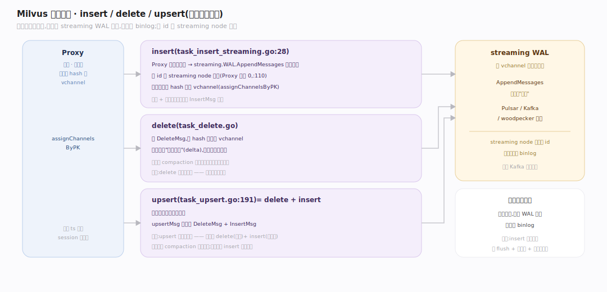
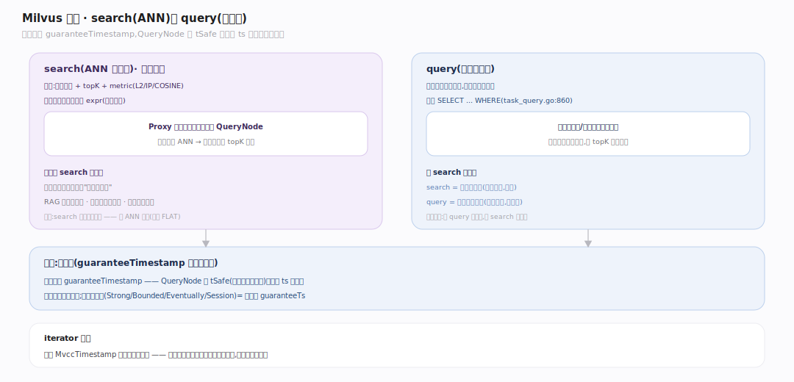
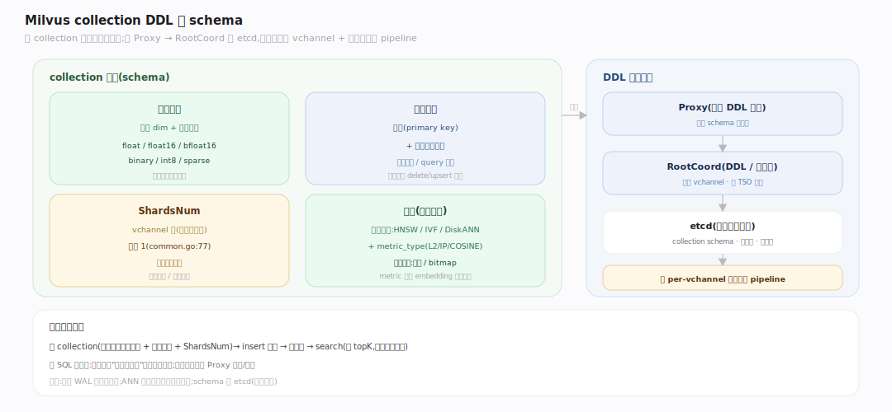

# Milvus 原理 · 接触面主线 · 向量 CRUD 与 ANN 检索 API

> **定位**：属"接触面主线"(用户可见)。Milvus 的接触面是**向量数据 API**:collection/partition DDL、insert/delete/upsert(写)、search(ANN 检索)、query(标量条件取)。调用【写入路径】落数据、【向量索引与检索】做 ANN、【一致性与时间】定快照。源码基准 **Milvus(9a6e499)**(`internal/proxy/`)。

用户怎么用 Milvus?建 collection(定义向量字段维度 + 标量字段 + shard 数)→ insert 向量 → 建索引 → search(给查询向量找 topK 最近邻,可带标量过滤)。所有请求先到 **Proxy**,由它路由/聚合。与 SQL 库不同:主操作是"相似度检索"而非关系查询。

---

## 一、数据操作:insert / delete / upsert

- **insert**(`internal/proxy/task_insert_streaming.go:28`):Proxy 建可变消息、`streaming.WAL().AppendMessages`(`task_insert_streaming.go:75`)写进日志;**段 id 由 streaming node 分配**(Proxy 侧 `genInsertMsgsByPartition` 传 0,`task_insert_streaming.go:110`);消息按主键 hash 分到 vchannel(`assignChannelsByPK` `internal/proxy/util.go:2602`,repack 见 `task_insert_streaming.go:89`)。返回的时间戳用于 session 一致性。
- **delete**(`internal/proxy/task_delete.go:38`):建 DeleteMsg,PreExecute 解析主键(`task_delete.go:130`)后按 hash 重分到 vchannel(`repackDeleteMsgByHash` `task_delete.go:150`);删除是写"删除标记"(delta),不立即从段移除。
- **upsert**(`internal/proxy/task_upsert.go:46`)= delete + insert:`upsertMsg`(`task_upsert.go:50`)同时持 DeleteMsg + InsertMsg,先删旧主键(`task_upsert.go:191`)再插新;`queryPreExecute`(`task_upsert.go:239`)取旧主键。

写入是**追加日志**语义(见写入路径篇):不原地改,而是往 WAL 追加,异步落 binlog。

---

## 二、检索:search(ANN)与 query

- **search**(ANN 最近邻,`internal/proxy/task_search.go:65`):给查询向量 + topK + metric(L2/IP/COSINE),可带标量过滤表达式(`expr`);`rankParams`(`task_search.go:106`)承载 rerank/group by。Proxy `PreExecute`(`task_search.go:160`)解析后下发到持有相关段的 QueryNode,各段并行 ANN(见向量检索篇的预过滤),结果归并取全局 topK 返回。
- **query**(标量条件取,`internal/proxy/task_query.go:54`):按标量谓词取实体(不做向量相似度),类似 `SELECT ... WHERE`;`Execute` 见 `task_query.go:922`。
- **一致性**:两者都带 `guaranteeTimestamp`(search `task_search.go:286` / query `task_query.go:859`)——QueryNode 等 tSafe 追上该 ts 才返回,保证读到一致快照(见一致性篇)。iterator 分页时钉 `MvccTimestamp` 保跨页快照稳定(`task_search.go:319`)。

**为什么 search 是核心**:向量库存在的意义就是"相似度检索"——RAG 找相关文档、推荐找相似物品、图搜找相似图,都是 topK ANN。

---

## 三、collection DDL 与 schema

建 collection 定义:
- **向量字段**:维度 + 数据类型(float/float16/bfloat16/binary/int8/sparse)。
- **标量字段**:主键 + 其它(用于过滤/query)。
- **ShardsNum**:vchannel 数(写入并行度,默认 1;`DefaultShardsNum` `pkg/common/common.go:77`)。
- **索引**:建表后为向量字段建索引(HNSW/IVF/DiskANN)+ metric_type;标量字段可建倒排/bitmap 索引。

DDL 经 Proxy → RootCoord 落元数据(etcd,见元数据篇);collection 创建时分配 vchannel、建 per-vchannel 的数据同步 pipeline。

---

## 拓展 · 接触面关键结构一览

| 结构 | 定义 | 职责 |
|---|---|---|
| insertTask.Execute | `internal/proxy/task_insert_streaming.go:28` | insert → WAL |
| assignChannelsByPK | `internal/proxy/util.go:2602` | 按主键 hash 分 vchannel |
| deleteTask | `internal/proxy/task_delete.go:38` | 删除标记(delta) |
| repackDeleteMsgByHash | `internal/proxy/task_delete.go:150` | delete 按 hash 重分 vchannel |
| upsertTask | `internal/proxy/task_upsert.go:46` | delete+insert(`upsertMsg` `:50`) |
| searchTask | `internal/proxy/task_search.go:65` | ANN 检索(guaranteeTs `:286`) |
| queryTask | `internal/proxy/task_query.go:54` | 标量 query(guaranteeTs `:859`) |
| DefaultShardsNum | `pkg/common/common.go:77` | vchannel 数(默认 1) |

## 调优要点（关键开关）

- **ShardsNum**:写入并行度;高吞吐写调大,但增日志/调度开销。
- **metric_type**:须与 embedding 训练一致(L2/IP/COSINE),错了召回全乱。
- **一致性级别**:实时要求高用 Strong(等最新);容忍延迟用 Bounded/Eventually 换性能。
- **批量 insert**:攒批插比逐条快;upsert 有 delete+insert 双开销,非必要用 insert。

## 常见误区与工程要点

- **误区:insert 立即可查。** 写进 WAL 后异步落段;要等 flush + 建索引,且读受一致性级别(guaranteeTs)约束。
- **误区:upsert 是原地更新。** 是 delete(标记)+ insert(新版本);旧版本由 compaction 惰性回收。
- **误区:search 是精确最近邻。** 是 ANN 近似(除非用 FLAT);召回率由索引参数定。
- **误区:delete 立即腾空间。** 删除只写 delta 标记,数据由 compaction 应用删除后才真正移除。
- **归属提醒**:写落 WAL 在【写入路径】;ANN 算法在【向量索引与检索】;段状态在【段与生命周期】;guaranteeTs 语义在【一致性与时间】;schema 存 etcd(【元数据】)。

## 一句话总纲

**Milvus 接触面是向量数据 API:写(insert 经 streaming WAL 追加、段 id 由 streaming node 分配;delete 写删除标记;upsert=delete+insert)、检索(search 给查询向量找 topK 最近邻 + 可选标量过滤 expr、query 按标量条件取,都带 guaranteeTimestamp 读一致快照)、DDL(collection 定义向量字段维度+标量字段+ShardsNum,建表后建索引);所有请求经 Proxy 路由聚合——核心是相似度检索(RAG/推荐/图搜),不是关系查询。**
