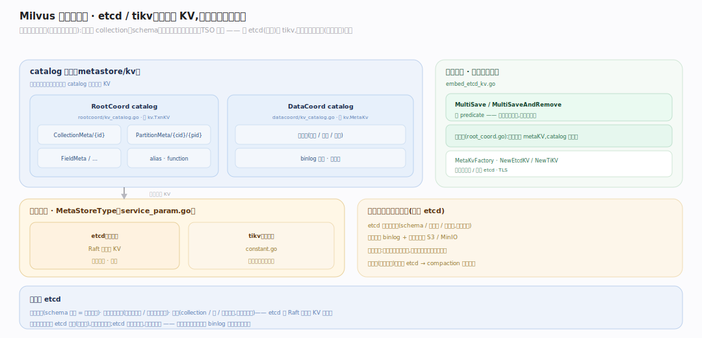
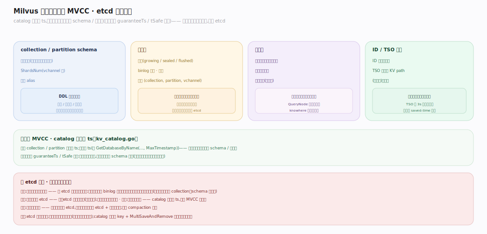

# Milvus 原理 · 支撑主线 · 元数据

> **定位**：属"元数据能力域"。管全局状态的持久化:collection schema、段信息、索引元、位点——存 etcd(或 tikv)。被所有主线依赖,是 DDL/段/索引状态的最终落点。源码基准 **Milvus(9a6e499)**(`internal/metastore/`、`internal/kv/`)。

分布式系统需要一个可靠的地方存"关于系统的关键元数据":有哪些 collection、schema 是什么、每个段在哪、索引建到哪、TSO 水位。Milvus 把这些存在 **etcd**(默认)或 **tikv**——强一致的分布式 KV,与海量向量数据(存对象存储)分开。元数据小而关键,要正确而非高吞吐。

---

## 一、元数据存储:etcd / tikv

- **后端选择**(`pkg/util/paramtable/service_param.go:544`):`MetaStoreType` 默认 `etcd`(`MetaStoreTypeEtcd` `pkg/util/constant.go:31`),可选 `tikv`(`MetaStoreTypeTiKV` `pkg/util/constant.go:32`)。
- **catalog 抽象**:RootCoord 的 catalog 包一个 `kv.TxnKV`(`internal/metastore/kv/rootcoord/kv_catalog.go:176` 的 `CreateCollection` 等),结构化 key:`CollectionMeta/{id}`、`PartitionMeta/{cid}/{pid}`、`FieldMeta/…`、alias、function。DataCoord catalog(`internal/metastore/kv/datacoord/kv_catalog.go:51`,`NewCatalog` `:59`)包 `kv.MetaKv` 管段/binlog 路径(`AddSegment` `:264`)。
- **初始化**(`initKVCreator` `internal/rootcoord/root_coord.go:369`):按类型建 metaKV(`etcdkv.NewEtcdKV` `root_coord.go:378` 或 `tikv.NewTiKV` `:373`),catalog 建在其上;工厂 `NewMetaKvFactory`(`internal/kv/etcd/metakv_factory.go:78`)支持嵌入式/外部 etcd、TLS。
- **事务操作**:`MultiSave`(`internal/kv/etcd/embed_etcd_kv.go:400`)/`MultiSaveAndRemove` 带 predicate(`embed_etcd_kv.go:471`)——原子多键更新。

**为什么 etcd**:元数据要强一致(schema 错乱=数据错乱)、要多节点共享(所有协调器/节点读同一份)、量小(collection/段/索引信息,非向量数据)——etcd 的 Raft 强一致 KV 正合适。

---

## 二、元数据内容与 MVCC

etcd 里存什么:
- **collection/partition schema**:字段定义(向量维度、标量类型)、ShardsNum、别名。
- **段信息**:每个段的状态(growing/sealed/flushed)、binlog 路径、行数、所属 (collection, partition, vchannel)。
- **索引元**:哪些字段建了什么索引、索引文件路径、构建状态。
- **ID/TSO KV**:ID 分配器 + TSO 用独立 KV path(同后端)持久化水位。

**元数据 MVCC**:catalog 的每个 collection/partition 操作带 `ts`(`kv_catalog.go:128`),读也带 ts(如 `GetDatabaseByName(..., MaxTimestamp)`)——支持按时间戳快照读 schema/元数据(与数据侧的 guaranteeTs/tSafe 呼应)。

---

## 拓展 · 元数据关键结构一览

| 结构 | 定义 | 职责 |
|---|---|---|
| MetaStoreType | `pkg/util/paramtable/service_param.go:544` | etcd(默认 `constant.go:31`)/ tikv `:32` |
| RootCoord catalog | `internal/metastore/kv/rootcoord/kv_catalog.go:176` | collection/partition/field 元(CreateCollection) |
| CreateDatabase(ts) | `internal/metastore/kv/rootcoord/kv_catalog.go:128` | 元数据带 ts(MVCC 快照) |
| DataCoord catalog | `internal/metastore/kv/datacoord/kv_catalog.go:51` | 段/binlog 路径元(NewCatalog `:59`) |
| AddSegment | `internal/metastore/kv/datacoord/kv_catalog.go:264` | 落段元 |
| initKVCreator | `internal/rootcoord/root_coord.go:369` | 按类型建 metaKV(NewEtcdKV `:378`) |
| MetaKvFactory | `internal/kv/etcd/metakv_factory.go:78` | 建 etcd KV(嵌入/外部/TLS) |
| MultiSave | `internal/kv/etcd/embed_etcd_kv.go:400` | 原子多键写 |
| MultiSaveAndRemove | `internal/kv/etcd/embed_etcd_kv.go:471` | 原子多键事务(带 predicate) |

## 调优要点（关键开关）

- **etcd vs tikv**:中小规模 etcd(简单);超大元数据量(海量 collection/段)可用 tikv。
- **etcd 容量**:元数据量随 collection/段数增长;段过多(小段碎片)会撑大 etcd,compaction 合段可缓解。
- **嵌入 vs 外部 etcd**:测试用嵌入,生产用外部独立 etcd 集群(高可用)。
- **元数据备份**:etcd 是系统真相,定期备份;丢了元数据即使对象存储有数据也无法恢复结构。

## 常见误区与工程要点

- **误区:向量数据存 etcd。** 不。etcd 只存元数据(schema/段信息/索引元,小而关键);向量数据在对象存储。
- **误区:段太多没关系。** 段元数据都在 etcd,小段碎片过多会撑大 etcd + 增加协调开销;及时 compaction。
- **误区:元数据无版本。** catalog 操作带 ts,支持按时间戳快照读元数据(MVCC)。
- **误区:丢对象存储才丢数据。** 丢 etcd 元数据同样致命——对象存储里的 binlog 没有元数据索引就是一堆无结构文件。
- **归属提醒**:DDL 写元数据由【接触面】触发;段信息由【段与生命周期】更新;TSO 水位持久化服务【一致性与时间】;协调器读元数据做调度(【分布式架构】)。

## 一句话总纲

**Milvus 元数据(collection/partition schema、段信息+binlog 路径、索引元、ID/TSO 水位)存 etcd(默认,可选 tikv)——强一致分布式 KV,与海量向量数据(对象存储)分开:RootCoord catalog 管 collection/字段、DataCoord catalog 管段/binlog 路径,经结构化 key + MultiSaveAndRemove 原子事务;catalog 操作带 ts 支持元数据 MVCC 快照读;元数据小而关键(要正确非高吞吐),丢了即使对象存储有 binlog 也无法恢复结构——是系统真相,须备份。**
