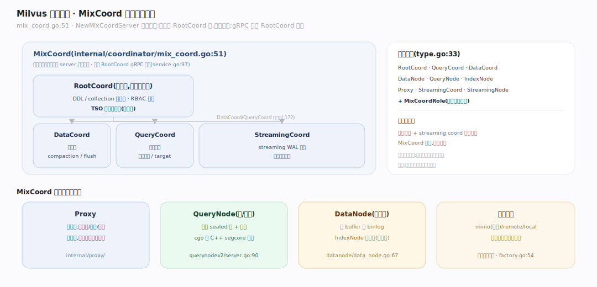
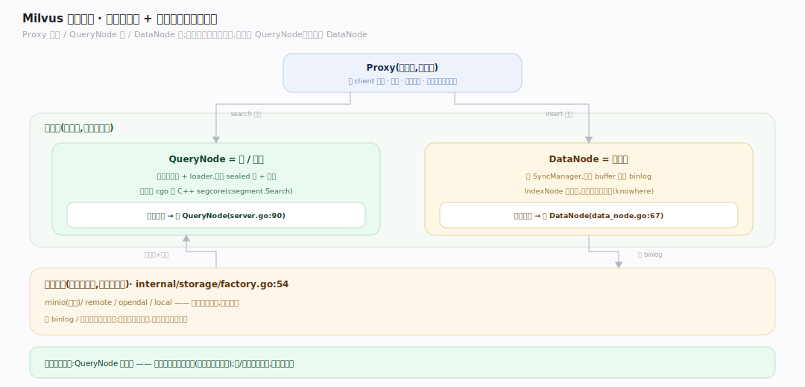
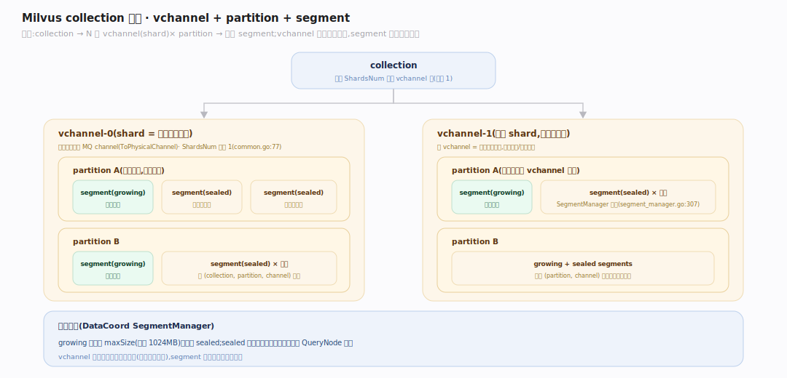
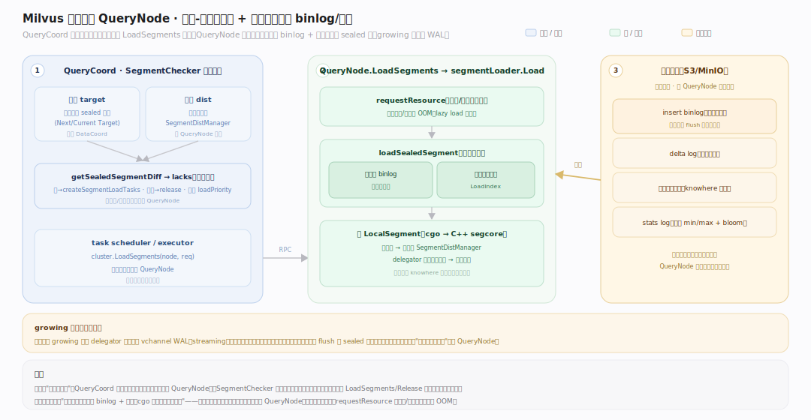

# Milvus 原理 · 支撑主线 · 分布式架构

> **定位**：属"架构能力域"。管存算分离的节点分工:MixCoord(合并协调器)、Proxy(接入)、QueryNode(读/检索)、DataNode(写/建索引)、对象存储。承载所有主线的运行拓扑。源码基准 **Milvus(6ca0350944)**(`internal/coordinator/`、`internal/proxy/`、`internal/querynodev2/`、`internal/datanode/`)。

Milvus 是**存算分离**的分布式系统:计算节点无状态、数据在共享对象存储,故可按负载独立弹性扩缩。角色分工清晰——Proxy 接入、协调器统管元数据/调度/TSO、QueryNode 读、DataNode 写+建索引。现代版把三个协调器 + streaming coord 合并成一个 **MixCoord** 进程,简化部署。

---

## 一、节点拓扑:MixCoord + 工作节点

角色枚举(`pkg/util/typeutil/type.go:33`):RootCoord/QueryCoord/DataCoord/DataNode/QueryNode/IndexNode/Proxy/StreamingCoord/StreamingNode + **MixCoordRole**。

**MixCoord**(`internal/coordinator/mix_coord.go:51`)内嵌四个协调器为进程内 server:`rootcoordServer *rootcoord.Core` + `queryCoordServer` + `datacoordServer` + `streamingCoord`,`NewMixCoordServer` 一起构造。启动序:RootCoord 先(其余依赖它),DataCoord/QueryCoord 并行起(`:172`)。gRPC 复用 RootCoord 端点(`internal/distributed/mixcoord/service.go:97`)。

各协调器职责:
- **RootCoord**:DDL/collection 元数据、RBAC 权限、**TSO 时间戳**。
- **DataCoord**:段管理(`segmentManager`)、compaction 触发、flush、导入。
- **QueryCoord**:副本管理、负载均衡、target 管理。

---

## 二、存算分离:Proxy / QueryNode / DataNode

- **Proxy**(`internal/proxy/`):接入层——收 client 请求、路由、聚合结果;无状态,可多副本负载均衡。
- **QueryNode = 读/计算**(`internal/querynodev2/server.go:90`):持段管理器 + loader,加载 sealed 段 + 索引;检索经 cgo 调 C++ segcore(`segment.go:802` `csegment.Search`)。
- **DataNode = 写路径**(`internal/datanode/data_node.go:67`):持 SyncManager,把写 buffer 落成 binlog;**IndexNode 已并入**(`internal/datanode/index/`,异步建向量索引 knowhere)。
- **对象存储**(`internal/storage/factory.go:54`):minio(默认)/remote/opendal/local——所有段数据的持久层,计算节点共享。

**存算分离的红利**:QueryNode 挂了重新加载段即可(数据在对象存储),读负载高就加 QueryNode、写负载高就加 DataNode,存储独立扩。

---

## 三、collection 分片:vchannel + partition + segment

一个 collection 的数据切分层次:

- **shard = vchannel**:建表 `ShardsNum`(默认 1,`common/common.go:77`)决定 vchannel 数;每个 vchannel 映射到一个物理消息队列 channel(`ToPhysicalChannel`)。vchannel 是写入日志的分片单位。
- **partition**:逻辑分区(按业务维度,如按日期),便于分区级加载/删除。
- **segment**:数据的物理单位,DataCoord 的 `SegmentManager` 按 (collection, partition, channel) 分配 growing 段(`segment_manager.go:307`);超 `maxSize`(默认 1024MB)封成 sealed。

层次:collection → N 个 vchannel(shard)× partition → 多个 segment。vchannel 决定并行写入与日志分片,segment 决定检索与索引粒度。

---

## 四、段加载到 QueryNode

存算分离下"段数据在对象存储、计算在 QueryNode",段怎么被搬到 QueryNode?靠**声明式收敛**:QueryCoord 的 `SegmentChecker`(`internal/querycoordv2/checkers/segment_checker.go:103`)周期比对**目标**(该加载的 sealed 段,源自 DataCoord 的 target)与**实际分布**(`SegmentDistManager` 各 QueryNode 上报),`getSealedSegmentDiff`(`segment_checker.go:313`)算出缺的段 → `createSegmentLoadTasks` → task executor 发 `cluster.LoadSegments`(`internal/querycoordv2/task/executor.go:281`)。QueryNode 侧 `LoadSegments`(`internal/querynodev2/services.go:459`)→ `segmentLoader.Load`(`internal/querynodev2/segments/segment_loader.go:224`):先 `requestResource` 做内存/磁盘配额守门(防 OOM),再 `loadSealedSegment`(`segment_loader.go:1045`)从对象存储并发拉字段 binlog + 向量索引、cgo 建 `LocalSegment`,注册进分布供检索。**growing 段不走此路**——由 delegator 订阅 vchannel WAL(streaming)得到、内存暴力搜。所以扩 QueryNode / 故障换节点只是"重拉段",这正是存算分离的红利。

---

## 拓展 · 架构关键结构一览

| 结构 | 定义 | 职责 |
|---|---|---|
| MixCoord | `internal/coordinator/mix_coord.go:51` | 内嵌四协调器的统管进程 |
| RootCoord | `internal/rootcoord/root_coord.go:131` | DDL 元数据 + RBAC + TSO |
| DataCoord | `internal/datacoord/server.go:94` | 段管理 + compaction + flush |
| QueryNode | `internal/querynodev2/server.go:90` | 读/检索(cgo segcore) |
| DataNode | `internal/datanode/data_node.go:67` | 写 binlog + 建索引 |
| 对象存储 factory | `internal/storage/factory.go:54` | minio/remote/local 持久层 |

## 调优要点（关键开关）

- **节点副本数**:读多加 QueryNode、写多加 DataNode;Proxy 多副本抗接入并发。
- **ShardsNum**:vchannel 数=写入并行度;过多增日志/调度开销、过少限写入吞吐。
- **对象存储选型**:云上 S3、自建 MinIO;带宽与延迟影响段加载/flush。
- **MixCoord vs 分离部署**:小集群 MixCoord 省资源;超大规模可拆开独立扩。

## 常见误区与工程要点

- **误区:Milvus 是单机向量库。** 它是分布式存算分离系统;单机是特例,生产是多节点。
- **误区:IndexNode 是独立节点。** 已并入 DataNode(`internal/datanode/index/`),仍注册 IndexNode gRPC 服务但不是独立进程。
- **误区:QueryNode 有状态。** 无状态——段数据在对象存储,挂了重新加载即可,这是存算分离的关键。
- **误区:协调器有三个进程。** 现代版合并成 MixCoord 单进程(内嵌四个),简化部署。
- **归属提醒**:写入日志分片(vchannel)在【写入路径】;段的 growing/sealed 在【段与生命周期】;检索在 QueryNode 但算法在【向量索引与检索】;元数据存 etcd(【元数据】)。

## 一句话总纲

**Milvus 是存算分离的分布式向量库:MixCoord 内嵌 RootCoord(DDL/TSO)/DataCoord(段/compaction)/QueryCoord(副本/均衡)/StreamingCoord 统管,Proxy 接入路由、QueryNode 无状态读检索(cgo 调 C++ segcore)、DataNode 写 binlog+建索引(IndexNode 已并入)、数据在共享对象存储;collection 按 vchannel(shard,=写入日志分片)× partition 切分、再分成 growing/sealed 段——计算节点无状态可弹性,存储独立扩。**
