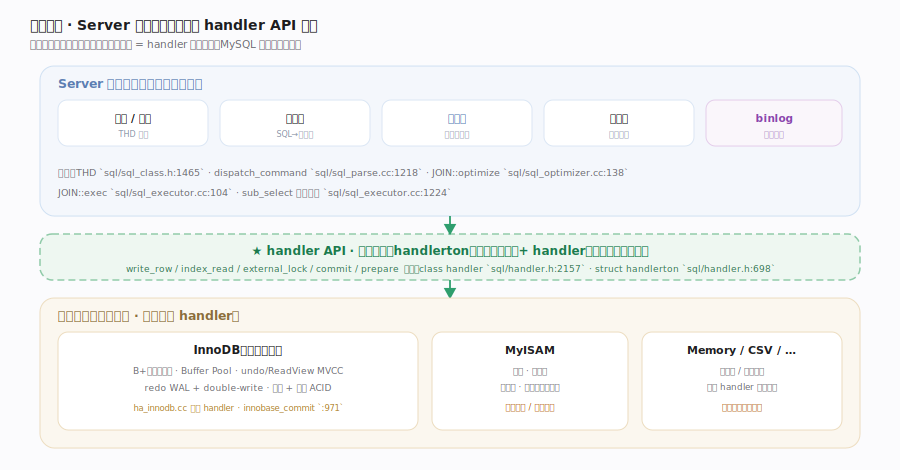
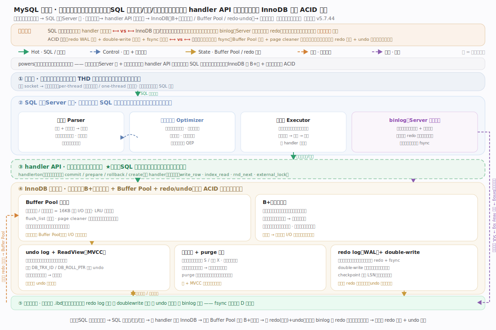
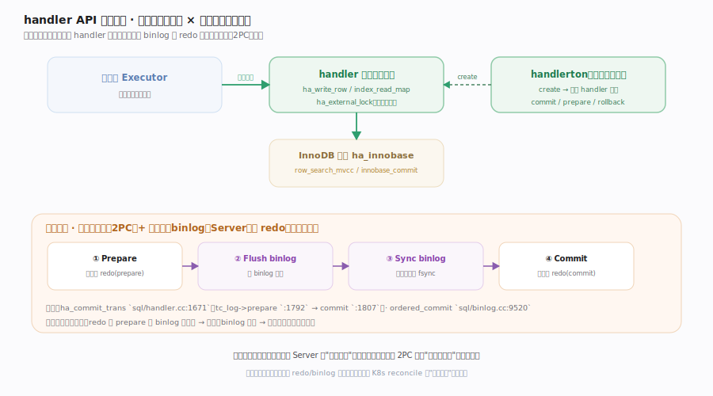
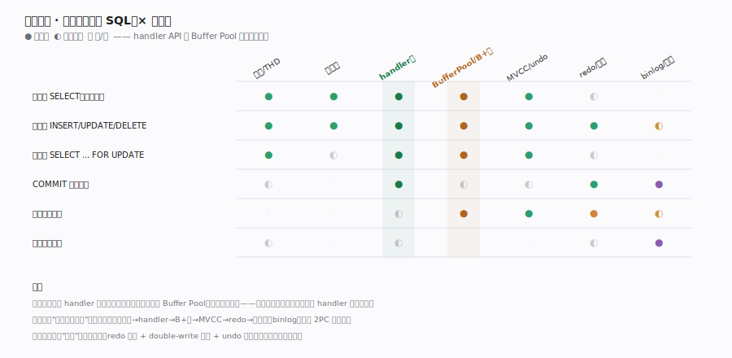

# MySQL 核心原理 · 全景主线框架

> **定位**：家族 0（关系数据库）范例。全库总纲——用"两层架构 × 可插拔引擎 × 执行时机"把 MySQL 拆成可导航的主线，并点出灵魂：**SQL 层与存储引擎经 handler API 解耦，一条 SQL 的旅程穿过这条缝落到 InnoDB 的 B+树与事务日志**。核实基准（MySQL `5.7.44`，本地全量克隆按 `grep -n` 逐处核实行号）：`sql/sql_parse.cc`、`sql/sql_optimizer.cc`、`sql/sql_executor.cc`、`sql/handler.h`、`storage/innobase/`。

## 一、两层架构：Server 层 × 存储引擎层

MySQL 最核心的结构是**两层**：上层 **Server 层**（连接、解析、优化、执行、binlog）对所有存储引擎通用；下层**存储引擎层**（InnoDB / MyISAM / Memory…）负责数据的实际存取。两层之间的唯一缝隙就是 **handler API**（`sql/handler.h:2157`）——这是 MySQL 区别于绝大多数数据库的**定义性设计**。Server 层不知道数据是 B+树还是堆表，只调用 `ha_write_row`、`index_read_map`、`ha_external_lock` 这些虚函数，每个引擎在自己的 `.cc` 里实现。**能力域**是内部公共机制：连接/线程模型、查询优化器、handler API（灵魂）、Buffer Pool + B+树、事务与 MVCC、redo 与崩溃恢复、binlog 与复制。**正交性检验**：任取一个核心概念都能唯一归位——`ReadView` 归 MVCC、`LSN` 归 redo、`handlerton` 归 handler API、`best_access_path` 归优化器、`THD` 归连接模型。

## 二、总架构：分层脊

**Server 层**：客户端连接绑定一个 `THD` 会话对象，命令主循环 `do_command` 逐条取 SQL 交 `dispatch_command`；解析器建语法树，优化器 `JOIN::optimize` 基于代价选计划，执行器 `JOIN::exec` 以火山模型逐行迭代；每一行的读写都经 handler 缝下到引擎。**存储引擎层（InnoDB）**：`row_search_mvcc` 从 B+树经 Buffer Pool 取行，改动先写 redo。**关键约束**：SQL 层与引擎**只经 handler 虚函数交互**，这是 MySQL 可插拔、引擎可热替换的根基。各符号的精确 `file:line` 见对应能力域分篇的深化表。

## 三、贯穿主线：handler API 缝（灵魂）

**一切表操作都经同一条缝**：Server 层拿到执行计划后，对每张表持有一个 `handler` 实例（由 `handlerton` 的 `create` 函数指针产出）。执行器要读一行就调 `ha_index_read_map` / `ha_rnd_next`，要写一行就调 `ha_write_row`，事务边界靠 `ha_external_lock` 通知引擎。提交时更关键：Server 层的 binlog 与引擎的 redo 是**两份独立日志**必须一致——`ha_commit_trans` 先 prepare 再 commit 做**两阶段提交（2PC）**，`ordered_commit` 用组提交把多事务的 fsync 合并。这条缝横切所有能力域，是"引擎无关"与"事务一致"两个目标的交汇点，也是本库的灵魂。各 2PC 函数落点见 handler 篇深化表。

## 四、依赖矩阵：接触面 × 能力域

矩阵显示"一条 SQL"这条接触面强依赖哪些能力域：任何语句都必过**连接/线程模型**（THD 会话）→ **优化器**选计划 → 经 **handler API** 缝 → 落 **Buffer Pool + B+树**；写事务还牵动 **MVCC/undo**（可见性 + 回滚）、**redo**（持久化 + 恢复）、**binlog**（复制）。可见 **handler API + Buffer Pool** 是被依赖度最高的两格——handler 缝塌了引擎接不上，Buffer Pool 塌了每次读写都打磁盘。这也解释了为何本库把 handler 缝定为灵魂。

## 深化 · 三维覆盖自检

| 维度 | MySQL 落点 | 代表主线 |
|---|---|---|
| 接触面 | 一条 SQL 语句（连接→解析→优化→执行→引擎→返回） | 接口_SQL执行生命周期 |
| 能力域·会话 | THD 会话对象 + 连接处理器 | 支撑_连接与线程模型 |
| 能力域·计划 | 基于代价的查询优化器 | 支撑_查询优化器 |
| 能力域·可插拔缝（灵魂） | handler / handlerton 虚函数集 | 支撑_handler存储引擎API |
| 能力域·存取 | Buffer Pool + B+树聚簇索引 | 支撑_InnoDB_BufferPool与B树 |
| 能力域·隔离 | undo + ReadView + 行锁 MVCC | 支撑_InnoDB事务与MVCC |
| 执行时机·持久 | redo WAL + double-write + 崩溃恢复 | 支撑_redo日志与崩溃恢复 |
| 执行时机·复制 | binlog + 2PC 组提交 + master→slave | 支撑_binlog与复制 |

## 拓展 · 与其它家族的同构对照

| 对照系（MySQL 第一列） | MySQL | 相似家族 | 关键差异 |
|---|---|---|---|
| 可插拔存储缝 | handler API 虚函数集 | 家族 3 K8s CRI/CSI 接口 | MySQL 把"存储引擎"整体抽象成一层虚函数 |
| 预写日志 WAL | redo log 先写后刷页 | 家族 6 etcd/Raft WAL | InnoDB 另有 double-write 防撕页 |
| 多版本并发 | undo + ReadView 快照读 | 家族 6 MVCC 存储 | InnoDB 版本链挂在聚簇索引行内 |
| 逻辑复制日志 | binlog row/statement | 家族 4 HDFS edits log | MySQL 双日志 + 2PC 对账是其特色负担 |

## 调优要点

- `innodb_buffer_pool_size` 是头号参数：命中率决定是否频繁打磁盘，通常设为可用内存的 50%~75%。
- `innodb_flush_log_at_trx_commit` 与 `sync_binlog` 决定 D 持久性档位：=1 每事务 fsync 最安全但最慢，组提交能缓解吞吐损失。
- 主键设计影响聚簇索引：随机主键（如 UUID）导致页分裂与写放大，自增主键顺序插入更友好。
- 长事务拖住 purge：旧版本无法回收 → undo 膨胀、history list 变长，监控并避免大事务久悬。

## 常见误区

- **优化器一定选最优计划**：它基于统计信息估代价，统计过期或估算偏差会选错索引，需 `ANALYZE TABLE` / 索引提示纠偏。
- **SQL 层直接读写磁盘文件**：Server 层只调 handler 虚函数，磁盘存取全在引擎内部（InnoDB 的 Buffer Pool + B+树）。
- **redo 就是 binlog / 二者可去其一**：redo 是引擎物理日志（崩溃恢复），binlog 是 Server 逻辑日志（复制），职责不同，靠 2PC 保持一致。
- **MVCC 快照读也加锁**：普通 SELECT 走 ReadView 快照读、不加行锁；只有当前读（`SELECT...FOR UPDATE`、UPDATE/DELETE）才加锁。

## 一句话总纲

**MySQL 是一台"两层解耦的关系数据库机器"：Server 层把 SQL 解析/优化/执行成计划，再经 handler API 这条可插拔缝把每一行读写下派给存储引擎——默认的 InnoDB 用 B+树聚簇索引 + Buffer Pool 提供高效存取，用 undo+ReadView 做 MVCC 隔离、redo WAL + double-write 做崩溃安全的持久化，并靠 binlog 与 redo 的两阶段组提交兑现复制与一致性；这条 handler 缝就是贯穿全库、连接"引擎无关"与"事务一致"的灵魂。**
