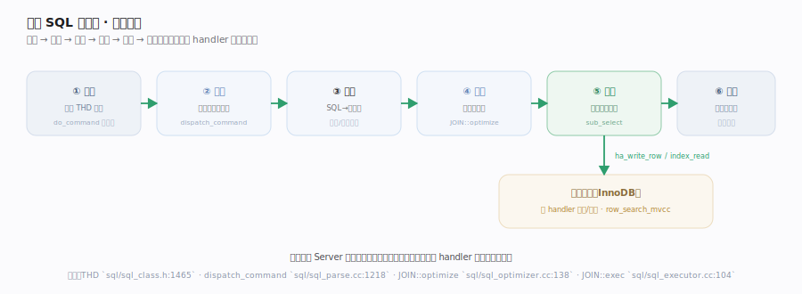
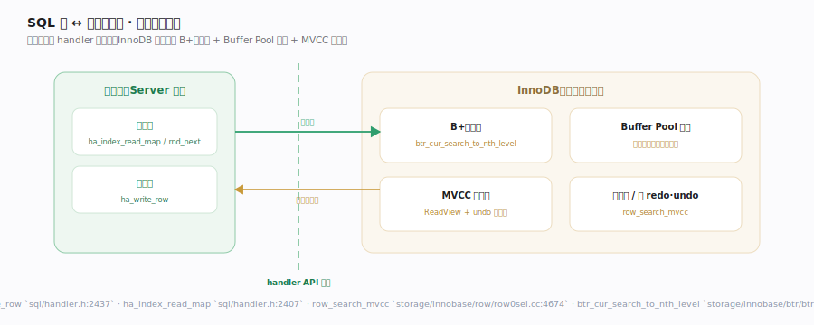

# MySQL 核心原理 · 接触面 · SQL 执行生命周期

> **定位**：MySQL 唯一的用户接触面——一条 SQL 语句的完整旅程。用户不关心 B+树或 Buffer Pool，只发一条 SQL、等一个结果集；系统负责把它变成对存储引擎的行级读写。核实基准：`sql/sql_parse.cc`、`sql/sql_optimizer.cc`、`sql/sql_executor.cc`、`sql/handler.h`。

## 一、一条 SQL 的旅程

一条 `SELECT` / `UPDATE` 进入服务器后依次穿过六站：**① 连接**——客户端连上、绑定一个 `THD` 会话对象，命令主循环 `do_command` 从网络读出一条命令。**② 派发**——`dispatch_command` 按命令类型分流，`COM_QUERY`（普通 SQL）交给查询路径 `mysql_parse`。**③ 解析**——词法 + 语法分析把 SQL 文本变成内部语法树（`SELECT_LEX` 等），并做名称解析与权限检查。**④ 优化**——`JOIN::optimize` 基于代价选索引、定连接顺序，生成执行计划。**⑤ 执行**——`JOIN::exec` 以火山（迭代器）模型驱动：对每张表做嵌套循环，每取到一个组合就求值连接条件与 `WHERE`、命中则把行送往下一层或结果集，逐行"拉取"直到取完。**⑥ 返回**——结果集经网络协议逐行回送客户端。整条链路里只有第 ⑤ 站真正接触数据，其余都是把"文本"逐步精炼成"取数计划"。各站函数落点见下方六站表。

## 二、SQL 层与引擎层的交接

执行器不直接碰磁盘：它对每张参与表持有一个 `handler` 实例，读一行调 `ha_index_read_map` / `ha_rnd_next`、写一行调 `ha_write_row`，这一步就跨过了 Server 层与存储引擎层的边界——InnoDB 在 `row_search_mvcc` 里从 B+树取行、按 MVCC 判可见性（不可见就沿版本链回溯 undo）再返回执行器。**读写路径对称**：读走"handler→B+树→Buffer Pool 取页"，写走"handler→改页→写 redo/undo→（提交）2PC"。这条缝的**引擎无关性**是关键：执行器面对的永远是同一组 `handler` 虚函数签名，把表换成 MyISAM 也只是换实现体，火山循环一行不改——这正是"SQL 不变、引擎可换"的技术根基。执行器与引擎之间按行（而非按页/块）交换数据，故每多返回一列、多扫一行都被逐行放大，这是"减少返回列与行"能直接提速的原因。各接口函数落点见六站表。

## 深化 · 六站职责与落点

| 站 | 职责 | 落点 |
|---|---|---|
| 连接 | 建立会话、认证、读命令 | `THD` `sql/sql_class.h:1465` · `do_command` `sql/sql_parse.cc:901` |
| 派发 | 按命令类型分流 | `dispatch_command` `sql/sql_parse.cc:1218` |
| 解析 | SQL 文本→语法树、名称/权限 | 词法语法分析 + 预处理 |
| 优化 | 代价模型选计划 | `JOIN::optimize` `sql/sql_optimizer.cc:138` |
| 执行 | 火山迭代逐行 | `JOIN::exec` `:104` · `sub_select` `:1224` · `evaluate_join_record` `:1484` |
| 存取 | 经 handler 读写引擎 | `ha_write_row` `handler.h:2437` · `ha_index_read_map` `:2407` · `row_search_mvcc` `row0sel.cc:4674` |

## 拓展 · 为什么"一条 SQL"是唯一接触面

| 命令式接口（想象） | MySQL 的声明式 SQL |
|---|---|
| "打开表、定位第 5 页、读第 3 行" | "SELECT ... WHERE ..." 只描述想要什么 |
| 用户须懂物理存储 | 优化器决定怎么取，用户无感 |
| 换引擎要改应用 | 换引擎（InnoDB↔MyISAM）SQL 不变 |

## 深化 · 火山模型：为什么执行是"逐行拉取"

MySQL 5.7 的执行器是经典**火山（Volcano/迭代器）模型**：整个计划被组织成一串嵌套算子，最外层反复向内层"要下一行"，数据像水流一样被逐行拉上来而非一次性物化。`sub_select` 就是这台"泵"——对当前表用 handler 取一行、交 `evaluate_join_record` 判连接与 `WHERE`，通过则递归驱动下一张表，直到最内层产出一个完整连接行。这种模型内存占用小（流水线、无需缓存全部中间结果），但每行都要穿过整条算子链带来函数调用开销——这也是 8.0 引入 batched/iterator executor、列存引擎改用向量化执行的动因，也解释了为何"少返回一列、少扫一行"都能线性省掉一整趟逐行开销。

## 调优要点

- 慢查询先看执行计划：`EXPLAIN` 看优化器选了哪个索引、扫多少行，定位是否走错索引或全表扫。
- 减少返回列与行：`SELECT *` 触发回表且传输浪费；只取需要的列，能用覆盖索引最好。
- 连接开销：短连接频繁建/断代价高，用连接池复用 THD。
- 大结果集分页：深分页 `LIMIT 100000,20` 会扫弃大量行，改用键集分页（WHERE id > ?）。

## 常见误区

- **SQL 越短越快**：快慢取决于执行计划与扫描行数，与文本长度无关。
- **加了索引就一定走索引**：优化器按代价估算，选择性差或统计过期时可能弃用索引。
- **执行器自己读磁盘**：执行器只调 handler 虚函数，磁盘存取在引擎内部。

## 一句话总纲

**用户与 MySQL 的唯一接触面是一条声明式 SQL：它穿过连接→派发→解析→优化→执行五站，在执行阶段经 handler API 缝把逐行读写下派给存储引擎——用户只描述"要什么"，优化器与引擎决定"怎么取"，这正是关系数据库把物理存储对应用透明化的根本。**
