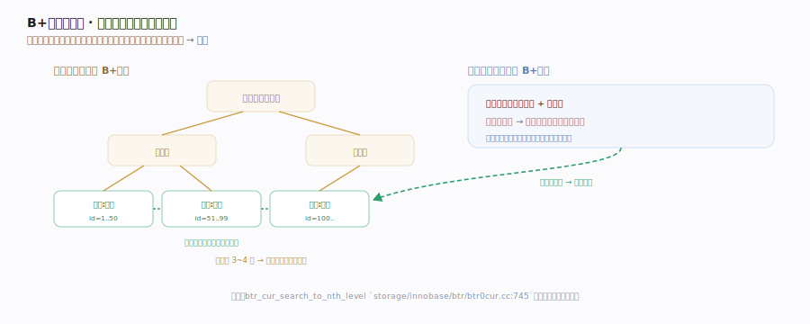
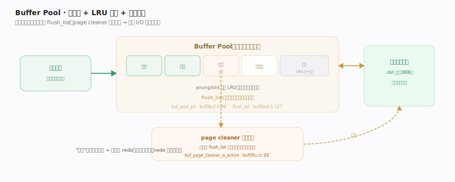

# MySQL 核心原理 · 支撑能力域 · Buffer Pool 与 B+树

> **定位**：InnoDB 的存储底盘。数据以 B+树聚簇索引组织在磁盘的 16KB 页里，Buffer Pool 把热页缓存在内存——这两者决定了 InnoDB 的读写性能上限。核实基准：`storage/innobase/include/buf0buf.h`、`storage/innobase/buf/`、`storage/innobase/btr/btr0cur.cc`。

## 一、B+树聚簇索引：主键即数据

InnoDB 每张表就是一棵以主键排序的 **B+树聚簇索引**：非叶结点存索引键 + 子页指针，**叶子直接存整行数据**（这就是"聚簇"——数据与主键索引存在一起）。查一行从根页逐层下探到叶子定位记录（每下探一层先经 Buffer Pool 取子页），范围扫描沿叶子层双向链表顺序遍历。插入使某页装不下时发生**页分裂**——随机主键（UUID）频繁分裂造成写放大与碎片，自增主键总在最右页追加几乎不分裂。**二级索引**是另一棵 B+树、叶子只存"索引列 + 主键值"，查非索引列需拿主键**回表**到聚簇索引取整行。B+树矮而宽，几百万行通常树高仅 3~4 层，定位一行只需极少次页访问。各下探/取页/分裂函数落点见深化表。

## 二、Buffer Pool：页缓存与刷脏

磁盘 I/O 以**页（16KB）**为单位，Buffer Pool 是内存里缓存这些页的大池子。读写都先落 Buffer Pool：命中则纯内存操作，未命中才从磁盘读页入池（入池前需取一块空闲帧，空闲链空了就从 LRU 尾淘汰或逼迫刷脏腾位）。**LRU 冷热淘汰**用改良版（young/old 分区，默认 old 区约 3/8）防全表扫把热页冲走：新页先插 old 区头部，被再次访问且停留超阈值才提升到 young 区。**脏页**（改过未落盘）挂在 flush_list 上，由 **page cleaner 后台线程**异步刷盘——事务提交不必等页落盘（有 redo 保证持久），磁盘 I/O 与事务解耦。这是"写快"的关键：改内存 + 顺序写 redo，脏页慢慢刷。各结构与刷脏函数落点见深化表。

## 深化 · 关键结构与落点

| 结构 | 作用 | 落点 |
|---|---|---|
| Buffer Pool | 内存页缓存池 | `buf_pool_ptr` `buf0buf.h:99` |
| 页获取入口 | 命中/未命中统一路径 | `buf_page_get_gen` `buf0buf.cc:4023` |
| 取空闲帧 | 入池前腾块 | `buf_LRU_get_free_block` `buf0lru.cc:1315` |
| young/old 比例 | 防扫表冲走热页 | `buf_LRU_old_ratio_update` `buf0lru.cc:2527` |
| 提升 young | 二次访问才转热 | `buf_page_make_young` `buf0buf.cc:3524` |
| flush_list | 脏页链表 | `flush_list` `buf0buf.h:127` |
| page cleaner | 异步刷脏线程 | `buf_page_cleaner_is_active` `buf0flu.cc:84` |
| 单页刷盘 | 落盘一个脏页 | `buf_flush_page` `buf0flu.cc:1143` |
| B+树游标下探 | 逐层定位记录 | `btr_cur_search_to_nth_level` `btr0cur.cc:745` |
| 页分裂 | 满页一分为二 | `btr_page_split_and_insert` `btr0btr.cc:2514` |

## 拓展 · 聚簇索引 vs 二级索引

| 聚簇索引（主键） | 二级索引 |
|---|---|
| 叶子存整行数据 | 叶子存索引列 + 主键 |
| 一表一棵 | 可多棵 |
| 主键查一次到位 | 查非索引列需回表 |

## 调优要点

- `innodb_buffer_pool_size` 是头号参数：通常设为可用内存 50%~75%，命中率越高磁盘 I/O 越少。
- 自增主键顺序插入友好：随机主键（UUID）致页分裂 + 写放大，聚簇索引碎片化。
- 覆盖索引免回表：查询列都在二级索引里则不必回聚簇索引取行。
- `innodb_io_capacity` 调 page cleaner 刷脏速率，匹配磁盘能力，避免脏页堆积或过度刷盘。

## 常见误区

- **Buffer Pool 只缓存数据**：它也缓存索引页、undo 页、自适应哈希等，是 InnoDB 的中央内存区。
- **提交就把数据页写盘**：提交只保证 redo 落盘；数据脏页由 page cleaner 异步刷，靠 redo 兜底持久。
- **B+树越深越慢无所谓**：树高每加一层多一次页访问，海量表用合适主键控制树高很重要。
- **二级索引查询不回表**：只有覆盖索引不回表，否则要拿主键回聚簇索引取整行。

## 一句话总纲

**InnoDB 把每张表组织成以主键排序的 B+树聚簇索引（叶子直接存整行，查询逐层下探矮树），并用 Buffer Pool 把热页缓存在内存——读写先落内存、脏页由 page cleaner 异步刷盘、LRU 冷热淘汰。这套"B+树定位 + 页缓存"是 InnoDB 存取性能的底盘，也让磁盘 I/O 与事务提交解耦，为高吞吐写入铺路。**
