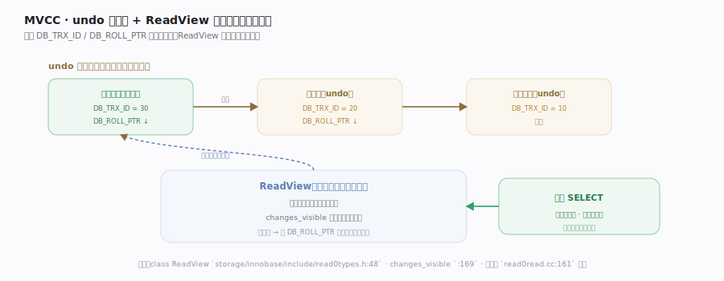
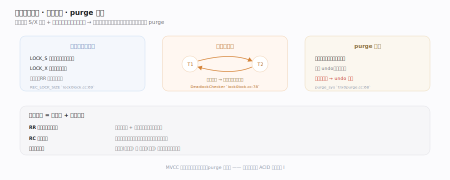

# MySQL 核心原理 · 支撑能力域 · InnoDB 事务与 MVCC

> **定位**：InnoDB 兑现"隔离性"（ACID 的 I）的机制。多版本并发控制（MVCC）让读不加锁、写不阻读；行锁 + 死锁检测处理"当前读"的冲突；purge 线程回收再无人可见的旧版本。核实基准：`storage/innobase/include/read0types.h`、`storage/innobase/read/read0read.cc`、`storage/innobase/lock/lock0lock.cc`、`storage/innobase/trx/trx0purge.cc`。

## 一、MVCC：undo 版本链 + ReadView 快照读

InnoDB 每行都藏两个隐藏列：`DB_TRX_ID`（最后修改它的事务 ID）与 `DB_ROLL_PTR`（指向 undo 里的上一个版本）。每次更新旧值被拷进 **undo log**、新行 `DB_ROLL_PTR` 指向它，形成一条**版本链**。**快照读**时事务取得一个 **ReadView**——记录"创建快照那一刻哪些事务还活跃"（活跃事务最小/最大 ID 与列表）；读某行时判断该版本的 `DB_TRX_ID` 对本事务是否可见，不可见就沿 `DB_ROLL_PTR` 回溯 undo、逐个重建更旧版本直到找到可见的那个。于是**普通 SELECT 完全不加锁**也能读到一致快照——读写并发、互不阻塞，这是 InnoDB 高并发的核心。RR 隔离级别下 ReadView 在首次快照读创建并复用到事务结束（可重复读），RC 下每条语句都重开新 ReadView（读已提交）。各可见性/回溯函数落点见深化表。

## 二、行锁、死锁检测与 purge

**当前读**（`UPDATE`/`DELETE`/`SELECT...FOR UPDATE`）要读最新版本并锁住，走行锁：共享锁 `LOCK_S`、排他锁 `LOCK_X`，锁对象本身是紧凑的位图结构 `ib_lock_t`；可重复读隔离级别下还加**间隙锁**防幻读。多事务互相等锁可能成环——**死锁检测器**在加锁进入等待时检查等待图是否有环，有则回滚代价最小（持锁/改动最少）的事务打破僵局（可关闭开关，关闭时退化为靠 `lock_wait_timeout` 超时）。**purge**：版本链的旧版本不能立刻删（可能还有老快照要读），后台 purge 线程等到"再无任何 ReadView 能看到某旧版本"时才真正清理 undo、回收空间。长事务会拖住 purge（老快照一直存在），导致 undo 膨胀、history list 变长。各加锁/检测/回收函数落点见深化表。

## 深化 · 关键机制与落点

| 机制 | 作用 | 落点 |
|---|---|---|
| 开快照 | 建 ReadView | `MVCC::view_open` `read0read.cc:554` |
| ReadView | 快照可见性判断 | `class ReadView` `read0types.h:48` · `changes_visible` `:169` |
| 版本重建 | 沿链回溯旧版本 | `row_vers_build_for_consistent_read` `row0vers.cc:1113` |
| undo 版本链 | 存旧版本供回溯/回滚 | `read0read.cc:161` 注释 |
| 行锁获取 | 当前读加 S/X | `lock_rec_lock` `lock0lock.cc:2033` |
| 锁对象 | 紧凑位图锁结构 | `ib_lock_t` / `REC_LOCK_SIZE` `lock0lock.cc:69` |
| 死锁检测 | 等待图找环回滚 | `DeadlockChecker::check_and_resolve` `lock0lock.cc:7607` |
| 死锁开关 | 关则退化超时 | `innobase_deadlock_detect` `lock0lock.cc:63` |
| purge 执行 | 回收旧版本 | `trx_purge` `trx0purge.cc:1826` · `purge_sys` `:68` |

## 拓展 · 快照读 vs 当前读

| 快照读（普通 SELECT） | 当前读（FOR UPDATE / 写） |
|---|---|
| 走 ReadView + undo | 读最新版本 |
| 不加锁 | 加行锁（S/X）+ 间隙锁 |
| 读写不互阻 | 可能等锁、可能死锁 |

## 调优要点

- 隔离级别选择：RR（默认）用间隙锁防幻读但锁范围大；RC 锁更少、并发更好但有幻读。
- 避免长事务：拖住 purge → undo 膨胀、history list 变长，性能与空间双输。
- 死锁重试：应用层要捕获死锁错误并重试事务；按固定顺序访问行降低死锁概率。
- 索引减小锁范围：当前读走索引只锁命中行/间隙，无索引会退化成锁大量行。

## 常见误区

- **MVCC 靠加锁实现**：快照读靠 ReadView + undo，不加锁；加锁的是当前读。
- **RR 下所有读都可重复**：只保证快照读可重复；当前读读的是最新数据。
- **提交后 undo 立即删**：purge 要等所有可能看到该版本的快照消失才清，长事务会延迟回收。
- **死锁是 bug**：并发系统中死锁正常，InnoDB 会检测并回滚一方，应用重试即可。

## 一句话总纲

**InnoDB 用 MVCC 兑现隔离性：每行经 undo log 串起版本链，事务用 ReadView 快照按可见性沿链回溯——普通 SELECT 读一致快照且完全不加锁，读写并发互不阻塞；当前读则走行锁 + 间隙锁并由死锁检测器破环，旧版本由 purge 线程在再无快照可见后回收。这套"快照读 + 锁"组合是 InnoDB 高并发与正确隔离的核心。**
