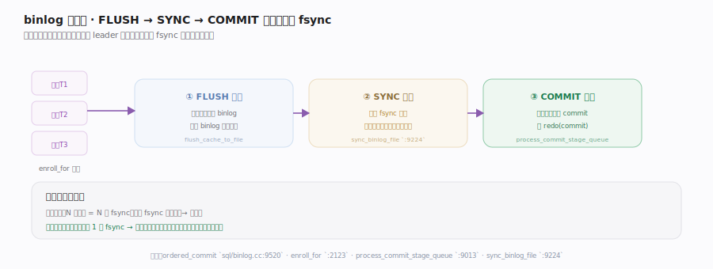
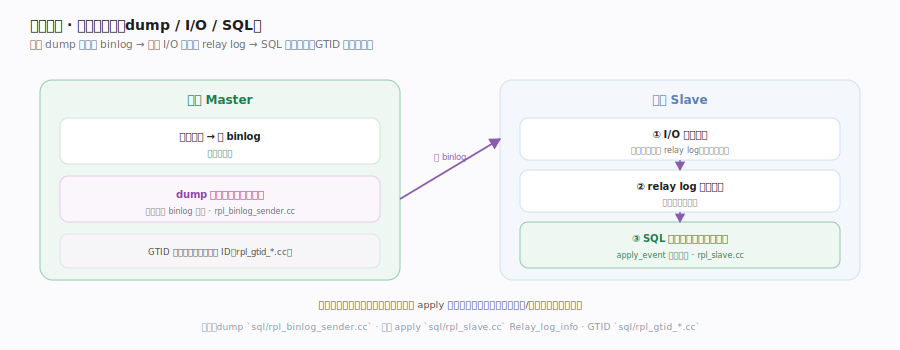

# MySQL 核心原理 · 支撑能力域 · binlog 与复制

> **定位**：MySQL 高可用与横向扩展的基础。binlog 是 Server 层的逻辑变更日志（引擎无关），既用于时点恢复，也是主从复制的数据源；它与引擎 redo 靠两阶段提交保持一致，并用组提交提升吞吐。核实基准：`sql/binlog.cc`、`sql/rpl_slave.cc`、`sql/rpl_binlog_sender.cc`。

## 一、binlog 与组提交

**binlog** 是 Server 层、引擎无关的逻辑变更日志，也是 2PC 的协调者。核心痛点是「每事务一次 fsync」太慢，**组提交**把并发事务排进 **FLUSH → SYNC → COMMIT** 三阶段流水线（见图）：每阶段队首线程作 leader 批量处理整队，**整批只做一次 fsync**——fsync 成本摊薄给一批事务，吞吐大增。同时保证 binlog 写入顺序 = 引擎提交顺序（基于位点的复制依赖此不变量）。各阶段函数落点见下方深化表。

## 二、主从复制：三线程模型

复制把主库 binlog 搬到从库重放，靠**三个线程**接力（见图）：主库 **dump 线程**按从库请求的位点流式推 binlog 事件；从库 **I/O 线程**收下原样写入本地 **relay log**；从库 **SQL 线程**读 relay log 逐个重放到数据并原子推进复制位点。**GTID** 给每个事务打全局唯一标识、并入 `gtid_executed` 已执行集，让「从哪继续复制」与故障切换可靠——不再依赖脆弱的文件名 + 偏移量。5.7 起支持多线程从库并行 apply。各线程主循环函数见深化表。

## 深化 · 关键机制与落点

| 机制 | 作用 | 落点 |
|---|---|---|
| binlog 提交协调 | 2PC 中的协调者 | `ordered_commit` `sql/binlog.cc:9520` · `binlog_prepare` `:1818` |
| 组提交入队 | 事务排入三阶段 | `enroll_for` `binlog.cc:2123` · `change_stage` `:9160` |
| FLUSH 阶段 | 批量写 binlog 文件 | `process_flush_stage_queue` `binlog.cc:8943` |
| SYNC 阶段 | 整批一次 fsync | `sync_binlog_file` `binlog.cc:9224` |
| COMMIT 阶段 | 批量通知引擎提交 | `process_commit_stage_queue` `binlog.cc:9013` |
| dump 线程 | 主库推 binlog | `Binlog_sender::run` `rpl_binlog_sender.cc:326` |
| I/O 线程 | 从库收事件写 relay | `handle_slave_io` `rpl_slave.cc:5606` |
| SQL 线程重放 | 读 relay + apply | `apply_event_and_update_pos` `rpl_slave.cc:4726` |
| GTID 更新 | 提交并入已执行集 | `Gtid_state::update_on_commit` `rpl_gtid_state.cc:204` |

## 拓展 · redo vs binlog

| redo（引擎层） | binlog（Server 层） |
|---|---|
| 物理页改动、循环写 | 逻辑事件、追加写 |
| 崩溃恢复 | 复制 + 时点恢复 |
| InnoDB 私有 | 引擎无关、所有引擎共用 |

## 调优要点

- `sync_binlog=1` + `innodb_flush_log_at_trx_commit=1` 是最安全组合，组提交摊薄 fsync 成本。
- binlog 格式选 ROW：statement 格式对非确定函数（NOW/UUID）复制不安全，ROW 记实际行变更更可靠。
- 主从延迟：单线程 SQL 重放是瓶颈，开多线程复制（`slave_parallel_workers`）并行 apply。
- 用 GTID 简化运维：故障切换、跳过错误事务比文件名+偏移更清晰可靠。

## 常见误区

- **复制靠 redo**：复制用的是 binlog（Server 层逻辑日志），redo 是引擎私有、不出引擎。
- **从库和主库强一致**：默认异步复制，从库有延迟；要更强需半同步/组复制。
- **binlog 可关掉不影响**：关了不能复制、不能做时点恢复；主库通常必开。
- **statement 格式总是对的**：非确定语句在从库可能算出不同结果，ROW 格式更安全。

## 一句话总纲

**binlog 是 Server 层引擎无关的逻辑变更日志：它既是 2PC 里协调 redo 一致的协调者，又用组提交（FLUSH/SYNC/COMMIT 三阶段）把多事务的 fsync 合并以提吞吐；主从复制则靠主库 dump 线程推 binlog、从库 I/O 线程落 relay log、SQL 线程重放，配合 GTID 让复制与故障切换可靠——这条日志把单机 ACID 扩展成集群级的高可用与读扩展。**
