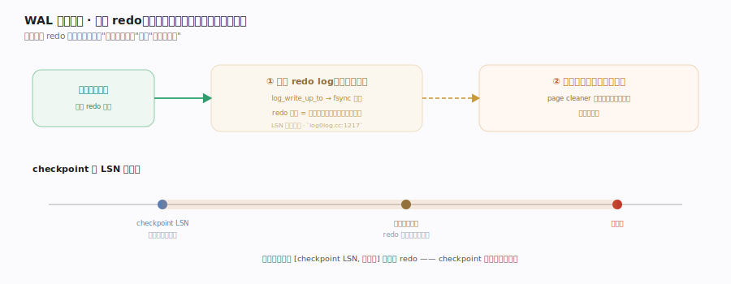
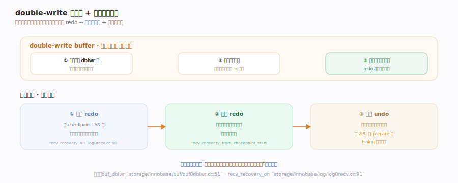

# MySQL 核心原理 · 支撑能力域 · redo 日志与崩溃恢复

> **定位**：InnoDB 兑现"持久性"（ACID 的 D）与崩溃安全的机制。WAL（预写日志）让提交只需顺序写 redo 而非随机刷数据页；double-write 防页部分写断裂；崩溃后靠 redo 重放 + undo 回滚重建一致态。核实基准：`storage/innobase/log/log0log.cc`、`storage/innobase/log/log0recv.cc`、`storage/innobase/buf/buf0dblwr.cc`。

## 一、WAL：先写日志，后刷数据页

InnoDB 的持久化基石是 **WAL（Write-Ahead Logging，预写日志）**：修改一个数据页时，先把"这个改动"作为 redo 记录顺序追加进 **redo log**（快），再改内存里的数据页（脏页，慢慢刷）。所有对页的修改都封装在 **mini-transaction（mtr）**里，mtr 提交时把本组改动的 redo 原子地追加到全局 log buffer 并推进 **LSN（日志序列号）**。事务提交时只要 redo 落盘就算持久——哪怕数据脏页还在内存、进程随后崩溃，重启也能凭 redo 把改动重放出来。这就把"随机写数据页"换成了"顺序写日志"，是 InnoDB 写性能与持久性兼得的关键。**checkpoint** 定期推进"已确保刷盘的 LSN"，界定崩溃恢复的起点（该 LSN 之前的改动已在数据文件里，无需重放）。各 mtr/写盘/checkpoint 函数落点见深化表。

## 二、double-write 与崩溃恢复三步

**double-write buffer** 解决"页部分写（撕页）"：InnoDB 页 16KB 而磁盘扇区更小，刷脏页时若断电可能只写了半页——数据页损坏且 redo 也无法修复（redo 是增量、需要完整基准页）。对策：page cleaner 刷脏时先把整页顺序写到一块连续的 double-write 区（批量落盘），再写到真实位置；崩溃后若发现某页损坏，用 double-write 里的完整副本还原。**崩溃恢复三步**：① **扫描 redo**——从最近 checkpoint 的 LSN 起扫描、把日志记录按 (space, page_no) 归入哈希表；② **重放 redo**——把已提交但未刷盘的改动应用回数据页；③ **回滚 undo**——对崩溃时未提交的事务用 undo 反向撤销。结合 handler 篇的 2PC：redo 有 prepare 但 binlog 无记录的事务也在此回滚。各 double-write/恢复函数落点见深化表。

## 深化 · 关键机制与落点

| 机制 | 作用 | 落点 |
|---|---|---|
| mtr 提交 | 组改动追加 redo + 推 LSN | `mtr_t::commit` `mtr0mtr.cc:477` |
| redo 写盘 | WAL 顺序落日志 | `log_write_up_to` `log0log.cc:1217` |
| checkpoint | 界定恢复起点 | `log_checkpoint` `log0log.cc:1780` |
| double-write 收集 | 整页写连续区 | `buf_dblwr_add_to_batch` `buf0dblwr.cc:1096` |
| double-write 落盘 | 批量刷 dblwr 区 | `buf_dblwr_flush_buffered_writes` `buf0dblwr.cc:946` |
| 恢复扫描 | 从 checkpoint 建哈希表 | `recv_recovery_from_checkpoint_start` `log0recv.cc:4040` |
| 恢复重放 | 应用 redo 到数据页 | `recv_apply_hashed_log_recs` `log0recv.cc:2625` |
| 恢复标志 | 恢复进行中 | `recv_recovery_on` `log0recv.cc:91` |

## 拓展 · redo vs undo

| redo（重做日志） | undo（回滚日志） |
|---|---|
| 记"改成什么"（物理） | 记"原来是什么"（逻辑/旧值） |
| 崩溃后重放已提交 | 回滚未提交 + MVCC 旧版本 |
| WAL 顺序写 | 挂在版本链上 |

## 调优要点

- `innodb_flush_log_at_trx_commit`：=1 每次提交 fsync redo（最安全，默认）；=2 只写 OS 缓存；=0 每秒刷（最快但可能丢 1 秒）。
- redo 大小（`innodb_log_file_size` × 文件数）影响 checkpoint 频率：太小频繁 checkpoint、刷脏抖动；太大恢复时间长。
- double-write 有写放大（每页写两次）：极快且带掉电保护的硬件可评估关闭，一般保持开启。
- 恢复慢多因 redo 太大或脏页太多：监控 checkpoint age，避免长时间不刷盘。

## 常见误区

- **提交就把数据页写盘**：提交只保证 redo 落盘（D 由 WAL 兜底），数据脏页异步刷。
- **redo 能修复撕页**：redo 是增量，需完整基准页；撕页要靠 double-write 的完整副本还原。
- **崩溃会丢已提交事务**：只要 redo（据 flush 设置）已落盘，重放即可恢复，不丢。
- **undo 只为回滚**：undo 同时支撑 MVCC 快照读的旧版本回溯（见事务与 MVCC 篇）。

## 一句话总纲

**InnoDB 用 WAL 兑现持久性：改动先顺序写 redo（提交即持久，数据脏页异步刷），把随机写换成顺序写；double-write 保完整页副本防撕页；崩溃后从 checkpoint LSN 起扫描并重放 redo 补齐已提交改动、再用 undo 回滚未提交事务，把系统拉回一致态。这套"日志先行 + 恢复三步"是 InnoDB 崩溃安全与高写吞吐兼得的根本。**
