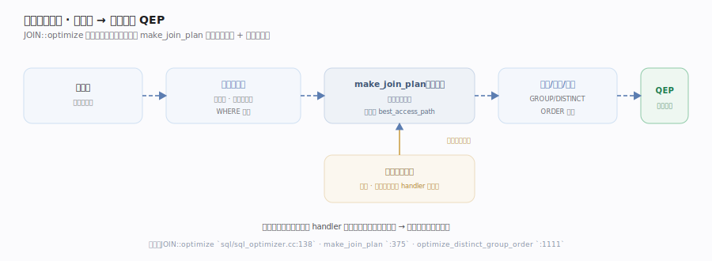
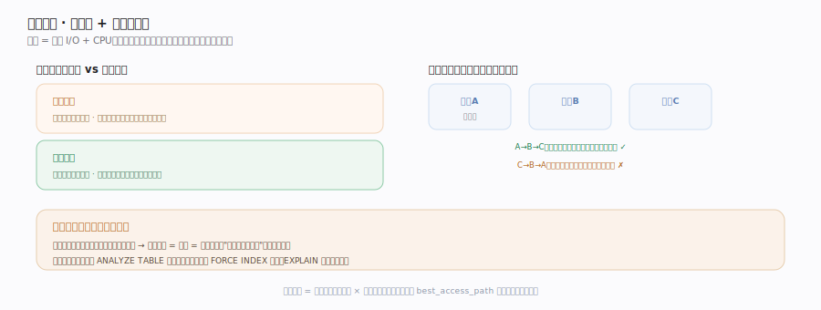
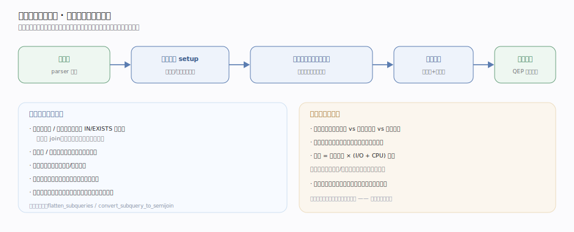

# MySQL 核心原理 · 支撑能力域 · 查询优化器

> **定位**：把"想要什么"翻译成"怎么取"的大脑。同一条 SQL 可能有成千上万种执行方式（用哪个索引、多表以什么顺序连接），优化器基于**代价模型**从中选一条估算最省的执行计划。核实基准：`sql/sql_optimizer.cc`。

## 一、优化流程：从语法树到执行计划

解析器交来语法树后，`JOIN::optimize` 作为总入口按固定次序驱动一长串变换：**常量表检测**（只含一行或按主键/唯一键等值定位的表提前读出、折叠进 `WHERE`）、**外连接化简**（`WHERE` 含内表列非空约束时 `LEFT JOIN` 退化为 `INNER JOIN`，扩大可枚举顺序）、**等值传播与常量折叠**（`a=b AND b=5` 推出 `a=5`），随后进入核心的连接计划阶段，最后决定 `GROUP BY`/`DISTINCT`/`ORDER BY` 是借索引有序性免排序还是走 filesort。各步骤函数落点见深化表。

`make_join_plan` 把"定连接顺序 + 为每表选访问路径"的搜索委托给 `Optimize_table_order`：表多时走**贪心 + 有限深度前瞻**——每步把尚未加入的每张表试接到当前前缀后，用 `best_access_path` 估出"用哪个索引、扫多少行、代价多少"，保留代价最低的若干扩展继续深入，从而在指数级的连接顺序空间里找到近优解；搜索定稿后把抽象计划物化成一串可执行的 `JOIN_TAB`。这一整段是**引擎无关**的：优化器只通过 handler 向引擎索要统计信息（表行数、索引基数、每键匹配行数），从不直接读数据页。

## 二、代价模型：选索引与连接顺序

代价 = 估算的 I/O + CPU，两者都换算成统一的抽象"代价单位"由 `Cost_model_server` 集中定义：CPU 侧的基元是 `row_evaluate_cost`（每对一行求值 `WHERE` 的代价）与 `key_compare_cost`（比较一次索引键，用于估排序与索引查找），I/O 侧由 `page_read_cost` 按读取页数计并区分数据是否已在 Buffer Pool 命中。对**单表访问**，范围优化器 `test_quick_select` 枚举可用索引的各种 range/ref 扫描方式再与全表扫描比代价——选择性高的索引才划算，否则回表随机 I/O 的开销盖过收益。对**多表连接**，连接顺序决定中间结果集大小：把过滤性强、结果小的表放前面能显著压小后续每层输入。全程据统计信息估算，因此**统计过期会选错计划**——这是慢查询常见根因，需 `ANALYZE TABLE` 刷新索引基数或用索引提示纠偏；最终计划可用 `EXPLAIN` / `EXPLAIN FORMAT=JSON` 观察每张表的 `type`、`rows`、`key`。各代价基元函数落点见深化表。

## 三、变换流水线：逻辑重写 + 代价枚举

优化分两步接力：先做**等价逻辑变换**缩小计划空间（子查询上拉/半连接转换 `flatten_subqueries` `sql/sql_resolver.cc:2612`、`convert_subquery_to_semijoin` `:1863`、派生表合并、冗余子句消除 `remove_redundant_subquery_clauses` `:266`、常量传播、外连接转内连接），把 IN/EXISTS 子查询摊平成 join 以免逐行重算；再在剩余空间里做**代价枚举**（`JOIN::optimize` `sql/sql_optimizer.cc:138`、`make_join_plan` `:375`），按"估算行数 × (I/O+CPU) 权重"挑访问路径与连接顺序。行数估算来自索引统计/直方图，估不准就可能选错计划——这是"变换缩小空间、枚举择优"两步合力的关键前提。

## 深化 · 优化器主要变换

| 变换 | 作用 | 落点 |
|---|---|---|
| 入口驱动 | 编排所有优化步骤 | `JOIN::optimize` `sql/sql_optimizer.cc:138` |
| 连接计划 | 组织连接顺序搜索 | `JOIN::make_join_plan` `sql/sql_optimizer.cc:5077` |
| 顺序搜索入口 | 全排列 vs 贪心分派 | `choose_table_order` `sql/sql_planner.cc:1830` |
| 顺序搜索器 | 连接顺序搜索类 | `Optimize_table_order` `sql/sql_planner.h:51` |
| 贪心搜索 | 逐表扩展前缀 | `greedy_search` `sql/sql_planner.cc:2214` |
| 有限前瞻 | 深度受限剪枝 | `best_extension_by_limited_search` `sql/sql_planner.cc:2571` |
| 访问路径 | 单表选索引/扫描 | `best_access_path` `sql/sql_planner.cc:918` |
| 计划物化 | best_positions→JOIN_TAB | `get_best_combination` `sql/sql_optimizer.cc:2753` |
| 去重分组排序 | GROUP/DISTINCT/ORDER 优化 | `optimize_distinct_group_order` `sql/sql_optimizer.cc:1111` |
| 范围优化 | 枚举索引 range 扫描 | `test_quick_select` `sql/opt_range.cc:2810` |
| 代价常量 | I/O+CPU 统一计价 | `Cost_model_server` `sql/opt_costmodel.h:39` |
| CPU 求值代价 | 每行求值 WHERE | `row_evaluate_cost` `sql/opt_costmodel.h:83` |
| I/O 读页代价 | 按页数计、辨命中 | `page_read_cost` `sql/opt_costmodel.h:340` |

## 拓展 · 全表扫描 vs 索引扫描

| 全表扫描 | 索引扫描 |
|---|---|
| 顺序读全部数据页 | 按索引定位少量页 |
| 选择性低时反而快 | 选择性高时优 |
| 无需回表 | 二级索引可能回表取整行 |

## 调优要点

- 用 `EXPLAIN` 读计划：关注 `type`（访问类型）、`rows`（估扫行数）、`key`（选中索引）。
- 保持统计新鲜：大量增删改后 `ANALYZE TABLE` 更新索引基数，避免选错。
- 建对索引：为高频过滤/连接/排序列建索引，覆盖索引可免回表。
- 谨慎用提示：`FORCE INDEX` 等强制手段应在确认优化器估算失准后使用。

## 常见误区

- **优化器总能选最优**：它基于估算，统计偏差、复杂谓词会导致次优计划。
- **索引越多越好**：过多索引拖慢写入（每次写都要维护索引 B+树）且占空间。
- **`OR` 一定能用索引**：多列 `OR` 常导致优化器放弃索引走全表扫，需改写或加合适索引。

## 一句话总纲

**优化器是关系数据库的大脑：它把声明式 SQL 的无数种执行方式，用代价模型（估 I/O + CPU）压缩成一条最省的执行计划——为单表选最优索引、为多表定最优连接顺序，全程引擎无关，只向 handler 索要统计信息。它的判断依赖统计新鲜度，这也是"加了索引却不走"的根源。**
