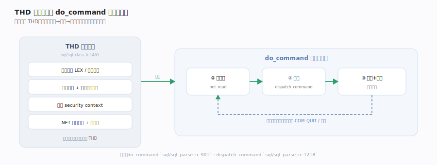
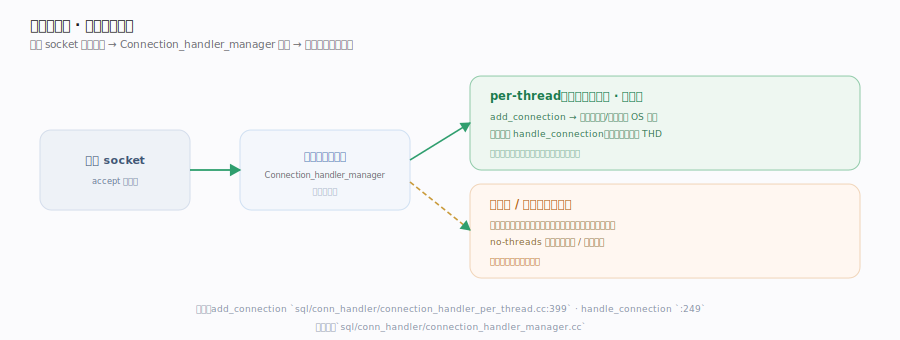

# MySQL 核心原理 · 支撑能力域 · 连接与线程模型

> **定位**：SQL 进入服务器的第一道门。每个客户端连接在服务端对应一个 `THD` 会话对象——它是"当前语句 + 事务 + 权限 + 网络"的全部上下文载体；连接处理器决定用什么线程模型服务这些连接。核实基准：`sql/sql_class.h`、`sql/sql_parse.cc`、`sql/conn_handler/`。

## 一、THD 会话对象与命令主循环

`THD`（`sql/sql_class.h:class THD`）是 MySQL 最重的对象之一：一个连接一个 THD，聚合当前语句 `LEX`、活动事务、字符集、权限上下文、诊断区、网络 `NET`，并自带元数据锁上下文。建连构造、认证后初始化，随后服务线程进入命令主循环（见图）：`do_command` 读一条协议包 → `dispatch_command` 按类型分派 → `COM_QUERY` 走解析优化 + 执行 → 回循环等下一条，直到 `COM_QUIT` 收尾。**同一连接多条语句复用同一 THD**——所以会话级状态（autocommit、临时表、用户变量、预处理语句）能跨语句保持，这是 THD「有状态」的根源。各阶段函数落点见下方「一条命令在主循环里的一趟」表。

## 二、连接处理器：两种线程模型

接受器循环 `accept` 新连接，先做**准入**（`connection_count` 对比 `max_connections`，超限拒连、仅额外放行一个 SUPER 管理连接），再交连接处理器。两种模型（见图）：**per-thread（默认）**——每连接一个 OS 线程，线程干完不销毁而是挂在线程缓存等下一个连接复用（受 `thread_cache_size` 约束），摊薄建线程成本；实现简单、隔离好，但海量连接时线程过多、调度与内存开销大。**no-threads** 用于嵌入/调试。企业版**线程池**插件用一组工作线程服务大量连接，把「连接数」与「线程数」解耦，高并发短事务更省资源。

## 深化 · THD 承载的上下文

| 维度 | THD 里的载体 | 说明 |
|---|---|---|
| 语句 | 当前 `LEX` / 查询结构 | 正在执行的 SQL |
| 事务 | 事务状态 + 引擎事务句柄 | autocommit / 显式事务 |
| 权限 | security context | 当前用户可做什么 |
| 网络 | `NET` 连接 | 收发协议包 |
| 诊断 | 诊断区 warnings/errors | 回给客户端的状态 |

## 拓展 · per-thread vs 线程池

| per-thread（默认） | 线程池 |
|---|---|
| 每连接一 OS 线程 | 一组工作线程服务多连接 |
| 实现简单、隔离强 | 连接数与线程数解耦 |
| 万级连接线程过多 | 高并发短事务更省资源 |

## 深化 · 一条命令在主循环里的一趟

| 阶段 | 落点 | 说明 |
|---|---|---|
| 读命令包 | `do_command` `sql/sql_parse.cc:901` | 从 `NET` 读一条协议包 |
| 按类型分派 | `dispatch_command` `sql/sql_parse.cc:1218` | COM_QUERY / COM_QUIT… |
| 解析+优化 | `mysql_parse` `sql/sql_parse.cc:5426` | 建语法树、交优化器 |
| 真正执行 | `mysql_execute_command` `sql/sql_parse.cc:2455` | 按语句种类走对应分支 |
| 会话收尾 | `end_connection` `sql/sql_connect.cc:787` | 断连时清理 THD |

这一趟走完线程不退出，回到 `do_command` 顶端阻塞等下一条命令；只有 `COM_QUIT` 或网络错误才跳出循环，THD 随之销毁而 OS 线程回到线程缓存待命。

## 调优要点

- `max_connections` 控制最大并发连接；过大导致线程/内存爆，过小拒连。
- `thread_cache_size` 缓存空闲线程，降低频繁建线程开销（per-thread 模型）。
- 每线程栈与缓冲（`thread_stack`、`sort_buffer_size` 等）是"每连接"开销，乘以连接数评估内存。
- 长连接空转占资源：设置 `wait_timeout` 回收空闲连接。

## 常见误区

- **连接数越多吞吐越高**：超过 CPU/IO 承载后，上下文切换与锁争用反而降吞吐。
- **THD 是无状态的**：THD 保存会话级状态，同连接多语句共享（事务、临时表、用户变量）。
- **每条 SQL 新建连接**：应复用连接（连接池），建连认证代价不小。

## 一句话总纲

**每个客户端连接在服务端映射为一个 THD 会话对象——它是语句、事务、权限、网络的统一上下文；服务线程在 do_command 主循环里逐条读命令、派发、返回，复用同一 THD 保持会话状态。默认的 per-thread 模型简单可靠，高并发下可换线程池把连接数与线程数解耦。**
