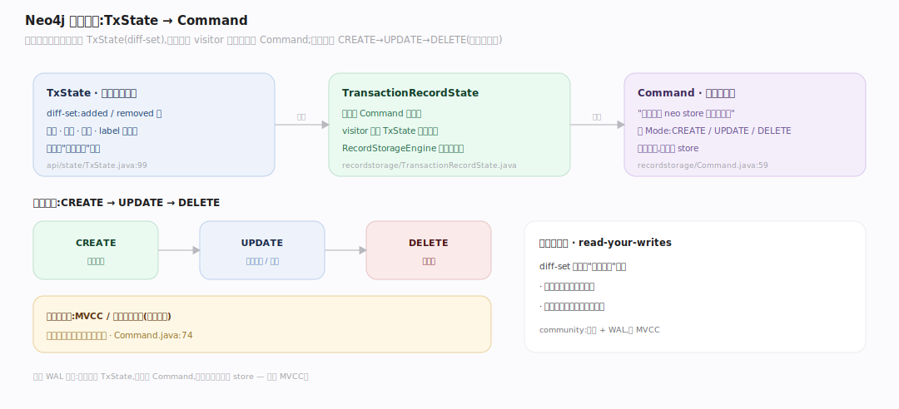
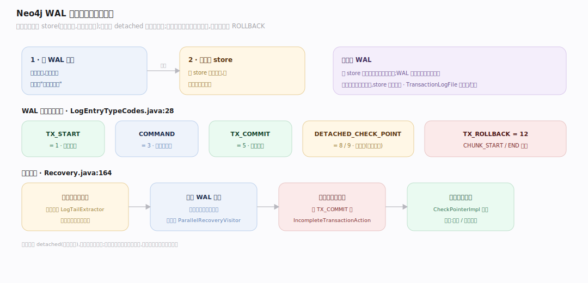

# Neo4j 原理 · 支撑主线 · 事务与恢复

> **定位**：属"事务能力域"。管写的原子持久与崩溃恢复:TxState 累积变更 → Command → WAL(预写日志)→ 崩溃重放。依赖【锁与并发】串行化、【记录存储】落记录、【页缓存】刷盘。源码基准 **Neo4j 2026.06**(`community/kernel/`、`community/wal/`)。

图的写入(建节点、连关系、改属性)要么全成要么全不,崩溃后要能恢复到一致状态。Neo4j 的路子:事务内变更先攒在内存 **TxState**、提交时转成 **Command**(记录级操作)写进 **WAL(预写日志)**、再应用到 store;崩溃重启从 WAL 重放未落盘的事务。这是经典的 WAL + 恢复,不是 MVCC。

---

## 一、事务状态与提交:TxState → Command

- **TxState**(`kernel/.../api/state/TxState.java:110` `public class TxState implements TransactionState`)持事务本地变更,用 **diff-set**(added/removed 节点/关系/属性/label 集)记录,叠加在已提交读之上——事务内你看到自己的改动,别人看不到。
- 提交时,TxState 经 visitor 转成物理 **Command** 对象(`recordstorage/Command.java:60` `public abstract class Command implements StorageCommand`,"所有能对 neo store 执行的命令")。Command 带 `Mode`(CREATE/UPDATE/DELETE)。
- **应用顺序 CREATE→UPDATE→DELETE**(`Command.java:74`):因为**不取读锁**(注释明确 MVCC/读锁尚未实现),按此序避免依赖问题。
- `TransactionRecordState`(`recordstorage/TransactionRecordState.java:96`)是记录级累积器,产出这些 Command;`RecordStorageEngine`(`recordstorage/RecordStorageEngine.java:144`)是存储引擎入口。

---

## 二、WAL 预写日志与恢复

**WAL(预写日志)**记录每个事务的 Command,先写日志再改 store——崩溃可从日志重建。日志条目类型(`wal/.../LogEntryTypeCodes.java:28`):`TX_START=1`、`COMMAND=3`、`TX_COMMIT=5`、`DETACHED_CHECK_POINT=8/9`、`CHUNK_START/END`、`TX_ROLLBACK=12`。**检查点是"detached"**(写到单独文件)。

`TransactionLogFile`(`kernel/.../transaction/log/files/TransactionLogFile.java:111`,`append()` `TransactionLogFile.java:398`)管日志追加/轮转。**恢复**(`kernel/recovery/Recovery.java:169` `public final class Recovery`,入口 `performRecovery()` `Recovery.java:471`):最后检查点后有事务就需恢复——**重放**日志里记录的所有变更,末尾再写一个检查点。可并行恢复(`ParallelRecoveryVisitor`),读日志尾(`LogTailExtractor`),未完成事务回滚(`IncompleteTransactionAction.ROLLBACK`)。检查点由 `CheckPointerImpl`(`kernel/.../checkpoint/CheckPointerImpl.java:60`,`forceCheckPoint()` `CheckPointerImpl.java:130`)+ 阈值策略(周期/日志块数)驱动。

**为什么 WAL**:改 store 文件是随机写、慢且难保原子;WAL 是顺序追加、快且完整,先落日志就保证了"提交即持久",store 可稍后异步应用。

---

## 拓展 · 事务关键结构一览

| 结构 | 定义 | 职责 |
|---|---|---|
| TxState | `kernel/.../api/state/TxState.java:110` | 事务本地变更(diff-set) |
| Command | `recordstorage/Command.java:60` | 记录级操作(CREATE/UPDATE/DELETE) |
| TransactionRecordState | `recordstorage/TransactionRecordState.java:96` | 记录级 Command 累积器 |
| LogEntryTypeCodes | `wal/.../LogEntryTypeCodes.java:28` | WAL 条目类型码 |
| Recovery | `kernel/recovery/Recovery.java:169` | 崩溃重放恢复 |
| CheckPointerImpl | `kernel/.../checkpoint/CheckPointerImpl.java:60` | 检查点(截断日志) |

## 调优要点（关键开关）

- **检查点间隔**:太频增 IO、太疏则恢复回放多;`dbms.checkpoint.interval.*` 调。
- **日志保留** `db.tx_log.rotation.*`:轮转大小与保留;影响恢复与增量备份。
- **并行恢复**:大日志崩溃恢复可并行加速。
- **事务大小**:超大事务的 TxState 占内存;批量写宜分批提交。

## 常见误区与工程要点

- **误区:Neo4j 用 MVCC。** community record engine 明确**未实现 MVCC**;用锁串行化 + WAL,读不加读锁但靠锁序与应用序保证一致。
- **误区:提交就写了 store 文件。** 提交先写 WAL(顺序快),store 应用可异步;崩溃靠 WAL 重放补齐。
- **误区:检查点在事务日志里。** 检查点是"detached"、写单独文件;恢复从最后检查点后重放。
- **误区:恢复会丢未提交事务的部分改动。** 未完成事务在恢复时回滚(ROLLBACK),保证原子。
- **归属提醒**:变更落成记录在【记录存储】;串行化靠【锁与并发】;脏页刷盘经【页缓存】;写由 Cypher 的 CREATE/MERGE 触发。

## 一句话总纲

**Neo4j 写入靠 WAL + 恢复(非 MVCC):事务内变更攒在内存 TxState(diff-set),提交时转成记录级 Command(CREATE→UPDATE→DELETE 序,因不取读锁)、先写预写日志(TX_START/COMMAND/TX_COMMIT 条目,顺序追加保提交即持久)再应用到 store;检查点"detached"写单独文件截断日志,崩溃重启从最后检查点后重放 WAL、未完成事务回滚——这是经典 WAL 恢复,community 明确未实现 MVCC。**
