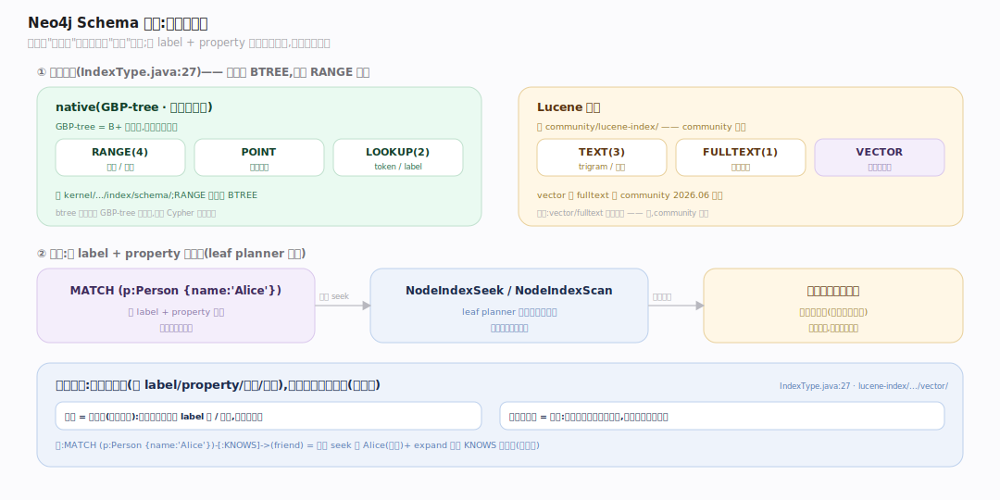
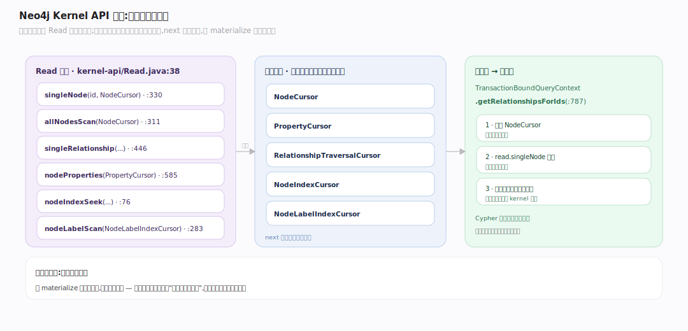
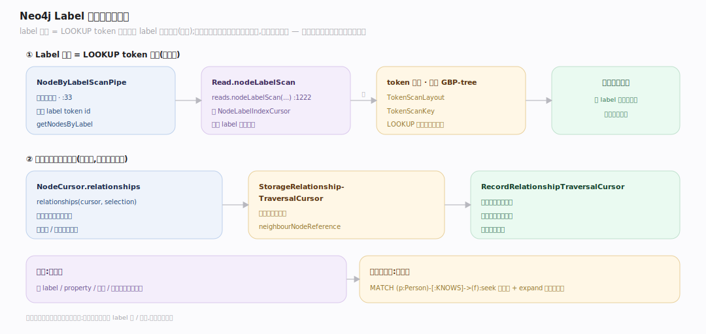

# Neo4j 原理 · 支撑主线 · 索引与遍历

> **定位**：属"索引能力域"。管两件事:schema 索引(按 label+property **找遍历起点**)与 Kernel API 游标遍历(读图的统一接口)。被【Cypher 执行】用来定位起点 + 读图,遍历落到【记录存储】的免索引邻接。源码基准 **Neo4j 2026.06**(`community/kernel/`、`community/kernel-api/`、`community/lucene-index/`)。

免索引邻接解决了"遍历"(节点→关系跟指针),但**遍历得先有起点**——"找所有叫 Alice 的 Person"这种按属性定位起点,还是要索引。所以 Neo4j 的索引是"**找起点**"用的,不是"遍历"用的。找到起点后,一切读图都经 **Kernel API 游标**(nodeCursor/relationshipCursor/propertyCursor)统一进行。

---

## 一、Schema 索引:找遍历起点

索引类型(`community/schema/.../IndexType.java:27`):`LOOKUP(2)`(token/label 索引)、`TEXT(3)`、`RANGE(4)`、`POINT`、`FULLTEXT(1)`、`VECTOR`。**注意无 BTREE**——已被 RANGE 取代(btree 只在底层 GBP-tree 页存层)。

- **native(GBP-tree 页缓存支撑)**:RANGE、POINT、token(LOOKUP)索引在 `kernel/.../index/schema/`,基于 GBP-tree(B+ 树变体,页缓存支撑)。
- **Lucene 支撑**:TEXT(trigram)、FULLTEXT、**VECTOR** 索引在 `community/lucene-index/`——vector 与 fulltext 在 community 就有。
- **用途**:Cypher 的 leaf planner 生成 `NodeIndexSeek`/`NodeIndexScan` 计划,按 label+property 快速定位起点节点(如 `MATCH (p:Person {name:'Alice'})`),再从这些起点展开关系链。

---

## 二、Kernel API 游标:读图的统一接口

所有读图都经 **Read 接口**(`community/kernel-api/.../Read.java:38`)的游标:

- `singleNode(id, NodeCursor)`(`Read.java:330`)、`allNodesScan`(`Read.java:311`)、`singleRelationship`(`Read.java:446`)、`nodeProperties(..., PropertyCursor)`(`Read.java:585`)、索引 seek `nodeIndexSeek`(`Read.java:76`)、label 扫 `nodeLabelScan`(`Read.java:283`,返 `NodeLabelIndexCursor`)。
- **游标类型**:`NodeCursor`/`PropertyCursor`/`RelationshipTraversalCursor`/`NodeIndexCursor`/`NodeLabelIndexCursor`。游标是"指向当前实体的可移动指针",`next` 前进。
- **运行时→内核桥**:Cypher 的 `TransactionBoundQueryContext.getRelationshipsForIds`(`interpreted-runtime/.../TransactionBoundQueryContext.scala:787`,类定义 `TransactionBoundQueryContext.scala:165`)分配 NodeCursor、`read.singleNode` 定位、按方向建关系游标遍历——所有图读都汇聚到 kernel 游标。

**为什么游标**:游标是流式、零拷贝的读取——不 materialize 整个结果集,而是按需前进,配合免索引邻接实现"边遍历边产结果"。

---

## 三、Label 扫描与遍历落地

- **label 扫描 = LOOKUP token 索引**:`Read.nodeLabelScan` 返 `NodeLabelIndexCursor`;运行时 `NodeByLabelScanPipe`(`interpreted-runtime/.../pipes/NodeByLabelScanPipe.scala:30`,`internalCreateResults` 解析 label token id 见 `NodeByLabelScanPipe.scala:37`)、`getNodesByLabel`(`TransactionBoundQueryContext.scala:1216`)经 `reads().nodeLabelScan(...)`(`TransactionBoundQueryContext.scala:1222`)拿到该 label 的所有节点。token 索引存底层 GBP-tree(`TokenScanLayout`/`TokenScanKey`)。
- **遍历落到免索引邻接**:`StorageRelationshipTraversalCursor.neighbourNodeReference`(`storageengine/api/StorageRelationshipTraversalCursor.java:23`)是存储级遍历契约;`NodeCursor.relationships(cursor, selection)` 从节点发起遍历,`RecordRelationshipTraversalCursor` 顺着关系链走(见记录存储篇)——**不查关系索引**。

**分工清晰**:索引找起点(按 label/property/全文/向量),免索引邻接做遍历(跟指针)。两者配合:`MATCH (p:Person {name:'Alice'})-[:KNOWS]->(friend)` = 索引 seek 找 Alice(起点)+ expand 遍历 KNOWS 关系链(免索引)。

---

## 拓展 · 索引与遍历关键结构一览

| 结构 | 定义 | 职责 |
|---|---|---|
| IndexType | `schema/.../IndexType.java:27` | LOOKUP/TEXT/RANGE/POINT/FULLTEXT/VECTOR |
| Read | `kernel-api/.../Read.java:38` | 游标读图统一接口 |
| NodeCursor / RelationshipTraversalCursor | `kernel-api/.../` | 可移动读取游标 |
| StorageRelationshipTraversalCursor | `storageengine/api/StorageRelationshipTraversalCursor.java:22` | 存储级遍历契约 |
| VectorIndexProvider | `lucene-index/.../vector/VectorIndexProvider.java:73` | 向量索引(community 有) |
| TokenScanLayout | `kernel/.../index/schema/TokenScanLayout.java:39` | label token 索引(GBP-tree) |

## 调优要点（关键开关）

- **给起点属性建索引**:MATCH 里按属性过滤的起点节点要有 RANGE/TEXT 索引,否则全 label 扫甚至全扫。
- **索引类型选择**:等值/范围用 RANGE;模糊/全文用 TEXT/FULLTEXT;地理用 POINT;相似度用 VECTOR。
- **复合索引**:多属性过滤用复合索引;注意属性顺序。
- **PROFILE 看 db hits**:确认查询用了 index seek 而非 NodeByLabelScan / AllNodesScan。

## 常见误区与工程要点

- **误区:图遍历需要关系索引。** 不。遍历是免索引邻接(跟指针);索引只用于**找起点节点**(按 label/property)。
- **误区:Neo4j 还有 BTREE 索引。** 已被 RANGE 取代;BTREE 只在底层 GBP-tree 页存层,不是 Cypher 索引类型。
- **误区:vector/fulltext 是企业版。** community 2026.06 就有 vector 与 fulltext 索引(Lucene 支撑)。
- **误区:没索引也能快。** 无起点索引则全 label 扫/全扫,大图上极慢;起点定位是图查询性能的第一道关。
- **归属提醒**:找到起点后的遍历在【记录存储】(免索引邻接);索引由【Cypher 规划器】选用;游标读取经【页缓存】取记录;索引更新在【事务与恢复】。

## 一句话总纲

**Neo4j 的索引是"找遍历起点"用的、不是"遍历"用的:schema 索引(LOOKUP token/RANGE/TEXT/POINT/FULLTEXT/VECTOR,native GBP-tree 或 Lucene 支撑,community 含向量/全文)按 label+property 定位起点节点;找到起点后,所有读图经 Kernel API 的 Read 游标(nodeCursor/relationshipCursor/propertyCursor 流式前进),关系遍历落到记录存储的免索引邻接(跟指针不查关系索引)——索引找起点、免索引邻接做遍历,分工清晰。**
