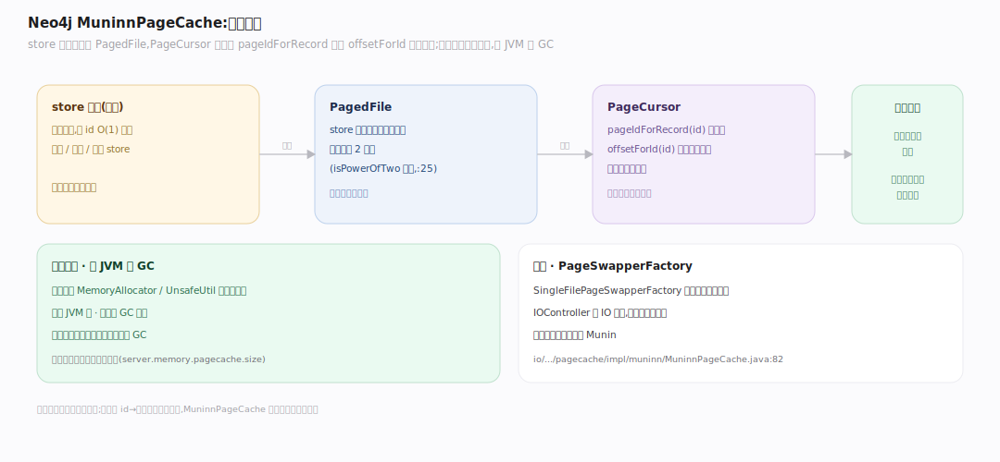
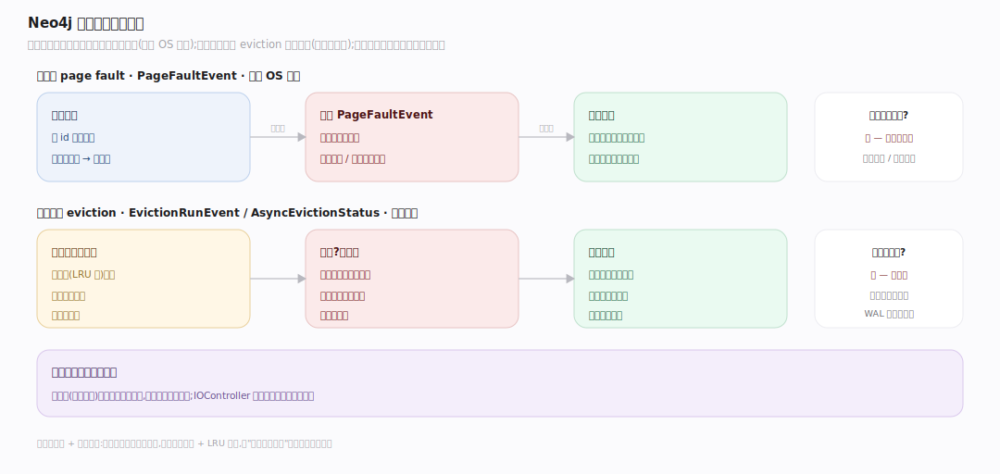

# Neo4j 原理 · 支撑主线 · 页缓存

> **定位**：属"缓存能力域"。管把 store 文件分页进内存:MuninnPageCache 堆外分页、页错误加载、后台 eviction。是【记录存储】读写记录的内存底座——所有记录访问都经它。源码基准 **Neo4j 2026.06**(`community/io/`)。

store 文件在磁盘,但按 id O(1) 定位后要读进内存才能用。Neo4j 用 **MuninnPageCache**(名字来自奥丁的乌鸦 Munin)把 store 文件分页(page)进**堆外内存**——避开 JVM 堆的 GC 压力,让海量记录常驻。记录存储的 `pageIdForRecord`/`offsetForId` 定位后,就在页缓存的页里读写。

---

## 一、MuninnPageCache:堆外分页

**MuninnPageCache**(`community/io/.../pagecache/impl/muninn/MuninnPageCache.java:132` `public class MuninnPageCache implements PageCache`)是生产页缓存:

- **堆外分配**:页内存经 `MemoryAllocator`(`io/.../mem/MemoryAllocator.java:27`)/`UnsafeUtil` 分配在堆外——不占 JVM 堆、不触发 GC。海量图数据可常驻内存而不拖累 GC。
- **PagedFile + PageCursor**:store 文件映射成 `PagedFile`(接口 `io/.../pagecache/PagedFile.java:34`,`io()` 取游标 `PagedFile.java:151`),记录存储把 `PageCursor`(`io/.../pagecache/PageCursor.java:70`)`next()` 翻页(`PageCursor.java:253`)、定位到 `pageIdForRecord(id)` 页的 `offsetForId(id)` 偏移读写(见记录存储篇);实现 `MuninnPagedFile.io()` 在 `impl/muninn/MuninnPagedFile.java:274`。
- **页大小是 2 的幂**(`isPowerOfTwo` 校验,`MuninnPageCache.java:472`),便于位运算定位。
- **锁标志**:读锁 `PagedFile.java:44`(`PF_SHARED_READ_LOCK`)、写锁 `PagedFile.java:60`(`PF_SHARED_WRITE_LOCK`)。
- **换页**:`PageSwapper`(接口 `io/.../pagecache/impl/muninn/swapper/PageSwapper.java:34`,`read()` `:48`/`write()` `:95`)负责页与磁盘交换,`SingleFilePageSwapper`(`swapper/SingleFilePageSwapper.java:63`,`swapIn()` `:188`/`swapOut()` `:194`)是单文件实现;`IOController` 做 IO 节流。

---

## 二、页错误与后台淘汰

- **页错误(page fault)**:访问不在内存的页时,`PageFaultEvent`(`io/.../pagecache/tracing/PageFaultEvent.java:22`)触发从磁盘加载该页到一个空闲/被淘汰的页帧——空闲页帧由 `MuninnPageCache.grabFreeAndExclusivelyLockedPage()`(`MuninnPageCache.java:847`)抓取,类比 OS 缺页。
- **后台淘汰(eviction)**:内存满时,后台线程按策略淘汰冷页(`MuninnPageCache.evictPages()` `MuninnPageCache.java:1052`,事件 `tracing/EvictionRunEvent.java:29`),脏页先刷盘再释放页帧。这让热数据留内存、冷数据让位。
- **脏页刷盘**:被修改的页标记为脏,淘汰或检查点时刷回磁盘;检查点(见事务篇)会强制刷所有脏页,建立一致的持久点。

**为什么堆外 + 自管淘汰**:图数据量常远超堆大小,交给 JVM 堆会 GC 停顿;MuninnPageCache 自己管堆外内存 + LRU 式淘汰,把"哪些页留内存"的决策握在手里,读热记录接近内存速度、冷记录按需从盘加载。

---

## 拓展 · 页缓存关键结构一览

| 结构 | 定义 | 职责 |
|---|---|---|
| MuninnPageCache | `io/.../pagecache/impl/muninn/MuninnPageCache.java:132` | 堆外分页页缓存 |
| PagedFile / PageCursor | `io/.../pagecache/PagedFile.java:34` / `PageCursor.java:70` | 文件映射 + 页内定位读写 |
| PageSwapper | `io/.../pagecache/impl/muninn/swapper/PageSwapper.java:34` | 页与磁盘交换 |
| PageFaultEvent | `io/.../pagecache/tracing/PageFaultEvent.java:22` | 缺页加载事件 |
| IOController | `io/.../pagecache/` | IO 节流 |

## 调优要点（关键开关）

- **`server.memory.pagecache.size`**:页缓存大小——图核心调优参数;理想是能容纳热数据集(节点+关系+属性 store)。
- **堆 vs 页缓存分配**:堆给查询执行(slot 行),页缓存给 store 数据;二者分开调,别让堆挤占页缓存。
- **预热(warmup)**:重启后页缓存冷,首次查询慢;可配页缓存预热把热页提前加载。
- **IO 节流**:`IOController` 防检查点/恢复的大量刷盘打满磁盘影响前台。

## 常见误区与工程要点

- **误区:页缓存在 JVM 堆里。** 在**堆外**(MemoryAllocator/UnsafeUtil),避 GC;所以页缓存大小与堆大小分开配。
- **误区:页缓存越大越好。** 应匹配热数据集大小;超过物理内存会 swap 反而慢,还要给堆和 OS 留空间。
- **误区:记录直接从磁盘读。** 所有记录访问经页缓存;命中则内存速度,未命中触发页错误从盘加载。
- **误区:脏页立即刷盘。** 脏页延迟刷(淘汰或检查点时),批量顺序刷更快;WAL 已保证持久性。
- **归属提醒**:记录的 id→页定位在【记录存储】;脏页刷盘的一致点由【事务与恢复】的检查点建立;页缓存是所有存储访问的内存底座。

## 一句话总纲

**Neo4j 用 MuninnPageCache 把 store 文件分页进堆外内存(避 JVM 堆 GC):store 映射成 PagedFile,记录存储用 PageCursor 定位到 pageIdForRecord 页的 offsetForId 偏移读写;访问不在内存的页触发页错误从磁盘加载,内存满时后台 eviction 淘汰冷页(脏页先刷盘)、检查点强制刷所有脏页建持久点;页缓存大小(server.memory.pagecache.size)是图核心调优参数,理想能容纳热数据集、且与 JVM 堆分开配。**
