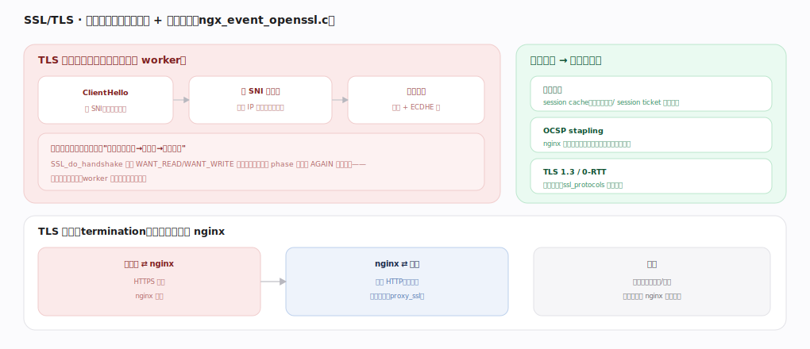
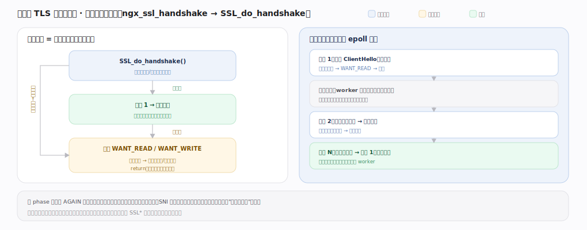

# nginx 核心原理 · 支撑能力域 · SSL/TLS

> **定位**：后端与安全能力域。在事件循环内做非阻塞 TLS 握手、按 SNI 选证书、终止加密（解密后明文转后端）。依赖**进程与事件模型**（握手不阻塞 worker），与 phase 引擎的暂停/恢复机制同构。核实基准：官方源码 `nginx/src`（`commit 9e32c636`，nginx 1.31.3，`event/ngx_event_openssl.c`）。

## 一、握手、SNI 与优化

**SSL 上下文构建**：启动时 `ngx_ssl_create`（`event/ngx_event_openssl.c:306`）按 `ssl_protocols` 建 `SSL_CTX`；连接到来时 `ngx_ssl_create_connection`（`:2107`）为该连接建 `SSL*`。**TLS 握手嵌进事件循环**：核心是 `ngx_ssl_handshake`（`:2201`）里调 `SSL_do_handshake(c->ssl->connection)`（`:2219`）——ClientHello（含 SNI 目标域名）→ 按 SNI 选证书 → 密钥协商（证书 + ECDHE 等）。握手非阻塞、可跨多个事件周期重入的状态机见 §二。

**SNI 虚拟主机选证书**：`SSL_CTX_set_tlsext_servername_callback` 注册回调（`http/modules/ngx_http_ssl_module.c:785-786`），回调 `ngx_http_ssl_servername`（`http/ngx_http_request.c:885`）从 ClientHello 取 SNI 域名，调 `ngx_http_find_virtual_server`（`:2491`）按 `server_name` 匹配虚拟主机、切换到对应证书（一个 IP 多域名各自证书）。**ALPN 协议协商**（选 h2/http1.1）经 `SSL_select_next_proto`（`http/modules/ngx_http_ssl_module.c:528`）在握手内完成。

握手很贵，故有复用与优化：**会话复用**（session cache 共享内存 / session ticket 免全握手）、**OCSP stapling**（nginx 代取证书吊销状态、随握手下发，省客户端外部查询；`ngx_ssl_ocsp_validate` `:2214`、ex_index `ngx_ssl_ocsp_index` `:139`）、**TLS 1.3/0-RTT**（更少往返，`ssl_protocols` 控版本）。

**TLS 终止（termination）**：加密边界在 nginx——客户端⇄nginx 走 HTTPS（nginx 解密）、nginx⇄后端走明文 HTTP（内网）或再加密（proxy_ssl）。收益：后端不必管证书/加密、证书集中在 nginx 统一管理。

---

## 二、非阻塞握手状态机

不变式：`SSL_do_handshake` 返回负值且错误码为 `SSL_ERROR_WANT_READ`/`WANT_WRITE` 时挂起等对应读/写事件、`return` 让出线程，事件就绪后重入 `ngx_ssl_handshake`（`event/ngx_event_openssl.c:2201`）续跑——与 phase 引擎的 AGAIN 机制同构，一次慢握手可横跨多个 epoll 周期而全程不占线程；握手未完成前绝不收发应用数据，连接的握手状态由 `SSL*` 保存、跨事件周期续跑。

---

## 深化 · 失败路径与边界

| 失败/边界场景 | 处理机制 | 锚点 |
|---|---|---|
| **握手失败** | `SSL_do_handshake` 返错（协议不符/套件不匹配/证书校验失败）记 SSL error 日志、关连接，绝不半开挂起 | `ngx_ssl_handshake` `event/ngx_event_openssl.c:2201` |
| **SNI 未匹配** | 找不到对应 `server_name` 回退该 listen 的**默认 server** 证书，可能触发客户端证书名不符告警——每域名都配证书 | `ngx_http_find_virtual_server` `http/ngx_http_request.c:2491` |
| **OCSP 取回失败** | stapling 拉取失败/过期时不阻断握手、只是不下发 stapling（客户端自校验），容错返回 | `ngx_ssl_ocsp_validate` `openssl.c:2214`/`:2267` |
| **0-RTT 重放** | TLS 1.3 early data 可被重放，nginx 标记 `Early-Data` 头，非幂等请求应在后端拒绝或校验 | — |
| **私钥加载失败** | 证书/私钥不匹配或文件缺失直接启动失败、不带病运行 | `ngx_ssl_create` `event/ngx_event_openssl.c:306` |

---

## 拓展 · SSL 相关指令

| 指令 | 作用 | 锚点 |
|---|---|---|
| `ssl_certificate` / `ssl_certificate_key` | 证书与私钥（可多组按 SNI） | `event/ngx_event_openssl.c:306` |
| `ssl_protocols` / `ssl_ciphers` | 允许的协议版本与加密套件 | `event/ngx_event_openssl.c:306` |
| `server_name`（SNI 选证书） | 按 ClientHello SNI 切虚拟主机 | `http/ngx_http_request.c:885/2491` |
| `ssl_session_cache` / `ssl_session_tickets` | 会话复用 | `event/ngx_event_openssl.c` |
| `ssl_stapling on` | OCSP stapling | `event/ngx_event_openssl.c:139/2214` |
| `proxy_ssl_*` | 到后端再加密 | `http/modules/ngx_http_proxy_module.c` |

---

## 调优要点（关键开关）

- 开 `ssl_session_cache shared:...` + tickets，握手复用降 CPU 与延迟。
- 用 TLS 1.3 减少往返；禁用老旧协议/弱套件。
- `ssl_stapling on` 提升客户端首次连接速度。
- 大量 HTTPS 时握手是 CPU 大头，worker 数与会话复用要一起调。

---

## 常见误区与工程要点

- **以为握手会阻塞 worker**：握手是事件驱动非阻塞的，`SSL_do_handshake`（`:2219`）返回 WANT_READ/WRITE 时让出线程。
- **不开会话复用**：每次全握手 CPU 昂贵，高并发 HTTPS 必开 cache/tickets。
- **SNI 证书配错**：多域名要为每个 server_name 配对应证书，否则 `ngx_http_find_virtual_server`（`:2491`）回退默认证书告警。
- **终止后忘了内网安全**：nginx→后端明文只在可信内网可接受，跨网段应 proxy_ssl。
- **0-RTT 无脑开**：early data 有重放风险，非幂等请求需防护。

---

## 一句话总纲

**SSL/TLS 在事件循环内做非阻塞握手：`ngx_ssl_handshake`（`ngx_event_openssl.c:2201`）调 `SSL_do_handshake`（`:2219`），ClientHello 带 SNI → 回调 `ngx_http_ssl_servername`（`ngx_http_request.c:885`）+ `ngx_http_find_virtual_server`（`:2491`）选证书 → 密钥协商，返回 WANT_READ/WRITE 时像 phase 引擎的 AGAIN 一样挂起让出线程；握手昂贵故用 session cache/ticket 复用、OCSP stapling（`:2214`）、TLS 1.3 优化；nginx 作 TLS 终止点——对客户端 HTTPS 加密、对后端明文（或 proxy_ssl 再加密），把证书与加密集中管理、卸载后端负担。**
