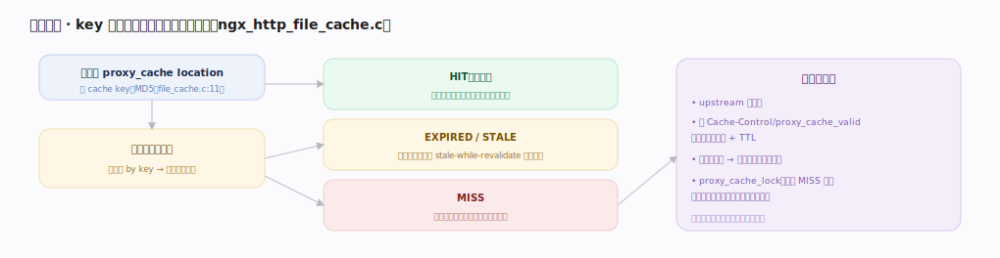
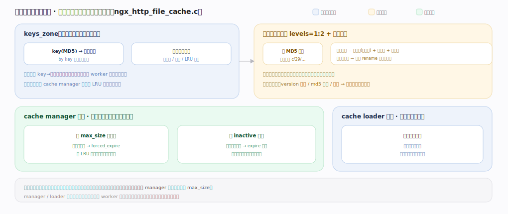

# nginx 核心原理 · 支撑能力域 · 代理缓存

> **定位**：后端与安全能力域。把后端响应按 key 缓存到磁盘、命中直返，大幅减轻后端压力。依赖 **upstream**（回源）、**共享内存**（索引）、**后台任务**（cache manager/loader 进程）。核实基准：官方源码 `nginx/src`（`commit 9e32c636`，nginx 1.31.3）。

## 一、缓存查找与回填流程

请求到 proxy_cache location 先算 cache key：`ngx_http_file_cache.c` 里 `ngx_crc32_init/ngx_md5_init`（`http/ngx_http_file_cache.c:240`）对 key 组成部分逐段 `ngx_md5_update`（`http/ngx_http_file_cache.c:250`），`ngx_md5_final(c->key, &md5)`（`http/ngx_http_file_cache.c:258`）得 16 字节 MD5 作为主键、CRC32 作校验。`ngx_http_file_cache_open`（`http/ngx_http_file_cache.c:265`）驱动查找：`ngx_http_file_cache_exists`（`http/ngx_http_file_cache.c:881`）在共享内存红黑树里 `ngx_http_file_cache_lookup`（`http/ngx_http_file_cache.c:1029`）按 key 查节点得缓存状态——**HIT（有效）** 由 `ngx_open_cached_file`（`http/ngx_http_file_cache.c:359`）打开磁盘缓存文件直接返回、不碰后端；**EXPIRED/STALE** 回源校验，可配 stale-while-revalidate 先返旧的；**MISS** 回源取、边返客户端边写缓存文件。

回填时依 Cache-Control/`proxy_cache_valid` 决定是否可缓存 + TTL，写临时文件后原子 rename 进 `ngx_http_file_cache_name`（`http/ngx_http_file_cache.c:994`）算出的分级目录路径；`proxy_cache_lock` 让并发 MISS 只放一个回源、其余等回填或超时（防缓存击穿）。**索引在共享内存、数据在磁盘文件**——内存只存 key→元数据映射（存储布局与后台管理见下节）。

---

## 二、缓存存储与后台管理

磁盘按 key 的 MD5 分级目录（`levels=1:2`，末几位切子目录）打散海量文件，缓存文件头 `ngx_http_file_cache_header_t` 存元数据+响应头+体，`keys_zone` 存内存红黑树索引。**cache manager** 进程 `ngx_http_file_cache_manager`（`http/ngx_http_file_cache.c:2022`）按 `max_size` 触发 `ngx_http_file_cache_forced_expire`（`http/ngx_http_file_cache.c:1761`）按 LRU 强淘汰、按 `inactive` 走 `ngx_http_file_cache_expire`（`http/ngx_http_file_cache.c:1860`）清久未访问；**cache loader** 进程 `ngx_http_file_cache_loader`（`http/ngx_http_file_cache.c:2109`）仅启动时扫描缓存目录、把已有文件重建进内存索引。不变式：命中只碰磁盘不碰后端；校验失败（version/md5/too small）的坏文件永不返给客户端而是回源重建；manager/loader 是独立后台进程、不在 worker 事件循环内，淘汰与加载不阻塞请求。

---

## 深化 · 失败路径与边界

| 失败/边界场景 | 处理机制 | 锚点 |
|---|---|---|
| **缓存文件损坏/版本不符** | 读到 `version mismatch`(`:570`)/`md5 collision`(`:576`)/`too small`(`:562`) 判失效、删除并回源，绝不返坏数据 | `ngx_http_file_cache_open:265` |
| **磁盘文件被外部删除** | 索引仍在但 open 失败（`:373` 记 error），退化为 MISS 回源并重建 | `ngx_open_cached_file:359` |
| **keys_zone 索引满** | 内存索引写不下新 key 时 manager 立即按 LRU 强淘汰腾位，新请求不命中但服务不中断 | `ngx_http_file_cache_forced_expire:1761` |
| **max_size 超限** | manager 后台持续 LRU 淘汰把总量压回阈值；渐进淘汰、短时超限可容忍 | — |
| **回源自身失败** | MISS 回源遇后端错误时，配 `proxy_cache_use_stale` 可返回过期旧缓存兜底，否则透传后端错误 | — |

---

## 拓展 · 缓存相关指令

| 指令 | 作用 | 锚点 |
|---|---|---|
| `proxy_cache_path ... keys_zone= levels= max_size= inactive=` | 缓存目录、内存索引、容量、失效 | `http/ngx_http_file_cache.c:994` |
| `proxy_cache zone` | 该 location 启用缓存 | `http/ngx_http_file_cache.c:265` |
| `proxy_cache_key` | 自定义 key（默认含 scheme/host/uri，MD5） | `http/ngx_http_file_cache.c:258` |
| `proxy_cache_valid code time` | 各状态码的缓存 TTL | `http/ngx_http_file_cache.c:1029` |
| `proxy_cache_lock on` | 防击穿：并发 MISS 只回源一次 | — |
| `proxy_cache_use_stale` | 后端异常时返旧缓存 | — |
| cache manager / loader | 后台 LRU 淘汰 / 启动载入索引 | `http/ngx_http_file_cache.c:2022/2109` |

---

## 调优要点（关键开关）

- `keys_zone` 要够大（每 MB 约存 8000 个 key），否则索引满 LRU 淘汰频繁。
- `proxy_cache_lock on` 防热点 key 并发回源打垮后端。
- `proxy_cache_use_stale` + `updating` 提升后端抖动时可用性。
- 缓存目录放快盘；`levels` 分级避免单目录文件过多。

---

## 常见误区与工程要点

- **以为缓存全在内存**：索引在共享内存、数据体在磁盘文件；内存只存 key→元数据。
- **key 设计不当**：默认 key 含 host/uri，动态参数多时命中率低，需按业务定 key。
- **不设 lock 致击穿**：热点内容过期瞬间大量并发回源，务必 `proxy_cache_lock`。
- **忽视 Cache-Control**：后端返回 no-cache/private 时 nginx 不缓存，排查命中率先看响应头。
- **误以为 loader 会常驻扫盘**：`ngx_http_file_cache_loader`（`:2109`）只在启动时跑一次载入索引；日常淘汰是 manager 的活。

---

## 一句话总纲

**代理缓存把后端响应按 MD5 cache key（`ngx_md5_final` `ngx_http_file_cache.c:258`）缓存到磁盘：`ngx_http_file_cache_open`（`:265`）查共享内存红黑树（`ngx_http_file_cache_lookup` `:1029`）判 HIT/EXPIRED/MISS，命中直读磁盘文件返回、未命中回源并边返边写缓存文件（proxy_cache_lock 防并发击穿），依 Cache-Control/proxy_cache_valid 定 TTL；索引在共享内存、数据在磁盘分级目录，cache manager（`:2022`）按 max_size/inactive 后台 LRU 淘汰、cache loader（`:2109`）启动时载入索引——用磁盘换后端压力。**
