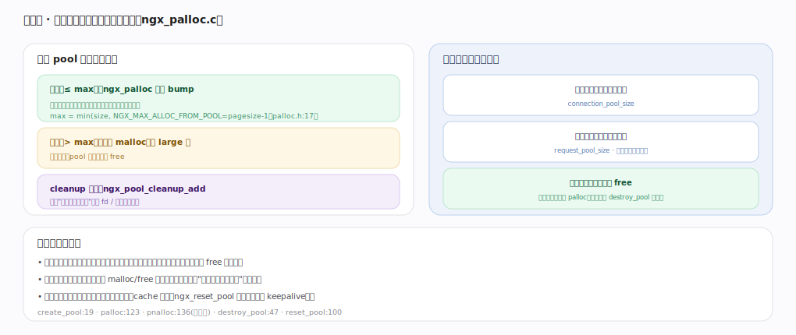
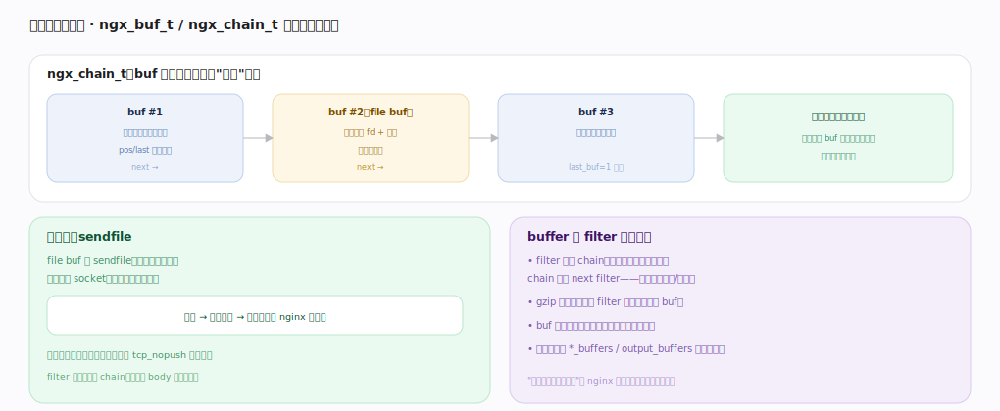

# nginx 核心原理 · 支撑能力域 · 内存池与缓冲

> **定位**：连接底座能力域。按对象生命周期开内存池、一次性释放（杜绝泄漏、免逐个 free），并用 buffer 链零拷贝传递数据。被**HTTP 阶段处理**、**模块体系**、**upstream** 广泛依赖。核实基准：官方源码 `nginx/src`（`commit 9e32c636`，nginx 1.31.3）。

## 一、内存池：按生命周期分配、一次性释放

`ngx_create_pool`（`core/ngx_palloc.c:19`）建池时算出 `p->max = (size < NGX_MAX_ALLOC_FROM_POOL) ? size : NGX_MAX_ALLOC_FROM_POOL`（`:34`），阈值 `NGX_MAX_ALLOC_FROM_POOL = ngx_pagesize - 1`（`core/ngx_palloc.h:20`，x86 上 4095），默认池块 `NGX_DEFAULT_POOL_SIZE = 16*1024`（`:22`）。分配分两路：**小块（≤max）** `ngx_palloc`（`:123`，对齐）/ `ngx_pnalloc`（`:136`，不对齐）走 `ngx_palloc_small`（`:149`）在当前块里移动 `d.last` 指针切一段，几乎零开销；当前块放不下就 `ngx_palloc_block`（`:178`）再挂一块新块进链。**大块（>max）** 走 `ngx_palloc_large`（`:214`）直接 `malloc` 并挂进 `pool->large` 链，池销毁时一并 free。**cleanup 回调** `ngx_pool_cleanup_add`（`:312`）注册"销毁时要做的事"（关 fd、删临时文件、释放外部资源）。

按对象生命周期开池：连接池（连接建立时开、连接关闭时销毁）、请求池（请求开始时开、请求结束整体销毁）。**关键收益**：请求相关的所有分配都挂请求池，请求一结束 `ngx_destroy_pool`（`:47`，先跑 cleanup 链、再 free large 链、最后 free 块链）整池回收——忘记 free 也不漏；小块分配只是指针移动、无系统调用开销；keepalive 复用连接时 `ngx_reset_pool`（`:100`）把指针拨回块首复用同一池，避免反复建销。

---

## 二、缓冲链与零拷贝

`ngx_buf_t`（`core/ngx_buf.h:18`）+ `ngx_chain_t`（`:61`，`{ngx_buf_t *buf; ngx_chain_t *next;}`）构成 buf 单链表，数据以"引用"传递：内存 buf（`pos/last` 指向数据、`ngx_create_temp_buf` 建，`core/ngx_buf.c:13`）、file buf（`in_file` 置位，指向 fd + `file_pos/file_last` 偏移，不读进内存）串成链。链节点由 `ngx_alloc_chain_link`（`core/ngx_buf.c:48`）从池里取（带 free 链复用）；`ngx_chain_add_copy`（`:127`）把一串 buf 追加进输出链；`ngx_chain_update_chains`（`:185`）把已发完的 buf 从 busy 链移回 free 链复用。输出时分批非阻塞写、写不完的挂起等写事件续发。

**零拷贝 sendfile**：file buf 走 `sendfile`，内核直接把文件数据发到 socket 不经用户态拷贝（磁盘→内核页缓存→网卡），是静态大文件服务的关键提速。filter 链传递的是 chain 不复制 body——多数 filter（chunked、not_modified、range）只改指针/标志，只有 gzip 等重编码 filter 才分配新 buf 装压缩结果。"不搬数据、只传引用"是 nginx 低内存高吞吐的又一支柱。

---

## 深化 · 失败路径与边界

| 失败/边界场景 | 处理机制 | 锚点 |
|---|---|---|
| **large 分配失败** | `malloc` 返 NULL 时向上返 NULL、调用方须判空；池不 OOM-kill，靠上层 finalize 请求 | `ngx_palloc_large` |
| **cleanup 顺序** | 先按注册逆序跑所有 cleanup（如关临时文件 fd）再释放内存；未注册 cleanup 的裸 malloc fd 不会被替关，致泄漏 | `ngx_destroy_pool:47` |
| **写缓冲背压** | 输出链一次写不完（socket 满）时 buf 挂 busy 链返 `NGX_AGAIN`，等写事件再回收已发部分——绝不阻塞 | `ngx_chain_update_chains:185` |
| **请求头超缓冲** | 请求头超 `large_client_header_buffers` 报 414/400，不无限扩内存 | — |
| **跨 worker 数据不能进池** | pool 进程内随生命周期释放；跨 worker 状态（缓存索引/限流计数）必须放共享内存+slab，不能 palloc | `core/ngx_slab.c` |

---

## 拓展 · 内存相关组件

| 组件 | 职责 | 锚点 |
|---|---|---|
| ngx_create_pool | 建池、算 max 阈值 | `core/ngx_palloc.c:19` |
| ngx_palloc / ngx_pnalloc | 对齐 / 不对齐小块分配 | `core/ngx_palloc.c:123/136` |
| ngx_palloc_small / block / large | 块内切分 / 加新块 / 大块 malloc | `core/ngx_palloc.c:149/178/214` |
| ngx_destroy_pool / reset_pool | 整池释放（跑 cleanup）/ 复用 | `core/ngx_palloc.c:47/100` |
| ngx_pool_cleanup_add | 注册销毁回调 | `core/ngx_palloc.c:312` |
| ngx_buf_t / ngx_chain_t | 缓冲 / 缓冲链结构 | `core/ngx_buf.h:18/61` |
| ngx_create_temp_buf / alloc_chain_link | 建内存 buf / 取链节点 | `core/ngx_buf.c:13/48` |
| ngx_chain_add_copy / update_chains | 追加链 / busy↔free 回收 | `core/ngx_buf.c:127/185` |

---

## 调优要点（关键开关）

- `client_header_buffer_size` / `large_client_header_buffers`：请求头缓冲大小。
- `output_buffers`、`proxy_buffers`：响应/代理缓冲，影响内存与吞吐。
- `sendfile on` + `tcp_nopush on`：静态文件零拷贝 + 合并包。
- 大量小对象场景正是内存池的强项，勿在 handler 里手动 malloc/free 绕过池。

---

## 常见误区与工程要点

- **在请求处理里手动 malloc**：应从请求池 `ngx_palloc` 分配，随请求结束自动回收；手动分配易泄漏。
- **以为 filter 会复制 body**：多数只传 chain 引用；只有重编码 filter 才分配新缓冲。
- **共享内存与池混淆**：pool 是进程内、随生命周期释放；缓存/限流跨 worker 的数据用共享内存 + slab。
- **缓冲设太小**：请求头/响应超缓冲会报错或退化落盘，按业务调大。
- **持有资源不注册 cleanup**：open 的 fd/临时文件须 `ngx_pool_cleanup_add` 注册，否则 destroy_pool 不替你关。

---

## 一句话总纲

**内存池按对象生命周期分配（小块 `ngx_palloc` 指针 bump `palloc.c:123`、大块 `ngx_palloc_large` malloc 挂链 `:214`、`ngx_pool_cleanup_add` 注册销毁回调 `:312`），请求相关分配挂请求池、请求结束一次 `ngx_destroy_pool`（`:47`）整体回收——杜绝泄漏且极快；数据用 `ngx_chain_t`（`ngx_buf.h:61`）缓冲链以引用传递、file buf 走 sendfile 零拷贝，filter 链多只传 chain 不复制 body——"按生命周期一次性释放"与"不搬数据只传引用"共同支撑 nginx 的低内存高吞吐。**
