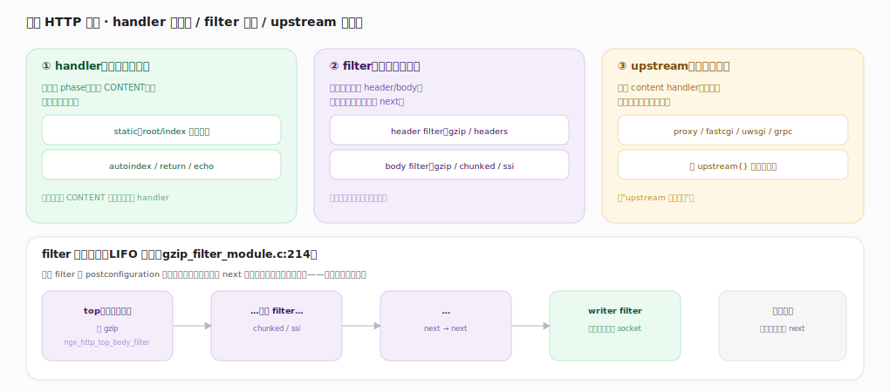

# nginx 核心原理 · 支撑能力域 · 模块体系

> **定位**：请求处理能力域。nginx"一切功能皆模块"——三类 HTTP 模块（handler 产内容 / filter 加工响应 / upstream 转后端）挂进请求流水线。它是**配置指令**的载体（每指令由模块注册）、**HTTP 阶段处理**的填充物。核实基准：官方源码 `nginx/src`（`commit 9e32c636`，nginx 1.31.3）。

## 一、三类 HTTP 模块

**handler**（内容生成器）挂在某 phase（多为 CONTENT），直接产响应（static 读文件、autoindex、return）；一个请求的 CONTENT 只选一个 handler。以 static 模块为例，`ngx_http_static_init`（`http/modules/ngx_http_static_module.c:282`）在 postconfiguration 时 `ngx_array_push(&cmcf->phases[NGX_HTTP_CONTENT_PHASE].handlers)`（`:289`）把 `ngx_http_static_handler`（`:49`）push 进 CONTENT 阶段的 handler 数组。**filter**（响应加工链）不产内容、改 header/body，串成责任链逐级调 next（gzip、chunked、ssi）；可多个叠加。**upstream**（后端代理）是特殊 content handler，把请求转后端并回传（proxy/fastcgi/uwsgi/grpc），配 `upstream{}` 做负载均衡。

**filter 链 LIFO 构建**：每个 filter 在 postconfiguration 时把全局链头存进自己的 `ngx_http_next_*_filter`、再把自己设为新的 `ngx_http_top_*_filter`——以 gzip 为例，`ngx_http_gzip_filter_init` 里 `ngx_http_next_header_filter = ngx_http_top_header_filter; ngx_http_top_header_filter = ngx_http_gzip_header_filter;`（`http/modules/ngx_http_gzip_filter_module.c:1130-1131`），body filter 同理（`:1133-1134`）。**后注册先执行**，链尾是真正写 socket 的 `ngx_http_write_filter`（其 init `http/ngx_http_write_filter_module.c:366` 最先注册故排在链尾）。

---

## 二、模块类型与生命周期

模块结构 `ngx_module_t`（`core/ngx_module.h:227`）核心字段：`ctx_index/index`（`:228-229`，模块在同类中/全局的序号）、`ctx`（`:239`，指向类型专属上下文如 `ngx_http_module_t`）、`commands`（`:240`，本模块的指令表）、`type`（`:241`，`NGX_CORE_MODULE`/`NGX_EVENT_MODULE`/`NGX_HTTP_MODULE`/`STREAM`/`MAIL`/`CONF`）、生命周期钩子 `init_module`（`:245`）、`init_process`（`:247`，每 worker fork 后调）、`exit_process`（`:250`）。编译期静态链接进 `ngx_modules[]`，`ngx_preinit_modules`（`core/ngx_module.c:26`）遍历给每个模块打 `index = i`（`:31`）建立全局序号；或运行期 `load_module` 动态加载 `.so`。

HTTP 模块的配置钩子 `ngx_http_module_t`（`http/ngx_http_config.h:23-36`）：`preconfiguration`（`:25`，注册变量）、`postconfiguration`（`:26`，挂 filter 和 phase handler）、`create_main_conf`（`:28`）、`create_srv_conf`/`merge_srv_conf`（`:31-32`）、`create_loc_conf`/`merge_loc_conf`（`:34-35`，各层建/合并配置结构）。启动初始化顺序：解析配置 → create/merge conf（见"配置指令"篇）→ postconfiguration（挂 filter/handler）→ 每 worker fork 后各调 `init_process` 初始化连接池、共享内存等。

---

## 深化 · 失败路径与边界

| 失败/边界场景 | 处理机制 | 锚点 |
|---|---|---|
| **模块崩溃即 worker 崩溃** | 模块编进 worker 进程、无隔离沙箱；劣质第三方模块段错误令整 worker 崩溃，靠 master 重启兜底 | `ngx_reap_children`（见进程篇） |
| **filter 顺序不可乱插** | filter 链在 postconfiguration 一次性按注册序建成 LIFO，运行期不可动态插队；排序须控编译顺序或注册时机 | — |
| **handler 返回 DECLINED** | content handler 返 `NGX_DECLINED`（我不处理）时 phase checker 继续找下一个或最终 404，不悬挂 | — |
| **动态模块 ABI 不匹配** | `load_module` 的 `.so` 须与主程序同版本、同编译选项，否则加载即报错拒绝启动——避免运行期崩溃 | — |

---

## 拓展 · 模块与流水线挂载点

| 类型 | 挂载点 | 例子 | 锚点 |
|---|---|---|---|
| handler | phase handler 数组 | static、proxy、fastcgi | `http/modules/ngx_http_static_module.c:289` |
| header filter | ngx_http_top_header_filter 链 | headers、gzip、not_modified | `http/modules/ngx_http_gzip_filter_module.c:1130` |
| body filter | ngx_http_top_body_filter 链 | gzip、chunked、ssi、sub | `http/modules/ngx_http_gzip_filter_module.c:1133` |
| writer（链尾） | write_filter（最先注册） | 实际写 socket | `http/ngx_http_write_filter_module.c:366` |
| upstream | content handler + 负载均衡 | proxy_pass、grpc_pass | `http/ngx_http_upstream.c:543` |
| 配置钩子 | ngx_http_module_t | create/merge/pre/postconfiguration | `http/ngx_http_config.h:23` |

---

## 调优要点（关键开关）

- 编译时用 `--with-*` / `--without-*` 裁剪模块，减小体积。
- 动态模块 `load_module` 便于按需加载第三方模块。
- filter 顺序由内置注册决定，一般无需干预；自定义模块注意注册时机。
- 用 `nginx -V` 看编译进了哪些模块。

---

## 常见误区与工程要点

- **以为 filter 能改内容顺序随意**：filter 是固定 LIFO 链，顺序由注册决定，不能任意插队。
- **handler 与 filter 混淆**：handler 产内容（CONTENT 阶段选一个），filter 只加工已产出的内容。
- **第三方模块乱加**：模块直接嵌进 worker 进程，劣质模块会拖垮/搞崩整个 nginx。
- **忘了 upstream 也是 content handler**：proxy_pass 本质是 CONTENT 阶段的一个 handler。

---

## 一句话总纲

**nginx 一切功能皆模块（`ngx_module_t`，`core/ngx_module.h:227`）：handler 挂在 phase 上产内容（CONTENT 只选一个，如 `static_module.c:289`）、filter 以 LIFO 责任链逐级加工 header/body 后调 next（`gzip_filter_module.c:1130-1134` 注册、链尾 writer filter 写 socket）、upstream 作为特殊 content handler 转后端；模块按 core/event/http/stream/mail 分类经 `ngx_preinit_modules`（`ngx_module.c:26`）建序，再由 `ngx_http_module_t`（`ngx_http_config.h:23`）的 create/merge conf 与 pre/postconfiguration 钩子把配置结构、变量、filter 与 phase handler 注册进引擎——这套模块体系是配置指令的载体与 HTTP 阶段流水线的填充物。**
