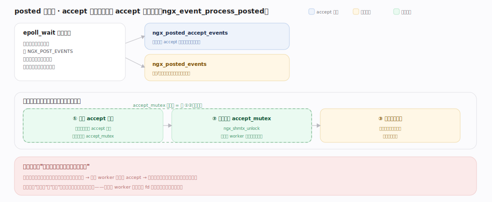

# nginx 核心原理 · 支撑能力域 · 进程与事件模型

> **定位**：连接底座、灵魂能力域之一。master-worker 多进程 + worker 单线程非阻塞事件循环（epoll），是 nginx 高并发的根基。被**所有**能力域依赖（一切都在 worker 事件循环内跑），由**信号控制**驱动进程生命周期。核实基准：官方源码 `nginx/src`（`commit 9e32c636`，nginx 1.31.3）。

## 一、worker 事件循环：单线程非阻塞跑满一颗核

每个 worker 跑无限循环 `ngx_process_events_and_timers`（`event/ngx_event.c:195`）：① 若开了 accept_mutex 则先 `ngx_trylock_accept_mutex`（调用点 `event/ngx_event.c:224`，函数体 `event/ngx_event_accept.c:345`）——抢到锁的 worker 才把监听 fd 加进自己 epoll；② 计算 `epoll_wait` 超时（取最近定时器到期，`ngx_event_find_timer`）；③ `ngx_process_events`（宏派发到 `ngx_epoll_process_events`，`event/modules/ngx_epoll_module.c:784`）里真正调 `epoll_wait`（`:800`）等就绪事件；④ 就绪的连接读/写事件先按 `NGX_POST_EVENTS` 标志推入队列，事件循环回到主体后 `ngx_event_process_posted`（`event/ngx_event_posted.c:19`）统一执行 handler；⑤ 处理到期定时器（红黑树管超时/keepalive）。

epoll 返回的就绪事件不立即处理，而是按 `NGX_POST_EVENTS` 标志分拣进**两个 posted 队列**，回主循环后**两段式执行**（详见下节图）：先跑 accept 队列接完新连接、随后立即 `ngx_shmtx_unlock` 释放 accept 锁、最后才处理耗时业务事件（`event/ngx_event.c:255/257/263`）——锁只在 accept 期间持有、绝不跨越业务处理。

**一个线程扛上万连接**的三条根因：连接是不占线程的状态机（`ngx_connection_t`，就绪才被唤醒、处理一小步就返回）；一切可能阻塞的都异步化（网络非阻塞、磁盘 aio/线程池、DNS 异步 resolver）；`epoll_wait` 只返回真正有事件的 fd（复杂度 O(就绪数) 而非 O(总连接)）。epoll 事件默认边缘触发（`EPOLLET`，`event/modules/ngx_epoll_module.c:32`），一次通知须读干到 `EAGAIN`，故 handler 都是循环读到底。worker 数 ≈ CPU 核数，每核跑满无线程切换抖动。

---

## 二、posted 两段式：accept 优先、锁只在 accept 期间持有

不变式：`accept_mutex` 的持有区间只覆盖"接连接"这一小段，绝不跨越业务处理。若持锁期间夹带耗时业务，别的 worker 抢不到 accept → 新连接积压、分配不均、尾延迟抬高；两段式（`ngx_event_process_posted` 分别处理 `ngx_posted_accept_events` 与 `ngx_posted_events`，`event/ngx_event.c:255/263`）把持锁时间压到最短。启用 `EPOLLEXCLUSIVE`/`reuseport` 时内核已避免惊群、无软锁，此纪律退化为纯粹的队列分拣顺序。

---

## 三、惊群与连接分配

多 worker 共享监听套接字，新连接若唤醒所有 worker 去 accept 就是**惊群**（只一个成功、其余空忙、分配不均）。三种解法：**accept_mutex**（`ngx_trylock_accept_mutex` 里 `ngx_shmtx_trylock(&ngx_accept_mutex)`，`event/ngx_event_accept.c:347`；抢到者 `ngx_enable_accept_events` 把监听 fd 加进 epoll，`:383`；未抢到者不监听 accept，配 `accept_mutex_delay` 默认 500ms 轮流持锁，`event/ngx_event.c:1370`）；**EPOLLEXCLUSIVE**（`event/modules/ngx_epoll_module.c:30`，内核只唤醒一个等待者，无需用户态锁）；**SO_REUSEPORT**（每 worker 各绑同端口 socket、内核按四元组均匀分发，无锁无惊群、尾延迟最低，现代 Linux 首选）。

`ngx_event_accept`（`event/ngx_event_accept.c:21`）在 accept 后维护**负载均衡阀** `ngx_accept_disabled`（`:139`）：当已用连接超过 `connection_n * 7/8`，该值转正、本 worker 暂不抢 accept 锁，把连接让给更空闲的 worker，实现跨 worker 的软均衡。连接的一生是事件驱动状态机：accept 取 `ngx_connection_t` → 注册读事件 → 读就绪跑 HTTP 阶段 → 写就绪发响应 → keepalive 复用或关闭。连接数上限 = worker_processes × worker_connections。

---

## 深化 · 失败路径与边界

| 失败/边界场景 | 处理机制 | 锚点 |
|---|---|---|
| **抢锁失败** | `ngx_accept_mutex_held=0` 分支，本轮不监听新连接、仅处理已有连接读写与定时器——不空转、不惊群 | `ngx_trylock_accept_mutex` `event/ngx_event.c:228` |
| **accept 出错** | `EAGAIN` 表就绪连接取完（正常收尾）；`EMFILE/ENFILE`（fd 耗尽）记 error 并短暂停 accept，靠预留 `files` 降级避免僵死 | `ngx_event_accept` |
| **worker 崩溃** | master 经 `SIGCHLD` 感知、回收并按需重启新 worker，单 worker 故障不影响其余 worker 连接 | `ngx_reap_children` `os/unix/ngx_process_cycle.c:534` |
| **惊群残留** | 即使用 EPOLLEXCLUSIVE，跨多 listen socket 仍可能多 worker 唤醒，用 `ngx_accept_disabled` 做二次均衡兜底 | — |

---

## 拓展 · 进程与事件组件

| 组件 | 职责 | 锚点 |
|---|---|---|
| ngx_master_process_cycle | master 管控循环（轮询信号标志） | `os/unix/ngx_process_cycle.c:74` |
| ngx_start_worker_processes | fork 出 N 个 worker | `os/unix/ngx_process_cycle.c:336` |
| ngx_worker_process_cycle | worker 主体循环 | `os/unix/ngx_process_cycle.c:699` |
| ngx_worker_process_init | worker 初始化（绑核/降权/装事件） | `os/unix/ngx_process_cycle.c:753` |
| ngx_reap_children | 回收并重启崩溃 worker | `os/unix/ngx_process_cycle.c:534` |
| ngx_process_events_and_timers | 事件循环核心 | `event/ngx_event.c:195` |
| ngx_epoll_process_events | epoll 具体实现（含 epoll_wait） | `event/modules/ngx_epoll_module.c:784` |
| ngx_event_accept | accept 连接 + 负载均衡阀 | `event/ngx_event_accept.c:21` |
| ngx_trylock_accept_mutex | 惊群互斥抢锁 | `event/ngx_event_accept.c:345` |
| ngx_event_process_posted | 处理延迟事件队列 | `event/ngx_event_posted.c:19` |

---

## 调优要点（关键开关）

- `worker_processes auto`：通常设为 CPU 核数，跑满多核。
- `worker_connections`：单 worker 连接上限；总容量 = worker 数 × 它。
- `use epoll`（Linux 默认）/ `multi_accept on`：一次事件循环接多个连接（一次 accept 到 `EAGAIN`）。
- `listen ... reuseport`：现代 Linux 用它替代 accept_mutex，降尾延迟、去锁竞争。
- `accept_mutex off`（默认新版即 off）：配 reuseport 或 EPOLLEXCLUSIVE 时无需软锁。

---

## 常见误区与工程要点

- **调大 worker_processes 到远超核数**：进程切换开销反增；一般 = 核数。
- **worker_connections 当作最大并发请求数**：它含到后端的连接、代理时一个请求占两个连接（client + upstream）。
- **以为多线程**：默认单线程事件循环；`aio threads` 仅把阻塞磁盘 IO 卸到线程池，事件主循环仍单线程。
- **阻塞操作写进 handler**：任何同步阻塞（同步 DNS、大文件同步读、第三方模块里 sleep）会卡住整个 worker 上所有连接。
- **误以为 accept_mutex 还是默认开**：新版默认 off，惊群靠内核 EPOLLEXCLUSIVE/reuseport 解决。

---

## 一句话总纲

**进程与事件模型是 nginx 高并发的根基：master 管控并 fork ≈CPU 核数个 worker（`ngx_process_cycle.c:74/336`），每个 worker 用单线程跑 `ngx_process_events_and_timers`（`event/ngx_event.c:195`）无限循环——`epoll_wait` 拿就绪事件、先接 accept 事件并立即放锁、再跑业务 posted 事件、最后处理定时器——连接是不占线程的状态机、一切阻塞操作都异步化，故一个线程可管上万连接；多 worker 抢连接用 accept_mutex / EPOLLEXCLUSIVE / SO_REUSEPORT 避免惊群，并以 `ngx_accept_disabled` 做跨 worker 软均衡。**
