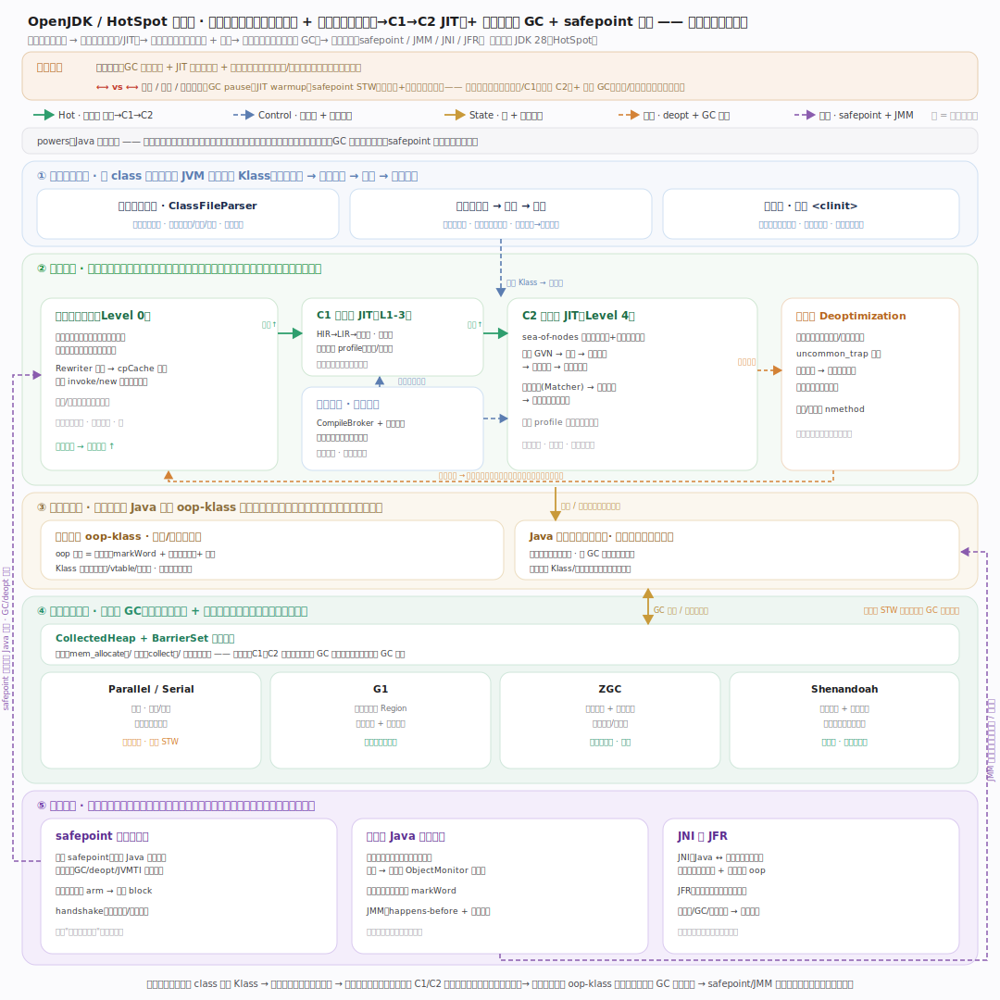

# OpenJDK / HotSpot 核心原理 · 全景主线框架

> **定位**：这是整个图谱的"先读这一篇"。OpenJDK 的心脏是 **HotSpot JVM**——一个**托管运行时虚拟机**：把平台无关的 `.class` 字节码，通过**类加载**装入、**分层执行引擎**（解释器 → C1 → C2 JIT）自适应地编译成本机代码、在 **GC 自动管理**的堆上运行，并由 **safepoint** 协调全局停顿动作。核实基准：HotSpot 源码（JDK 28，`make/conf/version-numbers.conf:DEFAULT_VERSION_FEATURE=28`）。

## 一、判型：这是哪一类系统

**判型 = 托管运行时虚拟机（managed runtime VM）**。它不是编译器、不是操作系统，而是介于二者之间的一层：向上给 Java/Kotlin/Scala 等语言提供"一次编译到处运行"的字节码抽象与自动内存，向下把字节码翻译成宿主 CPU 的机器码。四大支柱：

1. **类加载与链接** —— 双亲委派把 `.class` 字节流解析、校验、链接成 JVM 内部的 `Klass` 元数据（`classfile/systemDictionary.cpp:569 resolve_instance_class_or_null`）。
2. **分层执行引擎** —— 字节码先由**模板解释器**执行（`CompLevel_none=0`），热点方法/循环按计数器逐级升级到 **C1**（`CompLevel_simple..full_profile=1..3`）、**C2**（`CompLevel_full_optimization=4`），见 `compiler/compilerDefinitions.hpp:57-61`。
3. **可插拔并发 GC** —— `gc/shared/collectedHeap.hpp:91 CollectedHeap` 是统一抽象，启动时择一具体收集器（`enum Name{None,Serial,Parallel,G1,Epsilon,Z,Shenandoah}`，collectedHeap.hpp:187）。
4. **safepoint / 横切协调** —— `runtime/safepoint.cpp:333 SafepointSynchronize::begin` 让所有 Java 线程停到安全点，作为 GC、去优化、JVMTI 等动作的前置。

## 二、设计张力：托管抽象 vs 停顿/预热/内存

贯穿 HotSpot 一切设计取舍的主轴：

- **托管抽象（收益）**：GC 自动内存（免手动 free、消灭悬垂/泄漏大类）+ JIT 自适应优化（运行期 profile 驱动的投机优化，常胜过静态编译）+ 平台无关字节码（write once, run anywhere）。
- **停顿 / 预热 / 内存开销（代价）**：GC 需要 STW 停顿；JIT 需要预热（warmup，冷启动先跑慢解释器）；safepoint 是 STW 的协调点；对象头 + 类元数据是内存税。
- **缓解手段**：**分层编译**让启动用解释器/C1（快就绪）、峰值用 C2（高性能）；**并发 GC**（G1 增量、ZGC/Shenandoah 着色指针/转发指针 + 读写屏障）把标记/疏散与应用线程并跑，把停顿压到亚毫秒级。

这条张力在每一条支撑主线里都会再次出现——读任一模块时，都可问："它在托管抽象上给了什么便利？又付出了什么停顿/预热/内存代价？靠什么缓解？"

## 三、五路径归纳：怎么读总架构图

总架构图用五种语义颜色把机制串起来（图例见图顶部）：

| 路径 | 颜色 | 含义 |
|---|---|---|
| Hot · 执行流 | 绿 | 字节码解释执行 → 热点计数超阈 → C1 → C2 逐级升级为本机代码 |
| Control · 类加载 + 编译派发 | 蓝 | 双亲委派装入 Klass；CompileBroker 编译队列按计数器异步派发编译 |
| State · 堆 + 对象模型 | 琥珀 | 执行引擎在 Java 堆按 oop-klass 布局分配/读写对象（经 GC 屏障） |
| 失败 · deopt + GC 停顿 | 橙 | C2 投机假设失效 → uncommon_trap 去优化回退解释器；GC 回收含 STW |
| 横切 · safepoint + JMM | 紫 | safepoint/handshake 暂停线程；JMM happens-before + 内存屏障约束可见性 |

**一句话读法**：类加载器把 class 装成 Klass → 解释器先执行并计数热度 → 热点方法经编译队列升级到 C1/C2 本机代码（失效则去优化回退）→ 对象在堆上按 oop-klass 分配、由可插拔 GC 自动回收 → safepoint/JMM 横切协调全局停顿与内存可见性。

## 四、依赖矩阵：谁依赖谁

- **执行引擎**（解释器/C1/C2）依赖 **类加载** 提供 Klass、依赖 **对象模型** 布局字段、依赖 **GC 屏障** 完成对象访问。
- **GC** 依赖 **safepoint**（多数收集阶段要在安全点起停）、依赖 **对象模型**（markWord 转发/着色、Klass 遍历引用）。
- **同步/JMM** 依赖 **对象模型**（markWord 锁位）、影响 **C2**（内存屏障、锁消除/膨胀）。
- **JNI** 跨越执行引擎与本机代码边界、需切换线程状态（与 safepoint 交互）；**JFR** 横切采集运行时/GC/编译事件。

## 五、八条支撑主线（点击总架构图下钻）

1. **类加载与链接** —— 双亲委派 → 解析校验 → 链接（验证/准备/解析）→ 初始化 `<clinit>`。
2. **对象模型 oop-klass** —— 实例数据（oop）与类元数据（Klass）分离、压缩指针、快速子类型检查。
3. **字节码解释器** —— 模板解释器运行期生成派发表、Rewriter → cpCache、首执符号解析。
4. **分层编译 C1/C2 JIT** —— 计数器驱动升级、C2 sea-of-nodes 优化管线、去优化回退。
5. **垃圾回收与可插拔 GC** —— CollectedHeap/BarrierSet 抽象、G1/ZGC/Shenandoah/Parallel。
6. **safepoint 与线程协调** —— 全局安全点、轮询页 arm/block、handshake 单线程握手。
7. **同步与 Java 内存模型** —— 轻量级锁栈 → 膨胀 ObjectMonitor、markWord 锁位、JMM。
8. **JNI 与 JFR** —— 本地方法边界与线程状态切换、低开销事件采集可观测性。

## 一句话总纲

**OpenJDK / HotSpot 是一台托管运行时虚拟机：以类加载把平台无关字节码装入、以分层执行引擎（解释器起步、C1/C2 按热度自适应编译为本机代码、失效则去优化回退）兼顾启动速度与峰值性能、以可插拔并发 GC 自动管理堆内存、以 safepoint/JMM 横切协调全局停顿与内存可见性——用"托管抽象"换开发效率与可移植性，用"分层编译 + 并发 GC"把停顿、预热、内存开销这三笔代价压到可接受范围。**
