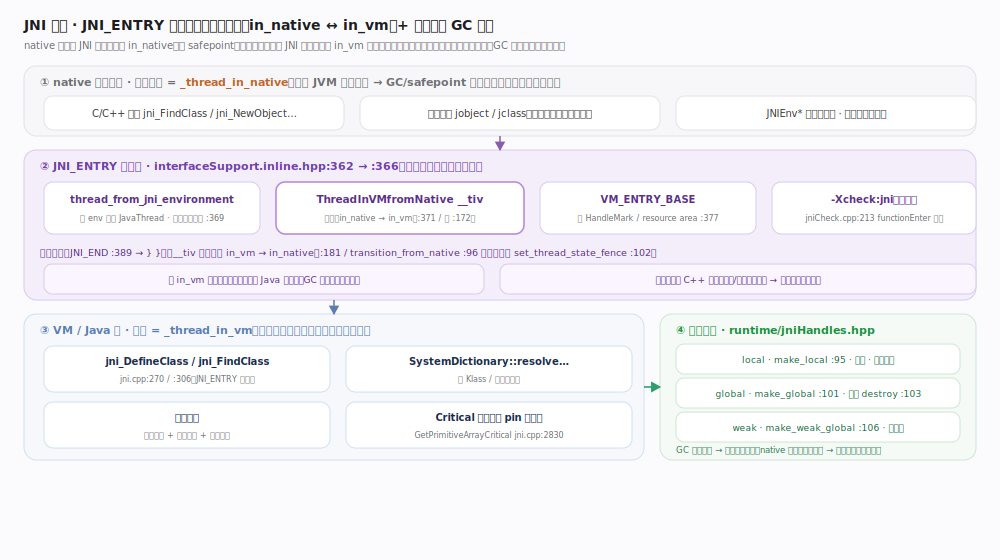
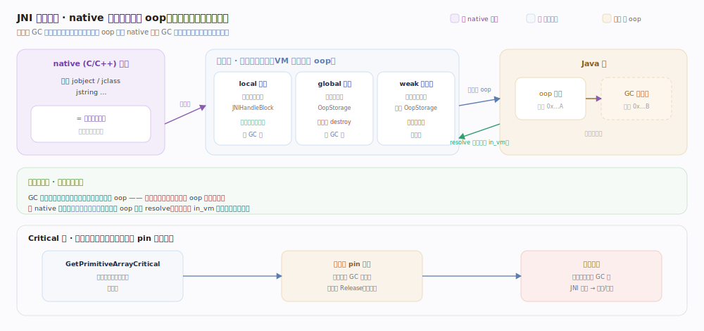
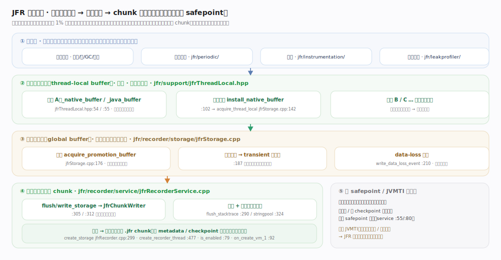

# OpenJDK / HotSpot 核心原理 · 支撑能力域 · JNI 与 JFR

> **定位**：这是 JVM 的两条"对外通道"。**JNI** 是 Java 世界与 native（C/C++）世界之间的边界协议——它的核心不是"怎么调函数"，而是**跨越边界时如何与 GC/safepoint 安全共处**：线程状态在 `in_Java` / `in_vm` / `in_native` 之间切换，裸 `oop` 指针一律用**句柄（handle）**包一层，让"会移动对象的 GC"和"拿着对象引用的 native 代码"互不打架。**JFR（Flight Recorder）** 是 JVM 内建的、可在生产环境长期开启的低开销可观测性引擎——它把事件先写进**线程本地缓冲**，满了再晋升到**全局缓冲**，最后成批落成 **chunk** 文件，用"几乎不加锁、不进 safepoint"的设计把观测开销压到个位数百分比。两者一个管"让外部代码安全进来"，一个管"让内部状态低成本流出"。核实基准：`prims/jni.cpp`、`runtime/interfaceSupport.inline.hpp`、`runtime/jniHandles.hpp`、`prims/jniCheck.cpp`、`jfr/recorder/jfrRecorder.cpp`、`jfr/support/jfrThreadLocal.hpp`、`jfr/recorder/storage/jfrStorage.cpp`（JDK 28）。

## 一、JNI 边界：JNI_ENTRY 宏与线程状态切换

每个 `jni_*` 实现函数都被 **`JNI_ENTRY` 宏**（展开在 `interfaceSupport.inline.hpp:362`）包裹。`JNI_ENTRY_NO_PRESERVE`（`:366`）做三件关键事：① `thread_from_jni_environment`（`:369`）从 `JNIEnv*` 反查当前 `JavaThread` 并断言必须是当前线程（`JNIEnv` 每线程独有）；② `ThreadInVMfromNative __tiv`（`:371`）——**边界的灵魂**：进 JNI 实现体（要碰 Java 对象）前从 `_thread_in_native` 切回 `_thread_in_vm`；③ `VM_ENTRY_BASE`（`:377`）装 HandleMark 等上下文。函数收尾 `JNI_END`（`:389`）析构 `__tiv` 时**自动切回 `_thread_in_native`**——状态切换靠 C++ 栈对象构造/析构成对完成，异常路径也不漏切。例：`jni_DefineClass`（`prims/jni.cpp:270`）建类后把 `oop` 包成本地句柄返回（`:297`）。

### 为什么非要切状态？——与 safepoint 的契约

关键在于 safepoint 对不同状态线程有**不同契约**：`_thread_in_native` 被视为**"已安全"**（不碰 Java 堆对象，GC/VMThread 直接开工无需等它，代价是它**返回 VM 前必须自检**、若期间发生 safepoint 就先 block）；`_thread_in_vm`/`_thread_in_Java` 会**触碰对象**，safepoint 必须等它们停到安全点才能移动对象。状态迁移由 `ThreadInVMfromNative`（构造 `transition_from_native→in_vm`、析构反向）等 RAII 类完成，`transition_from_native`（`:96`）里 `set_thread_state_fence`（`:102`）带内存屏障。所以 JNI 边界切换本质是**一纸契约声明**：进实现体切 `in_vm`（"我要碰对象了，GC 请等我"），native 用户代码维持 `in_native`（"我不碰内部对象，GC 别管我"）。

## 二、句柄机制：为什么 native 永远拿不到裸 oop

句柄 API 集中在 `runtime/jniHandles.hpp`：**local**（`make_local` `:95`）绑当前调用帧、返回自动批量释放（存 `JNIHandleBlock`）；**global**（`make_global` `:101`）跨调用长存、须手动 `destroy_global`（`:103`）；**weak global**（`make_weak_global` `:106`）不阻止回收、挂独立 OopStorage（`:42`）。核心不变量与 Critical 区代价见图；取真实 `oop` 走 `resolve`（`:85`），仅在 `in_vm` 状态下短暂使用。

## 三、JNI 的开销来源与 Critical 区

JNI 慢，慢在**边界税**而非函数调用本身：① 每次进出都要 `in_native ↔ in_vm` 切换并带内存屏障（`set_thread_state_fence`，`interfaceSupport.inline.hpp:102`）；② 每个返回对象要在 `JNIHandleBlock` 分配本地句柄；③ JIT 无法内联跨越 JNI 边界的调用；④ 参数封送/校验。为减拷贝，JNI 提供 **Critical 区**（`GetPrimitiveArrayCritical` `prims/jni.cpp:2830`、`GetStringCritical` `:2861`）承诺"直接给底层内存指针、不拷贝"，代价是区间内**实质禁止 GC 移动该对象**（临时 pin），必须尽快 `Release` 且**区内不得调用任何可能触发 GC 的 JNI 函数**（成对，`:2910`），用错会拉长 GC 停顿甚至死锁。调试期 **`-Xcheck:jni`** 开校验层 `prims/jniCheck.cpp`（`functionEnter :213`、错误即 `ReportJNIFatalError :150`），抓"错误线程用 JNIEnv""句柄类型不符""Critical 区非法调用"等 native 侧 bug。

## 四、JFR：低开销可观测性的分层缓冲

JFR 设计目标是**"生产可长开"**（开销约 1% 量级），每处设计都围绕"不加全局锁、不进 safepoint、不阻塞业务线程"。启动链路（`jfrRecorder.cpp`）：`is_enabled`（`:79`）→ `on_create_vm_1`（`:92`）→ `create_storage`（`:299`）→ `create_recorder_thread`（`:477`）。**三级缓冲**是低开销核心：① **线程本地缓冲**——每线程各有 `_java_buffer`/`_native_buffer`（`jfrThreadLocal.hpp:54`/`:55`），事件写自己线程的缓冲、**无跨线程竞争无锁**（最关键一环）；② **全局缓冲**——本地写满后经 `acquire_promotion_buffer`（`jfrStorage.cpp:176`）晋升，领不到则退化 transient 或判丢并写 data-loss 事件（`:210`），**宁可丢样本也不阻塞业务线程**；③ **chunk 落盘**——后台记录线程周期性把全局缓冲经 `flush_storage`/`write_storage`（`jfrRecorderService.cpp:305`/`:312`）刷成自包含 `.jfr` chunk（连同去重堆栈/字符串常量池）。

### 与 safepoint / JVMTI 的关系

JFR 刻意**尽量避开 safepoint**：绝大多数事件是线程在自己执行流里写本地缓冲，无需世界静止；仅在**轮转/刷盘、写 checkpoint**（类型元数据、线程/栈映射）等少数需一致视图的时刻才与 safepoint 协作（`jfrRecorderService.cpp:55/:80`）。这与 JVMTI 的重量级采样（常需挂起线程或进安全点）形成对比——JFR 用"本地缓冲 + 事后成批处理 + 极少安全点"换来生产可长开。事件来源分列 `jfr/{metadata,periodic,leakprofiler,instrumentation}` 各目录。

## 深化

把两条通道放到同一张"边界"视角下看，它们共享同一组底层设施、方向相反。**JNI 是"外部代码进来"**：核心风险是 GC 移动对象、safepoint 需一致视图，故用线程状态机（`in_native` 视为"已安全"）+ 句柄（对象会动、句柄不动）两把锁扣住。**JFR 是"内部状态出去"**：核心风险是"观测本身拖慢被观测系统"，故用线程本地无锁缓冲 + 尽量不进 safepoint + 宁丢勿阻塞，把 observer effect 压到最低。

两者都体现 HotSpot 反复出现的设计律：**凡跨越"托管/非托管"或"业务/观测"边界处，就用一层间接 + 一套状态契约来隔离，绝不让一侧的实现细节（对象地址、GC 时机）泄漏到另一侧**——JNI 的句柄是"空间间接"，JFR 的分层缓冲是"时间延迟"。代价的落点也清晰：JNI 的边界税意味着**细粒度高频 JNI 调用是性能杀手**（正确姿势是少次、粗粒度、批量），Critical 区省拷贝却 pin 住对象威胁 GC；JFR 的"宁丢勿阻塞"意味着极端高频下会丢样本（如实记 data-loss），给的是"统计意义够用"而非逐条不漏的审计。

## 拓展

JNI 三类句柄的对比：

| 句柄类型 | 创建 API | 生命周期 | 阻止 GC 回收对象？ | 释放方式 | 典型用途 |
| --- | --- | --- | --- | --- | --- |
| local 本地句柄 | `make_local`（`jniHandles.hpp:95`） | 当前 native 方法调用帧内 | 是（作为 GC 根） | 方法返回自动批量释放 | 方法内临时引用、返回值 |
| global 全局句柄 | `make_global`（`:101`） | 跨调用长期存活 | 是（作为 GC 根） | 手动 `destroy_global`（`:103`） | 缓存类/方法 ID、长期持有对象 |
| weak global 弱全局句柄 | `make_weak_global`（`:106`） | 跨调用，但不保命 | 否（弱引用） | 手动 `destroy_weak_global`（`:108`） | 缓存但允许被回收的对象 |

JFR 事件的几类来源（对应 `jfr/` 子目录）：

| 类别 | 目录/机制 | 说明 |
| --- | --- | --- |
| 常规事件 | 各子系统埋点 → thread-local buffer | 分配、锁竞争、GC、编译等，直接写线程本地缓冲 |
| 周期事件 | `jfr/periodic/` | 后台线程按周期采样（如线程转储、CPU 负载） |
| instrumentation | `jfr/instrumentation/` | 字节码级埋点，为 Java 层事件注入采集代码 |
| leak profiler | `jfr/leakprofiler/` | 老年代对象采样，辅助定位内存泄漏 |
| metadata / checkpoint | `jfr/metadata/` + service checkpoint | 类型定义、线程/栈/常量池映射，随 chunk 落盘保证自包含 |

## 调优要点

- **`-Xcheck:jni`**：开发/测试期开启 `prims/jniCheck.cpp` 校验层，抓 native 侧 JNI 误用；生产环境关闭（有开销）。
- **`-XX:+FlightRecorder`**（老版本需显式开启，新版默认可用）配合 **`-XX:StartFlightRecording=...`** 在启动即开始录制，如 `-XX:StartFlightRecording=duration=60s,filename=rec.jfr`。
- **`-XX:FlightRecorderOptions=...`**：调整缓冲策略，如 `globalbuffersize`、`memorysize`、`maxchunksize`、`threadbuffersize`——线程本地缓冲越大，晋升越少、开销越低，但内存占用越高。
- **`-Xlog:jfr`**（统一日志）：观察 JFR 自身的启动、轮转、chunk 落盘与数据丢失情况；出现大量 data-loss 说明事件频率超过缓冲吞吐，应调大缓冲或降低采样。
- JNI 性能：**合并调用**（一次跨界做多件事）而非高频细粒度调用；`GetPrimitiveArrayCritical` 区间要短且区内不调可能触发 GC 的 JNI 函数。

## 常见误区

- **"JNI 慢是因为函数调用慢"**：慢在边界税（状态切换 `interfaceSupport.inline.hpp:102`、句柄分配、无法内联），不是调用指令本身。解法是减少跨界次数而非优化单次。
- **"jobject 就是对象地址，可以缓存下来当指针用"**：错。它是间接句柄，且 local 句柄方法返回即失效；要长期持有必须转 `make_global`（`jniHandles.hpp:101`）。
- **"native 线程也会被 safepoint 强行挂起"**：`_thread_in_native` 被视为"已安全"，GC 无需等它；它返回 VM 时才自检并可能 block。
- **"Critical 区只是拿指针的语法糖"**：它会 pin 住对象、抑制 GC 移动，用不好会拖长停顿甚至死锁。
- **"开 JFR 会明显拖慢应用"**：默认配置下 JFR 走线程本地无锁缓冲、尽量不进 safepoint，开销约 1% 量级，正是为生产长开而设计。
- **"JFR 不丢数据"**：高频事件下缓冲吞吐不足会丢样本并记 data-loss 事件（`jfrStorage.cpp:210`）——它选择"宁丢勿阻塞"。

## 一句话总纲

**JNI 与 JFR 是 JVM 的两条对外通道：JNI 让外部 native 代码安全"进来"——每个 `jni_*` 被 `JNI_ENTRY` 宏（`interfaceSupport.inline.hpp:362`）包裹，进实现体时用 `ThreadInVMfromNative` 把线程从 `in_native` 切到 `in_vm`、退出自动切回，因为 `in_native` 对 safepoint 是"已安全"的，且所有对象引用都用 local/global/weak 句柄（`jniHandles.hpp:95/101/106`）间接持有，让"会移动对象的 GC"与"native 手里的引用"解耦；JFR 让内部状态低成本"出去"——事件先写线程本地无锁缓冲（`jfrThreadLocal.hpp:54`），满了晋升全局缓冲（`jfrStorage.cpp:176`），后台线程成批刷成自包含 chunk，尽量不进 safepoint、宁丢勿阻塞，把可观测性开销压到生产可长开的量级——一个用"空间间接 + 状态契约"隔离托管边界，一个用"时间延迟 + 无锁分层"隔离观测边界，本质都是不让边界一侧的实现细节泄漏到另一侧。**
