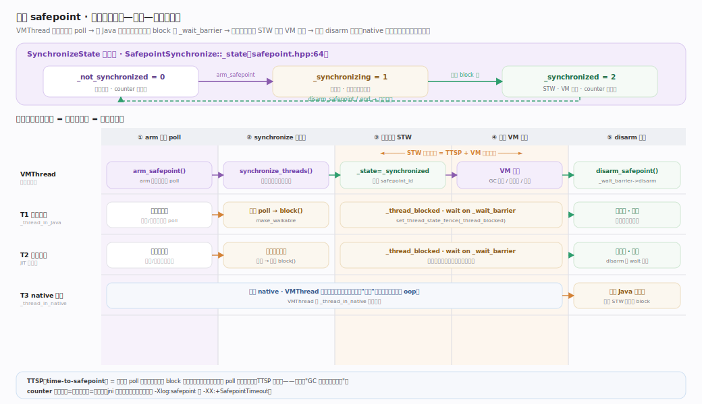
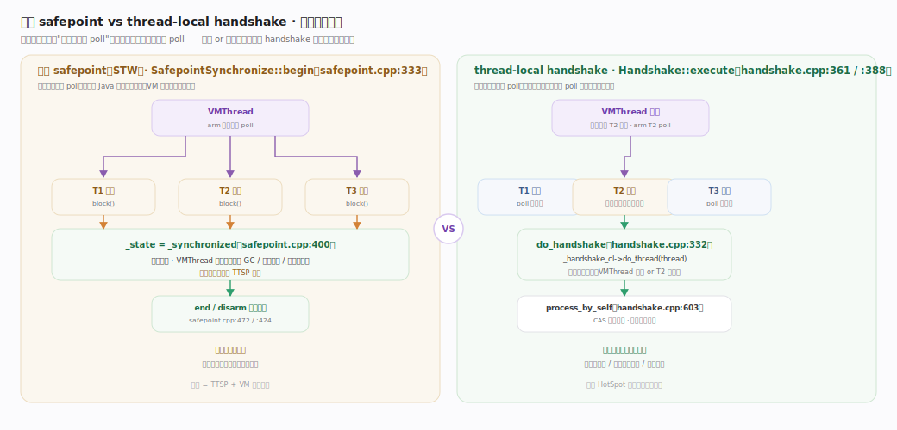

# OpenJDK / HotSpot 核心原理 · 支撑能力域 · safepoint 与线程协调

> **定位**：safepoint（安全点）是 HotSpot 里"让所有 Java 线程停在一个能被安全观察的位置"的核心协调机制。GC 遍历对象图、去优化（deoptimization）改写栈帧、偏向锁撤销、栈遍历采样、类重定义等操作，都要求虚拟机在某个瞬间拥有一份**一致、静止**的 Java 堆与线程栈视图。safepoint 就是达成这种一致视图的约定点：只有当每个线程都停在自己代码里预先埋好的"安全位置"、且此处的寄存器/栈映射（OopMap）完整可信时，VM 线程才能放心地遍历它的栈、移动它引用的对象。本篇讲清全局 safepoint 的状态机与到点流程、poll 轮询点如何插入、native 线程为什么天然安全、以及 JDK 用 handshake 把"全局停顿"降级为"单线程停顿"的演进。核实基准：`runtime/safepoint.cpp`、`runtime/safepointMechanism.hpp`、`runtime/handshake.cpp`（JDK 28）。

## 一、机制主线：全局 safepoint 的到点—停顿—释放

全局 safepoint 由唯一 VMThread 驱动，围绕三态状态机 `SynchronizeState`（`safepoint.hpp:64`）：`_not_synchronized=0` → `_synchronizing=1`（收拢中）→ `_synchronized=2`（VM 独占）。一次停顿由 `begin()`（`safepoint.cpp:333`）打开、`end()`（`:472`）关闭，五步：**① 武装** `arm_safepoint`（`:276`）武装等待栅栏、计数器自增为奇数、遍历每线程置本地 poll（穿插 `fence` 保证全局写对各线程本地读可见）→ **② 收拢** `synchronize_threads`（`:190`）自旋等所有跑 Java 的线程各自在轮询点进 `block`（`:555`，先让栈可遍历再挂到栅栏）→ **③ 全体到达** `_state=_synchronized`（`:400`），世界静止 → **④ 执行 VM 操作**（GC 根扫描/对象移动、批量去优化等，由 `NoSafepointVerifier` 守护防嵌套）→ **⑤ 释放** `disarm_safepoint`（`:424`）计数器回偶数、`_wait_barrier->disarm()` 唤醒全部线程。核心不变量：**只有当每线程都停在自己代码里预埋的安全位置、且此处 OopMap 完整可信，VM 才能安全遍历其栈、移动其引用的对象**。

## 二、poll 点如何插入，native 为何不必停

**不同线程状态用不同机制停下**（判定依据 `JavaThreadState`，`globalDefinitions.hpp:1024`）：**解释执行**在字节码边界检查本地 poll；**编译代码**在方法返回/循环回边编译进一条读"轮询页"的 load——需要停时该页被设成缺页、load 触发信号导入 safepoint（**正常路径零开销、靠内存保护陷阱停下**）；**native**（`_thread_in_native`）**根本不用停**——它只碰句柄不碰裸 oop、栈对 VM 已"安全"，VMThread 直接跳过它，代价是它**返回 Java 时**转换代码检查 `_state`、若 safepoint 进行中就地 block（"进入前等"变"返回时挡"）；**在 VM 内/转换中**轮询直到其下次状态转换时 block。统一入口 `should_process`/`process_if_requested`（`safepointMechanism.hpp:81`/`:84`），本地 poll 武装/解除 `arm_local_poll`（`:90`）/`disarm_local_poll`（`:48`）。JDK 9+ 起 poll 是**每线程本地**的，这正是 handshake 只停一个线程的基础设施。

**TTSP（time-to-safepoint）** 是关键指标：从武装 poll 到最后一个线程 block 的墙钟时间，**真正 STW = TTSP + VM 操作耗时**。超长无回边循环会拖长 TTSP，表现为"GC 很快、停顿却久"，`SafepointTimeout`（`:236`）用来抓掉队线程。

## 三、handshake——把全局停顿降级为单线程停顿

许多操作只需"让某个（或每个）线程各自到自己的安全点执行一小段闭包"，**不需全体同时静止**。JDK 10 的 handshake（`handshake.cpp`）服务于此：`Handshake::execute(closure)`（`:361`）对所有线程各自到点各自跑、跑完各自走；`execute(closure, target)`（`:388`）只对单个目标线程执行（最轻量）。闭包由 `do_handshake`（`:332`）执行，目标线程既可能被 VMThread 代跑、也可能自己在轮询点经 `process_by_self`（`:603`）执行——**谁先到谁执行、CAS 抢所有权保证只跑一次**。免全局停顿的原因：它复用每线程本地 poll，只武装目标线程的 poll，别的线程照常飞奔。偏向锁撤销、单点栈采样、部分线程挂起因此从"全世界停一下"改进为"只打扰相关线程"。

## 四、判型与张力落到本模块

- **托管抽象收益**：safepoint 给了 GC/JIT/工具一个"一致快照"的能力，是自动内存回收与自适应编译能正确工作的地基。
- **代价**：safepoint 就是 STW 停顿本身；"到达安全点的延迟"（超长无回边循环、大量线程集合慢）会拉长停顿。
- **缓解**：并发 GC 把大部分工作移出安全点；handshake 缩小停顿到单/子集线程；编译器在循环回边插轮询点避免"迟迟不到点"。

## 拓展：safepoint vs handshake

下面把两种协调方式并排对比。

| 维度 | 全局 safepoint | thread-local handshake |
| --- | --- | --- |
| 停顿范围 | 全体 Java 线程同时静止（STW） | 单个或逐个线程，各自到点，不同时停 |
| 驱动者 | 唯一 VMThread | VMThread 发起，可由目标线程自执行 |
| 状态机 | `_not_synchronized`/`_synchronizing`/`_synchronized`（`runtime/safepoint.hpp:64`） | 每线程 handshake 队列 + 本地 poll |
| 核心入口 | `SafepointSynchronize::begin/end`（`runtime/safepoint.cpp:333`/`:472`） | `Handshake::execute`（`runtime/handshake.cpp:361`/`:388`） |
| 一致视图 | 全堆+全栈一致，可移动对象 | 仅目标线程栈一致 |
| 典型用途 | 整堆 GC 阶段、类重定义、批量去优化 | 偏向锁撤销、单线程栈采样、线程挂起 |
| 停顿代价 | 高（受最慢线程 TTSP 拖累） | 低（只等相关线程） |
| 引入版本 | HotSpot 早期 | JDK 10（本地 poll 于 JDK 9） |

一句话：**能用 handshake 就别用全局 safepoint**——现代 HotSpot 的演进方向正是把越来越多操作从全局停顿迁移到 handshake。

## 调优要点（真实开关）

- `-XX:+UseCountedLoopSafepoints`（`opto/c2_globals.hpp:251`，默认 false）：让 C2 在计数循环回边插入 safepoint poll。若观测到"长循环导致 TTSP 飙高"，开启它可缩短到点时间，代价是循环体每圈多一次 poll。
- `-Xlog:safepoint`（统一日志，JDK 9+）：打印每次 safepoint 的 TTSP、同步耗时、操作耗时、命中 poll 的线程数。旧版的 `-XX:+PrintSafepointStatistics`/`PrintSafepointStatisticsCount` 已在新 JDK 移除，改用 `-Xlog:safepoint` 及 `safepoint+stats`。
- `-XX:GuaranteedSafepointInterval=<ms>`（`runtime/globals.hpp:1250`，DIAGNOSTIC，默认 0=关）：即使无人请求，也周期性触发一次 safepoint，用于清理累积的清扫工作。设为 0 可减少无谓停顿。
- `-XX:+SafepointTimeout` 配 `-XX:SafepointTimeoutDelay=<ms>`（`runtime/globals.hpp:427`）：到点超过阈值就打印掉队线程，用来定位"谁没及时到点"，对应 `synchronize_threads` 里的超时检查（`runtime/safepoint.cpp:236`）。
- 定位方向：先看 `-Xlog:safepoint` 里 TTSP 是否远大于 VM 操作耗时；若是，问题在"线程到点慢"（长循环/长 native 回调/换页），而非 GC 本身。

## 常见误区

- **"safepoint 就是 GC 停顿"**——错。GC 只是众多 VM 操作之一；去优化、偏向锁撤销、`getStackTrace`、类重定义等都会触发 safepoint。日志里的停顿未必来自 GC。
- **"停顿时间全花在 GC 上"**——未必。停顿 = TTSP + 操作时间。TTSP（等最慢线程到点）可能才是大头，尤其存在无回边 poll 的长循环时。
- **"native 线程也要停下来才安全"**——反了。`_thread_in_native`（`utilities/globalDefinitions.hpp:1028`）本身就是安全区，VMThread 直接跳过它；真正的检查发生在它**返回** Java 的转换点。
- **"handshake 会 STW"**——不会。单目标 handshake（`runtime/handshake.cpp:388`）只打扰目标线程，其余线程照跑。
- **"poll 点越多越好"**——过密的 poll 会拖慢正常执行；HotSpot 默认在方法返回和（可选的）循环回边插点，是吞吐与 TTSP 的折中。
- **"safepoint_counter 是自增序号"**——它的奇偶才是语义：偶=空闲、奇=进行中，`jni_GetField` 快路径靠它判断是否有 safepoint 正在进行（`runtime/safepoint.hpp:64` 附近注释）。

## 一句话总纲

**safepoint 是 HotSpot 让全体 Java 线程停在"栈可遍历、oop 可信"的约定点，从而获得一致堆栈视图的机制：VMThread 武装每线程本地 poll、各线程在解释/编译代码的轮询点自愿 block 到 `_wait_barrier`、全体到达即进入 STW 执行 VM 操作、再统一 disarm 唤醒；native 线程因不碰裸 oop 而天然安全、只在返回时受检；而 handshake 复用同一套本地 poll，把"全世界停一下"降级成"只打扰相关线程"，成为现代 HotSpot 削减停顿的主路径。**
