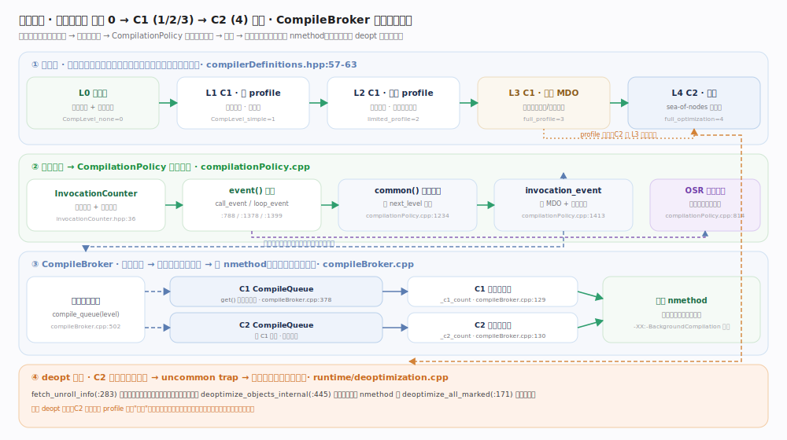
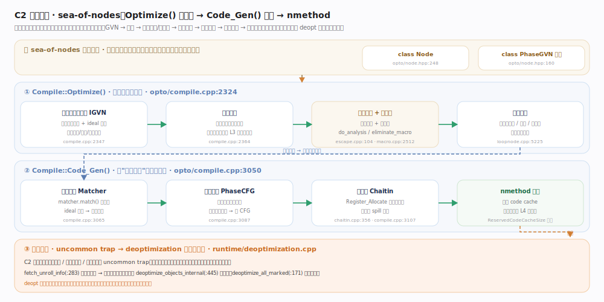

# OpenJDK / HotSpot 核心原理 · 支撑能力域 · 分层编译 C1/C2 JIT

> **定位**：HotSpot 用"解释器 + 两个 JIT 编译器(C1 / C2)"的分层结构，把"启动即可运行"与"长跑逼近原生峰值"这对天然矛盾拆成一条可平滑升级的梯子。字节码先被解释执行同时埋下计数器；随着热度累积，方法沿 `CompLevel 0 → 1/2/3 → 4` 逐级爬升，低层 C1 快速产出带 profile 的机器码，高层 C2 依据 profile 做激进投机优化；一旦投机假设被现实推翻，去优化(deoptimization)把执行安全地退回解释器。本篇聚焦这条"计数器驱动的升级链 + C2 sea-of-nodes 优化管线 + deopt 兜底"的支撑机制。核实基准 JDK 28：`compiler/compilerDefinitions.hpp`、`compiler/compilationPolicy.cpp`、`compiler/compileBroker.cpp`、`c1/c1_Compilation.cpp`、`opto/compile.cpp`、`opto/escape.cpp`、`opto/macro.cpp`、`opto/chaitin.cpp`、`runtime/deoptimization.cpp`。

---

## 一、为何要分层：启动速度与峰值性能的张力

单一策略无法兼顾两个诉求：一上来就 C2 全优化则编译慢、短命方法白付代价、启动被拖慢；始终只用解释器/轻量 C1 则长跑热点拿不到峰值。HotSpot 的答案是**分层**——按实际热度"按需付费"。分层级别定义在 `compiler/compilerDefinitions.hpp:57-63`，是整套机制的坐标系：`CompLevel_none=0`（解释、零编译成本、累积计数）、`simple=1`（C1 无 profile、最快出码）、`limited_profile=2`（C1 + 有限计数）、`full_profile=3`（C1 + 完整 MDO，为 C2 采集分支频率/类型剖面）、`full_optimization=4`（C2 峰值）。典型热路径 `0→3→4`；C2 队列拥塞时走更轻的 `0→2→4`；不值得全优化则停在 1。**"多路径按压力选择"正是分层区别于死板两段的关键。**

## 二、计数器驱动的升级链

每个方法维护**调用计数**与**回边计数**（载体 `InvocationCounter`，`interpreter/invocationCounter.hpp:36`）；解释器在方法入口/循环回边递增，越阈即向策略发事件。总入口 `CompilationPolicy::event`（`compilationPolicy.cpp:788`）分 `call_event`（`:1378`）/`loop_event`（`:1399`），都汇聚到 `common`（`:1234`）用一族谓词算出 `next_level`。调用侧闭环 `method_invocation_event`（`:1413`）必要时先建 MDO；循环侧可能触发 **OSR**（`:814` 附近）——让"跑到一半的热循环"把栈帧从解释帧迁到编译帧，立即受益。核心不变量：**level 3 的 C1 代码不只是快，它带 profile**——C2 敢激进优化，正因 L3 已记录每个分支频率、每个虚调用的实际接收者类型。

## 三、CompileBroker：编译与执行解耦

JIT 不在应用线程上同步进行。`compiler/compileBroker.cpp` 把"提交请求"与"实际编译"解耦为**生产者(策略)—队列—消费者(编译线程)**：编译线程分 C1/C2 两组（`_c1_count :129`、`_c2_count :130`），对应两条独立队列（`compile_queue :502`，C1/C2 互不阻塞），线程经 `CompileQueue::get`（`:378`）阻塞取任务。应用线程发出请求后继续解释执行，编译完成装上新 nmethod、后续调用自动切换。默认后台编译可用 `-XX:-BackgroundCompilation` 关闭。

## 四、C1：快速出码的三档梯度

C1（Client Compiler）目标是"够快够用"。主干 `Compilation::compile_java_method`（`c1/c1_Compilation.cpp:367`）三阶段：`build_hir`（`:145`，字节码→基于 SSA 的 HIR + 局部优化）→ `emit_lir`（`:257`，HIR→接近机器指令的 LIR，用**线性扫描**分配寄存器）→ `emit_code_body`（`:336`，LIR→机器码）。三个 profile 档（level 1/2/3）差异不在管线而在**插桩深浅**：level 1 无 profile 最快、level 3 带完整 MDO。用线性扫描而非图着色，正是为编译速度让路——这是它与 C2 最本质的取舍分野。

## 五、C2：sea-of-nodes 优化管线

C2（Server Compiler）用 **sea-of-nodes**（节点即 `opto/node.hpp:248`，变换由 `PhaseGVN` 家族 `:160` 驱动）把控制流与数据流统一进一张图，节点在数据依赖允许下自由浮动重排。优化主干 `Compile::Optimize`（`opto/compile.cpp:2324`）依次：**IGVN**（`:2347` 合并等价节点 + 常量折叠/化简/死码消除，迭代到不动点）→ **增量内联**（`:2364`，依 L3 频率与类型剖面做投机内联/去虚化）→ **逃逸分析 + 宏消除**（`escape.cpp:104` → 标量替换/锁消除，`macro.cpp:2512` 抹除可消除宏节点，`:2697` 展开其余）→ **循环优化**（`loopnode.cpp:5225`，不变量外提/展开/范围检查消除）。随后 `Code_Gen`（`compile.cpp:3050`）：**指令选择** Matcher（`:3065`）→ **全局调度** PhaseCFG（`:3087`，把漂浮节点落到确定基本块）→ **图着色寄存器分配**（`chaitin.cpp:356`，Chaitin-Briggs，比线性扫描更优更慢，冲突则 spill）→ 产出 nmethod。

## 六、投机优化与 deopt 兜底

C2 的激进优化建立在来自 L3 profile 的**投机假设**（某分支几乎不走、某虚调用永远同一实现、某处不抛异常）——大概率成立但不保证。C2 在可疑处埋 **uncommon trap**：假设一旦被推翻（加载新子类、走了从未走过的分支），触发**去优化**把执行从编译帧安全退回解释器。流程见 `runtime/deoptimization.cpp`：`fetch_unroll_info`（`:283`）把压缩的编译栈帧"解卷"成若干解释帧，被标量替换的对象靠 `deoptimize_objects_internal`（`:445`）重新物化到堆，批量作废失效 nmethod 走 `deoptimize_all_marked`（`:171`）。**deopt 是分层投机的安全网——正因有它兜底，C2 才敢"赌"，赌错也不出错，只退回慢路径并可能以更保守策略重编译。**

---

## 深化

**profile 的双向价值**。level 3 采集的 MDO 不仅决定"要不要升 C2"，更决定"C2 怎么优化"。分支频率指导代码布局与冷分支外提；虚调用的接收者类型剖面(type profile)支撑投机去虚化(单态直接内联、双态 guard 内联)；null/异常剖面让 C2 敢省略检查并埋 trap。可以说 **C2 的激进程度正比于 profile 的丰富程度**，这也是为什么冷启动后的第一波 C2 编译质量，取决于 level 3 阶段跑够了没有。

**sea-of-nodes 为何强**。传统"CFG + 每块内 DAG"的表示，优化被基本块边界切碎；sea-of-nodes 把控制与数据统一成一张图，节点只受真实依赖约束，天然支持全局值编号、跨块提升、指令自由重排。代价是它不"具象"——直到 `Code_Gen` 里的全局调度(`opto/compile.cpp:3087`)才把漂浮节点钉回确定顺序，调试和理解成本更高。

**OSR 的必要性**。若没有 OSR，一个"main 里一个百万次大循环"的程序，方法永不返回、永远拿不到编译版本，只能全程解释。OSR 让长循环能在执行途中热切换，是分层机制覆盖"长循环型热点"的关键补充(与"高频短方法型热点"互补)。

---

## 拓展

C1 与 C2 是两种设计哲学的对照——一个为"快出码"优化，一个为"出好码"优化：

| 维度 | C1（Client Compiler） | C2（Server Compiler） |
| --- | --- | --- |
| 目标 | 编译快、启动快 | 峰值性能极致 |
| IR | HIR → LIR（`c1/c1_Compilation.cpp`） | sea-of-nodes（`opto/node.hpp:248`） |
| 寄存器分配 | 线性扫描（`c1/c1_LinearScan.*`） | 图着色 Chaitin（`opto/chaitin.cpp:356`） |
| profile | level 3 采集，供 C2 使用 | 消费 profile 做投机优化 |
| 关键优化 | 局部优化、少量内联 | GVN、逃逸分析、循环优化、投机内联 |
| 投机 / deopt | 基本不投机 | 大量投机 + uncommon trap 兜底 |
| 编译耗时 | 短（毫秒级） | 长（可达 C1 数倍以上） |
| 对应级别 | 1 / 2 / 3 | 4 |

---

## 调优要点

- **`-XX:+TieredCompilation`**：分层编译总开关(现代 JVM 默认开启)。关闭后退化为单编译器模式。
- **`-XX:TieredStopAtLevel=N`**：把升级链截断在第 N 层。设为 1 即"只用 C1、永不 C2"(适合极短命进程或追求确定性延迟的场景)；设为 4 为完整分层。
- **`-XX:CompileThreshold=N`**：非分层模式下的编译阈值(方法调用+回边计数)。分层模式下阈值由 `compilationPolicy` 的一族 `Tier*` 参数控制。
- **`-XX:-BackgroundCompilation`**：关闭后台编译，让编译在应用线程同步进行——通常仅用于测试/复现，生产环境应保持后台异步(依赖 `compileBroker` 的队列机制)。
- **`-XX:+PrintCompilation`**：打印每次编译事件(方法、级别、OSR 标记、made-not-entrant 等)，是观测升级链与频繁 deopt 最直接的手段；配合 `-XX:+PrintTieredEvents` 可看分层转移。
- **`-XX:ReservedCodeCacheSize=N`**：编译产物(nmethod)存放在 code cache，满了会触发"编译停止 + 方法清扫"，峰值性能骤降。长跑大应用需上调并监控。

---

## 常见误区

- **"JIT 一开始就编译"**：错。方法先解释执行，只有越过热度阈值才编译；短命方法可能自始至终都是解释执行，从不进 JIT。
- **"C2 编译的代码一定不会退回解释器"**：错。投机优化失败会触发 deopt(`runtime/deoptimization.cpp:283`)，编译帧被解卷回解释帧；这是特性不是 bug。
- **"分层就是先跑 C1 再跑 C2 的简单两段"**：不准确。存在 `0→3→4`、`0→2→4`、停在 1 等多条路径，由 `common()`(`compiler/compilationPolicy.cpp:1234`)按队列压力和方法特征动态选择。
- **"level 3 只是慢一点的编译码"**：错。level 3 的核心价值是采集 profile，它慢是因为带插桩；没有它，C2 的投机优化就没有数据依据。
- **"逃逸分析 = 一定栈上分配"**：不准确。EA(`opto/escape.cpp:104`)是使能条件，实际收益是标量替换/锁消除；未逃逸对象可能被拆散成标量而根本不"分配"。
- **"OSR 和普通编译是一回事"**：不同。OSR 针对尚在执行的循环做栈上替换(`compilationPolicy.cpp:814` 附近)，入口点和触发方式都与"下次调用才切换"的普通编译不同。

---

## 一句话总纲

**分层编译是一部"按热度付费"的自适应引擎——解释器边跑边埋计数器与 profile，`CompilationPolicy` 依计数沿 `CompLevel 0→1/2/3→4` 驱动升级并经 `CompileBroker` 队列异步派发，C1 三档以线性扫描快速出带 profile 的码，C2 以 sea-of-nodes 消费 profile 做 GVN/内联/逃逸分析/循环优化/图着色的激进投机优化，再以 uncommon trap 触发的 deopt 为投机兜底，从而在同一进程内既保证启动即用、又逼近原生峰值。**
