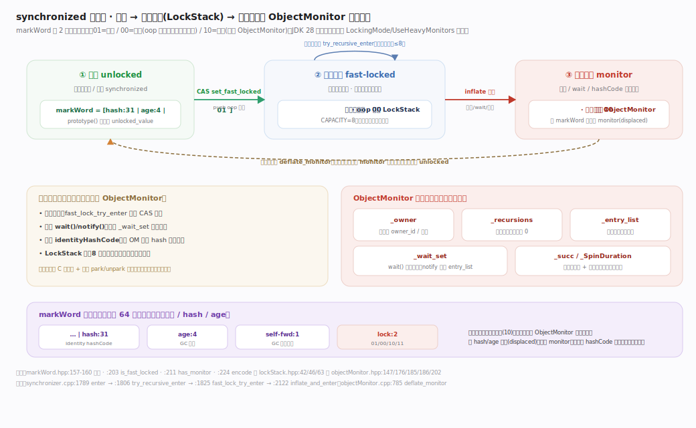
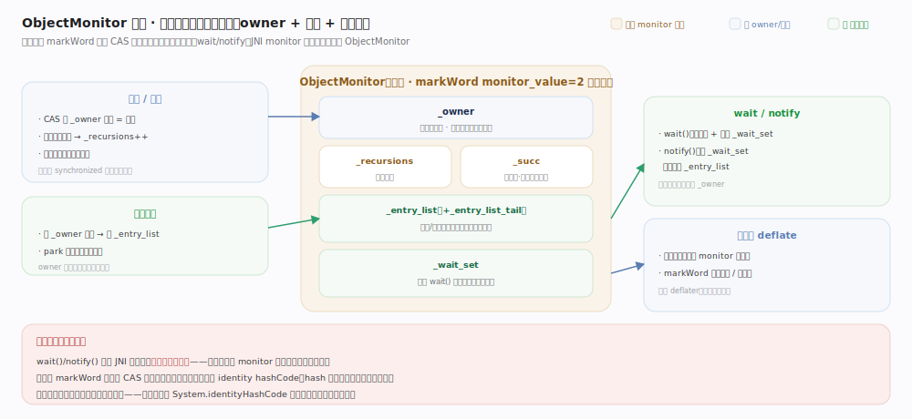
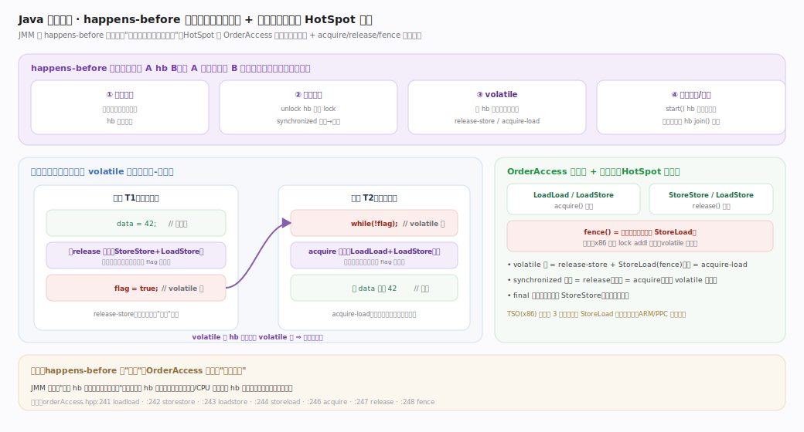

# OpenJDK / HotSpot 核心原理 · 支撑能力域 · 同步与 Java 内存模型

> **定位**：`synchronized` 与内存可见性的底层实现，属"横切协调"能力域。HotSpot 把锁做成**分级**的：无竞争走线程私有的**轻量级锁栈 LockStack**（CAS，极快），出现竞争才**膨胀**成重量级 **ObjectMonitor**（依赖 OS 互斥 / park-unpark 阻塞队列）；锁状态就地编码在对象头 **markWord**（依赖"对象模型"主线的头字布局）。**JMM（Java 内存模型）** 用 happens-before 规定多线程可见性与有序性，JVM 据此在编译期（尤其 C2）与运行期插入**内存屏障**约束重排序。核实基准：`runtime/synchronizer.cpp`、`runtime/objectMonitor.cpp`、`runtime/lockStack.hpp`、`oops/markWord.hpp`、`runtime/orderAccess.hpp`（JDK 28）。

## 一、锁膨胀阶梯：无锁 → 轻量级 → 重量级

**分级思想**：绝大多数运行时的 `synchronized` 其实**无竞争**，为它们统统付重量级锁（系统调用、内核阻塞队列、上下文切换）是巨大浪费。故 HotSpot 按竞争程度分级、代价随竞争递增：

1. **无竞争 · 轻量级锁 LockStack**：每线程私有持锁栈 `LockStack`（`lockStack.hpp:42`，容量固定 8 `:46`），`monitorenter` 把对象压栈（`:91`）并 CAS 把 markWord 锁位标 `locked`(=0)，加解锁只是 CAS + 压/弹栈，**全程无系统调用、无跨线程交互**——源码里是 `quick_enter`（`synchronizer.cpp:2372`）由解释器/JIT 内联的最快路径。
2. **常规进入 enter**：`ObjectSynchronizer::enter`（`:1789`）/`exit`（`:1849`）先试轻量 CAS，栈满（>8 层嵌套）或竞争则转膨胀。
3. **出现竞争 · 膨胀 inflate**：另一线程抢同一锁而无法简单 CAS 时，分配堆外 `ObjectMonitor`、markWord 改指向它（锁位 `monitor`=2），入口 `inflate_and_enter`（`:446`）。原因编码为 `InflateCause`（`synchronizer.hpp:78-83`）——**调用 `wait()`/`notify()` 或从 JNI `MonitorEnter` 进入会强制膨胀**（这些语义只有重量级 monitor 能表达）。
4. **重量级 ObjectMonitor**：`enter`（`objectMonitor.cpp:499`）/`exit`（`:1476`）/`wait`（`:1732`）/`notify`（`:2108`），未获锁线程进阻塞队列，依赖 OS 互斥与 `park`/`unpark`。

> **JDK 28 已移除偏向锁**：默认是轻量级锁（LockStack），竞争即膨胀为 ObjectMonitor——从历史的"偏向→轻量→重量"三级简化为干净的"轻量→重量"两级（偏向锁撤销在多核 NUMA 下代价高、收益已被 LockStack 快路径覆盖）。

## 二、ObjectMonitor 内部：owner / 队列 / 重入计数

膨胀后的 `ObjectMonitor`（`runtime/objectMonitor.hpp`）：**`_owner`** 当前持有者（隔到独立缓存行 `:103-138` 减少伪共享）、**`_recursions`**（`:52`）重入计数（归零才真正释放，这就是 `synchronized` 可重入的实现）、**入口队列/等待集**（`wait` `:1732` 释放锁并挂起、`notify` `:2108` 把等待者移回入口）、**去膨胀 deflate**（`:785`）把长期不竞争的 monitor 回收、markWord 恢复无锁/轻量态。字段协作与「`wait()`/`notify()`、JNI 进入的锁一定是重量级的」这条因果见图。

## 三、markWord：锁状态的编码位置

锁状态就存在对象头第一字 markWord 里（`oops/markWord.hpp`，详见"对象模型"主线），锁位 2 bit 区分：

| markWord 锁位取值 | 含义 | markWord 其余部分存什么 |
|---|---|---|
| `unlocked_value=1`（`markWord.hpp:158`） | 无锁 | identity hash（`:121 hash_bits`）+ GC age（`:126 age_shift`） |
| `locked_value=0`（`markWord.hpp:157`） | 轻量级锁 | 指向持锁线程 LockStack 上的记录 |
| `monitor_value=2`（`markWord.hpp:159`） | 已膨胀 | 指向堆外 ObjectMonitor |

一字多用（锁位/hash/age 与 Klass 指针挤在头字，`:150 klass_shift`）让无锁对象零额外内存、有锁对象就地记录——体现 HotSpot 内存税最小化哲学。代价：**一旦对象计算过 identity hashCode，就不能再走轻量级锁**（hash 占了本要放锁记录的位）只能直接膨胀——这是"给对象调用 `System.identityHashCode` 后同步变慢"的底层原因。

## 四、Java 内存模型：可见性与有序性契约

锁不只是互斥，还是**内存可见性**的保证。JMM 用 **happens-before（hb）** 规定："若 A hb B，则 A 之前的写对 B 可见，且不能被重排到 B 之后"。关键规则：

- **监视器规则**：对一把锁的解锁 hb 后续对同一锁的加锁——所以出临界区前的写，进临界区的线程一定能看见。
- **volatile 规则**：volatile 写 hb 后续对同一变量的 volatile 读。
- **final 字段**：正确构造（this 未逸出）下，final 字段的初始化对其他线程可见（安全发布）。
- **线程启动 / 终止**：`Thread.start()` hb 新线程内的动作；线程内动作 hb 其他线程 `join()` 的返回。
- **传递性**：hb 可传递串联。

JMM 是"允许 JVM/CPU 做哪些重排"的**规范**，`synchronized`/`volatile` 是程序员表达 happens-before 的**手段**。HotSpot 据 JMM 在恰当处插入**内存屏障**：acquire/release 语义由 `runtime/orderAccess.hpp:69` 一族原语成对表达（release-store 发布、load-acquire 观察，`:73-95`），volatile 写后需 StoreLoad 全屏障。这些屏障既约束 **CPU 乱序**也约束 **C2 指令重排**（C2 把内存序建模进 sea-of-nodes 的内存边，见"分层编译"主线）。

## 拓展 · 三级锁形态对比

| 形态 | markWord 锁位 | 数据结构 | 开销 | 触发条件 |
|---|---|---|---|---|
| 无锁 | `unlocked_value=1` | 头字存 hash/age | 零 | 从未加锁 |
| 轻量级锁 | `locked_value=0` | 线程私有 LockStack（`lockStack.hpp:46 CAPACITY=8`） | CAS + 压栈，纳秒级 | 无竞争 `synchronized` |
| 重量级锁 | `monitor_value=2` | 堆外 ObjectMonitor（`_owner`/`_recursions`/队列） | park/unpark + 上下文切换 | 竞争、wait/notify、JNI monitor、hash 已占位 |

## 调优要点

- `-XX:LockingMode=<n>`：切换锁实现（当前默认为轻量级 LockStack 模式；另有传统 legacy 模式与仅重量级 monitor 模式）。生产极少动。
- `-XX:+UseHeavyMonitors`：强制所有锁直接走重量级 ObjectMonitor（调试 / 排查用，会显著变慢，勿用于生产）。
- `-XX:+PrintConcurrentLocks`（线程转储含 j.u.c 锁信息）辅助排查死锁 / 争用。
- 应用层：优先 `java.util.concurrent`（`ReentrantLock`、原子类）而非裸 `synchronized`——更细粒度、可中断、可超时；缩小锁范围与持锁时间降低膨胀概率；无共享则无需同步。
- C2 逃逸分析可**锁消除**（不逃逸对象上的锁直接去掉）与**锁粗化**（相邻小锁合并）——写出"对象不逃逸"的代码可让 JIT 帮你去锁（见"分层编译"主线的逃逸分析）。

## 常见误区

- **"JDK 还有偏向锁"**：JDK 28 已移除；现在是轻量级 → 重量级两级。
- **"synchronized 一定慢"**：无竞争时是 CAS 快路径（`quick_enter`），很轻；只有竞争 / wait-notify / JNI monitor 才膨胀变重。
- **"volatile 保证原子性"**：只保证可见性与有序性（happens-before），**不保证**复合操作（如 `i++`）的原子性。
- **"加了锁就没有可见性问题"**：可见性来自 happens-before；只有正确**配对**加解锁 / 使用 volatile 才建立 hb，错配依然可能读到旧值。
- **"调用 hashCode 不影响同步"**：一旦对象存了 identity hash，头字被占，后续同步只能直接膨胀为重量级锁。

## 一句话总纲

**HotSpot 把 synchronized 做成分级锁：无竞争时锁记录压入线程私有 LockStack 走 CAS 快路径（quick_enter），出现竞争、wait/notify 或 JNI monitor 才膨胀成带 `_owner`/`_recursions`/阻塞队列、依赖 OS park-unpark 的重量级 ObjectMonitor，锁状态（含 hash/age）就地编码在对象头 markWord 的 2 位锁位里；JMM 用 happens-before 规定多线程可见性与有序性、JVM 据此在 C2 与运行期插入 acquire/release 及全屏障约束重排序——用"简单并发原语 + 可移植内存语义"换开发便利，用"锁分级 + 锁消除 + 就地编码"把竞争、屏障与内存的代价压到最小。**
