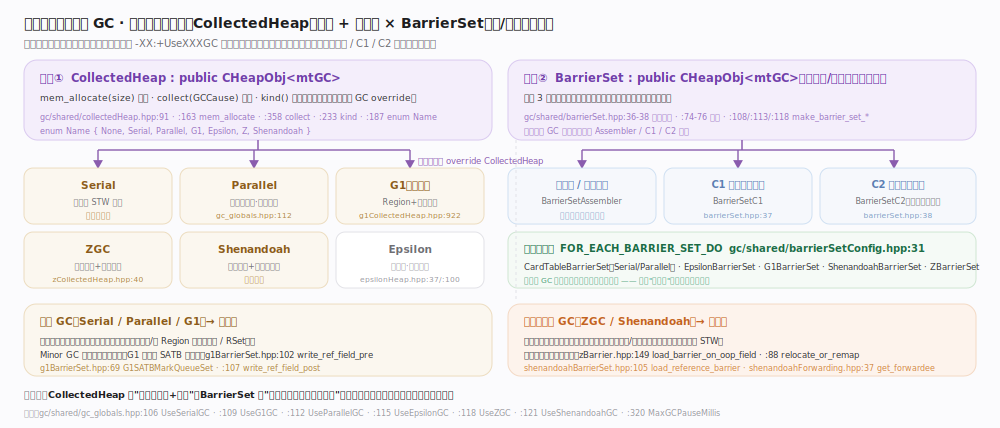
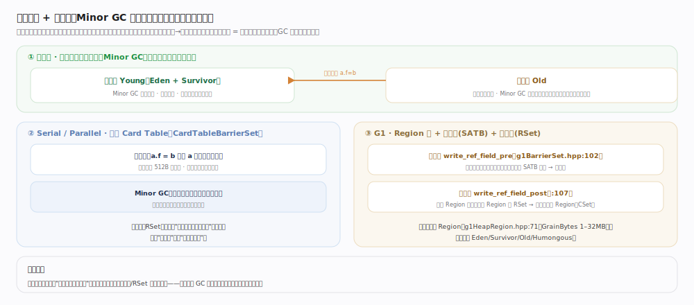
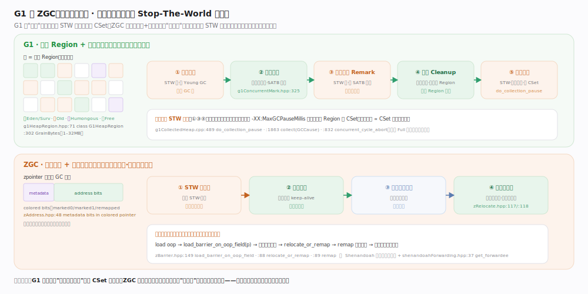

# OpenJDK / HotSpot 核心原理 · 支撑能力域 · 垃圾回收与可插拔 GC

> **定位**：自动内存管理是 HotSpot 让 Java "无需手动 free" 的支柱。HotSpot 没有把某一款收集器写死在虚拟机里，而是把垃圾回收抽象成两个纯虚接口——`CollectedHeap`（谁来分配、谁来回收整个堆）与 `BarrierSet`（对象引用的读/写如何插桩），执行引擎（解释器、C1、C2）只依赖这两个抽象。启动时按 `-XX:+UseG1GC` / `-XX:+UseZGC` 等开关择一具体实现装配进来。分代 GC（Serial/Parallel/G1）依赖"弱分代假说"用写屏障维护跨代引用；并发 GC（G1 的并发标记、ZGC/Shenandoah 的并发重定位）用读/写屏障让回收线程与业务线程并跑，把 Stop-The-World 停顿从"扫整堆"压缩到"扫根+若干快照增量"。核实基准：`gc/shared/collectedHeap.hpp`、`gc/shared/barrierSet.hpp`、`gc/shared/barrierSetConfig.hpp`、`gc/{serial,parallel,g1,z,shenandoah,epsilon}/`（JDK 28）。

## 一、可插拔抽象：CollectedHeap + BarrierSet

"可插拔"的根是两条正交抽象轴，任一 GC 都要补齐两块拼图：

- **分配与回收轴 `CollectedHeap`**（`collectedHeap.hpp:91`）：三个纯虚函数钉死 GC 必答——`mem_allocate(size)`（`:163`，TLAB 之上的慢路径各 GC 覆写）、`kind()`（`:233`，返回枚举 `Name{None,Serial,Parallel,G1,Epsilon,Z,Shenandoah}` `:187`）、`collect(GCCause)`（`:358`）。极端例子 `EpsilonHeap`（`epsilonHeap.hpp:37`）的 `collect`（`:100`）几乎什么都不做，是"抽象够薄"的活标本。
- **对象访问轴 `BarrierSet`**（`barrierSet.hpp`）：描述"每次读写引用字段时 GC 顺带做什么"，前向声明三个协作者 `BarrierSetAssembler/C1/C2`（`:36-38`）分别把屏障插到**解释器/模板汇编、C1、C2**三条路径，由工厂 `make_barrier_set_*`（`:108/:113/:118`）在选定 GC 后装配。故同一段 `obj.field=other` 在不同 GC 下编译出带不同屏障的机器码。

编译期清单集中在 `barrierSetConfig.hpp:31 FOR_EACH_BARRIER_SET_DO` —— 加一款 GC 就登记一个屏障实现（CardTable/Epsilon/G1/Shenandoah/Z）。

## 二、分代假说与写屏障（Serial / Parallel / G1）

**弱分代假说**（多数对象朝生夕死）把堆分新生代/老年代。难点：回收新生代若只扫新生代会漏掉"老年代→新生代"跨代引用，扫全老年代又丢了成本优势。解法是**写屏障 + 记忆集**：Serial/Parallel 用**卡表**（512B 一卡，写屏障标脏，Minor GC 只扫脏卡，即 `CardTableBarrierSet`）。G1 把堆切成等长 **Region**（`g1HeapRegion.hpp:71`，`GrainBytes` 1–32MB），写屏障分两段：**前屏障** SATB `write_ref_field_pre`（`g1BarrierSet.hpp:102`）并发标记期把旧值入队防漏标；**后屏障** `write_ref_field_post`（`:107`）记跨 Region 引用到 RSet，使 G1 能只回收部分 Region（CSet）而非全堆。

## 三、并发标记与增量停顿（G1）

G1 追求"可预测停顿"：按 `-XX:MaxGCPauseMillis` 挑回报最高的一批 Region 组成 CSet，一次 STW 内疏散，**停顿 ∝ CSet 大小而非堆大小**。并发标记 `G1ConcurrentMark`（`g1ConcurrentMark.hpp:325`）分四阶段：初始标记（搭 Young GC 短 STW 标根）→ 并发标记（与业务并跑，SATB 前屏障兜漏标）→ 最终标记 Remark（短 STW 清 SATB 残留 + 弱引用）→ 清理 Cleanup（统计存活、回收整块空 Region）；对象复制在随后的疏散停顿 `do_collection_pause`（`g1CollectedHeap.cpp:489`）。关键：**G1 把最重的"标记全堆"并发化，只把"复制存活对象"留在 STW 且被 CSet 限流**——代价是写屏障更重、吞吐略降。`System.gc()` 走 `collect`（`:1863`），退化 Full 前先 `concurrent_cycle_abort`（`:832`）。

## 四、着色指针与并发重定位（ZGC / Shenandoah）

超大堆下 G1 的 STW 疏散仍可能超毫秒。ZGC/Shenandoah 把**对象复制本身**也并发化，STW 只剩根扫描，停顿与堆大小近乎无关（亚毫秒），靠的是**读屏障**——每次从堆读引用时先"修正"它。

- **ZGC：着色指针 + 加载屏障**。GC 状态编码进**指针高位元数据位**（`zAddress.hpp:48`，marked/remapped 等"颜色"）。读引用经 `load_barrier_on_oop_field`（`zBarrier.hpp:149`）：若颜色显示对象已搬走，当场 `relocate_or_remap`（`:88`）按转发表重映射或协助搬迁（复制/转发由 `zRelocate.hpp:117/:118`），业务读到的引用因此"自愈"为最新地址。
- **Shenandoah：转发指针 + 读引用屏障**。每个对象前放转发指针，并发疏散先复制再把旧对象转发指针指向副本；读引用经 `load_reference_barrier`（`shenandoahBarrierSet.hpp:105`）重定向到 `get_forwardee`（`shenandoahForwarding.hpp:37`）的最新副本，标记期同样用 SATB `satb_enqueue`（`:99`）兜漏标。

两者殊途同归：**用读屏障把"对象已移动"对业务透明化**，从而把复制搬出 STW。

## 深化

- **屏障是"GC 与执行引擎的合同"**。一段 Java 代码可能先解释执行、后被 C1/C2 编译，三条路径的机器码都必须含语义一致的屏障，否则并发 GC 会漏改指针、读到旧对象。`BarrierSetAssembler/C1/C2`（`barrierSet.hpp:36-38`）就是把同一份屏障语义翻译成三种代码形态的适配器，`make_barrier_set_*`（`:108/:113/:118`）在选定 GC 后一次性装配。这也是 ZGC/Shenandoah 依赖编译器协同的原因——读屏障出现在每次引用加载上，必须被 C2 高度优化否则吞吐塌陷。
- **写屏障 vs 读屏障的分野**。分代 GC（Serial/Parallel/G1）主要用**写屏障**：写少读多，把成本压在较稀疏的引用写入上，配合卡表/RSet 缩小扫描面。并发重定位 GC（ZGC/Shenandoah）必须用**读屏障**：因为要在业务读到旧引用的瞬间纠正它，读远多于写，故读屏障的每一条指令都是性能敏感点，这正是着色指针（把判断压成几条位运算）设计的动机。
- **STW 究竟停在哪**。三代演进的主线是"把可并发的阶段搬出 STW"：Parallel 全程 STW 但多线程并行压时长；G1 把"标记"并发化、只 STW 疏散且限流 CSet；ZGC/Shenandoah 连"疏散/重定位"也并发化、只 STW 根扫描。停顿的下界最终由"必须暂停业务才能安全完成的根处理"决定。
- **可插拔的边界代价**。抽象带来灵活，但 `mem_allocate`、屏障等都在最热路径上，虚函数/间接跳转会伤性能。HotSpot 的做法是：分配快路径在编译期内联、屏障由 `BarrierSetAssembler` 直接生成内联机器码，只有慢路径才走虚函数——抽象在冷路径、内联在热路径，是"可插拔"不拖累吞吐的关键工程折衷。

## 拓展

各收集器定位对比（面向不同的停顿/吞吐/堆规模取舍）：

| 收集器 | 开关 | 停顿特征 | 吞吐 | 适用堆规模 | 核心机制锚点 |
| --- | --- | --- | --- | --- | --- |
| Serial | `-XX:+UseSerialGC` | STW，单线程 | 中（小堆无并行开销） | 小（<100MB～数百MB） | CardTableBarrierSet；分代复制/标记整理 |
| Parallel | `-XX:+UseParallelGC` | STW，多线程并行 | **最高**（吞吐优先） | 中大 | 卡表；`gc/shared/gc_globals.hpp:112 UseParallelGC` |
| G1 | `-XX:+UseG1GC`（默认） | 可预测、软实时 | 高 | 中～大（几 GB～几十 GB） | Region+并发标记；`g1ConcurrentMark.hpp:325`、`g1HeapRegion.hpp:71` |
| ZGC | `-XX:+UseZGC` | **亚毫秒**，与堆无关 | 中高 | **超大**（几百 GB～TB） | 着色指针+加载屏障；`zBarrier.hpp:149`、`zAddress.hpp:48` |
| Shenandoah | `-XX:+UseShenandoahGC` | 亚毫秒～低毫秒 | 中高 | 大～超大 | 转发指针+读引用屏障；`shenandoahBarrierSet.hpp:105` |
| Epsilon | `-XX:+UseEpsilonGC` | 无回收即无 GC 停顿 | 极高（无屏障负担） | 短命/压测/无 GC 场景 | 只分配不回收；`epsilonHeap.hpp:37/:100` |

各 GC 的开关集中在 `gc/shared/gc_globals.hpp`：`:106 UseSerialGC`、`:109 UseG1GC`、`:112 UseParallelGC`、`:115 UseEpsilonGC`、`:118 UseZGC`、`:121 UseShenandoahGC`；停顿目标 `:320 MaxGCPauseMillis`。

## 调优要点

- **选型开关**：`-XX:+UseG1GC`（默认，均衡）、`-XX:+UseParallelGC`（批处理/吞吐优先，能容忍较长停顿）、`-XX:+UseZGC`（大堆低延迟）、`-XX:+UseShenandoahGC`（大堆低延迟，OpenJDK 发行版需含该模块）、`-XX:+UseSerialGC`（容器小堆/单核）。多个开关互斥，同开会报错。
- **堆大小**：`-Xms` 与 `-Xmx` 建议设成相等，避免运行期堆伸缩带来的额外 Full GC 与页面提交抖动；容器里配合 `-XX:MaxRAMPercentage` 按份额取堆。
- **停顿目标**：G1 用 `-XX:MaxGCPauseMillis=N`（对应 `gc/shared/gc_globals.hpp:320`）作软目标——它是"尽力而为"，设得过低会导致 CSet 变小、GC 变频、吞吐下降，并非越小越好。
- **Region 粒度**：G1 可用 `-XX:G1HeapRegionSize` 覆盖 `GrainBytes` 默认值，大对象多时适当调大以减少 Humongous 分配。
- **实验/压测**：`-XX:+UseEpsilonGC`（需 `-XX:+UnlockExperimentalVMOptions`）让 JVM 只分配不回收，用于测量"无 GC 干扰"下的分配吞吐，或运行注定在堆耗尽前退出的短命任务。
- **观测**：统一用 `-Xlog:gc*`（Unified Logging）打印各阶段耗时，定位停顿是卡在标记、疏散还是根扫描。

## 常见误区

- **"选个低延迟 GC 就一定更快"**：ZGC/Shenandoah 换来低停顿的代价是读屏障开销与略低吞吐；吞吐敏感的批处理反而 Parallel 更优。延迟与吞吐是权衡，没有全局最优。
- **"`MaxGCPauseMillis` 设得越小停顿越短"**：它是软目标。设过低会让 G1 缩小 CSet、更频繁 GC，累计开销上升，甚至更容易退化 Full GC。
- **"`System.gc()` 能立刻清干净"**：它只是把原因交给 `collect(GCCause::Cause)`（如 `g1CollectedHeap.cpp:1863`），是否/何时/怎么回收由 GC 决定，且可能触发昂贵的 Full GC；生产环境常用 `-XX:+DisableExplicitGC` 屏蔽。
- **"分代 GC 不用管跨代引用"**：恰恰相反，卡表/RSet 与写屏障就是为跨代引用而生；没有它们，Minor GC 会漏活对象或被迫扫全堆。
- **"读屏障只是读一下没成本"**：ZGC/Shenandoah 的读屏障出现在每一次引用加载上，是最热的指令；着色指针把它压成位运算、依赖 C2 优化，才让它可承受。
- **"Epsilon 没用"**：它是验证 `CollectedHeap` 抽象是否足够解耦的基准实现，也是隔离 GC 干扰做分配基准测试、跑短命作业的正经工具。

## 一句话总纲

**HotSpot 把垃圾回收抽象成 `CollectedHeap`（分配+回收）与 `BarrierSet`（读/写屏障插桩到解释器/C1/C2）两条正交接口，启动时按 `-XX:+UseXXXGC` 择一装配；分代 GC 用写屏障+卡表/RSet 缩小扫描面，G1 用 Region+并发标记把"标记"搬出 STW，ZGC/Shenandoah 再用着色指针/转发指针+读屏障把"重定位"也并发化——三代演进的同一主题，就是不断把可并发的阶段从 Stop-The-World 里挪走。**
