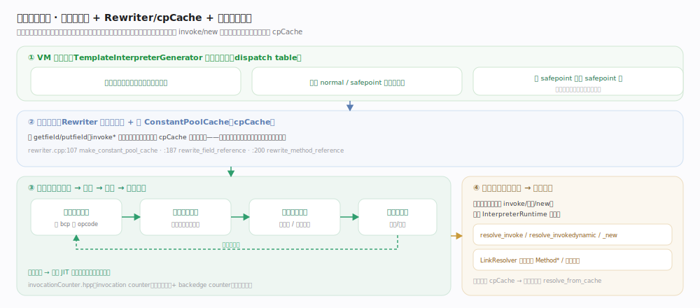
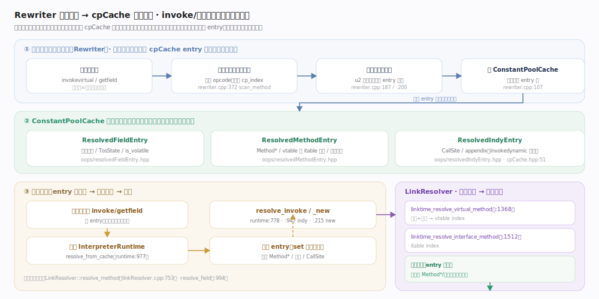

# OpenJDK / HotSpot 核心原理 · 支撑能力域 · 字节码解释器

> **定位**：执行引擎的**第 0 级**（`CompLevel_none`）。它让方法**启动即可执行、无需预热**，代价是每条字节码逐条解释、慢。HotSpot 用**模板解释器**：VM 启动时为每条字节码运行期生成一段本机机器码模板，装入派发表；解释循环靠"取码 → 查表跳转 → 执行"高速运转，同时累计热度计数器，超阈就把方法交给 JIT。核实基准：`interpreter/templateInterpreter.cpp`、`interpreter/rewriter.cpp`、`interpreter/interpreterRuntime.cpp`、`interpreter/linkResolver.cpp`（JDK 28）。

## 一、解释循环与两张派发表

**为什么是"模板"解释器而非 switch 大循环**：VM 启动期 `TemplateTable::initialize`（`templateInterpreter.cpp:61`）登记每条字节码的机器码生成器，`TemplateInterpreterGenerator` 为**每条字节码即时生成一小段本机机器码**（codelet）填进派发表（填表在 `templateInterpreterGenerator.cpp:278`，每 opcode 按九种栈顶状态 TosState 各生成一入口 `:306`）。解释执行时"读 opcode → 派发表取机器码入口 → 跳过去执行 → 取下一条"——**这一计算跳转避免了大 switch 的分支预测惩罚**。

**两张派发表**：正常表 `_normal_table` + 安全点表 `_safept_table`（`templateInterpreter.hpp:130-132`）。需进安全点时 `notice_safepoints()` 把活动表整表切到 safepoint 表（`templateInterpreter.cpp:318`），结束再切回。安全点表每条入口多一段"是否需暂停"逻辑，于是**解释循环在每条字节码边界都能被安全暂停**，而热路径无需恒定检查——这是解释器与 safepoint（GC/deopt）的接口。计数与升级由 `InvocationCounter`（`invocationCounter.hpp:36`）累计调用/回边计数，越阈提交编译请求、回边越阈触发 OSR（详见分层编译主线）。另有平台无关的 Zero C++ 解释器（用计算 goto 派发）作可移植兜底，接口一致但慢得多。

## 二、Rewriter 与 cpCache：把"解析一次"变"缓存复用"

类链接后 `Rewriter` **一次性改写字节码**并建 **ConstantPoolCache**：`scan_method`（`rewriter.cpp:372`）登记每处 `invoke*`/字段访问的常量池索引，`rewrite_field_reference`（`:187`）/`rewrite_method_reference`（`:200`）把操作数从"常量池符号索引"就地改成"cpCache 间接索引"，`make_constant_pool_cache`（`:107`）分配 `ConstantPoolCache`（`oops/cpCache.hpp:51`）。cpCache 按引用种类存三张解析结果表：`ResolvedFieldEntry`（字段偏移/栈顶状态/is_volatile）、`ResolvedMethodEntry`（`Method*`/vtable 或 itable 索引）、`ResolvedIndyEntry`（`invokedynamic` 的 CallSite）。不变量：**符号首次解析结果就地写进 entry，之后零重复解析**；把可变解析状态放进可写 cpCache，让 `ConstantPool` 保持只读、便于 CDS 归档。

## 三、首次执行触发的符号解析

解释器执行到**尚未解析**的 `invoke*`/字段/`new` 时（entry 解析标志为空），从机器码模板陷入 `InterpreterRuntime` 惰性解析：字段与普通调用走 `resolve_from_cache`（`interpreterRuntime.cpp:977`）→ `resolve_invoke`（`:778`）；`invokedynamic` 走 `resolve_invokedynamic`（`:947`）并把 CallSite 写回 `ResolvedIndyEntry`；`new` 走 `_new`（`:215`）触发目标类解析/初始化并分配。实际的"符号引用→直接引用"由 `LinkResolver` 完成：`resolve_method`（`linkResolver.cpp:753`）、`invokevirtual`→vtable 索引（`:1368`）、`invokeinterface`→itable 索引（`:1512`）、`resolve_field`→字段偏移（`:994`），结果统一回填 cpCache。这体现**懒解析**：绝大多数引用直到首次执行到才解析并缓存，摊平类装入成本、也避免永不执行分支的无谓解析。

## 深化

- **派发表为何要"运行期生成机器码"**：字节码语义在不同 CPU 上要落成不同指令序列，模板生成器（`templateInterpreterGenerator.cpp`）在启动时按当前架构一次性 emit，之后解释循环只跳转不再判架构；这也是解释器"零 JIT 依赖即可跑"的根基。
- **TosState 与"栈顶缓存"**：模板解释器把操作数栈顶元素尽量保留在寄存器里，每条字节码入口按"进入时栈顶类型 → 退出时栈顶类型"分成九种变体（见 `set_entry_points` 对 vtos/itos/ltos/... 的分派），减少访存。这也是同一 opcode 在派发表里有多个入口的原因。
- **两张表的极简同步**：安全点切换只是整表拷贝（`copy_table`），解释循环本身完全无锁、不判标志——把"是否要停"外移到派发表选择，是把安全点开销从每指令降到"仅切表一次"的关键设计。
- **cpCache 与重定义/CDS**：把解析结果放进可写的 cpCache 而非只读 ConstantPool，既支持 RedefineClasses 时清缓存重解析，也让 ConstantPool 可被 CDS 只读映射多进程共享。

## 拓展

| 维度 | 模板解释器（默认） | C++/Zero 解释器 | JIT 编译代码（C1/C2） |
| --- | --- | --- | --- |
| 派发方式 | 派发表跳机器码模板 | 计算 goto / switch | 无派发，直接机器码 |
| 生成时机 | VM 启动期 emit | 编译期固定 | 运行期按热点编译 |
| 启动速度 | 快，无需预热 | 快 | 慢（要预热/编译） |
| 峰值性能 | 低 | 最低 | 高 |
| 可移植性 | 需各架构汇编模板 | 纯 C++，任意架构 | 需各架构后端 |
| 典型用途 | 冷代码、预热期、兜底 | 无汇编模板的移植架构 | 热点方法 |

## 调优要点

- `-Xint`（`runtime/arguments.cpp:2271`）：**纯解释执行**、关闭 JIT，用于排查 JIT bug 或极致快启动的短命进程；`-Xmixed`（`arguments.cpp:2275`，默认）解释+编译混合；`-Xcomp`（`arguments.cpp:2278`）尽量全编译，牺牲启动换峰值。
- `-XX:CompileThreshold=N`（`runtime/globals.hpp:1666`，`product_pd`）：非分层模式下方法调用/回边计数升级 JIT 的阈值；分层编译（默认 `TieredCompilation`）下改由各层独立阈值控制，调这个值意义不大。
- `-XX:TieredStopAtLevel=1`：只到 C1，跳过 C2，适合启动敏感、峰值不敏感的服务。
- `-XX:+PrintInterpreter`（`runtime/globals.hpp:1114`，DIAGNOSTIC）：打印生成出的解释器 codelet 汇编，用于研究派发表/模板。
- 注意：现代 HotSpot 中模板解释器是**唯一的产品级解释器**（旧的 `UseTemplateInterpreter` 开关已随汇编解释器成为默认而移除，Zero 是独立构建变体，不能运行期切换）。

## 常见误区

- **"解释器就是个大 switch"**：HotSpot 是模板解释器，启动期为每条字节码生成机器码并填派发表，靠计算跳转执行，比 switch 快得多。
- **"符号引用在类加载时全解析完"**：多为懒解析——解释器首次执行到 `invoke*`/字段/`new` 才解析，并把结果缓存进 cpCache 的对应 entry。
- **"解释器不参与安全点"**：解释器有专门的 safepoint 派发表，能在每条字节码边界安全暂停配合 GC/deopt。
- **"方法只有整个执行完才可能被编译"**：长循环可经 OSR（回边计数超阈）在方法执行中途切入编译代码。
- **"改 `-XX:CompileThreshold` 就能控制何时编译"**：仅在关闭分层编译时有效；默认分层模式下各层有各自阈值，该开关基本失灵。

## 一句话总纲

**字节码解释器是执行引擎的第 0 级：模板解释器在启动期为每条字节码生成机器码派发表，解释循环"取码 → 查表跳转 → 执行 → 累计热度"高速运转，安全点靠切换到第二张派发表实现零热路径开销的可暂停；Rewriter 在类链接后把字节码操作数改写为 cpCache 间接索引，首次执行时经 InterpreterRuntime + LinkResolver 惰性解析并回填 entry，从此零重复解析——它以"启动即可跑、无需预热"兜底，代价是解释慢，靠热点计数及时升级 C1/C2 与 OSR 缓解。**
