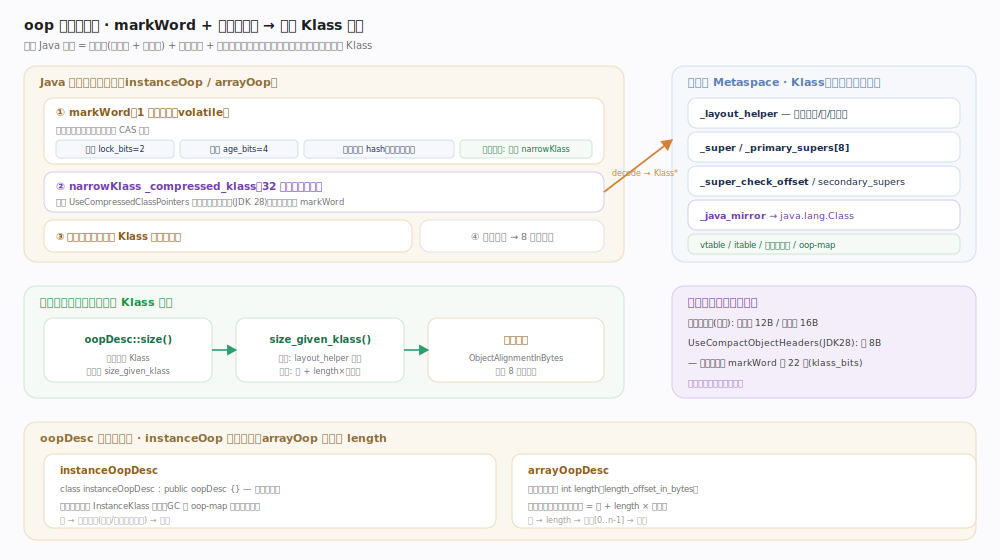
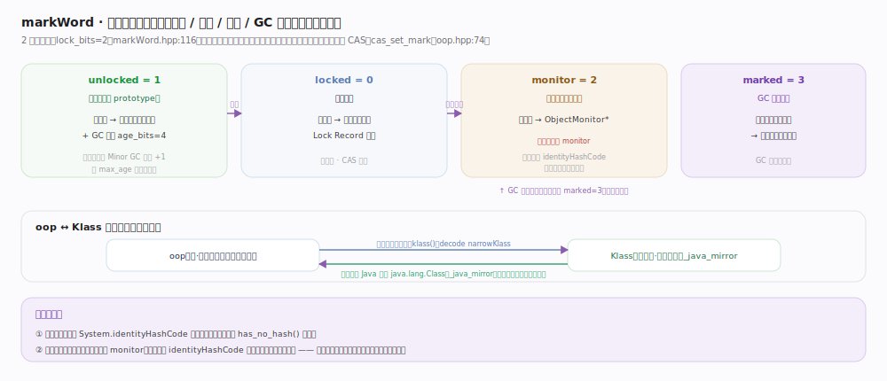
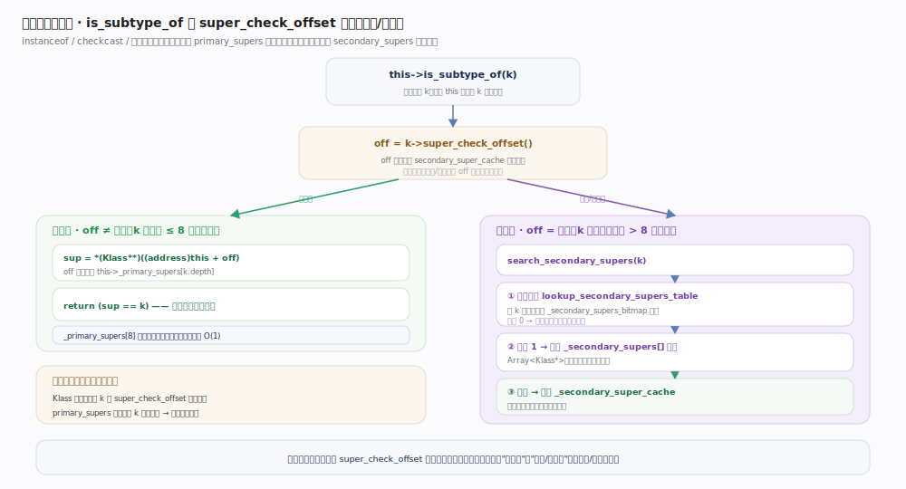

# OpenJDK / HotSpot 核心原理 · 支撑能力域 · 对象模型 oop-klass

> **定位**：本主线属于 HotSpot 的**对象表示能力域**，是"运行期数据表示"的地基。它向上被解释器/JIT、GC、反射、同步子系统依赖（取字段、扫描引用、算对象大小、做类型判定都要读这里的布局元数据）；向下依赖**类加载与链接**（Klass 由 ClassFileParser 建成）与 **Metaspace/堆**（Klass 存元空间、oop 存 Java 堆）。一句话：oop 是"堆上的实例数据"，Klass 是"元空间里的类型模板"，二者通过对象头里的（压缩）类指针相互勾连。

HotSpot 用两套指针把"数据"和"类型"分开：`oop` 指向 Java 堆上一个具体实例的数据；`Klass` 是描述该类的元数据模板，存放在元空间、一个类只有一份。任何 Java 对象都由**对象头 + 实例数据 + 对齐填充**组成，对象头里握有指回 `Klass` 的把柄——这就是对象模型的枢纽。

## 一、oop 与对象头：markWord + 压缩类指针

`oopDesc`（`oops/oop.hpp:47`）只有两个物理字段：`volatile markWord _mark`（`:50`，承载锁/GC 年龄/身份哈希等运行期元信息）与 `narrowKlass _compressed_klass`（`:51`，压缩类指针，指向所属 `Klass`）——合起来即"对象头"。关键不变量：**对象大小不落地** —— `oopDesc::size()`（`oop.inline.hpp:157`）每次经 `size_given_klass()`（`:161`）按 Klass 的 `layout_helper` 现算，取类型走 `klass()`（`:97`）解码 `narrowKlass`。markWord 位域见 `oops/markWord.hpp`（锁位 `lock_bits=2 :116`、年龄 `age_bits=4 :118`）。

## 二、markWord 四态复用：锁 / 哈希 / 年龄 / GC 转发

设计精髓：**用一个机器字复用地承载四类互斥状态，靠两位锁标签在它们之间切换语义**。标签与"高位存什么"联动 —— `unlocked=1` 存哈希+年龄、`locked=0` 存栈上 Lock Record 指针、`monitor=2` 存 `ObjectMonitor*`（哈希被搬进 monitor）、GC 阶段临时设 `marked=3` 把整字当转发指针。反直觉后果：**对象一旦膨胀过锁，读 `identityHashCode` 就不能再从对象头直接取**；身份哈希也是首次调用才惰性写入。修改标记字必走 CAS（`cas_set_mark` `oop.hpp:74`）。

## 三、Klass：类型模板与它的快速判定字段

`Klass`（`oops/klass.hpp:62`）的字段被精心编排来服务**取大小**与**子类型判定**两个高频操作：

- `jint _layout_helper`（`:114`）：一个 `jint` 把"实例还是数组 / 头多大 / 元素多宽"三件事编码进一个数——实例类为正（对齐后字节数）、数组类为负（高两位是数组标签），故"数组长度算总大小"退化成一次移位加法。编码常量 `:459` 起（`_lh_header_size_shift :465`、`_lh_element_type_shift :463`），工厂 `array_layout_helper() :531`；`InstanceKlass::size_helper()`（`instanceKlass.hpp:971`）由它反解实例大小。
- `_super`（`:146`）super 链；`_primary_supers[8]`（`:142`，limit `:86`）把深度 ≤ 8 的祖先平铺缓存、深度作下标 O(1)；`_super_check_offset`（`:131`）指向"到哪核对子类型"；`_secondary_supers`/`_secondary_super_cache`（`:140`/`:138`）+ `_secondary_supers_bitmap`（`:162`）走接口与深祖先。
- `_java_mirror`（`:144`）：类对应的 `java.lang.Class`。这体现 oop↔Klass 的**双向关系**：oop 的类指针指向 Klass（"我是什么类型"），`_java_mirror` 反指回镜像 oop（"类型的 Java 镜像"），静态字段拼在镜像尾部。

## 四、快速子类型检查：一次判定为何常常只读一个字

`instanceof`/`checkcast`/数组存储检查由 `Klass::is_subtype_of`（`oops/klass.inline.hpp:111`）实现，巧在**用同一段代码分流两种情况**：取 `off = k->super_check_offset()`，若等于 `_secondary_super_cache` 偏移走慢路径，否则读 `*(this+off) == k`（快路径一次读比）。

- **快路径**（深度 ≤ 8 的普通类）：`k` 的 `_super_check_offset` 恰等于 `_primary_supers[depth]` 偏移，故只读一个字比一次相等——绝大多数向下转型只花几条指令的原因。
- **慢路径**（接口/深祖先）：`search_secondary_supers`（`klass.inline.hpp:159`）先查哈希位图 `lookup_secondary_supers_table`（`:124`）——位为 0 一次位运算判否，位为 1 再核对 `_secondary_supers` 数组并写回 `_secondary_super_cache`。这套"位图 + 数组"取代早期线性扫描（接口多时曾要遍历一长串），非 PRODUCT 构建还交叉校验防位图出错。

## 深化 · instanceOop 与 arrayOop 的分家

`oopDesc` 有两个特化：`instanceOopDesc`（`oops/instanceOop.hpp`）**不加任何字段**——实例布局全部由类一级的 `InstanceKlass`（`oops/instanceKlass.hpp:134`）描述（`_nonstatic_field_size :213`、oop-map `:215`、`_itable_len :216`），对象本体只是一段裸内存，这正是 oop/Klass 分离的空间收益。`arrayOopDesc`（`oops/arrayOop.hpp:43`）则多一个 `int length`（`:84`），因长度运行期才知、必须存进对象。GC 扫引用时实例走 `InstanceKlass` 的 oop-map（记录哪些偏移是引用），数组按元素类型批量扫。取大小：实例走 `size_helper()`（定长、可编译期常量化），数组走 `size_given_klass()`（`oop.inline.hpp:161`）现算。

| oop 种类 | C++ 类型 | 额外字段 | 大小来源 | 布局元数据 |
|---|---|---|---|---|
| 普通实例 | `instanceOopDesc` | 无 | `size_helper()`（定长） | `InstanceKlass` + oop-map |
| 数组 | `arrayOopDesc` | `int length` | 头 + length×元素宽 | `ArrayKlass` + layout_helper |
| 类镜像 | `instanceOopDesc` | 静态字段拼在镜像尾部 | 镜像专用 | `_java_mirror` 指回 Klass |

## 拓展 · 压缩指针与紧凑对象头（Project Lilliput）

64 位平台默认开启压缩省内存。`CompressedOops`（`oops/compressedOops.hpp:37`）把 64 位堆指针压成 32 位 `narrowOop`，靠 `_base`（`:42`）+ `_shift`（`:46`）编解码——`真实地址 = _base + (narrowOop << _shift)`，`_shift = log2(对象对齐)`（默认 8 字节即 shift=3，因地址低 3 位恒为 0），故 32 位 narrowOop 能寻址 `2^32 × 8 = 32GB`（"堆 > 32GB 压缩失效"之由来）。`CompressedKlassPointers`（`oops/compressedKlass.hpp:101`）同理压 `Klass*`，`_base` 取元空间区间起点。JDK 28 的**紧凑对象头** `UseCompactObjectHeaders` 把类指针内嵌进 markWord 高位（`klass_shift`/`klass_bits=22`，`markWord.hpp:149`），普通对象头从 12/16 字节压到 8 字节，是近年最重要的堆内存优化。

| 开关 | 作用 | 影响的字段 |
|---|---|---|
| `-XX:+UseCompressedOops` | 引用字段压成 32 位 | 堆内 oop 字段宽度 |
| `-XX:+UseCompressedClassPointers` | 类指针压成 narrowKlass | 对象头 `_compressed_klass` |
| `-XX:+UseCompactObjectHeaders` | 类指针内嵌 markWord | 去掉独立类指针字段，头缩到 8 字节 |
| `-XX:ObjectAlignmentInBytes=N` | 对象对齐粒度 | 决定 CompressedOops 的 shift 与寻址上限 |

## 调优要点

- **`-XX:+UseCompressedOops`**：64 位下默认开启，堆 < 32GB 时几乎免费省一半引用内存；堆逼近上限可调 `-XX:ObjectAlignmentInBytes` 抬高可寻址范围（代价是每对象多几字节对齐填充）。
- **`-XX:+UseCompressedClassPointers`**：控制对象头里的类指针是否压缩；关掉它类指针占满 64 位，对象头变大。
- **`-XX:+UseCompactObjectHeaders`**（JDK 28）：把类指针塞进 markWord，普通对象头 8 字节，对小对象密集的服务收益显著；需与压缩类指针一起工作。
- **`-XX:ObjectAlignmentInBytes`**：影响 CompressedOops 的 `_shift`，也直接决定 `oopDesc::size()` 的对齐补齐量。
- 排查对象内存占用时结合 JOL（Java Object Layout）看真实头大小，比空想位域更可靠。

## 常见误区

- **"对象大小存在对象里"**：错。大小不落地，`oopDesc::size()`（`oops/oop.inline.hpp:157`）每次按 Klass 的 layout_helper 现算，只有数组把 `length` 存进头后计算才需要读它。
- **"对象头永远 16 字节"**：随开关变化。默认压缩类指针时 12 字节（实例）或 16 字节（数组），开 `UseCompactObjectHeaders` 后普通对象头只 8 字节。
- **"instanceof 一定要遍历父类链"**：多数情况不遍历。深度 ≤ 8 的类走 `_primary_supers` 一次读比（`oops/klass.inline.hpp:111`），只有接口和深祖先才走 `search_secondary_supers` 慢路径。
- **"markWord 里一直存着哈希"**：身份哈希是**首次调用 `System.identityHashCode` 时才惰性写入**标记字的，之前 `has_no_hash()` 为真；一旦对象膨胀成重量级锁，哈希会被搬到 ObjectMonitor 里。
- **"oop 和 Klass 是一回事"**：不是。oop 是堆上具体实例的数据、每个对象一份；Klass 是元空间里的类型模板、全类唯一一份。前者靠对象头里的压缩类指针（`oops/oop.hpp:51`）指向后者，后者靠 `_java_mirror`（`oops/klass.hpp:144`）指回类的镜像对象，二者是"实例 ↔ 类型模板"的多对一关系。

## 一句话总纲

**oop 是堆上一段"头 + 数据"的裸内存、Klass 是元空间里描述其布局与类型的模板，二者靠对象头里的（可压缩、甚至可内嵌 markWord 的）类指针勾连，而 layout_helper 与 super_check_offset 这两个被精心编码的字段，让"算大小"和"判类型"这两个最热的操作大多降到读一个字的代价。**
