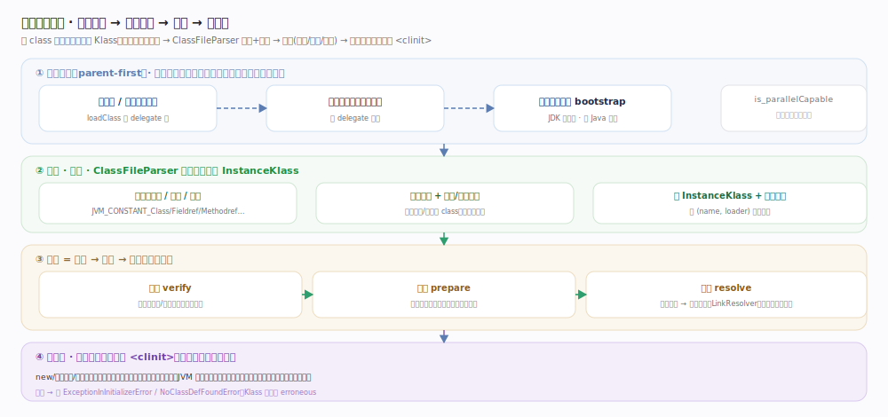
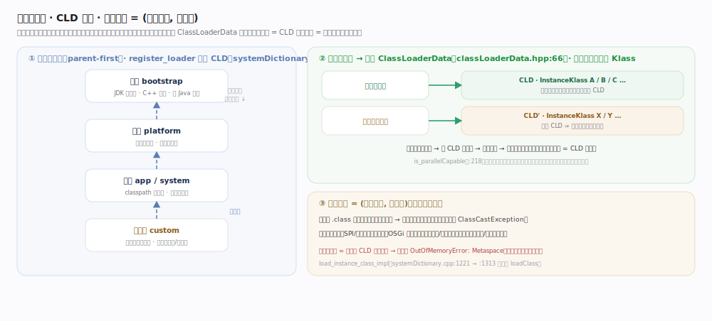
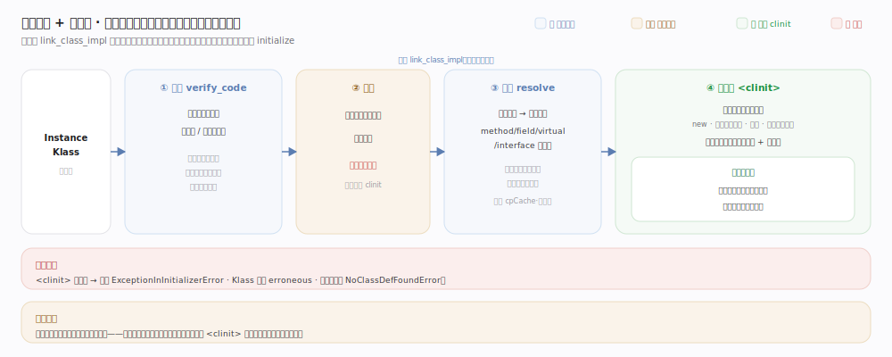

# OpenJDK / HotSpot 核心原理 · 支撑能力域 · 类加载与链接

> **定位**：把磁盘/网络上的 `.class` 字节流，变成 JVM 内部可执行的 `InstanceKlass` 元数据，属"执行引擎的供料口"能力域。四步：**双亲委派加载** → **ClassFileParser 解析 + 校验** → **链接（验证/准备/解析）** → **初始化 `<clinit>`**。它被"执行引擎"（解释器/JIT）依赖——没有 Klass，解释器无从取字节码；它又依赖"对象模型"（产物 InstanceKlass 是 Klass 元数据）与"元空间/ClassLoaderData"（Klass 的宿主与卸载单位）。核实基准：`classfile/systemDictionary.cpp`、`classfile/classFileParser.cpp`、`oops/instanceKlass.cpp`、`interpreter/linkResolver.cpp`（JDK 28）。

## 一、从委派到初始化的全链路

四步流水线：**委派加载 → ClassFileParser 解析+校验 → 链接(验证/准备/解析) → 首次主动使用触发 `<clinit>`**。入口 `SystemDictionary::resolve_or_null`（`systemDictionary.cpp:348`）→ 主函数 `resolve_instance_class_or_null`（`:569`）；`ClassFileParser`（`classFileParser.cpp:5315`）逐项解析常量池（`:166`）、结构/版本校验，再 `create_instance_klass`（`:5042`）→ `fill_instance_klass`（`:5063`）建成 `InstanceKlass` 按 (name, loader) 登记。不变量：加载、链接、初始化三段**分离且可懒惰**，解析甚至可懒到字节码首次执行。

## 二、加载器层级 · CLD 归属 · 类唯一性

双亲委派（parent-first）保证核心类总由引导加载器加载、杜绝伪造；每个加载器的类都挂在它的 `ClassLoaderData`（`classLoaderData.hpp:66`）下，故**类卸载 = CLD 整体回收**。关键不变量：**类唯一性 = (全限定名, 加载器)** —— 同名类被两个加载器各加载一份即互为不同类型（赋值抛 `ClassCastException`）。并行能力见 `is_parallelCapable`（`systemDictionary.cpp:218`），逐类名各一把锁。

## 三、链接三步：验证 → 准备 → 解析

链接由 `InstanceKlass::link_class_impl`（`oops/instanceKlass.cpp:971`）驱动，三段可懒惰：**验证** `verify_code`（`:949`）做字节码类型/栈映射校验（安全模型核心）；**准备**为静态字段分配空间并置**零值**（非用户初值）；**解析**把符号引用转直接引用（`LinkResolver::resolve_method` `linkResolver.cpp:753`、virtual `:1368`、interface `:1512`、`resolve_field :994`），可懒到首次执行到对应字节码。三步与初始化的分离/懒惰关系见图。

## 四、初始化 `<clinit>`

首次**主动使用**（new、访问静态成员、反射、子类触发父类）经 `InstanceKlass::initialize`（`:847`）→ `initialize_impl`（`:1258`）执行 `<clinit>`：**初始化锁保证只执行一次、父类先于子类**（见上图右栏）；成功置 `fully_initialized`（`:927`），抛异常则包装 `ExceptionInInitializerError`、Klass 标记 erroneous、后续使用抛 `NoClassDefFoundError`。

## 拓展 · 五种类加载器与可见性

| 加载器 | 加载什么 | 特点 |
|---|---|---|
| 引导 bootstrap | JDK 核心类（java.base 模块） | C++ 实现，无对应 Java 对象；委派链顶端 |
| 平台 platform | 平台模块类 | 委派给 bootstrap |
| 应用 app/system | classpath 上的应用类 | 默认加载器，委派给 platform |
| 自定义 | 按需（插件、热部署、字节码增强） | 可打破双亲委派；决定类可见性与相等性 |
| 类的唯一性 | —— | 由 `(全限定名, 加载器)` 共同决定，非仅名字 |

## 调优要点

- 打破双亲委派需谨慎（如 SPI/JDBC 的线程上下文类加载器、OSGi 子优先加载器）——易引入 `ClassCastException`（同名类被两个加载器各加载一份，互不相等）。
- 类加载器泄漏是长跑应用元空间 OOM（`OutOfMemoryError: Metaspace`）的常见根因：持有类加载器引用即钉住其加载的所有类，CLD 无法回收。
- CDS/AppCDS（类数据共享）归档常用类的已解析元数据，显著缩短启动与降低内存；`-Xshare:dump`/`-XX:SharedArchiveFile` 相关。
- `-verbose:class` / `-Xlog:class+load` 观察类加载来源，排查"加载了错误 jar 里的同名类"。

## 常见误区

- **"准备阶段就执行了静态初值赋值"**：不。准备只置零值，用户初值在初始化 `<clinit>` 才执行。
- **"类加载 = 加载 + 初始化一步到位"**：加载、链接、初始化是分离且可懒惰的三段；解析甚至可懒到字节码首次执行。
- **"同名类一定是同一个类"**：类的唯一性是 `(name, 加载器)`，不同加载器加载的同名类是不同类型，互相赋值抛 `ClassCastException`。
- **"双亲委派不可打破"**：可以（且框架常打破），但要理解由此带来的类可见性/相等性风险。

## 一句话总纲

**类加载器按双亲委派把 `.class` 字节流交给 ClassFileParser 解析校验并 create/fill 成 InstanceKlass（挂在加载器的 ClassLoaderData 下、按 (name, 加载器) 唯一），再经 link_class_impl 的验证/准备/解析完成链接（符号引用→直接引用，可懒惰到首次执行），首次主动使用时经 initialize_impl 线程安全地执行一次 `<clinit>`——这是执行引擎的供料口，用"按需动态加载 + 字节码校验 + 加载器隔离"换取可移植性与安全，代价是首次加载延迟与元空间内存。**
