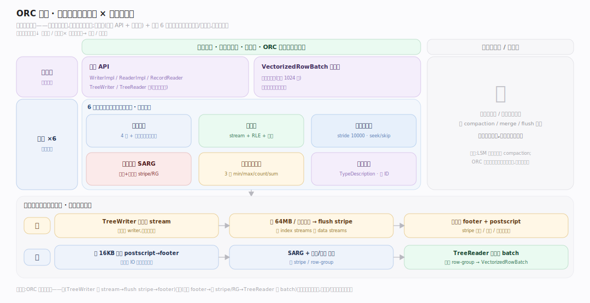
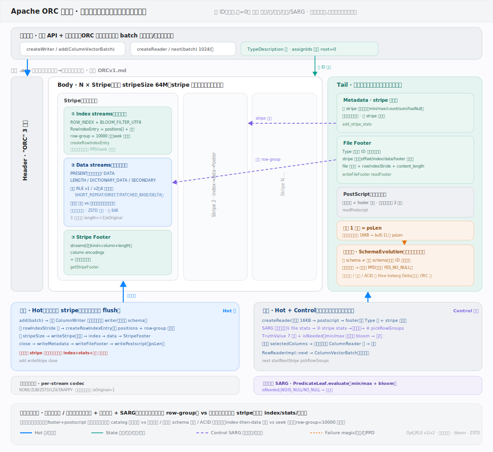

# ORC 原理 · 全景主线框架

> **定位**：统领全部原理文档。Apache ORC(Optimized Row Columnar)是**列式文件格式**(新家族:单个文件的磁盘字节布局规范 + 读写库,让一个文件把行数据按列存、带索引和统计能跳读——不是引擎、不是表格式)。世界观:**文件 = 按列组织的字节流 + 多级统计索引**;数据切成多个 ORC 文件,每文件内数据按列存(同列值连续,压缩率高、只读需要的列),文件分 stripe,stripe 内每列独立 stream,配 row-group 统计 + 布隆按谓词跳块。理解「文件布局 + 列编码 + 统计跳读」三点即懂 ORC。源码基准 **ORC(5f34b04a4)**(`java/core/` + `c++/`)。

---

## 一、双维模型:能力域 × 执行时机

能力域 × 执行时机两维:接触面(读写 API + VectorizedRowBatch)面向计算引擎,支撑侧管文件布局/列编码/行组索引/谓词下推/统计布隆/类型系统。全前台、无后台守护——纯文件格式库,进程内同步读写。

---

## 二、总架构图

写:引擎给 VectorizedRowBatch → WriterImpl 的 TreeWriter 树(每列一个)逐列编码进 stream + 攒 row-group 统计 → 满 64MB/行数上限 flush stripe(先 index 后 data + stripe footer)→ close 写 footer + postscript。读:ReaderImpl 倒读 postscript→footer 拿全图 → SARG + 列统计/布隆剪掉不匹配的 stripe 和 row-group → TreeReader 树解码存活块填批交引擎。ORC 是链接进 Spark/Hive/Trino 的库,非独立进程。

---

## 三、接触面 × 能力域 依赖矩阵

写依赖文件布局(stripe 结构)+ 列编码(stream/RLE/字典)+ 行组索引(建 row-group 统计)+ 列统计(3 级)+ 类型系统;读依赖文件布局(倒读)+ 谓词下推(SARG 剪枝)+ 列统计与布隆(跳 stripe/row-group)+ 列编码(解码)。

---

## 四、能力域依赖关系图

实线=数据流/调用,虚线=约束。贯穿层**列 ID(前序编号)**横切类型/编码/统计:类型树前序编号赋列 ID(root=0),每列的 stream、统计、索引都按列 ID 定位,SARG 谓词也映射到列 ID。

---

## 拓展 · 6 条主线分层归位

| 层 | 主线 | 一句话职责 |
|---|---|---|
| 接触面 | **读写 API + 向量批** | 引擎给/取 VectorizedRowBatch,TreeWriter/Reader 树 |
| 布局 | **文件布局(核心)** | header+stripes+footer+postscript,倒读定位 |
| 编码 | **列编码** | stream 分工 + 整数 RLE v1/v2 + 字符串字典 |
| 索引 | **行组与索引** | row index stride 10000,细粒度 seek/skip |
| 剪枝 | **谓词下推 SARG** | 统计 + 布隆跳 stripe/row-group |
| 统计 | **列统计与布隆** | 3 级 min/max/count/sum + 布隆等值过滤 |

## 深化 · 三条贯穿声明(ORC 区别于行存/表格式)

| 声明 | 内涵 | 对比 |
|---|---|---|
| **按列存,不按行** | 同列值连续存(不同 stream),带来高压缩(同类型值相邻)+ 只读所需列(列裁剪) | 与 CSV/Avro 等行存根本不同 |
| **多级统计支撑跳读** | 文件/stripe/row-group(每 10000 行)三级 min/max/count/sum + 可选布隆;谓词经 SARG 用统计跳整 stripe/row-group | 列存"扫得快"的关键 |
| **纯文件格式库,不管表/事务** | 只定义单文件字节布局 + 提供读写库,不管多文件表/schema 演进/ACID | 那是 Iceberg/Hive/Delta 的事,ORC 是被调用的底层砖块 |

## 一句话总纲

**ORC 是列式文件格式——单文件按列存字节布局(倒读 postscript→footer→stripe;stripe=index+data streams+footer,每列多 stream,整数 RLE + 字符串字典编码),配三级统计(文件/stripe/row-group,min/max/count/sum)+ 布隆过滤器 + row index stride 10000 支撑谓词下推 SearchArgument 跳 stripe/row-group;类型树前序编号赋列 ID 贯穿编码/统计;纯文件格式库(读写 VectorizedRowBatch),不管表/事务,是 Iceberg/Hive/Spark 调用的底层列存砖块。**
